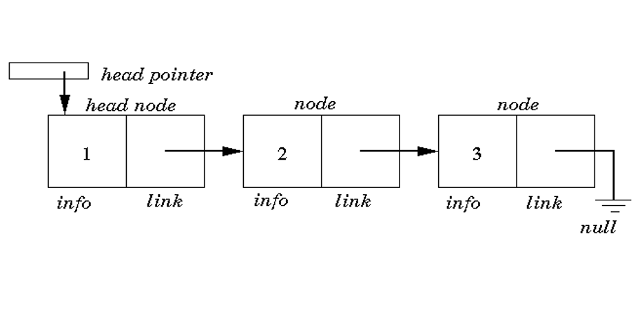
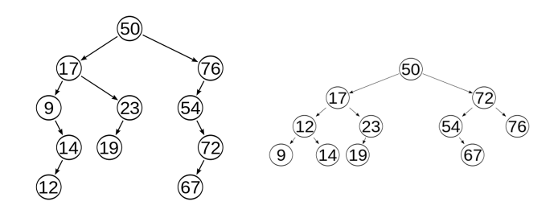
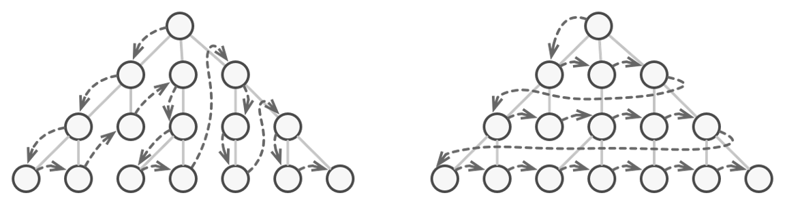
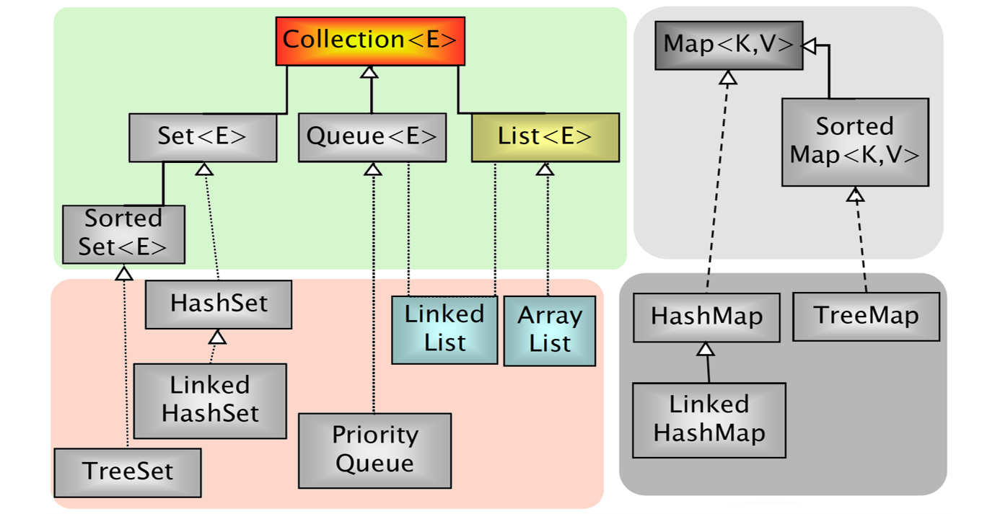
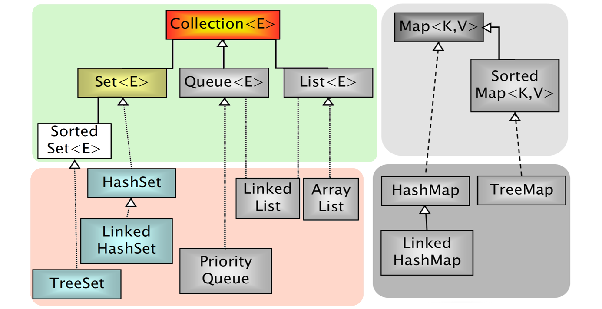
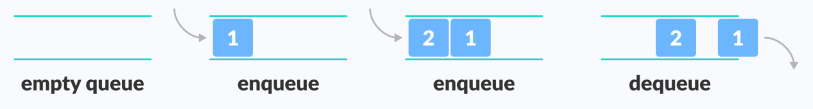
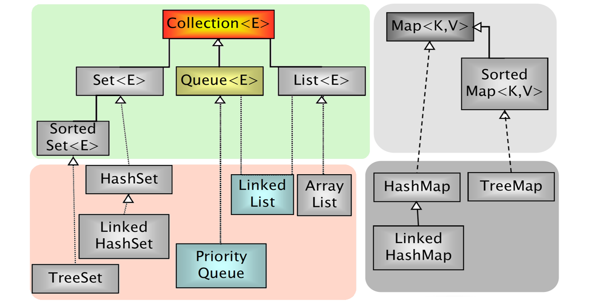

# Java Data Structures

Java Collections Framework is one of the core parts of the Java programming language. Collections are used in almost every programming language. Most of the programming languages support various type of collections such as List, Set, Queue, Stack, etc.

---

### Java Collection Framework
- The Java Collection Framework (JCF) is a set of classes and interfaces implementing commonly reusable data structures.
- The JCF (package java.util) provides
  - **interfaces** defining functionalities
  - **abstract classes** for shared code aggregation
  - **concrete classes** implementing functionalities
  - **algorithms** (java.util.Collections)


### Key technologies


**Dynamic Array ~O(n)**

The drawback of regular array is that we cannot adjust their size in the middle of the code execution. In other words, it will fail to add the (n + 1)th element if we allocate an array size equal to n. One idea would be to allocate a large array, which could waste a significant amount of memory. So what is an appropriate solution to this problem? We solve this problem using the idea of the [dynamic array](https://www.enjoyalgorithms.com/blog/dynamic-array) where we can *increase the array size dynamically* when we need.


**Linked List ~O(n)**

A [linked list](https://en.wikipedia.org/wiki/Linked_list) is a linear collection of data elements whose order is not given by their physical placement in memory. Instead, each element points to the next. It is a data structure consisting of a collection of nodes which together represent a sequence. In its most basic form, each node contains data, and a reference (in other words, a link) to the next node in the sequence. This structure allows for efficient insertion or removal of elements from any position in the sequence during iteration. More complex variants add additional links, allowing more efficient insertion or removal of nodes at arbitrary positions. A drawback of linked lists is that data access time is a linear function of the number of nodes for each linked list (I.e., the access time linearly increases as nodes are added to a linked list.) because nodes are serially linked so a node needs to be accessed first to access the next node (so difficult to pipeline). Faster access, such as random access, is not feasible. Arrays have better cache locality compared to linked lists.




**Balanced Tree ~O(log(n))**

A balanced binary tree, also referred to as a height-balanced binary tree, is defined as a binary tree in which the height of the left and right subtree of any node differ by not more than 1.




**Hash Table ~O(1)**


### Interfaces and implementations


### Iterable Interface
The **Iterable** interface (java.lang.Iterable) is the root interface of the Java collection framework. Iterable, literally, means that “can be iterated”.

Technically, it means that an **Iterator** can be returned. **Iterable objects (objects implementing the iterable interface) can be used within for-each loops**

```
public interface Iterable<T> {
    Iterator<T> iterator();    
}

List<Object> l = new ArrayList<Object>();
for(Object o : l){
    //do something;    
}
```

### Iterator Interface
The **Iterator** interface extracts the traversal behaviour of a collection into a separate object called an iterator.

```
public interface Iterator<T> {
  boolean hasNext()
  T next()
  void remove()
}

ArrayList<Object> l = new ArrayList<Object>();
for (Iterator<Object> i = l.iterator(); i.hasNext();) {
    Object o = i.next();
    // do something
}
```



(see more: [Design Patterns: Iterator - Refactoring.guru](https://refactoring.guru/design-patterns/iterator))


### Collection Interface
- **Group of elements (references to objects)**
- It is **not specified** whether they are
  - Ordered / not ordered
  - Duplicated / not duplicated 
- Common constructors
  - Collection()
  - Collection(Collection c)

### Collection main methods
  - int **size**()
  - boolean **isEmpty**()
  - boolean **contains**(Object element)
  - boolean **containsAll**(Collection c)
  - boolean **add**(Object element)
  - boolean **addAll**(Collection c)
  - boolean **remove**(Object element)
  - boolean **removeAll**(Collection c)
  - void **clear**()
  - Object[] **toArray**()
  - Iterator **iterator**()

---

### List Interface
- Can contain **duplicate elements**
- **Insertion order is preserved**
- User can select **arbitrary insertion points**
- Elements can be accessed **by position**



### List main methods
- Object **get**(int index)
- Object **set**(int index, Object o)
- Object **remove**(int index)
- void **add**(int index, Object o)
- boolean **addAll**(int index, Collection c)
- int **indexOf**(Object o)
- int **lastIndexOf**(Object o)
- List **subList**(int fromIndex, int toIndex)

### List initialization
```
/* plain, simple, long */
List < Integer > l = new ArrayList < Integer > ();
l.add(14);
l.add(73);
l.add(18); // ...

/* more compact version (mutable)*/
List < Integer > l = new ArrayList < > (Arrays.asList(14, 73, 18));
List < Integer > l = new ArrayList < > (List.of(14, 73, 18));

/* more compact version (immutable)*/
List < Integer > l = List.of(14, 73, 18);
```

### List implementations
Decoupling references from actual objects allows us to change implementation (and related performance!) by changing a single line of code!

```
List<Car> garage;
garage = new LinkedList<Car>();
garage = new ArrayList<Car>();

garage.add(new Car());
garage.add(new SDCar());
garage.add(new SDCar());
garage.add(new Car());

for(Car c : garage) {
    c.turnOn();
}
```

**ArrayList** implements **List**
  - get(index) -> Constant time
  - add(index, obj) -> Linear time


**LinkedList** implements **List, Deque**
  - get(index) -> Linear time
  - add(index, obj) -> Linear time (but more lightweight)


---

### Set Interface

- Contains no methods other than those inherited from Collection
- **No duplicate elements are allowed**



### Set Implementations

- **HashSet** implements **Set**
  - Hash tables as internal data structure (fast!)
  - Insertion order not preserved 
- **LinkedHashSet** extends **HashSet**
  - Insertion order preserved
- **TreeSet** implements **SortedSet (an extension of Set)**
  - R-B trees as internal data structure (provide ordering)
  - User definable internal ordering TreeSet(Comparator c)
  - Slow when compared to hash-based implementations

### Set initialization
```
List<String> l = List.of("Nicola", "Agata", "Marzia", "Agata");

Set<String> hs = new HashSet<>(l);
System.out.println(hs);
// [Marzia, Nicola, Agata]
 
Set<String> lhs = new LinkedHashSet<>(l);
System.out.println(lhs);
// [Nicola, Agata, Marzia]

Set<String> ts = new TreeSet<>(l);
System.out.println(ts);
// [Agata, Marzia, Nicola]
```

### TreeSet Internal Ordering
Depending on the constructor used, SortedSet implementations can use different orderings:
- **TreeSet()**
  - Natural ascending ordering
  - Elements must implement the **Comparable Interface**
- **TreeSet(Comparator c)**
  - Ordering is defined by the Comparator c

### HashSet vs TreeSet
- HashSet stores the objects in random order, whereas TreeSet applies the natural order of the elements.
- HashSet can store null objects, while TreeSet does not allow them.
- HashSet provides constant-time performance for most operations like add(), remove() and contains(), versus the log(n) time offered by the TreeSet.
- TreeSet is richer in functionalities, implementing additional methods like: first(), last(), ceiling(), lower(), …


Summary:
- If we want to keep our entries sorted, we need to go for the TreeSet
- If we value performance more than memory consumption, we should go for the HashSet
- If we are short on memory, we should go for the TreeSet
- If we want to access elements that are relatively close to each, we might want to consider TreeSet because it has greater locality
  

---

### Queue Interface

- **Queue**: a collection designed for holding elements prior to processing. Besides, basic Collection operations, queues provide additional insertion, extraction, and inspection operations. Each of these methods exists in two forms: one throws an exception if the operation fails, the other returns a special value (either null or false, depending on the operation).







### Dequeue Interface

- **Deque (extends Queue)**: A linear collection that supports element insertion and removal at both ends. The name deque is short for "double ended queue" and is usually pronounced "deck". Most Deque implementations place no fixed limits on the number of elements they may contain, but this interface supports capacity-restricted dequeue as well as those with no fixed size limit.


### Queue Implementations

- **PriorityQueue** implements **Queue**
  - No capacity restrictions.
  - Elements are ordered.
- **ArrayBlockingQueue** implements **Queue**
  - Limited in capacity.
  - Elements are not ordered.
- **LinkedList** implements **List, Queue, Deque**
  - No capacity restrictions.
  - Elements are not ordered.
- **ArrayDeque** implements **Deque**
  - No capacity restrictions.
  - Elements are not ordered.

### Queue Example

```
List<Integer> l = List.of(3, 1, 2);
Queue<Integer> fifo = new LinkedList<Integer>(l);
Queue<Integer> pqueue = new PriorityQueue<Integer>(l);

System.out.println(fifo.peek());     // 3
System.out.println(pqueue.peek());   // 1
```


---

### Map Interface

- An object storing pairs of (**key, value**
(e.g., key: surname, value: phone number)
  - **Keys and values must be objects**
  - **Keys must be unique**
- Common constructors:
  - Map()
  - Map(Map m)


- Object **put**(Object key, Object value)
- Object **get**(Object key)
- Object **remove**(Object key)
- boolean **containsKey**(Object key)
- boolean **containsValue**(Object value)
- public Set **keySet**()
- public Collection **values**()
- public Set **entrySet**()
- int **size**()
- boolean **isEmpty**()
- void **clear**()

### Map Implementations

- **HashMap** implements **Map**
  - Hash tables as internal data structure (fast!)
  - Insertion order not preserved
- **LinkedHashMap** extends **HashMap**
  - Insertion order preserved
- **TreeMap** implements **SortedMap**
  - R-B trees as internal data structure 
  - User definable internal ordering
  - Slow when compared to hash-based implementations

_(Similar to Set implementations)_

```
Map <Integer, String> src;
src = new HashMap <> ();
src.put(77, "Nicola");
src.put(17, "Marzia");
src.put(22, "Agata");
System.out.println(src);
// {17=Marzia, 22=Agata, 77=Nicola}

src = new LinkedHashMap<>();
src.put(77, "Nicola");
src.put(17, "Marzia");
src.put(22, "Agata");
System.out.println(src);
// {77=Nicola, 17=Marzia, 22=Agata}

src = new TreeMap<>();
src.put(77, "Nicola");
src.put(17, "Marzia");
src.put(22, "Agata");
System.out.println(src);
// {17=Marzia, 22=Agata, 77=Nicola}
```

### Map Example I

```
Map<String, Integer> m = new HashMap<>();
m.put(“Agata”,  2);
m.put(“Marzia”, 3);
m.put(“Agata”,  4);
m.put(“Nicola”, 1);

/* more compact version */
Map<String, Integer> m = new HashMap<>(
	Map.of(“Agata”, 2, “Marzia”, 3, “Agata”, 4, “Nicola”, 1));

/* immutable version */
Map<String, Integer> m =
	Map.of(“Agata”, 2, “Marzia”, 3, “Agata”, 4, “Nicola”, 1);
```

### Map Example II

```
Map<String, Integer> m = new HashMap<String, Integer>();

// contains key
if (m.containsKey(key)) {
    System.out.println(m.get(key));
}

// looping keys and accessing values
Set<String> keys = m.keySet();
for(String key : keys) {
    System.out.println(key + " -> " + m.get(key));
}

// looping values
List<Integer> values = m.values();
for(int value : values) {
    System.out.println(value);
}

// looping entries
for (Map.Entry<String, Integer> entry : m.entrySet()) {
  System.out.println(entry.getKey());
  System.out.println(entry.getValue());
}
```


---

### Modifying Collections: Iterators

### Collections and Iterators

- It is **unsafe** to modify (adding or removing elements) a Collection while iterating over it!

```
List<Double> l = new LinkedList<Double>(
List.of(10.8, 11.1, 13.2, 30.2));

int count = 0;
for (double i : l) {
  if (count == 1) l.remove(count);
  if (count == 2) l.add(22.3);
  count++;
} // Run-time error! We modify the list while iterating
```


### Iterator and ListIterator Interfaces

> Interface **Iterator** provides a transparent means for cycling through all elements of a Collection (**forward only**) and **removing elements**


- boolean **hasNext**()
- Object **next**()
- void **remove**()


> Interface **ListIterator** provides a transparent means for cycling through all elements of a Collection (**forward and backward**) and **removing and adding elements**


- boolean **hasNext**()
- boolean **hasPrevious**()
- object **next**()
- object **previous**()
- void **add**()
- void **set**()
- void **remove**()
- int **nextIndex**()
- int **previousIndex**()

```
// with Iterator
List<Double> l = new LinkedList<Double>(
	List.of(10.8, 11.1, 13.2, 30.2));

int count = 0;
for (Iterator<Double> i = l.iterator(); i.hasNext();) {
	double d = i.next();
	if (count == 1) i.remove();
	count++;
}
```

```
// with ListIterator
List<Double> l = new LinkedList<Double>(
List.of(10.8, 11.1, 13.2, 30.2));

int count = 0;
for (ListIterator<Double> i = l.listIterator(); i.hasNext();) {
  double d = i.next();
  if (count == 1) i.remove();
  if (count == 2) i.add(22.3);
  count++;
}
```


### Iterations and Iterators

```
List<Person> pl = new ArrayList<Person>();

/* C style */
for (int i = 0; i < pl.size(); i++)
    System.out.println(pl.get(i))

/* for-each style */
for (Person p : pl)
    System.out.println(p);

/* iterator style */
for(Iterator<Person> i = pl.iterator(); i.hasNext();) {
  Person p = i.next();
  System.out.println(p);
}

/* while style */
Iterator i = pl.iterator();
while (i.hasNext())
    System.out.println((Person)i.next());
```


---

### Manipulating Arrays: java.util.Collections

- _Alter-ego of java.util.Arrays for Collections_
- This class contains various methods for manipulating arrays such as **sorting, searching, filling, printing or being viewed as an array**


- sort() - merge sort implementation, n log(n)
- binarySearch() - requires ordered collection
- shuffle() - unsort
- reverse() - requires ordered collection
- rotate() – rotate elements of a given distance
- min(), max() - in a collection 


### Algorithms

```
ArrayList<String> l = new ArrayList<String>(
  List.of("Nicola", "Agata", "Marzia", "Agata"));

Collections.sort(l);
System.out.println(l);     // [Agata, Agata, Marzia, Nicola]

Collections.reverse(l);
System.out.println(l);     // [Nicola, Marzia, Agata, Agata]    

Collections.shuffle(l);    
System.out.println(l);     // [Marzia, Agata, Agata, Nicola]

Collections.rotate(l, 1);
System.out.println(l);     // [Nicola, Marzia, Agata, Agata]
```

```
ArrayList<String> l = new ArrayList<String>(
  List.of("Nicola", "Agata", "Marzia", "Agata"));

Collections.sort(l);
System.out.println(l);   // [Agata, Agata, Marzia, Nicola]

Collections.binarySearch(l, "Nicola");  // 3
Collections.binarySearch(l, "Zuck"));   // -5
```

The **list must be sorted into ascending order** according to the natural ordering of its elements (as by the sort(List) method) prior to making this call. **If it is not sorted, the results are undefined.**


---

### Sorting Collections: Comparator

- For sorting collections of objects, the **Comparable** interface must be implemented for **making objects comparable to each other.**
- **The Comparable Interface is implemented by default in common types in packages java.lang and java.util**
- A collection of T can be sorted if T implements Comparable. The compareTo() method compares the object with the object passed as a parameter. Return value must be:
  - < 0   if this object precedes obj
  - == 0 if this object has the same position as obj
  - \> 0   if this object follows obj

```
public interface Comparable<T> {
    public int compareTo(T obj);
}

public interface Comparator<T> {
    public int compare(T obj1, T obj2);
} 
```


### The Comparable Interface

```
class Person implements Comparable<Person> {
  protected String name; 
  protected String lastname;
  protected int age;
   
  public int compareTo(Person p) {
	// order by surname
	return lastname.compareTo(p.lastname);
  }
}
```

```
class Person implements Comparable<Person> {
  protected String name; 
  protected String lastname;
  protected int age;
   
  public int compareTo(Person p) {
	// order by surname
	cmp = lastname.compareTo(p.lastname);
	if (cmp == 0) 
		// if surnames are equal, order by name
		cmp = firstname.compareTo(s.firstname);
	return cmp;
  }
}
```


### The Comparator Interface

**Given a class already implementing Comparable<E>, we can sort it using alternative orders using a Comparator<E>**

```
public class SortByAge implements Comparator<Person> {
  @Override
  public int compare(Person o1, Person o2) {
    return o1.age - o2.age;
  }
}
class Person implements Comparable<Person> {
  protected String name;
  protected String lastname;
  protected int age;
  
  public int compareTo(Person p) {
    return lastname.compareTo(p.lastname);
  }
} 
```

```
public static void main(String[] args) {
  ArrayList<Person> l = new ArrayList<Person>();
  l.add(new Person("Mario", "Rossi", 68));
  l.add(new Person("Luca", "Bianchi", 28));
  l.add(new Person("Carlo", "Antoni", 34));
  
  // natural ordering (Comparable)
  Collections.sort(l)
  
  // special ordering (Comparator)
  Collections.sort(l, new SortByAge());
  
  // Comparator anonymous class
  Collections.sort(l, new Comparator<Person>() {
    @Override
    public int compare(Person o1, Person o2) {
      return o1.age - o2.age;
    }
  });
}
```


### Wisdom Pills

*Making messes is always slower than staying clean*

*The only way to go fast, is to go well.*

Robert C. Martin - Clean Architecture