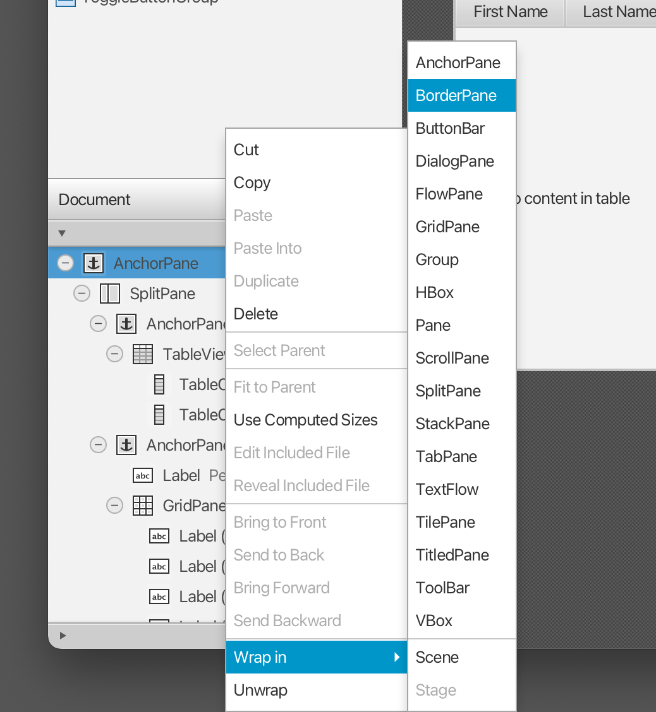

## Topics
* Getting to know JavaFX
* Creating and starting a JavaFX Project
* Using Scene Builder to design the user interface
* Basic application structure using the Model-View-Controller (MVC) pattern

## Helpful Links
You might want to bookmark the following links:

* [JavaFX](https://openjfx.io/) - Official page
* [JavaFX API](https://openjfx.io/javadoc/17/javafx.graphics/module-summary.html) - JavaDoc for JavaFX classes

## Create a new JavaFX Project
In IntelliJ go to *File | New | Project...* and choose *JavaFX*. Specify the Name of the project (e.g. *AddressApp*), select *Java*, and *Gradle*.

Remove the *application* package and its content if it was automatically created.

## Create the FXML Layout File
There are two ways to create the user interface. Either using an XML file or programming everything in Java. Looking around the internet you will encounter both. We will use XML (ending in .fxml) for most parts. I find it a cleaner way to keep the controller and view separated from each other. Further, we can use the graphical Scene Builder to edit our XML. That means we will not have to directly work with XML.

Create within the *resources* directory a package hierarchy specular to the one of our application (i.e., com.nbicocchi.javafx.address). Right-click on the package and create a new *FXML File* called `person-overview-view.fxml`.

## Design with Scene Builder
Right-click on `person-overview-view.fxml` and choose *Open in Scene Builder*. Now you should see *Scene Builder* with just an *AncherPane* (visible under Hierarchy on the left).

(If *Scene Builder* does not open, go to *Preferences | Languages and Frameworks | JavaFX* and set the correct path to your *Scene Builder* installation).

1. Select the *Anchor Pane* in your Hierarchy and adjust the size under Layout (right side):   


2. Add a *Split Pane (Horizontal Flow)* by dragging it from the Library into the main area. Right-click the *Split Pane* in the *Hierarchy* view and select *Fit to Parent*.   


3. Drag a *TableView* (under *Controls*) into the left side of the *SplitPane*. Right-click the *TableView* in the *Hierarchy* view and select *Fit to Parent*.

4. Go to the menu *Preview | Show Preview in Window* to see, whether it behaves right. Try resizing the window. The TableView should resize together with the window as it is anchored to the borders.

5. Change the column text (under Properties) to "First Name" and "Last Name".   


6. Select the *TableView* and choose *constrained-resize* for the *Column Resize Policy* (under Properties). This ensures that the colums will always take up all available space.   


7. Add a *Label* on the right side with the text "Person Details" (hint: use the search to find the *Label*). Adjust its layout using anchors.   


8. Add a *GridPane* on the right side, select it and adjust its layout using anchors (top, right and left).    


9. Add the following labels to the cells.   
*Note: To add a row to the GridPane select an existing row number (will turn yellow), right-click the row number and choose "Add Row".*   


10. Add a *ButtonBar* at the bottom. Add three buttons to the bar. Now, set anchors (right and bottom) to the *ButtonBar*, so it stays in the right place.   


11. Wrap the *AnchorPane* in a *BorderPane*


12. Add a *MenuBar* into the TOP Slot of the *BorderPane*. We will not implement the menu functionality at the moment.   


13. Now you should see something like the following. Use the *Preview* menu to test its resizing behaviour.   


## The JavaFX Main Class
Now, we need to create the **main java class** that starts up our application with the `person-overview-view.fxml` view.

Create an *AddressApplication* class containing the following code:

```
public class AddressApplication extends Application {
    public static void main(String[] args) {
        launch(args);
    }

    @Override
    public void start(Stage stage) throws Exception {
        Parent root = FXMLLoader.load(getClass().getResource("person-overview-view.fxml"));
        Scene scene = new Scene(root);
        stage.setTitle("Address Application");
        stage.setScene(scene);
        stage.show();
    }
}
```

The class extends from `Application` and contains two methods. This is the basic structure that we need to start a JavaFX Application. The most important part for us is the `start(Stage primaryStage)` method. It is automatically called when the application is `launched` from within the `main` method.

As you see, the `start(...)` method receives a `Stage` as parameter. The following graphic illustrates the structure of every JavaFX application:

   

The `Stage` is the main container which is usually a `Window` with a border and the typical minimize, maximize and close buttons. Inside the `Stage` you add a `Scene` which can, of course, be switched out by another `Scene`. Inside the `Scene` the actual JavaFX nodes like `AnchorPane`, `TextBox`, etc. are added.

