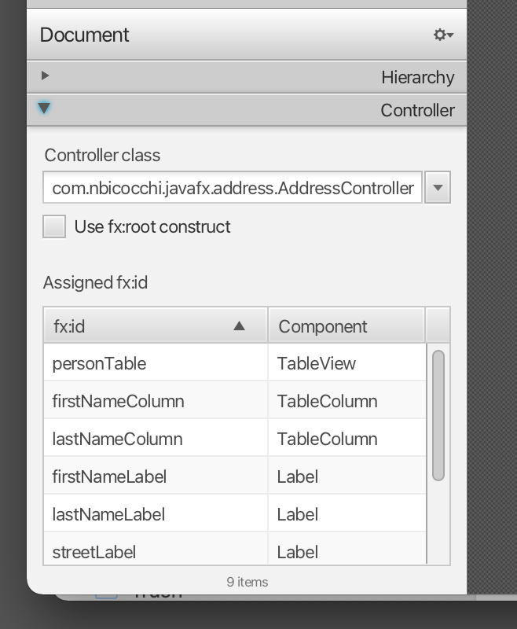

## Topics
* Creating a **model** class
* Using the model class in an **ObservableList**
* Show data in the **TableView** using **Controllers**

## Create the Model Class
We need a model class to hold information about the people in our address book. 

The `Person` class will have a few instance variables for the name, address and birthday. Add the following code to the class. I'll explain some JavaFX specifics after the code.


## Person.java
```
import javafx.beans.property.*;

import java.time.LocalDate;

public class Person {
    private final StringProperty firstName;
    private final StringProperty lastName;
    private final StringProperty street;
    private final IntegerProperty postalCode;
    private final StringProperty city;
    private final ObjectProperty<LocalDate> birthday;

    public Person(String firstName, String lastName, String street, Integer postalCode, String city, LocalDate birthDay) {
        this.firstName = new SimpleStringProperty(firstName);
        this.lastName = new SimpleStringProperty(lastName);
        this.street = new SimpleStringProperty(street);
        this.postalCode = new SimpleIntegerProperty(postalCode);
        this.city = new SimpleStringProperty(city);
        this.birthday = new SimpleObjectProperty<>(birthDay);
    }

    public Person(Person other) {
        this.firstName = new SimpleStringProperty(other.getFirstName());
        this.lastName = new SimpleStringProperty(other.getLastName());
        this.street = new SimpleStringProperty(other.getStreet());
        this.postalCode = new SimpleIntegerProperty(other.getPostalCode());
        this.city = new SimpleStringProperty(other.getCity());
        this.birthday = new SimpleObjectProperty<>(other.getBirthday());
    }

    public String getFirstName() {
        return firstName.get();
    }

    public void setFirstName(String firstName) {
        this.firstName.set(firstName);
    }

    public StringProperty firstNameProperty() {
        return firstName;
    }

    public String getLastName() {
        return lastName.get();
    }

    public void setLastName(String lastName) {
        this.lastName.set(lastName);
    }

    public StringProperty lastNameProperty() {
        return lastName;
    }

    public String getStreet() {
        return street.get();
    }

    public void setStreet(String street) {
        this.street.set(street);
    }

    public StringProperty streetProperty() {
        return street;
    }

    public int getPostalCode() {
        return postalCode.get();
    }

    public void setPostalCode(int postalCode) {
        this.postalCode.set(postalCode);
    }

    public IntegerProperty postalCodeProperty() {
        return postalCode;
    }

    public String getCity() {
        return city.get();
    }

    public void setCity(String city) {
        this.city.set(city);
    }

    public StringProperty cityProperty() {
        return city;
    }

    public LocalDate getBirthday() {
        return birthday.get();
    }

    public void setBirthday(LocalDate birthday) {
        this.birthday.set(birthday);
    }

    public ObjectProperty<LocalDate> birthdayProperty() {
        return birthday;
    }
}
```


## Explanation
* With JavaFX it's common to use [`Properties`](http://docs.oracle.com/javase/8/javafx/api/javafx/beans/property/Property.html) for all fields of a model class. A `Property` allows us, for example, to automatically be notified when the `lastName` or any other variable is changed. This helps us keep the view in sync with the data. To learn more about `Properties` read [Using JavaFX Properties and Binding](http://docs.oracle.com/javase/8/javafx/properties-binding-tutorial/binding.htm).
* [`LocalDate`](http://docs.oracle.com/javase/8/docs/api/java/time/LocalDate.html), the type we're using for `birthday`, is part of the new [Date and Time API for JDK 8](http://docs.oracle.com/javase/tutorial/datetime/iso/).


## A List of Persons
The main Data that our application manages, is a bunch of persons. Let's create a list for `Person` objects inside the `AddressApplication` class. All other controller classes will later get access to that central list inside the `AddressApplication`. 

## ObservableList
We are working with JavaFX view classes that need to be informed about any changes made to the list of persons. This is important, since otherwise the view would not be in sync with the data. 

For this purpose, JavaFX introduces some new [Collection classes](http://docs.oracle.com/javase/8/javafx/collections-tutorial/collections.htm). 

From those collections, we need the `ObservableList`. To create a new `ObservableList`, add the following code at the beginning of the `MainApp` class. We'll also add a constructor that creates some sample data and a public getter method:

```
/**
 * Returns an observable list of Person objects
 * @return the observable list
 */
ObservableList<Person> getPersonData() {
    ObservableList<Person> persons = FXCollections.observableArrayList();
    persons.add(new Person("Hans", "Muster", "Schillerstraße", 1123, "Munich", LocalDate.of(1955, 1, 3)));
    persons.add(new Person("Ruth", "Mueller", "Goethestraße", 5437, "Berlin", LocalDate.of(1934, 2, 23)));
    persons.add(new Person("Heinz", "Kurz", "Jahnstraße", 6778, "Leipzig", LocalDate.of(1929, 2, 13)));
    persons.add(new Person("Cornelia", "Meier", "Mozartstraße", 2234, "Nuremberg", LocalDate.of(1977, 6, 5)));
    persons.add(new Person("Werner", "Meyer", "Hauptstraße", 8879, "Frankfurt", LocalDate.of(1976, 6, 6)));
    persons.add(new Person("Lydia", "Kunz", "Hauptstraße", 9823, "Frankfurt", LocalDate.of(1999, 6, 16)));
    persons.add(new Person("Anna", "Best", "Schulstraße", 5872, "Erfurt", LocalDate.of(1984, 8, 2)));
    persons.add(new Person("Stefan", "Meier", "Gartenstraße", 3386, "Bremen", LocalDate.of(1987, 10, 21)));
    persons.add(new Person("Martin", "Mueller", "Bahnhofstraße", 3345, "Hamburg", LocalDate.of(1992, 10, 7)));
    return persons;
}
```

## The PersonOverviewController
Now let's finally get some data into our table. We'll need a controller for our `address-view.fxml`.

1. Create a class named `PersonOverviewController.java`. 
2. We'll add some instance variables that give us access to the table and the labels inside the view. The fields and some methods have a special `@FXML` annotation. This is necessary for the fxml file to have access to private fields and private methods. After we have everything set up in the fxml file, the application will automatically fill the variables when the fxml file is loaded. So let's add the following code:

Remember to always use the **javafx imports**, NOT awt or swing!

```
import javafx.collections.FXCollections;
import javafx.collections.ObservableList;
import javafx.fxml.FXML;
import javafx.scene.control.Label;
import javafx.scene.control.TableColumn;
import javafx.scene.control.TableView;
import javafx.scene.control.cell.PropertyValueFactory;

public class AddressController {
    @FXML private TableView<Person> personTable;
    @FXML private TableColumn<Person, String> firstNameColumn;
    @FXML private TableColumn<Person, String> lastNameColumn;

    @FXML private Label firstNameLabel;
    @FXML private Label lastNameLabel;
    @FXML private Label streetLabel;
    @FXML private Label cityLabel;
    @FXML private Label postalCodeLabel;
    @FXML private Label birthdayLabel;

    /**
     * Initializes the controller class. This method is automatically called after the fxml file has been loaded.
     */
    @FXML
    public void initialize() {
        // Initialize the person table with the two columns.
        firstNameColumn.setCellValueFactory(new PropertyValueFactory<>("firstName"));
        lastNameColumn.setCellValueFactory(new PropertyValueFactory<>("lastName"));
        personTable.setItems(getPersonData());
    }
    
    ObservableList<Person> getPersonData() {
        ObservableList<Person> persons = FXCollections.observableArrayList();
        persons.add(new Person("Hans", "Muster", "Schillerstraße", 1123, "Munich", LocalDate.of(1955, 1, 3)));
        persons.add(new Person("Ruth", "Mueller", "Goethestraße", 5437, "Berlin", LocalDate.of(1934, 2, 23)));
        persons.add(new Person("Heinz", "Kurz", "Jahnstraße", 6778, "Leipzig", LocalDate.of(1929, 2, 13)));
        persons.add(new Person("Cornelia", "Meier", "Mozartstraße", 2234, "Nuremberg", LocalDate.of(1977, 6, 5)));
        persons.add(new Person("Werner", "Meyer", "Hauptstraße", 8879, "Frankfurt", LocalDate.of(1976, 6, 6)));
        persons.add(new Person("Lydia", "Kunz", "Hauptstraße", 9823, "Frankfurt", LocalDate.of(1999, 6, 16)));
        persons.add(new Person("Anna", "Best", "Schulstraße", 5872, "Erfurt", LocalDate.of(1984, 8, 2)));
        persons.add(new Person("Stefan", "Meier", "Gartenstraße", 3386, "Bremen", LocalDate.of(1987, 10, 21)));
        persons.add(new Person("Martin", "Mueller", "Bahnhofstraße", 3345, "Hamburg", LocalDate.of(1992, 10, 7)));
        return persons;
    }
}
```


Now this code will probably need some explaining:

* All fields and methods where the fxml file needs access must be annotated with `@FXML`. Actually, only if they are private, but it's better to have them private and mark them with the annotation!
* The `initialize()` method is automatically called after the fxml file has been loaded. At this time, all the FXML fields should have been initialized already.
* The `setCellValueFactory(...)` that we set on the table columns are used to determine which field inside the `Person` objects should be used for the particular column.


## Hook the View to the Controller
We're almost there! But one little thing is missing: We haven't told our `address-view.fxml` file yet, which controller to use and which element should match to which field inside the controller.

1. Open `person-overview-view.fxml` with *Scene Builder*.

2. Open the *Controller* group on the left side and select the `PersonOverviewController` as **controller class**.   


3. Select the `TableView` in the *Hierarchy* group and choose in the *Code* group the `personTable` field as **fx:id**.   


4. Do the same for the columns and select `firstNameColumn` and `lastNameColumn` as **fx:id** respectively.

5. For **each label** in the second column, choose the corresponding **fx:id**.   


## Start the Application
When you start your application now, you should see something like this:


