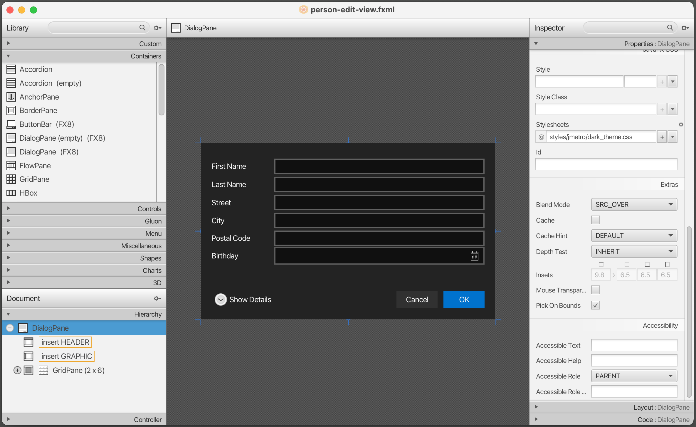

## Topics
* **CSS Styling**
* Adding an **Application Icon**


## CSS Styling
In JavaFX you can style your user interface using Cascading Style Sheets (CSS). It's never been as easy to customize the appearance of a Java application.

In this tutorial we will create a *DarkTheme* inspired by the Windows 8 Metro design. The css for the buttons is based on the blog post [JMetro - Windows 8 Metro controls on Java](http://pixelduke.wordpress.com/2012/10/23/jmetro-windows-8-controls-on-java/) by Pedro Duque Vieira.


## Getting Familiar with CSS
If you want to style your JavaFX application you should have a basic understanding of CSS in general. A good place to start is this [CSS tutorial](http://www.csstutorial.net/).

For more JavaFX specific information about CSS:

* [Skinning JavaFX Applications with CSS](http://docs.oracle.com/javase/8/javafx/user-interface-tutorial/css_tutorial.htm) - Tutorial by Oracle
* [JavaFX CSS Reference](http://docs.oracle.com/javase/8/javafx/api/javafx/scene/doc-files/cssref.html) - Official Reference


## Default JavaFX CSS
The default source for CSS styles in JavaFX 8 is a file called **`modena.css`**. This css file can be found in the Java FX jar file `jfxrt.jar` located in your Java folder under `/jdk1.8.x/jre/lib/ext/jfxrt.jar`.

Unzip the `jfxrt.jar`. You should find the `modena.css` under `com/sun/javafx/scene/control/skin/modena/`

This default style sheet is always applied to a JavaFX application. By adding a custom style sheet we can override the default styles of the `modena.css`.   

**Hint:** It helps to look at the default CSS file to see which styles you might need to override.


## Attaching CSS Style Sheets
Add the following CSS file called `DarkTheme.css` to the application package.


## DarkTheme.css

```
.background {
    -fx-background-color: #1d1d1d;
}

.label {
    -fx-font-size: 11pt;
    -fx-font-family: "Segoe UI Semibold";
    -fx-text-fill: white;
    -fx-opacity: 0.6;
}

.label-bright {
    -fx-font-size: 11pt;
    -fx-font-family: "Segoe UI Semibold";
    -fx-text-fill: white;
    -fx-opacity: 1;
}

.label-header {
    -fx-font-size: 32pt;
    -fx-font-family: "Segoe UI Light";
    -fx-text-fill: white;
    -fx-opacity: 1;
}

.table-view {
    -fx-base: #1d1d1d;
    -fx-control-inner-background: #1d1d1d;
    -fx-background-color: #1d1d1d;
    -fx-table-cell-border-color: transparent;
    -fx-table-header-border-color: transparent;
    -fx-padding: 5;
}

.table-view .column-header-background {
    -fx-background-color: transparent;
}

.table-view .column-header, .table-view .filler {
    -fx-size: 35;
    -fx-border-width: 0 0 1 0;
    -fx-background-color: transparent;
    -fx-border-color: 
        transparent
        transparent
        derive(-fx-base, 80%) 
        transparent;
    -fx-border-insets: 0 10 1 0;
}

.table-view .column-header .label {
    -fx-font-size: 20pt;
    -fx-font-family: "Segoe UI Light";
    -fx-text-fill: white;
    -fx-alignment: center-left;
    -fx-opacity: 1;
}

.table-view:focused .table-row-cell:filled:focused:selected {
    -fx-background-color: -fx-focus-color;
}

.split-pane:horizontal > .split-pane-divider {
    -fx-border-color: transparent #1d1d1d transparent #1d1d1d;
    -fx-background-color: transparent, derive(#1d1d1d,20%);
}

.split-pane {
    -fx-padding: 1 0 0 0;
}

.menu-bar {
    -fx-background-color: derive(#1d1d1d,20%);
}

.context-menu {
    -fx-background-color: derive(#1d1d1d,50%);
}

.menu-bar .label {
    -fx-font-size: 14pt;
    -fx-font-family: "Segoe UI Light";
    -fx-text-fill: white;
    -fx-opacity: 0.9;
}

.menu .left-container {
	-fx-background-color: black;
}

.text-field {
    -fx-font-size: 12pt;
    -fx-font-family: "Segoe UI Semibold";
}

/* 
 * Metro style Push Button
 * Author: Pedro Duque Vieira
 * http://pixelduke.wordpress.com/2012/10/23/jmetro-windows-8-controls-on-java/
 */
.button {
    -fx-padding: 5 22 5 22;   
    -fx-border-color: #e2e2e2;
    -fx-border-width: 2;
    -fx-background-radius: 0;
    -fx-background-color: #1d1d1d;
    -fx-font-family: "Segoe UI", Helvetica, Arial, sans-serif;
    -fx-font-size: 11pt;
    -fx-text-fill: #d8d8d8;
    -fx-background-insets: 0 0 0 0, 0, 1, 2;
}

.button:hover {
    -fx-background-color: #3a3a3a;
}

.button:pressed, .button:default:hover:pressed {
  -fx-background-color: white;
  -fx-text-fill: #1d1d1d;
}

.button:focused {
    -fx-border-color: white, white;
    -fx-border-width: 1, 1;
    -fx-border-style: solid, segments(1, 1);
    -fx-border-radius: 0, 0;
    -fx-border-insets: 1 1 1 1, 0;
}

.button:disabled, .button:default:disabled {
    -fx-opacity: 0.4;
    -fx-background-color: #1d1d1d;
    -fx-text-fill: white;
}

.button:default {
    -fx-background-color: -fx-focus-color;
    -fx-text-fill: #ffffff;
}

.button:default:hover {
    -fx-background-color: derive(-fx-focus-color,30%);
}
```

We now need to attach the CSS to our Scene. We could do this programmatically in Java code, but we'll use the Scene Builder to add it to our fxml files: 


## Attach CSS (person-overview-view.fxml)
1. Open the file `person-overview-view.fxml` in Scene Builder. 

2. Select the root `BorderPane` in the Hierarchy view. Under *Properties* group add the `DarkTheme.css` file as stylesheet.   


3. You should already see some changes now: The table and the buttons are black. All class styles `.table-view` and `.button` from `modena.css` apply to the table and buttons. Since we've redefined (and thus overridden) some of those styles in our custom CSS, the new styles are applied automatically.

4. You might need to adjust the size of the buttons so that all text is displayed.

5. Select the right `AnchorPane` that is inside the `SplitPane`.   
   

6. Go to the *Properties* group and select `background` as style class. The background should now turn black.   
   

   
## Attach CSS (person-edit-view.fxml)
1. Open the file `person-edit-view.fxml` in Scene Builder. Select the root `AnchorPane` and choose `DarkTheme.css` in the *Properties* group as stylesheet.

2. The background is still white, so add the Style Class `background` to the root `AnchorPane`.   


3. Select the OK button and choose *Default Button* in the Properties View. This will change its color and make this the default button when the *enter* key is pressed by the user.


## Labels with Different Style
Right now, all the labels on the right side have the same size. There are already some styles defined in the css file called `.label-header` and `.label-bright` that we'll use to further style the labels.

1. Select the *Person Details* label and add `label-header` as a Style Class.   


2. To each label in the right column (where the actual person details are displayed), add the css Style Class `label-bright`.   


## Adding an Application Icon
Right now our application just has the default icon in the title bar and taks bar:


It looks much nicer with a custom icon:


## The Icon File
A possible place to get free icons is [Icon Finder](http://www.iconfinder.com). I downloaded a little [address book icon](https://www.iconfinder.com/icons/86957/address_book_icon#size=32).

Put the icon of your choice inside the **resources** folder. 


To set the icon for our scene add the following line to the `start(...)` method in `AddressApplication.java`

```
public void start(Stage stage) throws Exception {
    Parent root = FXMLLoader.load(getClass().getResource("person-overview-view.fxml"));
    Scene scene = new Scene(root);
    stage.setTitle("Address Application");
    stage.getIcons().add(new Image(getClass().getResourceAsStream("address_book_512.png")));
    stage.setScene(scene);
    stage.show();
}
```

