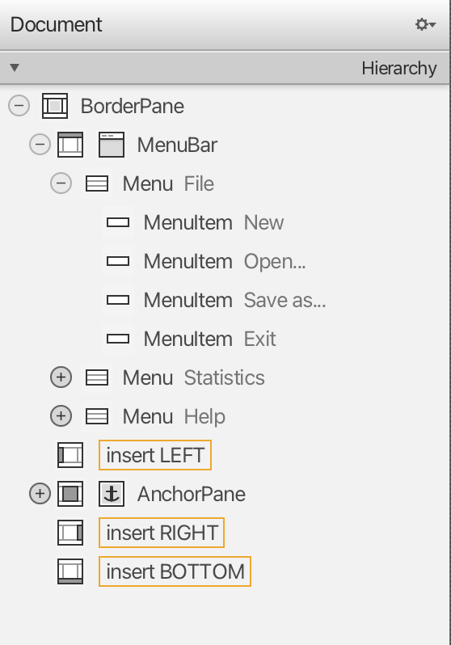

### Topics
* Using **persisting data in JSON format**
* Using the JavaFX **FileChooser**
* Using the JavaFX **Menu**

At the moment our address application's data only resides in memory. Every time we close the application, the data is lost. So it's about time to start thinking about persistently storing data.

## Persisting Data as JSON
One of the most common ways to persist data is using a database. Databases usually contain some kind of relational data (like tables) while the data we need to save are objects. This is called the [object-relational impedance mismatch](http://wikipedia.org/wiki/Object-relational_impedance_mismatch). It is quite some work to match objects to relational database tables. There are some frameworks that help with the matching (e.g. [Hibernate](http://www.hibernate.org/), the most popular one) but it still requires quite some work to set up.

For our simple data model it's much easier to use JSON. We'll use a library called [Jackson](https://github.com/FasterXML/jackson-core). To use Jackson, add the following three lines to the `dependencies` section of your `build.gradle`:

```
implementation group: 'com.fasterxml.jackson.core', name: 'jackson-core', version: '2.15.0-rc2'
implementation group: 'com.fasterxml.jackson.core', name: 'jackson-databind', version: '2.15.0-rc2'
implementation group: 'com.fasterxml.jackson.datatype', name: 'jackson-datatype-jsr310', version: '2.15.0-rc2'
```

With just a few lines of code, Jackson will allow us to generate JSON from objects and vice versa!

```
[ {
  "firstName" : "Hans",
  "lastName" : "Muster",
  "street" : "Random Street",
  "postalCode" : 1234,
  "city" : "Nowhere",
  "birthday" : [ 2000, 1, 1 ]
}, {
  "firstName" : "Ruth",
  "lastName" : "Mueller",
  "street" : "Random Street",
  "postalCode" : 1234,
  "city" : "Nowhere",
  "birthday" : [ 2000, 1, 1 ]
}, 
...
]
```

## Reading and Writing Data with Jackson
Add the following methods to your `PersonOverviewController` class. The `handleOpen` method reads JSON from a chosen file, builds Person objects, and adds them to the TableView component. The `handleSaveAs` transforms Person objects into JSON and writes them in a chosen file.

```
@FXML
private void handleOpen() {
    try {
        FileChooser fileChooser = new FileChooser();
        FileChooser.ExtensionFilter extFilter = new FileChooser.ExtensionFilter("JSON files (*.json)", "*.json");
        fileChooser.getExtensionFilters().add(extFilter);

        File file = fileChooser.showOpenDialog(null);
        if (file != null) {
            ObjectMapper mapper = new ObjectMapper();
            mapper.registerModule(new JavaTimeModule());
            List<Person> persons = mapper.readValue(file, new TypeReference<>() {
            });
            personTable.getItems().addAll(persons);
        }
    } catch (IOException e) {
        new Alert(Alert.AlertType.ERROR, "Could not load data").showAndWait();
    }
}

@FXML
private void handleSaveAs() {
    try {
        FileChooser fileChooser = new FileChooser();
        FileChooser.ExtensionFilter extFilter = new FileChooser.ExtensionFilter("JSON files (*.json)", "*.json");
        fileChooser.getExtensionFilters().add(extFilter);

        File file = fileChooser.showSaveDialog(null);
        if (file != null) {
            ObjectMapper mapper = new ObjectMapper();
            mapper.registerModule(new JavaTimeModule());
            mapper.writerWithDefaultPrettyPrinter().writeValue(file, personTable.getItems());
        }
    } catch (IOException e) {
        new Alert(Alert.AlertType.ERROR, "Could not save data").showAndWait();
    }
}

@FXML
private void handleNew() {
    personTable.getItems().clear();
}

@FXML
private void handleAbout() {
    Alert alert = new Alert(Alert.AlertType.INFORMATION);
    alert.setTitle("Address Application");
    alert.setHeaderText("About");
    alert.setContentText("Author: nbicocchi@unimore.it");
    alert.showAndWait();
}

@FXML
private void handleExit() {
    System.exit(0);
}
```

## FileChooser
Take note of the methods that use the `FileChooser` class inside `PersonOverviewController` above. First, a new object of the class `FileChooser` is created. Then, an extension filter is added so that only files ending in `.json` are displayed. Finally, the file chooser is displayed on top of the primary stage.

If the user closes the dialog without choosing a file, `null` is returned. Otherwise, we get the selected file and we can pass it to Jackson.

## Handling Menu Actions
In `person-overview-view.fxml` there is already a menu, but we haven't used it yet. Before we add action to the menu we'll first create all menu items. 

Open the `person-overview-view.fxml` file in Scene Builder and drag the necessary menu items from the *library* group to the `MenuBar` bar in the *hierarchy* group. Create a **New**, **Open...**, **Save As...**, and **Exit** menu items.



Hint: Using the *Accelerator* setting under the *Properties* group you can set shortcut keys to menu items.

## Connecting the fxml View to the Controller
1. Open `person-overview-view.fxml` in Scene Builder. Verify that the *Controller* group select the `PersonOverviewController` as Controller class. 

2. Go back to the *Hierarchy* group and select a menu item. In the *Code* group under **On Action** you should see a choice of all the available controller methods. Choose the corresponding method for each menu item.   


3. Repeat the steps for every menu item.

Refresh the project and **test it**!