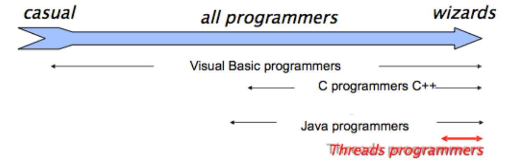

# Java Multi-Threading

### Processes
In operating systems, a process is an instance of a running application 

A  process has it own private address space, code,  data, opened files, PID, etc..

Processes do not share memory (separate address spaces), thus they have to communicate through IPC mechanisms offered by the OS (i.e., pipes, signals)

A process might contain one or more threads   running within the context of the process

### Threads
Threads are sometimes called lightweight processes. Like processes, each thread has its own stack, program counter, and local variables

However, threads within the same process share the same address space and, consequently, can share variables and objects

Sharing variables is a simple and fast way threads use for communicating but **frequently causes bugs unseen in single-thread programs**

### JVM and OS
A multitasking  operating   system  assigns CPU time (slices) to processes/threads via a kernel component called scheduler. Small time-slices (5-20ms) provide the illusion of parallelism of different processes/threads (on multi-core machines it is a partial illusion)

The JVM is a process and gets the CPU as assigned by the OS’s scheduler

Some JVMs operate like a mini-OS and schedule their own threads. Most JVMs use the OS scheduler (a Java thread is actually mapped to a system thread)

**Java is a specification** with [many implementations](https://en.wikipedia.org/wiki/List_of_Java_virtual_machines)

### Why Threads?
There are many reasons to use threads in your Java programs. If you use Android, Swing, JavaFX, Servlets, RMI you may already be using threads without realizing it.

Main reasons for using threads:
* make the UI responsive
* perform asynchronous operations or background processing
* take advantage of multiprocessor systems

### Why Threads? A case study
Imagine a stock-broker application with three key capabilities:
* Download stock prices
* Store stock prices into a database
* Short-term analysis (1 hour) for buy/sell signals

In a single-threaded process:
* actions execute one after another. An action happens only when the previous one is completed.
* If the download takes 10 minutes, should the user enjoy an unresponsive UI for 10 minute?
* If short-term analysis takes additional 10 minute the result may come too late. Prices could already have changed significantly!

In a multi-threaded process:
* the download can execute in background (i.e. in another thread)
* the analysis, too, can execute in background (i.e. in another thread) and eventually use multiple CPU cores for saving time
* the user can enjoy a responsive GUI while awaiting for eventual notifications (buy/sell signals)

### Summary

**The good**
* Enable parallelism
* Lighter than processes for both
  * Creation(i.e., fork())
  * Communication (i.e., r/w pipes …)

**The bad**
* Hard for most programmers
* Even for experts, development is often painful
* Threads break abstraction: can't design modules independently.



**The important**


### Processes in Java
In Java it is not possible to explicitly call the syscall fork() as in C. Syscalls fork() and exec() can be jointly called via the `java.lang.Process` class.

Methods of the `java.lang.Process` class also allow developers to acquire standard input, output, error, and exit value.

```
Process p = (new ProcessBuilder("/bin/ls", "-al", "/")).start();

BufferedReader in = new BufferedReader(new
    InputStreamReader(p.getInputStream()));
while ((line = in.readLine()) != null) {
    System.out.println(line);
}
in.close();
System.out.println(p.exitValue());

```

### Threads in Java
Every Java program has at least one thread, which is called **main,** created automatically by the JVM process to execute statements inside the `main` method. All Java programs have some other default threads as well (for example, a separate thread for the garbage collector).

Throughout the stages of development of the Java language, the approach to multithreading has changed from the use of low-level threads to the use of some high-level abstractions. However, understanding the fundamental base remains very important for a good developer.

### A class for threads
Each thread is represented by an object that is an instance of the `java.lang.Thread` class (or its subclass). This class has a static method named `currentThread` to obtain a reference to the currently executing thread object:

```
Thread thread = Thread.currentThread(); // the current thread
```

Any thread has a name, an identifier (`long`), a priority, and some other characteristics that can be obtained through its methods.

### The information about the main thread
The example below demonstrates how to obtain the characteristics of the **main** thread by obtaining a reference to it through an object of the `Thread`class.

```
public class MainThreadDemo {
    public static void main(String[] args) {
        Thread t = Thread.currentThread(); // main thread

        System.out.println("Name: " + t.getName());
        System.out.println("ID: " + t.getId());
        System.out.println("Alive: " + t.isAlive());
        System.out.println("Priority: " + t.getPriority());
        System.out.println("Daemon: " + t.isDaemon());

        t.setName("my-thread");
        System.out.println("New name: " + t.getName());
    }
}
```

All statements in this program are executed by the **main** thread.

The invocation `t.isAlive()` returns whether the thread has been started and hasn't died yet. Every thread has a **priority**, and the `getPriority()` method returns the priority of a given thread. Threads with a higher priority are executed in preference to threads with lower priorities. The invocation `t.isDaemon()` checks whether the thread is a **daemon**. A daemon thread (which comes from UNIX terminology) is a low-priority thread that runs in the background to perform tasks such as garbage collection and so on. JVM does not wait for daemon threads before exiting whereas it waits for non-daemon threads.

The output of the program will look like this:

```
Name: main
ID: 1
Alive: true
Priority: 5
Daemon: false
New name: my-thread
```

### Create custom threads
Java has two primary ways to create a new thread that performs a task you need.

-   by extending the `Thread` class and overriding its `run` method;
-   by implementing the `Runnable` interface and passing the implementation to the constructor of the `Thread` class.

```
class HelloThread extends Thread {

    @Override
    public void run() {
        String helloMsg = String.format("Hello, i'm %s", getName());
        System.out.println(helloMsg);
    }
}
```

```
class HelloRunnable implements Runnable {

    @Override
    public void run() {
        String helloMsg = String.format("Hello, i'm %s", Thread.currentThread().getName());
        System.out.println(helloMsg);
    }
}
```

```
Thread t1 = new HelloThread(); // a subclass of Thread

Thread t2 = new Thread(new HelloRunnable()); // passing runnable
```

In both cases, you should override the `run` method, which is a regular Java method and contains code to perform a task. What approach to choose depends on the task and on your preferences. 


If you are already familiar with lambda expressions, you may do the whole thing like this:

```
Thread t3 = new Thread(() -> {
    System.out.println(String.format("Hello, i'm %s", Thread.currentThread().getName()));
});
```

### Starting threads
The class `Thread` has a method called `start()` that is used to start a thread. At some point after you invoke this method, the method `run` will be invoked automatically, but it'll not happen immediately.

Let's suppose that inside the **main** method you create a `HelloThread` object named `t` and start it.

```
Thread t = new HelloThread(); // an object representing a thread
t.start();
```

Eventually, it prints something like:

```
Hello, i'm Thread-0
```

Here's a picture that explains how a thread actually starts and why it is not happening immediately.


As you may see, there is some delay between starting a thread and the moment when it really starts working (running).

By default, a new thread is running in **non-daemon** mode. Reminder: the difference between **daemon** and **non-daemon** mode is that JVM will not terminate the running program while there are **non-daemon** threads left, whereas the **daemon** threads won't prevent the JVM from terminating.

If you try to start a thread more than once, the `start` method throws `IllegalThreadStateException`.

### Execution order
Despite the fact that within a single thread all statements are executed sequentially, it is impossible to determine the relative order of statements between multiple threads without additional measures (discussed later).

Consider the following code:

```
public class StartingMultipleThreads {

    public static void main(String[] args) {
        Thread t1 = new HelloThread();
        Thread t2 = new HelloThread();

        t1.start();
        t2.start();

        System.out.println("Finished");
    }
}
```

The order of displaying messages may be different. Here is one of them:

```
Hello, i'm Thread-1
Finished
Hello, i'm Thread-0
```

It is even possible that all threads print their text after the **main** thread prints **"Finished":**

```
Finished
Hello, i'm Thread-0
Hello, i'm Thread-1
```

In summary:
* It is not guaranteed that threads will start running in the same order in which their start() methods have been called.
* It is not guaranteed that a thread keeps executing until it's done (it is not guaranteed that its loop completes before another thread begins)
* Nothing is guaranteed except: each thread will start and will run to completion after acquiring the CPU a finite number of times

### Threads priority
By default, a thread gets the priority of the thread creating it. Priority values are defined between 1 and 10 (see Thread class static attributes).

* Thread.MIN_PRIORITY  (== 1)
* Thread.NORM_PRIORITY  (== 5)
* Thread.MAX_PRIORITY  (== 10)

Priority can be set using the `setPriority`method.

```
Thread t = new Thread(() -> { . . . });
t.setPriority(Thread.MAX_PRIORITY);
t.start();
```

### Terminating threads
If the parent thread terminates, all of its child threads terminate as well.

Child threads share resources with the parent thread, including variables. When the parent thread terminates, the child threads will not be able to access to those resources that the parent thread owns.

Thus, if the parent thread terminates earlier than its own child threads, synchronization mechanisms are required.

```
public class StartStopThread extends Thread {
    public StartStopThread(String name) {
        super(name);
    }

    @Override
    public void run() {
        System.out.println(Thread.currentThread().getName() + " started");
        while (!interrupted()) {
            System.out.println(Thread.currentThread().getName());
        }
        System.out.println(Thread.currentThread().getName() + " terminated");
    }

    public static void main(String[] args) throws InterruptedException {
        StartStopThread a = new StartStopThread("Homer");
        StartStopThread b = new StartStopThread("Marge");

        /* start children threads */
        a.start();
        b.start();

        /* wait 10 millis */
        Thread.sleep(10L);

        /* gracefully terminate children threads */
        a.interrupt();
        b.interrupt();

        /* wait for children before exit */
        a.join();
        b.join();
    }
}
```

### Thread states


**Running:** The thread has been selected (from the runnable pool) to be the currently executing thread.

**Runnable:** A thread which is eligible to run, but the scheduler has not selected it to be the running thread . A thread first enters the runnable state when the start() method is invoked. A thread can also return to the runnable state after either the running, blocked, waiting, or sleeping state.

**Waiting:** A thread that can acquire a resource but there is no work to do; or a thread awaiting for its children (Thread.join()); or a thread which called object.wait() and waits for another thread to call object.notify().

**Blocking:** A thread waiting for a resource such waiting for the completion of I/O operations

**Sleeping:** A thread which is sleeping after an explicit call to Thread.sleep(). It goes back to the Runnable state when the sleep time expires.

### Leaving the running state
There are 3 ways for leaving the running state under the control of the programmer:

* **sleep()**:  the currently running thread stops executing for at least the specified sleep duration (go to sleeping state)
* **join()**:  the currently running thread stop executing until the thread it joins completes (go to waiting state)
* **yield()**: the currently running thread moves back to runnable to give room to other threads (go to runnable state)

There are 2 additional ways for leaving the running state which are not under the control of the programmer:

* end of run() method: go to dead state
* being suspended by the OS scheduler: go to runnable state

### Sleeping
The static method `Thread.sleep()` causes the currently executing thread to suspend execution for the specified number of milliseconds. This is an efficient means of making processor time available for the other threads of an application or other applications that might be running on a computer.

```
System.out.println("Started");

Thread.sleep(2000L); // suspend current thread for 2000 millis

System.out.println("Finished");
```

This code prints **"Started"**. Then the current thread is suspended for 2000 milliseconds (it may be longer, but not less than indicated). Eventually, the thread wakes up and prints **"Finished"**.

Another way to make the current thread sleep is to use the special class `TimeUnit` from the package `java.util.concurrent:`

-   `TimeUnit.MILLISECONDS.sleep(2000)` performs `Thread.sleep` for 2000 milliseconds;
-   `TimeUnit.SECONDS.sleep(2)` performs `Thread.sleep` for 2 seconds;

### Joining
The `join` method forces the current thread to wait for the completion of the thread for which the method `join` was called. In the following example, the string **"Do something else"** will not be printed until the thread terminates.

```
Thread thread = ...
thread.start(); // start thread

System.out.println("Do something useful");

thread.join();  // waiting for thread to die

System.out.println("Do something else");
```

The overloaded version of this method takes a waiting time in milliseconds. This is used to avoid waiting for too long or even infinitely in case the thread is hung.

```
thread.join(2000L);
```

Let's consider another example. The `Worker` class is developed to solve "a difficult task" simulated by sleep:

```
class Worker extends Thread {

    @Override
    public void run() {
        try {
            System.out.println("Starting a task");
            Thread.sleep(2000L); // it solves a difficult task
            System.out.println("The task is finished");
        } catch (Exception ignored) {
        }
    }
}
```

```
public class JoiningExample {
    public static void main(String[] args) throws InterruptedException {
        Thread worker = new Worker();
        worker.start(); // start the worker

        Thread.sleep(100L);
        System.out.println("Do something useful");

        worker.join(3000L);  // waiting for the worker
        System.out.println("The program stopped");
    }
}
```

The main thread waits for `worker` and cannot print the message `The program stopped` until the worker terminates or the timeout is exceeded. We know exactly only that `Starting a task` precedes `The task is finished` and `Do something useful` precedes `The program stopped`. 

### Yielding
The `yield()` method moves the running thread back to Runnable state.

It allows other threads to get their turn (with no guarantees). It is used when computation is not possible (no work to do) is a given time slice.

One of the benefits of this approach is making out code less dependent from the scheduler type, because threads release CPU when needed.

### Sharing data between threads
Threads that belong to the same process share the common memory (that is called **Heap**). They may communicate by using shared data in memory. To be able to access the same data from multiple threads, each thread must have a reference to this data (by an object). The picture below demonstrates the idea.

****

When you write your code in different threads that work with the same data concurrently, it is important to understand a few things:
* some operations are non-atomic;
* changes of a variable performed by one thread may be invisible to the other threads;
* if changes are visible, their order might not be (reordering).

### Thread Interference
Imagine two people (represented by two threads) each one having an ATM card linked to the same account:

```
class Account {
    private int balance;
    
    public int getBalance() {
        return balance;
    }

    public void withdraw(int amount) {
        balance -= amount;
    }
}
```

Each person (i.e., thread) does these steps:
* Check if the account is not empty
* Choose an amount to withdraw (comprised between 0 and balance)
* Withdraw the chosen amount

```
public void run() {
    RandomGenerator rnd = RandomGenerator.getDefault();
    while (!interrupted()) {
        if (account.getBalance() <= 0) {
            break;
        }

        int amount = rnd.nextInt(account.getBalance() + 1);

        account.withdraw(amount);
        
        Thread.yield();
    }
```

**What happens if the scheduler suspends one thread between step 2 and step 3 and the other one gets executed?**

1. **Homer enters the status RUNNING**
1. Homer checks that the account is not empty and contains 125$!
1. Homer chooses to withdraw 100$
1. **Homer leaves the status RUNNING**
1. **Marge enters the status RUNNING**
1. Marge checks that the account is not empty and contains 125$!
1. Marge chooses to withdraw 120$
1. Marge withdraws 120$
1. **Marge leaves the status RUNNING**
1. **Homer enters the status RUNNING**
1. Homer withdraws 100$ (he has already checked!) but the ATM gives him only 5$

### Critical sections and race conditions


A **race condition** is problem arising whenever two or more threads share the same resource and one thread **races in** too quickly before another thread has completed its operations (supposed to be atomic). 

A portion of code which needs to be executed as if it was atomic is called **critical section**.

We must guarantee that the steps comprising the withdrawal process are never split apart. **The withdrawal process must be an atomic operation**. In other words, any withdrawal (accomplished by one thread) must be completed before any other thread is allowed to act on the account.

### Synchronized
Developers can't guarantee that a single thread will stay running during a whole operation (supposed to be atomic). **Developers cannot control the scheduler's actions** (excluding the case of calling yield()).

**Synchronized** is used to protect resources that are accessed concurrently. Only one thread at a time can access. The modifier **synchronized can be applied either to a method or an object**.

Every object in Java has ONE built-in lock. **Entering a synchronized non-static method means getting the lock of the object**. If one thread gets the lock, all other threads have to wait to enter ALL the synchronized methods until the lock is released (the first thread exits the synchronized method).

```
public synchronized void doStuff() { 
    System.out.println("synchronized");
}

/* is equivalent to… */

public void doStuff() { 
    synchronized(this) {
        System.out.println("synchronized");
    }  
}
```

Another example: the first time the method `A()` is called, it sleeps and makes both `A()` and `B()` inaccessible for 100ms. All synchronized methods of an object share the same lock!

```
class Actor extends Thread {
    Runnable runnable;

    public Actor(Runnable runnable) {
        super();
        this.runnable = runnable;
    }

    @Override
    public void run() {
        while (!isInterrupted()) {
            runnable.run();
        }
    }
}
```

```
class SharedResource {
    public synchronized void A() {
        System.out.println(Thread.currentThread().getName() + " A()");
        try {
            Thread.sleep(100L);
        } catch (InterruptedException e) {
            e.printStackTrace();
        }
    }

    public synchronized void B() {
        System.out.println(Thread.currentThread().getName() + " B()");
    }

    public void C() {
        System.out.println(Thread.currentThread().getName() + " C()");
    }
}
```

```
public class LockingGranularity {
    public static void main(String[] args) {
        SharedResource resource = new SharedResource();
        Actor a = new Actor(resource::A);
        Actor b = new Actor(resource::B);
        Actor c = new Actor(resource::C);

        a.start();
        b.start();
        c.start();

        Thread.sleep(10);

        a.interrupt();
        b.interrupt();
        c.interrupt();

        a.join();
        b.join();
        c.join();
    }
}
```

**Whenever an object lock has been acquired by one thread, other threads can still access the class's non-synchronized methods**. Methods that don't access critical data don’t need to be synchronized.

**Details**:
* Threads going to sleep don't release locks!
* A thread can acquire more than one lock. For example, a thread can enter a synchronized method, then immediately invoke a synchronized method on another object (deadlock prone!)


```
public void run() {
    RandomGenerator rnd = RandomGenerator.getDefault();
    while (!interrupted()) {
        synchronized (account) {
            if (account.getBalance() <= 0) {
                break;
            }

            int amount = rnd.nextInt(account.getBalance() + 1);

            account.withdraw(amount);

            Thread.yield();
        }
    }
```

### Thread-safe shared objects

There are two main ways to grant atomic access to a shared object:
* Use the **synchronized** modifier within the run() method of each thread to lock the shared object.
* Use the **synchronized** modifier within the methods of the shared object itself.

A thread-safe class is class that is safe (works properly) when accessed by multiple threads. Critical sections (i.e., sections possibly generating race conditions) are encapsulated in synchronized methods.

* Interface List: ArrayList (unsafe), Vector (safe)
* Interface Queue: LinkedList (unsafe), ConcurrentLinkedQueue (safe), ArrayBlockingQueue (safe)

```
package com.nbicocchi.exercises.examples;

import java.util.Deque;
import java.util.LinkedList;
import java.util.NoSuchElementException;
import java.util.random.RandomGenerator;

public class SharedObject {
    static class ProducerSafe extends Thread {
        final Deque<Integer> integerDeque;

        public ProducerSafe(Deque<Integer> integerDeque) {
            super();
            this.integerDeque = integerDeque;
        }

        @Override
        public void run() {
            RandomGenerator rnd = RandomGenerator.getDefault();
            while (!isInterrupted()) {
                synchronized (integerDeque) {
                    integerDeque.addFirst(rnd.nextInt());
                }
            }
        }
    }

    static class ProducerUnsafe extends Thread {
        final Deque<Integer> integerDeque;

        public ProducerUnsafe(Deque<Integer> integerDeque) {
            super();
            this.integerDeque = integerDeque;
        }

        @Override
        public void run() {
            RandomGenerator rnd = RandomGenerator.getDefault();
            while (!isInterrupted()) {
                integerDeque.addFirst(rnd.nextInt());
            }
        }
    }

    static class ConsumerSafe extends Thread {
        final Deque<Integer> integerDeque;

        public ConsumerSafe(Deque<Integer> integerDeque) {
            super();
            this.integerDeque = integerDeque;
        }

        @Override
        public void run() {
            while (!isInterrupted()) {
                try {
                    synchronized (integerDeque) {
                        integerDeque.removeLast();
                    }
                } catch (NoSuchElementException e) {
                    Thread.yield();
                }
            }
        }
    }

    static class ConsumerUnsafe extends Thread {
        final Deque<Integer> integerDeque;

        public ConsumerUnsafe(Deque<Integer> integerDeque) {
            super();
            this.integerDeque = integerDeque;
        }

        @Override
        public void run() {
            while (!isInterrupted()) {
                try {
                    integerDeque.removeLast();
                } catch (NoSuchElementException e) {
                    Thread.yield();
                }
            }
        }
    }

    public static void main(String[] args) throws InterruptedException {
        /* An unsafe shared object require safe threads and vice versa */
        Deque<Integer> dq = new LinkedList<>();
        ProducerSafe p = new ProducerSafe(dq);
        ConsumerSafe c = new ConsumerSafe(dq);

        p.start();
        c.start();

        Thread.sleep(100L);

        p.interrupt();
        c.interrupt();

        p.join();
        c.join();
    }
}
```

### Synchronization using Object
Threads might be able to acquire exclusive access a shared resource but still be unable to progress. For example, a producer with a full queue, or a consumer with an empty queue. 

To avoid waste of computational resources we can use the wait() and notify() methods (inherited from Object).

wait() can only be called from a synchronized block. It releases the lock on the object so that another thread can jump in and acquire a lock. **wait() lets a thread say: “There's nothing for me to do now, so put me in the waiting pool and notify me when something happens that I care about.”**


notify() send a signal to one of the threads that are waiting in the object's waiting pool. The notify() method CANNOT specify which waiting thread to notify. The method notifyAll() is similar but sends a signal to all the threads waiting on the object. **notify() lets a thread say: “Something has changed here. Feel free to continue what you were trying to do”.**

[A more detailed example here.](https://github.com/nbicocchi/java-javafx/tree/main/src/main/java/com/nbicocchi/javafx/producerconsumer)

### Multi-thread patterns
Despite threads can be used for solving a number of real-world problems, most of them can be conceptually assimilated to two main patterns:

**The producer-consumer pattern**, where the producer thread pushes elements into a shared object and the consumer thread fetches (consumes) them


**The manager-worker pattern**, where a manager decomposes a complex task into subtasks, and assigns them to worker threads. 


### Executors

### The Task<T> class