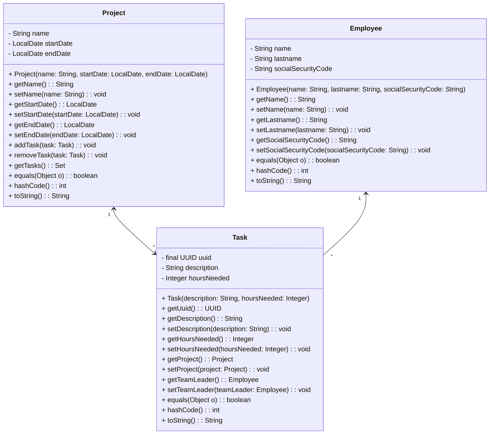

# Object-Oriented Programming - DIEF/UNIMORE

## Java Exercises (Lists)

**[CollatzSequence.java]** Consider the following operation on an arbitrary positive integer:

* If the number is even, divide it by two.
* If the number is odd, triple it and add one.

The [Collatz conjecture](https://en.wikipedia.org/wiki/Collatz_conjecture) is one of the most famous unsolved problems in mathematics. The conjecture asks whether repeating the two simple arithmetic operations above will eventually transform every positive integer into 1. Write a static method returning the Collatz sequence for a given integer number greater than 0.

Examples:

* collatzSequence(1) -> [1]
* collatzSequence(2) -> [2, 1]
* collatzSequence(3) -> [3, 10, 5, 16, 8, 4, 2, 1]
* collatzSequence(4) -> [4, 2, 1]

The method has the following prototype:

```
public static List<Long> collatzSequence(long n);
```

where:

* **n** represents the starting number of the sequence

---

**[DownSize.java]** Write a method that removes every nth String from a ```List<String>```.

Examples:

* downSize(["A", "B", "C", "D", "E", "F"], 2) -> ["A", "C", "E"] 
* downSize(["A", "B", "C", "D", "E", "F"], 3) -> ["A", "B", "D", "E"]

The method has the following prototype:

```
public static void downsize(List<String> list, int n);
```

where:

* **list** is the list to be downsized
* **n** represents the intensity of the downsizing

---

**[SortAccount.java]** Given the following class Account:

```
public static class Account {
    double amount;
    double interestRate;
    LocalDate duePayment;
    ...
}
```

Write three methods accepting a ```List<Account>``` and returning void. Each method sorts the list based on one criterion (i.e., one attribute).

The methods have the following prototype:

```
public static void sortByAmount(List<Account> accounts);
public static void sortByInterestRate(List<Account> accounts);
public static void sortByDuePayment(List<Account> accounts);
```

where:

* **accounts** is the list of Account to be sorted.

---

**[SpeedTest.java]** Demonstrate that the position is which elements are added to a List impacts performance in a significant way.
Write two methods for inserting an element at the beginning (or end) of a List a certain number of times, returning the elapsed time.
Then, write a test for showing that ArrayList is faster than LinkedList when adding elements at the end, while the opposite 
is true when inserting elements at the beginning (see System.nanoTime()).

The methods have the following prototype:

```
public static long insertBeginning(List<String> list, String item, int times);
public static long insertEnd(List<String> list, String item, int times);
```

where:

* **list** is the list used for adding elements.
* **item** is the item to be added.
* **times** is the number of times to repeat the add operation.

## Java Exercises (Deque)

**[Reverse.java]** Write a method reversing the order of words in a sentence (represented as a ```List<String>```) using
an ArrayDeque as a stack (see .push() and .pull() methods). Each word has to be pushed to the stack and fetched
later. If the stack is behaving correctly, the order is reversed.

Examples:

* reverse(["Hello", "World!"]) → ["World!", "Hello"]
* reverse(["I", "am"]) → ["am", "I"]

The method has the following prototype:

```
public static List<String> reverse(List<String> sentence);
```

where:

* **sentence** is the list of words to be reversed.

## Java Exercises (Sets)

**[Intersection.java]** Write a method returning the intersection of two given sets of Integers. 
Write two versions of the same method with and without using Set.retainAll().

Examples:

* intersection([1,2,3], [4,5,6]) → []
* intersection([1,2,3], [3,4,5]) → [3]
* intersection([], []) → []

The method has the following prototype:

```
public static Set<Integer> intersection(Set<Integer> first, Set<Integer> second);
public static Set<Integer> intersectionRetainAll(Set<Integer> first, Set<Integer> second);
```

where:

* **first** is the first Set.
* **second** is the second Set.

---

**[Union.java]** Write a method returning the union of two given sets of Integers.
Write two versions of the same method with and without using Set.addAll().

Examples:

* union([1,2,3], [4,5,6]) → [1,2,3,4,5,6]
* union([1,2,3], [3,4,5]) → [1,2,3,4,5]
* union([], []) → []

The method has the following prototype:

```
public static Set<Integer> union(Set<Integer> first, Set<Integer> second);
public static Set<Integer> unionAddAll(Set<Integer> first, Set<Integer> second);
```

where:

* **first** is the first Set.
* **second** is the second Set.

---

**[RecurringChars.java]** Write a method accepting a string and returning a set comprising all recurring characters of
the string.

Examples:

* recurringChars("Ciao") → []
* recurringChars("Hello") → ['l']
* recurringChars("Hello World!") → ['l', 'o']

The method has the following prototype:

```
public static Set<Character> recurringChars(String string);
```

where:

* **string** is the string to be processed.

---

**[RemoveDuplicates.java]**  Write a method to remove all duplicate elements from a ```List<Integer>```.

Examples:

* removeDuplicates([1,2,3,4,5]) → [1,2,3,4,5]
* removeDuplicates([1,1,1,2,2]) → [1,2]

The method has the following prototype:

```
public static List<Integer> removeDuplicates(List<Integer> list);
```

where:

* **list** is the list to be processed.

---

**[Eratosthenes.java]** Implement the [sieve of Eratosthenes](https://en.wikipedia.org/wiki/Sieve_of_Eratosthenes): a method for computing prime numbers, known to the ancient Greeks.
This method will compute all prime numbers up to *n*. Choose an integer number *n*. First, insert all numbers from 2 to *n* into a set. Then, erase all multiples of 2 (i.e., 4, 6, 8, 10, 12, ...), all multiples of 3 (i.e., 6, 9, 12, 15, ...) until all multiples of int(sqrt(n)). The elements remaining in the set at the end of the process, are all prime numbers.

The method has the following prototype:

```
public static Set<Integer> eratosthenes(int n);
```

where:

* [2, n] is the range in which searching for primes.

---

**[WordAfterWord.java]** Download the [Ulysses, by James Joyce](https://github.com/laumann/ds/blob/master/hashing/books/) book.
Write a method, reading all the unique words of the book (all words have to be converted in lowercase), and sorting them in alphabetical order. Given a word, the method returns the next word (in alphabetical order) contained within the book (See TreeSet.tailSet()).

The method has the following prototype:

```
public static String wordAfterWord(String filename, String word) throws IOException;
```

where:

* **filename** is the filename of the book.
* **string** is the word to be searched.

For reading the file and transforming it into a ```List<String>```, you can use:

```
public static List<String> getLines(String filename) throws IOException {
    return Files.readAllLines(Path.of(filename));
}
```

For splitting a line into a list of single words, you can use:

```
public static List<String> lineToWords(String line) {
    return Arrays.asList(line.replaceAll("[^a-zA-Z ]", "").toLowerCase().split("\\s+"));
}
```

---

**[ProjectManagement.java]** Sets are frequently used for representing *one-to-many* and *many-to-many* relationships between objects. In this exercise, we'll use the following three classes.

* `Project` represents a project. It encapsulates information such as the project name, start date, end date, and a collection of tasks associated with the project. Projects can have multiple tasks assigned to them.
* `Task` represents a specific task within a project. It contains details such as a unique identifier, description, estimated hours needed to complete the task, associated project, and team leader.
* `Employee` class represents an employee within the system. It contains information such as the employee's first name, last name, and social security code.

The meaning of the lines with one or two arrows in the UML diagram is the following: 
* The *one-to-many* relationship between `Project` and `Task` is bidirectional in that `Project` keeps in memory a Set of `Task`, while `Task` keeps a reference to a `Project` object.
* The *one-to-many* relationship between `Employee` and `Task` is unidirectional in that only `Task` keeps in memory a reference to its team leader `Employee`.

Concerning object equality parameters (which are very important to allow the method `Collection.contains()` to work properly!):
* Projects are considered equal if they have the same name, startDate, endDate.
* Tasks are considered equal if they have the same UUID code (given that the other attributes are little descriptive).
* Employees are considered equal if they have the same name, lastname, socialSecurityCode.

Implement the described classes while paying attention at keeping the object relationships healthy! For example, if you assign a task to a project, the relationship has to be reflected in both `Project` and `Task` objects! 
Remember also that relationships in UML (lines connecting classes) become attributes in terms of actual code!





## Java Exercises (Maps)

**[CheckAnagrams.java]** Write a static method accepting two Strings and returning true if they are anagrams, false otherwise.

Two strings are considered anagrams if they contain the same characters but in a different order. The order of characters doesn't matter, what matters is the frequency of each character in both strings.

Examples:

* areAnagrams("dusty", "study") -> true
* areAnagrams("world", "sky") -> false
* areAnagrams("cheap", "") -> false

The method has the following prototype:

```
public static boolean areAnagrams(String first, String second);
```

where:

* **first** is the first string.
* **second** is the second string.

---

**[MorseCode.java]** Write a static method accepting a String, converting it to lowercase, and returning its [Morse](https://en.wikipedia.org/wiki/Morse_code) translation. The 26 lowercase letters of the english alphabet have to be supported. 

You have to use a ```Map<Characher, String>``` as a conversion table (dot='.', dash='_'). If the input String contains characters not supported by the conversion table, IllegalArgumentException have to be thrown.

Examples:

* morseCode("hello") -> `.... . ._.. ._.. ___`
* morseCode("world") -> `.__ ___ ._. ._.. _..`
* morseCode("w0rld") -> IllegalArgumentException

The method has the following prototype:

```
public static String morseCode(String string);
```

where:

* **string** is the string to be converted in Morse.

---

**[RomanToDecimal.java]** Roman numerals are represented by seven different symbols: 
* `I` = 1
* `V` = 5
* `X` = 10
* `L` = 50
* `C` = 100
* `D` = 500
* `M` = 1000

Roman numerals are usually written largest to smallest from left to right. However, the numeral for four is not `IIII`. Instead, the number four is written as `IV`. 
Because the one is before the five we subtract it making four. The same principle applies to the number nine, which is written as `IX`. 

There are six instances where subtraction is used:
* `I` can be placed before `V` (5) and `X` (10) to make 4 and 9.
* `X` can be placed before `L` (50) and `C` (100) to make 40 and 90.
* `C` can be placed before `D` (500) and `M` (1000) to make 400 and 900.

Given a roman numeral, convert it to a decimal one.

Examples:
* romanToDecimal("III") -> 3
* romanToDecimal("LVIII") -> 58
* romanToDecimal("MCMXCIV") -> 1994

The method has the following prototype:

```
public static int romanToDecimal(String s);
```

where:

* **s** is the string representing the roman numeral.

Constraints:

* `1 <= s.length <= 15`
* `s` contains only the characters `('I', 'V', 'X', 'L', 'C', 'D', 'M')`

---

**[ValuesKeys.java]** Write a static method accepting a ```Map<String, String>``` and returning true if some values have been used as keys as well.

The method has the following prototype:

```
public static boolean valuesKeys(Map<String, String> map);
```

where:

* **map** is the map to be checked.

---

**[InvertMap.java]** Write a static method accepting a ```Map<Integer, String>``` and returning a ```Map<String, Integer>``` in which the original keys and values have been inverted.
In case of repeated values (thus associated to multiple keys) you can select one of the keys.

Examples:

* invertMap({1: "Hello", 3: "World"}) → {"Hello": 1, "World": 3}
* invertMap({1: "Hello", 3: "Hello"}) → {"Hello": 3}

The method has the following prototype:

```
public static Map<String, Integer> invertMap(Map<Integer, String> src);
```

where:

* **src** is the map to be inverted.

---

**[WordFrequency.java]** Download
the [Ulysses, by James Joyce](https://github.com/laumann/ds/blob/master/hashing/books/) book.
Write a method, reading all the lines of the file and returning a ```Map<String, Integer>``` having all the unique words
of the book as keys, associated with the number of times they appeared.

The method has the following prototype:

```
public static Map<String, Integer> wordFrequency(String filename) throws IOException;
```

where:

* **filename** is the filename of the book.

For reading the file and transforming it into a ```List<String>```, you can use:

```
public static List<String> getLines(String filename) throws IOException {
    return Files.readAllLines(Path.of(filename));
}
```

For splitting a line into a list of single words, you can use:

```
public static List<String> lineToWords(String line) {
    return Arrays.asList(line.replaceAll("[^a-zA-Z ]", "").toLowerCase().split("\\s+"));
}
```

---

**[WordFrequencySorted.java]** Add two methods to WordFrequency.java for returning a new ```Map<String, Integer>```
containing only the n most (or less) frequent words and their frequency. Entries within the returned Map, have to be
sorted by value (i.e. frequency). For sorting, you can transform the ```Map<String, Integer>``` into
a ```List<Map.Entry<String, Integer>>``` which can be sorted using a ```Comparator<Map.Entry<String, Integer>>```.
Remember also that LinkedHashMap is an implementation of Map maintaining the insertion order.

The methods have the following prototype:

```
public static Map<String, Integer> mostFrequent(Map<String, Integer> map, int limit);
public static Map<String, Integer> lessFrequent(Map<String, Integer> map, int limit);
```

where:

* **map** is the Map<String, Integer> to be processed.
* **limit** is the number of most (or less) frequent words to be returned.

