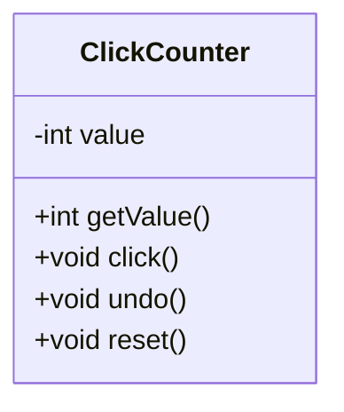
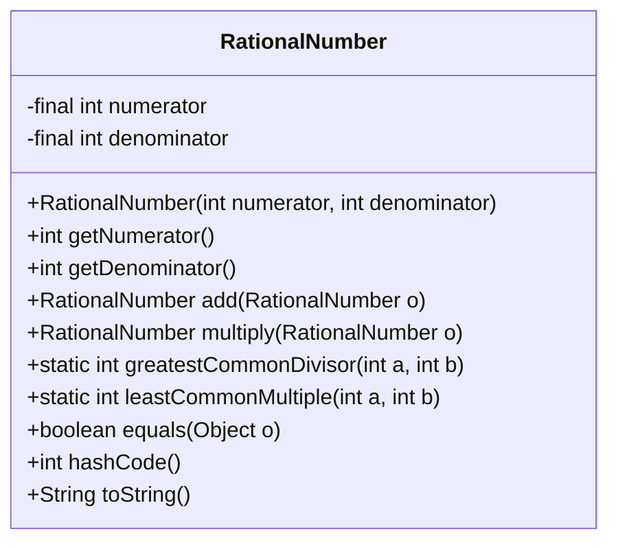
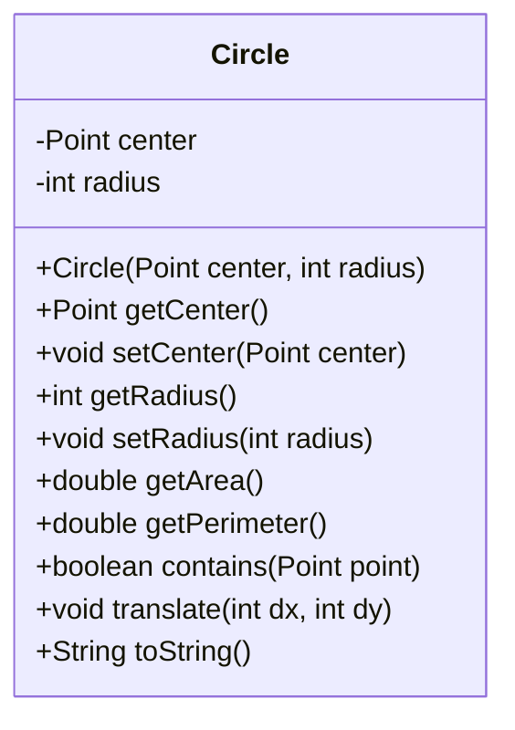
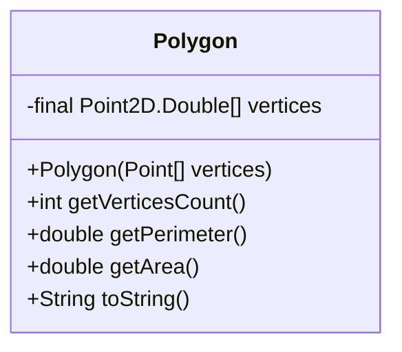
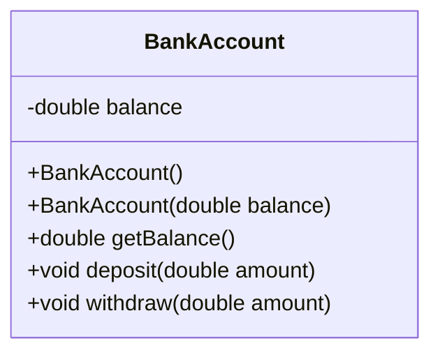
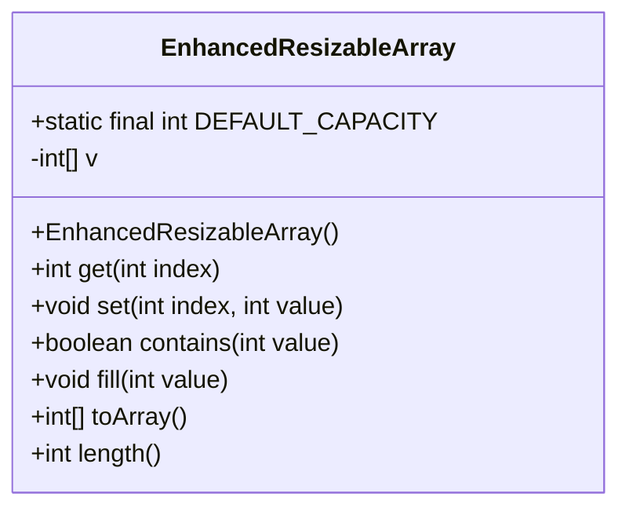
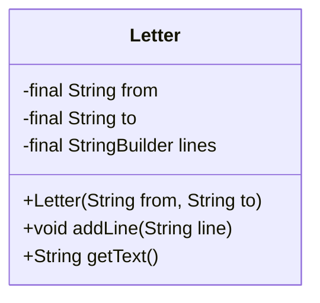

# Object-Oriented Programming - DIEF/UNIMORE

## Java Exercises (Concrete Classes)

---

**[basic.ClickCounter.java]** Write a class named ClickCounter representing a simple device to keep track of how many times a button (in this case a method) is clicked.
Internally, the class represents the number of clicks with an int value (starting from 0).
The class provides the following methods:
* public int getValue() returning the current number of clicks.
* public void click() increasing the number of clicks of 1 unit.
* public void undo() decreasing the number of clicks of 1 unit (but preventing negative click values).
* public void reset() setting the number of clicks to 0.

Refer to the UML diagram, JavaDoc documentation, and unit tests for further inspiration.



---

**[basic.RationalNumber.java]** Write a class named RationalNumber representing a rational number.
RationalNumbers are immutable objects, indeed they cannot be changed after creation.
Internally, the class represents numerator and denominator as int values. RationalNumbers must support equality with other RationalNumbers (see Object.equals(), Object.hashCode()) 
The class provides the following methods:
* public RationalNumber(int numerator, int denominator) creating the rational number. Before creating the object, numerator and denominator have to be simplified (i.e., divided by their greatest common divisor). 
* public int getNumerator() returning the numerator.
* public int getDenominator() returning the denominator.
* public RationalNumber add(RationalNumber o) returning a RationalNumber object representing the sum of the current number and another number. 
* public RationalNumber multiply(RationalNumber o) returning a RationalNumber object representing the multiplication of the current number and another number.
* public String toString().

You can use the following two methods for computing the least common multiple and the greatest common divisor of two integer numbers.

```java
public static int greatestCommonDivisor(int a, int b) {
    int max = Math.max(Math.abs(a), Math.abs(b));
    int min = Math.min(Math.abs(a), Math.abs(b));

    int rest = max % min;
    if (max % min == 0) {
        return min;
    } else {
        return greatestCommonDivisor(min, rest);
    }
}

public static int leastCommonMultiple(int a, int b) {
    return Math.abs(a * b) / greatestCommonDivisor(a, b);
}
```

Refer to the UML diagram, JavaDoc documentation, and unit tests for further inspiration.



---

**[basic.Circle.java]** Write a class named Circle representing a Circle on a 2D plane.
Internally, the class uses a Point object and an int value for representing the center and the radius of the Circle, respectively. 
The class provides the following methods:
* public Circle(Point center, int radius) creating the circle.
* getters and setters.
* public double getPerimeter() returning the perimeter of the circle.
* public double getArea() returning the area of the circle.
* public boolean contains(Point point) returning true if point is contained within the circle.
* public void translate(int dx, int dy) moving the circle on the 2D plane. dx and dy are the x and y components of the translation vector.
* public String toString().

Refer to the UML diagram, JavaDoc documentation, and unit tests for further inspiration.



---

**[basic.Polygon.java]** Write a class named Polygon representing an irregular polygon.
Internally, the class uses a Point[] for representing the vertices of the polygon.
The class provides the following methods:
* public Polygon(Point2D.Double[] vertices) creating the polygon.
* public int getVerticesCount() returning the number of vertices.
* public double getPerimeter() returning the perimeter of the polygon. 
* public double getArea() returning the area of the polygon. 
* public String toString().

Polygons must have at least three vertices. We can throw an *exception* within the constructor to avoid the creation of invalid objects, as shown below:

```java
public Polygon(Point2D.Double[] vertices) {
    if (vertices.length < 3) {
        throw new IllegalArgumentException("At least three vertices are required");
    }
    this.vertices = vertices;
}
```

Refer to [this guide](https://arachnoid.com/area_irregular_polygon/index.html) for computing perimeter and area.

Refer to the UML diagram, JavaDoc documentation, and unit tests for further inspiration.



---

**[basic.BankAccount.java]** Write a class named BankAccount representing a bank account.
Internally, the class uses a double value for representing the balance of the account.
The class provides the following methods:
* public BankAccount() creating an empty account.
* public BankAccount(double balance) creating an account with the specified balance.
* public double getBalance() getting the current balance.
* public void deposit(double amount) depositing the specific amount into the account.
* public void withdraw(double amount) withdrawing the specified amount from the account.

Refer to the UML diagram, JavaDoc documentation, and unit tests for further inspiration.



---

**[basic.EnhancedResizableArray.java]** Write a class named EnhancedResizableArray representing a resizable array. It internally keeps an int array, enlarges it when needed, and provides its key functionalities via a set of methods:

* public EnhancedResizableArray() creating an empty resizable array (the underlying int[] has a default capacity of DEFAULT_CAPACITY items).
* public int get(int index) returning the element at the specified index.
* public void set(int index, int value) setting the element at the specified index with value. If the underlying int[] capacity is smaller than index, a new int[] (with a capacity of index * 2 items) have to be allocated. All the newly allocated elements have to be set to 0.
* public boolean contains(int value) returning true if the specified value is contained within the internal array.
* public void fill(int value) setting all the elements of the internal array to the specified value.
* public int length() returning the capacity of the internal array.
* public int[] toArray() returning a copy of the internal array.

Refer to the UML diagram, JavaDoc documentation, and unit tests for further inspiration.



---

**[basic.Letter.java]** Write a class for authoring a simple letter.
In the constructor, supply the names of the sender and the recipient:

```java
public Letter(String from, String to);
```

Supply a method to add a line of text to the body of the letter.

```java
public void addLine(String line);
```

Supply a method that returns the entire text of the letter.

```java
public String getText();
```

The text has the form:

```text
Dear recipient name: 
blank line
first line of the body 
second line of the body 
. . .
last line of the body 
blank line 
Sincerely,
blank line
sender name
```

Refer to the UML diagram, JavaDoc documentation, and unit tests for further inspiration.


