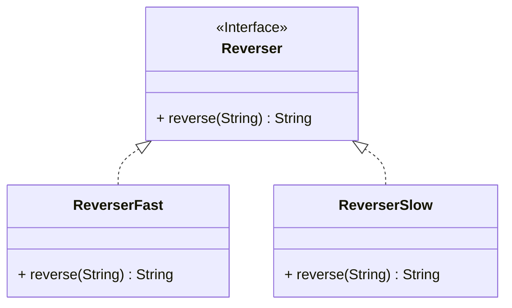
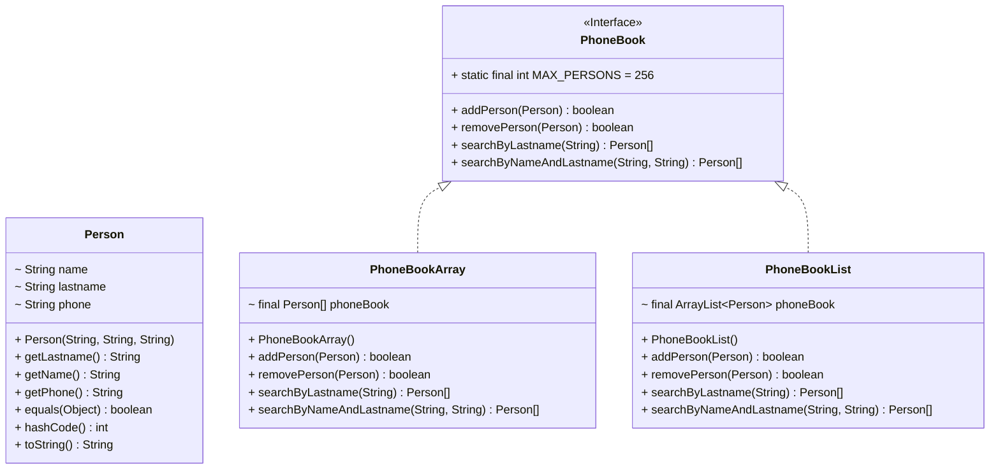
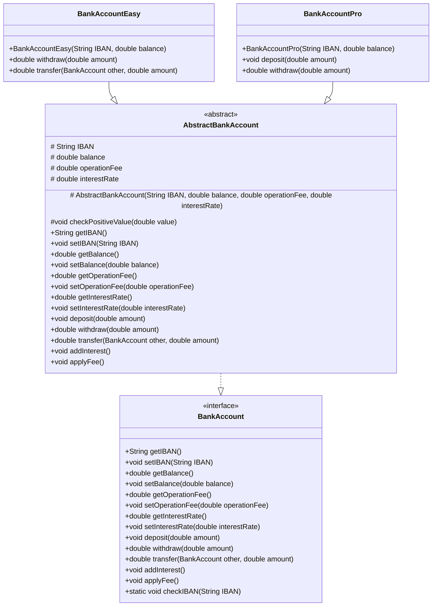
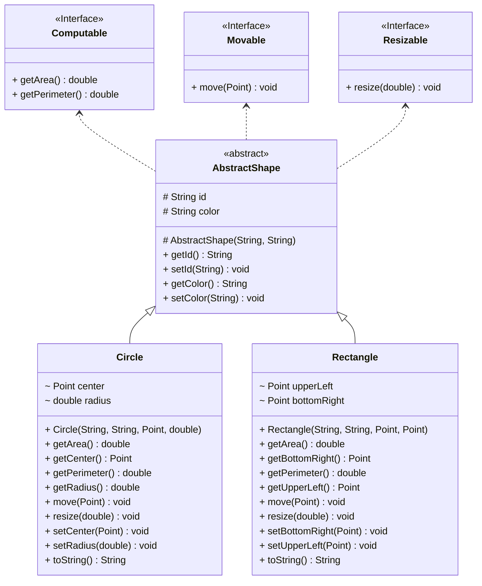
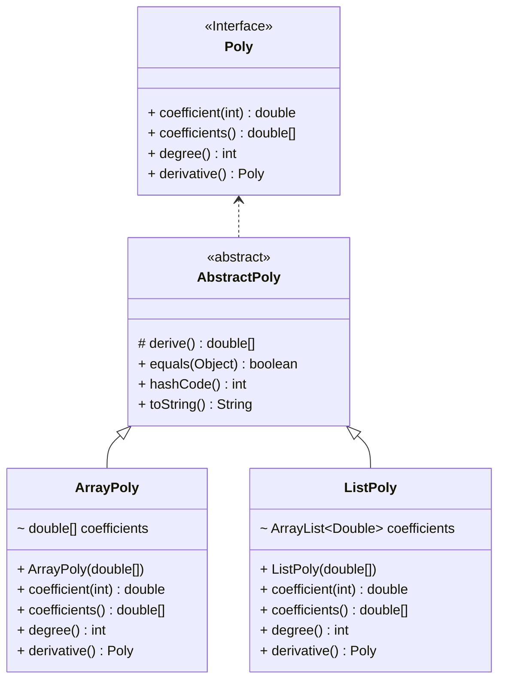
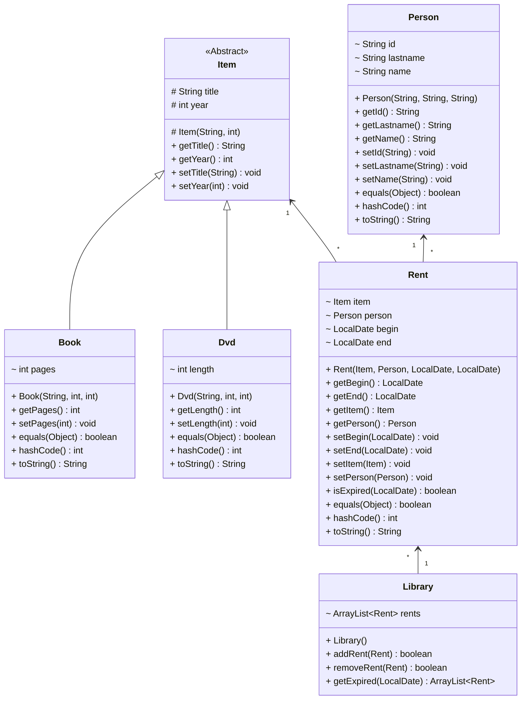

# Object-Oriented Programming - DIEF/UNIMORE

## Java Exercises (OOP Design)

Before starting this module, generate the JavaDoc documentation of the oop_full package.

In IntelliJ, click on the oop package then select Tools -> Generate JavaDoc...

---

**[reverse package]** Given the Reverser interface defining a single method *reverse* for reversing a string, provide two implementations namely ReverserFast and ReverserSlow providing two different strategies for reversing a String. As a suggestion, ReverserSlow could use a char array (see String.valueOf()), while ReverserFast could use a StringBuilder. Try also to write an anonymous implementation of the Reverser interface within a test.

Refer to the UML diagram, JavaDoc documentation, and unit tests for further inspiration.



---

**[phonebook package]** Define two classes, namely PhoneBookArray and PhoneBookList implementing the PhoneBook interface (reported below). 

* PhoneBookArray internally models the phone book as a ```Person[]```.
* PhoneBookList internally models the phone book as a ```ArrayList<Person>```.

The methods searchByLastname, searchByNameAndLastname of the PhoneBook interface have to return all the instances matching the search criteria. Both implementations limit the number of persons to 256 and do not accept duplicate elements. 

Refer to the UML diagram, JavaDoc documentation, and unit tests for further inspiration.



---

**[bankaccount package]** Define two classes, namely BankAccountEasy and BankAccountPro implementing the BankAccount interface (reported below).
* BankAccountPro represents a fully fledged bank account, allowing international transfers, negative balances, and a 2pc interest rate. However, all this comes with the cost of 1 Euro for each operation (deposit, withdrawal). 
* BankAccountEasy represents a basic bank account, which does not support negative balances, international transfers, and does not pay any interest. Nevertheless, deposits and withdrawals are free.

Note well:
* a valid IBAN must have a length comprised between 8 and 34 characters and the first two characters (representing the country) must be uppercase letters;
* the operationFee (money that will be subtracted for each operation) value must be greater or equal to zero;
* the deposit or withdraw amount must be greater or equal to zero.

Both accounts must refuse to set **invalid IBANs**, to set **negative fees** and to operate with **negative amounts**.
To implement these functionalities, you can throw an IllegalArgumentException as shown below:

```java
public void checkPositiveValue(double value){
    if(value < 0.0){
        throw new IllegalArgumentException("Negative values are not allowed for this operation");
    }
}
```

Refer to the UML diagram, JavaDoc documentation, and unit tests for further inspiration.


---

**[shape package]** Define two classes, namely Circle and Rectangle representing a circle and rectangle on a 2D plane.
* Circle internally uses a Point object and a double value for representing its center and radius.
* Rectangle internally uses two Point objects for representing its upper-left and bottom-right vertices. The edges of the rectangle have to be parallel to the x and y axes.

Both shapes must also support:
* an id (String) for identifying the shape
* a color (String) for coloring the shape (RGB Web Standard #RRGGBB, see https://en.wikipedia.org/wiki/Web_colors)
* the capability of moving on the 2D plane (move() method)
* the capability of resizing (resize() method)
* the capability of computing area and perimeter (getArea(), getPerimeter() methods)

Refer to the UML diagram, JavaDoc documentation, and unit tests for further inspiration.



---

**[polynomials package]** Define two classes, namely ArrayPoly and ListPoly providing two implementations of the Poly interface representing a generic polynomial p = c0 + c1 * x^1 + c2 * x^2 + ... + cn * x^n.
* ArrayPoly internally stores the coefficients (c0 ... cn) as a double[].
* ListPoly internally stores the coefficients (c0 ... cn) as an ```ArrayList<Double>```.

As prescribed by the Poly interface, both implementations must provide:
* a method *coefficient(int degree)* returning the coefficient of a given degree (0 ... n).
* a method *coefficients()* returning a double[] containing all the coefficients.
* a method *degree()* returning the degree of the polynomial (the number of coefficients - 1).
* a method *derivative()* returning the derivative polynomial.

Both implementations must also redefine *equals()* and *hashCode()* in order to be compared with other Poly objects.

Refer to the UML diagram, JavaDoc documentation, and unit tests for further inspiration.



---

**[library package]** A library needs a software system for managing subscribers, rents of books and dvds, and be notified about late returns. 
* Books can be modelled with a title (String), a publication year (int), and a number of pages (int).
* Dvds can be modelled with a title (String), a publication year (int), and a length in minutes (int).
* People can be modelled with an id (String), a name (String), and a lastname (String).
* Rents can be modelled with an item (a book or a dvd), a person, and two dates representing the beginning and the end of the rent.
* The library itself can be modelled as a `List<Rent>` and provides methods for adding/removing rents a method *getExpired()* returning all the late rents.

Provide and implementation of all the needed classes.

Refer to the UML diagram, JavaDoc documentation, and unit tests for further inspiration.



---

