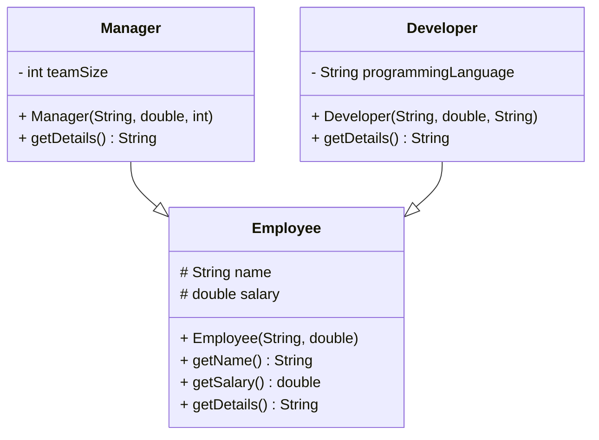
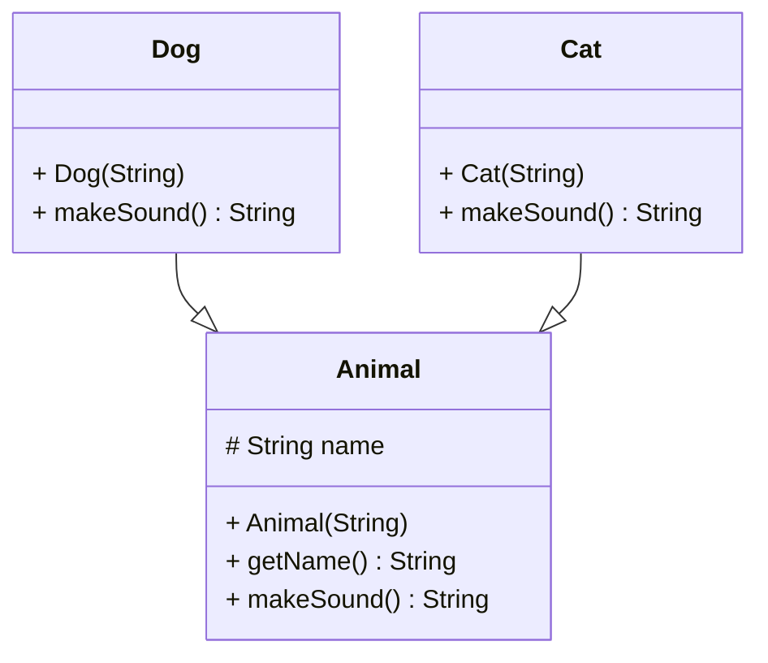
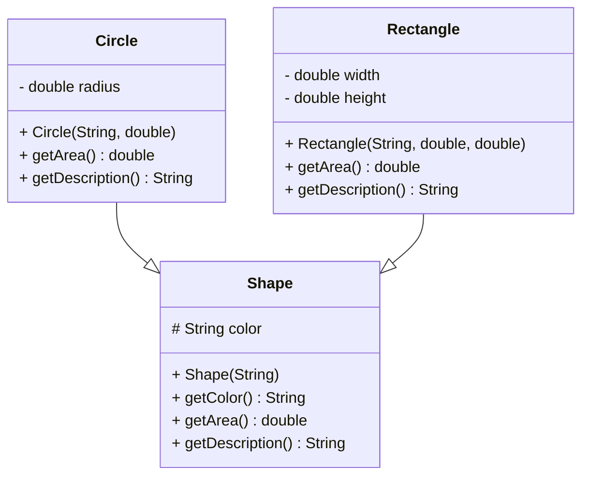
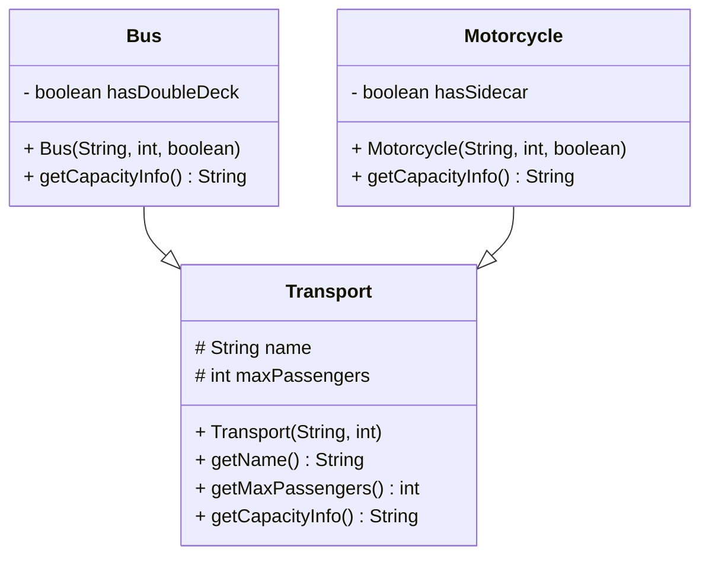
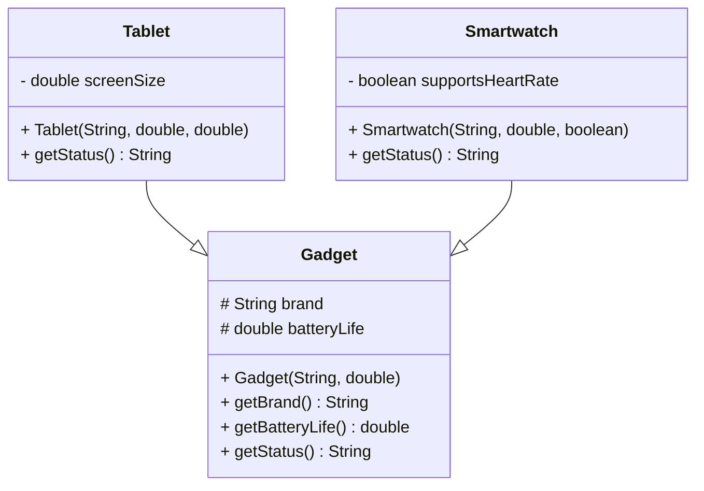

# Object-Oriented Programming - DIEF/UNIMORE

## Java Exercises (Concrete Classes & Polymorphism)

---

### **[employees package]**

Define a concrete base class `Employee` and subclasses `Manager` and `Developer`.

* `Employee`:

    * name (String)
    * salary (double)
    * method `getDetails()` returning `"Employee: name, salary"`

* `Manager`:

    * teamSize (int)
    * overrides `getDetails()` to include team size

* `Developer`:

    * programmingLanguage (String)
    * overrides `getDetails()` to include programming language

Goal: create a list of `Employee` objects and print `getDetails()` to test **polymorphic behavior**.

---

### **[animals package]**

Define a concrete class `Animal` and subclasses `Dog` and `Cat`.

* `Animal`:

    * name (String)
    * method `makeSound()` returning `"some generic sound"`

* `Dog`:

    * overrides `makeSound()` → `"woof"`

* `Cat`:

    * overrides `makeSound()` → `"meow"`

Goal: create an array of `Animal` objects and call `makeSound()` to demonstrate **polymorphism and overriding**.

---

### **[shapes package]**

Define a concrete base class `Shape` and subclasses `Circle` and `Rectangle`.

* `Shape`:

    * color (String)
    * method `getArea()` returning `0`
    * method `getDescription()` returning `"Shape with color: color"`

* `Circle`:

    * radius (double)
    * overrides `getArea()` → `Math.PI * radius^2`
    * overrides `getDescription()` → include radius

* `Rectangle`:

    * width (double), height (double)
    * overrides `getArea()` → `width * height`
    * overrides `getDescription()` → include width and height

Goal: create a `Shape[]` with circles and rectangles, iterate, and print `getArea()` and `getDescription()` to test **polymorphism**.

---

### **[vehicles package]**

Define a concrete base class `Transport` and subclasses `Bus` and `Motorcycle`.

* `Transport`:

    * name (String)
    * maxPassengers (int)
    * method `getCapacityInfo()` → `"Transport: name can carry maxPassengers passengers"`

* `Bus`:

    * hasDoubleDeck (boolean)
    * overrides `getCapacityInfo()` → include if double deck

* `Motorcycle`:

    * hasSidecar (boolean)
    * overrides `getCapacityInfo()` → include sidecar info

Goal: create a `Transport[]` array with buses and motorcycles and print `getCapacityInfo()` to see polymorphic behavior.

---

### **[electronics package]**

Define a concrete base class `Gadget` and subclasses `Tablet` and `Smartwatch`.

* `Gadget`:

    * brand (String)
    * batteryLife (double)
    * method `getStatus()` → `"Gadget: brand, batteryLife hours"`

* `Tablet`:

    * screenSize (double)
    * overrides `getStatus()` → include screen size

* `Smartwatch`:

    * supportsHeartRate (boolean)
    * overrides `getStatus()` → include heart rate support

Goal: create a `Gadget[]` array and call `getStatus()` for all objects to see **polymorphism** in action.

