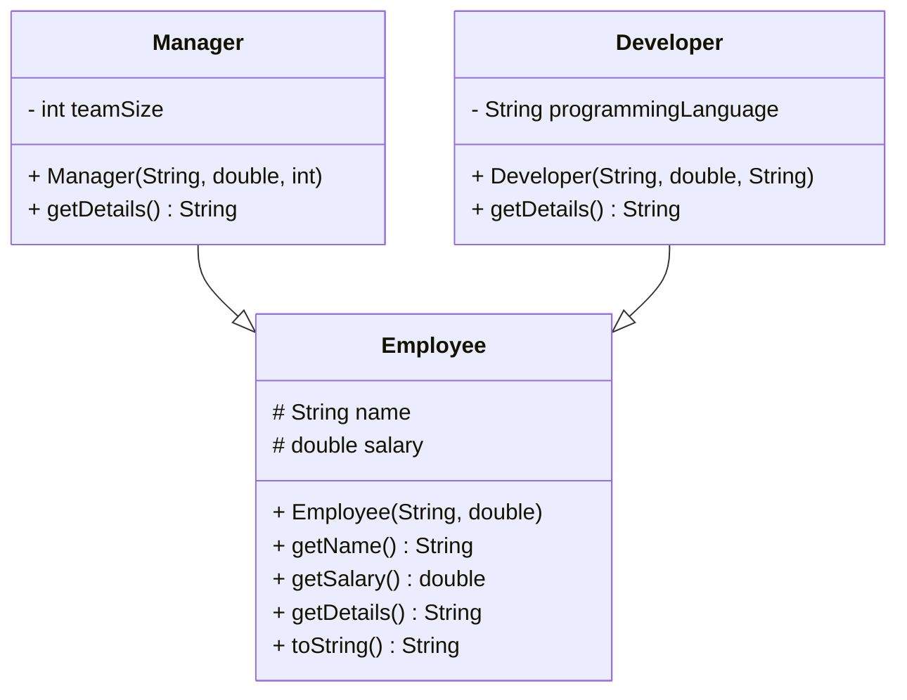
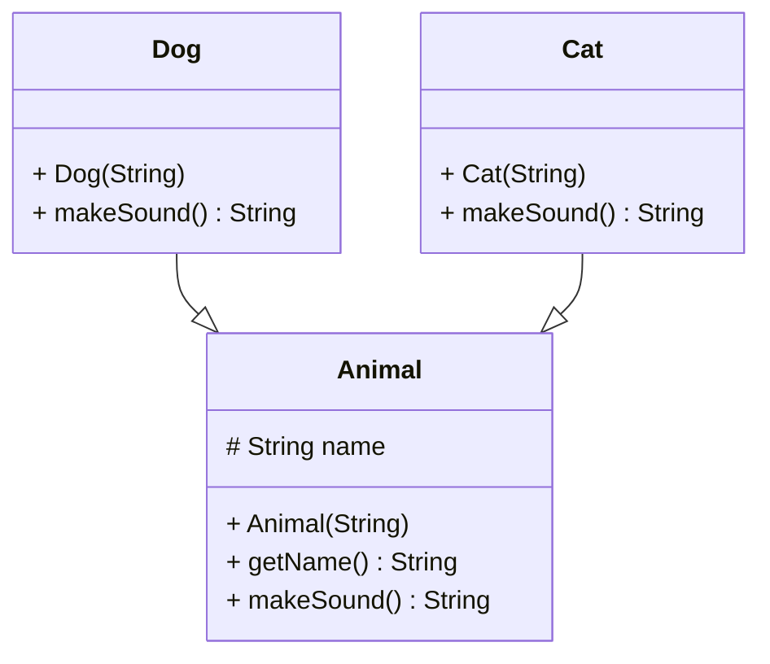
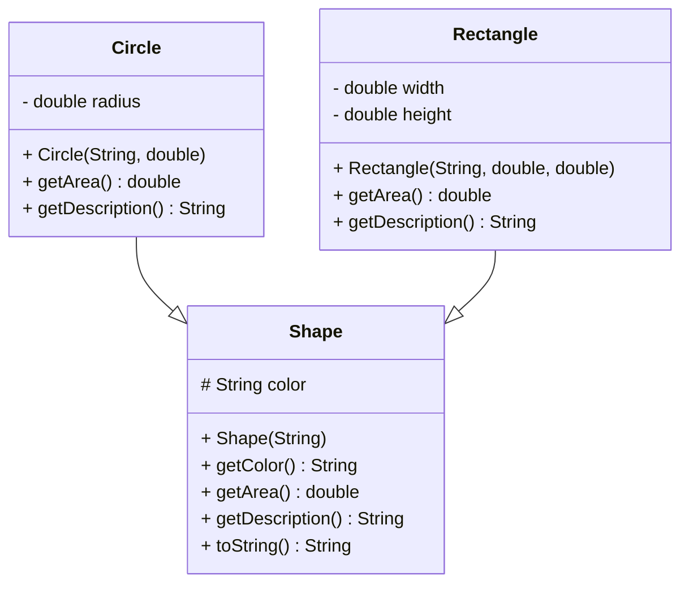
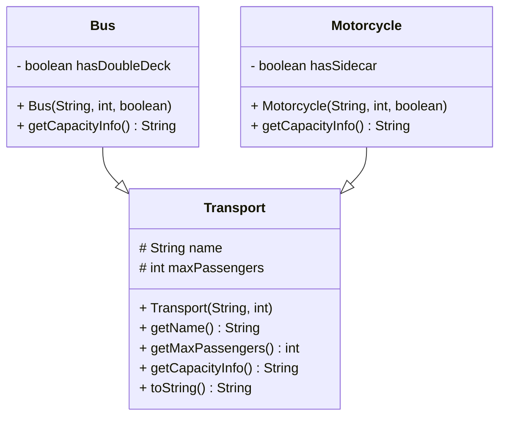
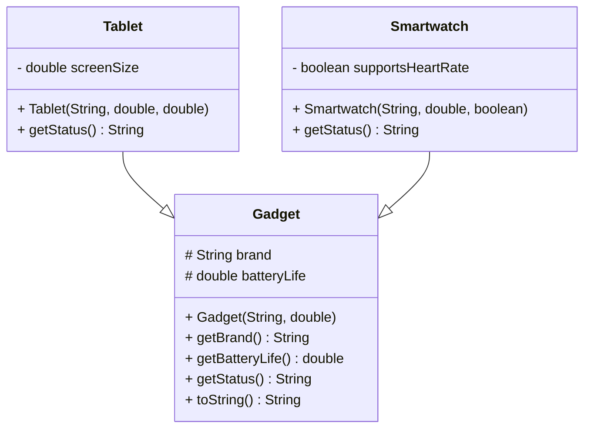

# Object-Oriented Programming - DIEF/UNIMORE

---

## [employees package]

### Specification

**Employee**

* `name` (String)
* `salary` (double)
* `getDetails()` →

  ```
  Employee{name='name', salary=salary}
  ```
* `toString()` → delegates to `getDetails()`

**Manager**

* `teamSize` (int)
* overrides `getDetails()` →

  ```
  Manager{name='name', salary=salary, teamSize=teamSize}
  ```

**Developer**

* `programmingLanguage` (String)
* overrides `getDetails()` →

  ```
  Developer{name='name', salary=salary, language='language'}
  ```



---

## [animals package]

### Specification

**Animal**

* `name` (String)
* `makeSound()` → `"generic"`

**Dog**

* overrides `makeSound()` → `"woof"`

**Cat**

* overrides `makeSound()` → `"meow"`



---

## [shapes package]

### Specification

**Shape**

* `color` (String)
* `getArea()` → `0`
* `getDescription()` →

  ```
  Shape{color='color'}
  ```
* `toString()` → delegates to `getDescription()`

**Circle**

* `radius` (double)
* overrides `getArea()` → `Math.PI * radius^2`
* overrides `getDescription()` →

  ```
  Circle{color='color', radius=radius}
  ```

**Rectangle**

* `width`, `height` (double)
* overrides `getArea()` → `width * height`
* overrides `getDescription()` →

  ```
  Rectangle{color='color', width=width, height=height}
  ```



---

## [vehicles package]

### Specification

**Transport**

* `name` (String)
* `maxPassengers` (int)
* `getCapacityInfo()` →

  ```
  Transport{name='name', maxPassengers=maxPassengers}
  ```
* `toString()` → delegates to `getCapacityInfo()`

**Bus**

* `hasDoubleDeck` (boolean)
* overrides `getCapacityInfo()` →

  ```
  Bus{name='name', maxPassengers=maxPassengers, doubleDeck=true/false}
  ```

**Motorcycle**

* `hasSidecar` (boolean)
* overrides `getCapacityInfo()` →

  ```
  Motorcycle{name='name', maxPassengers=maxPassengers, sidecar=true/false}
  ```



---

## [electronics package]

### Specification

**Gadget**

* `brand` (String)
* `batteryLife` (double)
* `getStatus()` →

  ```
  Gadget{brand='brand', batteryLife=batteryLife}
  ```
* `toString()` → delegates to `getStatus()`

**Tablet**

* `screenSize` (double)
* overrides `getStatus()` →

  ```
  Tablet{brand='brand', batteryLife=batteryLife, screenSize=screenSize}
  ```

**Smartwatch**

* `supportsHeartRate` (boolean)
* overrides `getStatus()` →

  ```
  Smartwatch{brand='brand', batteryLife=batteryLife, heartRate=true/false}
  ```



