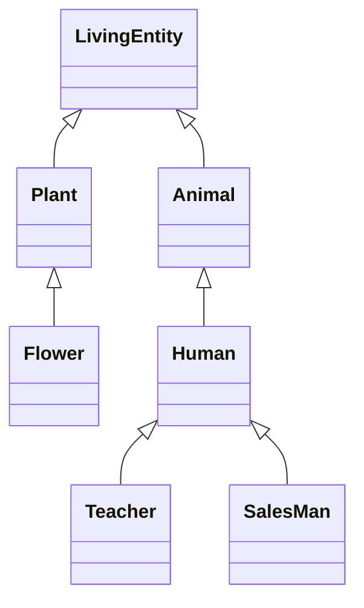
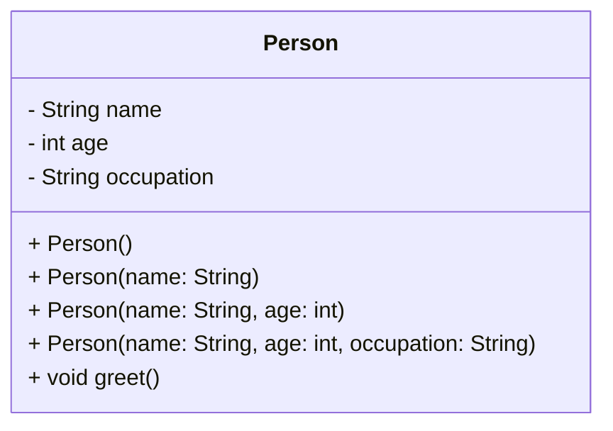
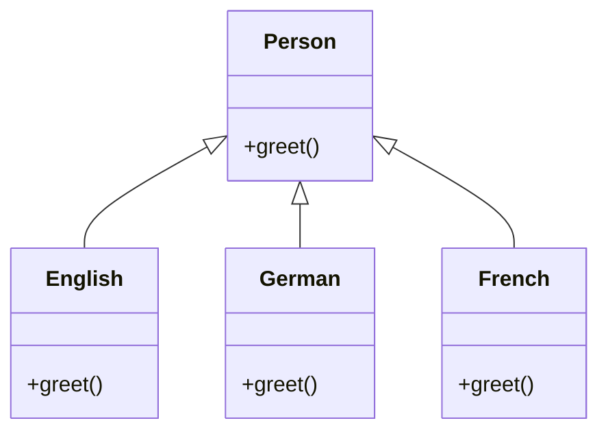

# Java From Functions to Classes

## Motivations

### The present


### The past


(see more: [Most Popular Programming Languages 1965-2020 - YouTube](https://www.youtube.com/watch?v=YqxeLodyyqA))


### The future?


### Lines of code


_Lines of code per kernel version_


_Lines of code per space mission_


_Lines of code per product_

(see more: [Million Lines of Code - Information is Beautiful](http://www.informationisbeautiful.net/visualizations/million-lines-of-code/))


### Tools and artifacts

In the early days of computing science it appeared increasingly evident that with
**increasing complexity** the lines of code contained in a software became more and more
numerous, making its **maintenance more and more complex**.

A great example of a severe misalignment between available tools and artifacts' complexity took place during the 1970s in a period remembered as [software crisis](https://en.wikipedia.org/wiki/Software_crisis). 
* Projects running over-budget
* Projects running over-time
* Software was inefficient
* Software was difficult to maintain


| Tools                             | Artifacts                     |
|-----------------------------------|-------------------------------|
|  |  |
|  |  | 


### Errors / 1K SLOC
A simple and informal rule to understand the quality of a software is to measure the amount of
errors per thousand lines of code (_errors / 1K SLOC_).

- Industry Average, 25 errors / 1K SLOC
- Corporate Applications, 5 errors / 1K SLOC
- Cleanroom development technique, 0.5 errors / 1K SLOC


Various processes and methodologies have been developed over the last few decades to improve
software quality management such as procedural programming and object-oriented programming.

### Software maintenance costs
- Procedural programming languages (e.g., C) are **not suitable for building large
  software infrastructures** because code reuse is limited. Limited reuse increases both development costs (code written from scratch) and maintenance costs (code written from scratch is less tested than older code).
- OOP aims at secure, re-usable, flexible, extensible software. Instead of focusing on algorithms, optimization, and efficiency, **OOP focus on programming techniques**.


## Procedural vs Objected Oriented
### Procedural approach

* Data and functions are separate
* Functions process data: _operation(object, params)_

```c++
int main() {
  int v[100];
  int n = sizeof(v) / sizeof(v[0]);

  init(v, n);
  sort(v, n);
  search(v, n, 10);
}
```

```c++
void init(int v[], int size) {
  int i;
  for (i = 0; i < size; i++) {
    v[i] = rand() % 100;
  }
}

void sort(int v[], int n) {
  int i, j, tmp, changed;
  for (i = 0; i < n - 1; i++) {
    changed = FALSE;
    for (j = 0; j < n - i - 1; j++) {
      if (v[j] > v[j + 1]) {
        changed = TRUE;
        tmp = v[j];
        v[j] = v[j + 1];
        v[j + 1] = tmp;
      }
    }
    if (!changed) break;
  }
}

int search(const int v[], int size, int value) {
  int i;
  for (i = 0; i < size; i++) {
    if (v[i] == value) {
      return i;
    }
  }
  return -1;
}

void show(int v[], int size) {
  int i;
  for (i = 0; i < size; i++) {
    printf("[%d] %d\n", i, v[i]);
  }
}
```

**Issues**


- **Reuse of code limited**: data and operations are separate. This makes it complex to reuse existing code in
  other projects
- **Data protection limited**: unprotected data accessible from vast portions of the source code. After a certain
  stage, debug becomes a nightmare!
- **Decomposition limited**: large scale projects require a large scale working force (many teams). Unprotected
  data, separate from operations, makes it hard to decompose
  
    
### Object-oriented approach

* Data and functions are coupled together within classes
* Objects deliver services using internal data: _object.operation(params)_


```java
public class App {
  public static void main(String[] args) {
    Vector vector = new Vector();
    vector.sort();
    vector.search(10);
  }
}
```


```Java
public class Vector {
    int[] v;

    public Vector(int capacity) {
        this.v = new int[capacity];
        init();
    }

    void sort() {
        boolean changed;
        for (int i = 0; i < v.length - 1; i++) {
            changed = false;
            for (int j = 0; j < v.length - i - 1; j++) {
                if (v[j] > v[j + 1]) {
                    changed = true;
                    int tmp = v[j];
                    v[j] = v[j + 1];
                    v[j + 1] = tmp;
                }
            }
            if (!changed) break;
        }
    }
    
    void init() {
      Random rnd = new Random();
      for (int i = 0; i < v.length; i++) {
        v[i] = rnd.nextInt(100);
      }
    }
  
    int search(int value) {
      for (int i = 0; i < v.length; i++) {
        if (v[i] == value) {
          return i;
        }
      }
      return -1;
    }
  
    void show() {
      for (int i = 0; i < v.length; i++) {
        System.out.printf("[%d] %d\n", i, v[i]);
      }
    }
  }
  ```

## OOP Features

### Encapsulation
Encapsulation is defined as the mechanism wrapping together, inside a protective shield, 
code and data (data is encapsulated inside a shield of code); that prevents the data 
from being accessed by code outside this shield. The rest of the program has access only 
to a selected list of public methods (_public interface_).


Was it possible before? Data in C language is public by default. Although “Struct” variables can be declared private by defining them separately from the main class. This can be achieved by having a separate header and source C files. A header file is followed by the “.h” extension while C files are followed by the “.C” extension.

```c++
// point.h 
struct Point {
  double x;
  double y;
};

struct Point* makePoint(double x, double y); 
double distance (struct Point *p1, struct Point *p2); 
```

```c++
// point.c
#include "point.h"

struct Point* makepoint(double x, double y) {   
  struct Point* p = malloc(sizeof(struct Point));
  p->x = x;
  p->y = y;
  return p;
}

double distance(struct Point* p1, struct Point* p2) {
  double dx = p1->x - p2->x;
  double dy = p1->y - p2->y;
  return sqrt(dx * dx + dy * dy);
}
```

### Inheritance
Inheritance consists in the mechanism in which one class acquires all the properties and behaviours of a parent object. The idea is that you create new classes that are built upon existing classes. 
* The class that inherits (and that can reuse) methods and fields of the parent class is known as **subclass** or **child class**.
* Moreover, it can add new methods and fields or "override" the methods of the **parent class**, also known as **superclass**.
* Every class specializes its ancestors
* Inheritance introduces the **IS A** relationship (_child IS A parent_)
* Enables **reuse of code**



Was it possible before? Single inheritance in C can be achieved by embedding the inherited class attribute structure as the first member of the derived class attribute structure.

For example, instead of creating a NamedPoint class from scratch, you can inherit most what’s common from the already existing Point class and add only what’s different for NamedPoint (i.e., a name). Here’s how you declare the NamedPoint “class”.

```c++
// namedPoint.h
struct NamedPoint {
  double x;
  double y;
  char* name;
};

struct NamedPoint *makeNamedPoint(double x, double y, char *name);
void setName(struct NamedPoint *np, char *name);
char *getName(struct NamedPoint *np);
```

```c++
// namedPoint.c
#include "namedPoint.h"

struct NamedPoint *makeNamedPoint(double x, double y, char *name) {
  struct NamedPoint *p = malloc(sizeof(struct NamedPoint));
  p->x = x;
  p->y = y;
  p->name = name;
  return p; 
}

void setName(struct NamedPoint *np, char *name) {
  np->name = name;
}

char *getName(struct NamedPoint *np) {
  return np->name;
}
```

```c++
// main.c
#include "point.h"
#include "namedPoint.h"
#include <stdio.h>

int main(int ac, char** av) {
  struct NamedPoint* origin = makeNamedPoint(0.0, 0.0, "origin");
  struct NamedPoint* upperRight = makeNamedPoint(1.0, 1.0, "upperRight");
  printf("distance=%f\n", distance(
             (struct Point *) origin,
             (struct Point *) upperRight));
}
```


### Polymorphism
In general, **polymorphism** means that something (an object or another entity) has many forms.

Java provides two main types of polymorphism:

**Static (compile-time) polymorphism** refers to polymorphic functions that can be applied to arguments of different types, but behave differently depending on the type of the argument to which they are applied. Java supports it as **method overloading**.



**Dynamic (run-time) polymorphism** is the possibility to use an instance of a subclass (and its methods) based on the object type used at run-time instead of the object type declared by the programmer (often the base class type). Java supports it as **method overriding**.

> **Tell-Don't-Ask Principle**
> 
> Instead of asking an object about its state and then performing actions, it is much easier to simply tell the object what it needs to do and let it decide for itself how to do that.



Was it possible before? Polymorphism in C can be implemented by initializing a 'default structure' containing a function pointer, leveraging linking properties. This allows the program to dynamically select the appropriate behavior based on the data type or situation.

```c++
// person.h
#ifndef PERSON_H
#define PERSON_H

struct person {
    const char* name;
    const struct nationalityInfo* nationality;
};

struct nationalityInfo {
    const char* (*greet) (void);
};

static const char* greet(struct person* person) {
    return person->nationality->greet();
}

extern const struct nationalityInfo ENGLISH[], FRENCH[], GERMAN[];

#endif
```

```c++
// english.c
#include "person.h"

static const char* sayHello(void) {
    return "hi!";
}

const struct nationalityInfo ENGLISH[] = { { sayHello } };
```

```c++
// french.c
#include "person.h"

static const char* sayHello(void) {
    return "bonjour!";
}

const struct nationalityInfo FRENCH[] = { { sayHello } };
```

```c++
// german.c
#include "person.h"

static const char* sayHello(void) {
    return "hallo!";
}

const struct nationalityInfo GERMAN[] = { { sayHello } };
```

```c++
// main.c
#include "person.h"

#include <stdio.h>
#include <stdlib.h>

int main(void) {
    struct person elias = { "Elias", GERMAN };
    struct person john = { "John", ENGLISH };
    struct person jean = { "Jean", FRENCH };

    printf("%s says %s\n", elias.name, greet(&elias));
    printf("%s says %s\n", john.name, greet(&john));
    printf("%s says %s\n", jean.name, greet(&jean));

    exit(EXIT_SUCCESS);
}
```

```text
Output:
Elias says hallo!
John says hi!
Jean says bonjour!
```

## Resources