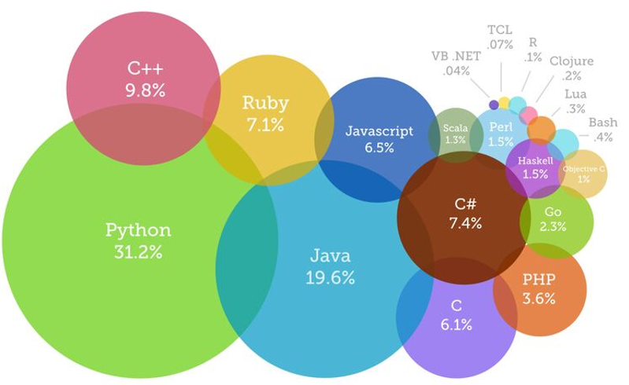
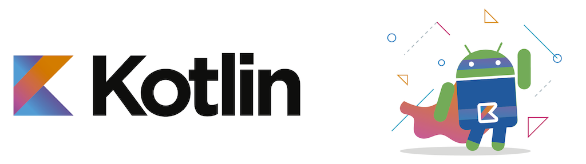
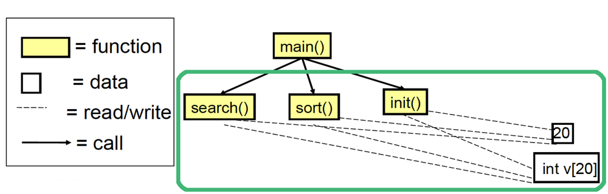
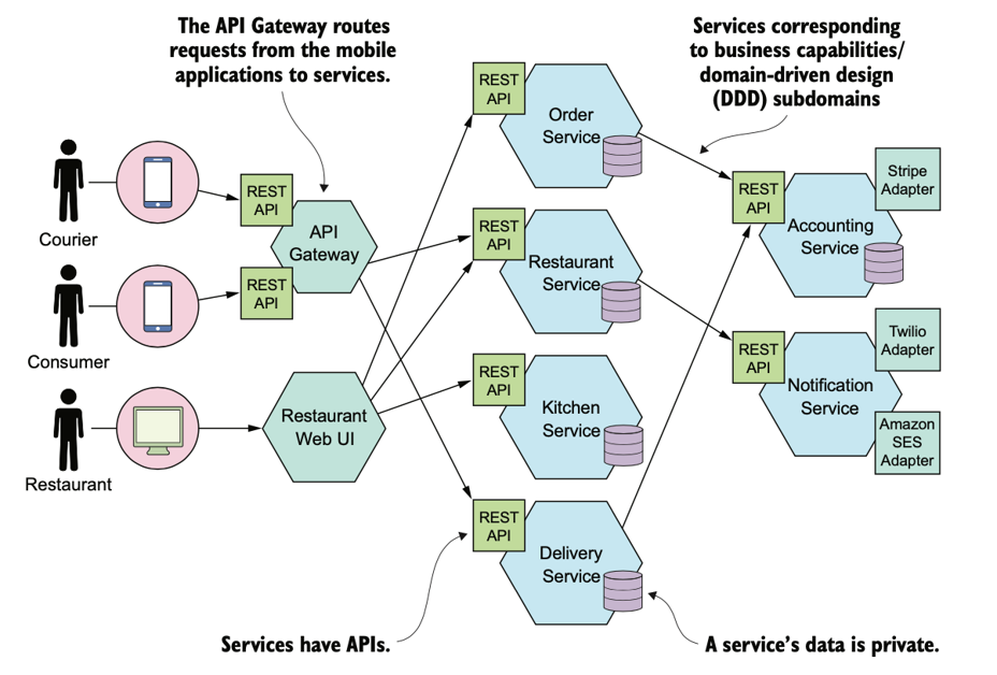

# Java From Functions to Classes

### The present



### The past


(see more: [Most Popular Programming Languages 1965-2020 - YouTube](https://www.youtube.com/watch?v=YqxeLodyyqA))


### The future?



### Lines of code


_Lines of code per kernel version_


_Lines of code per space mission_


_Lines of code per product_

(see more: [Million Lines of Code - Information is Beautiful](http://www.informationisbeautiful.net/visualizations/million-lines-of-code/))


### Tools and artifacts

In the early days of computing science it appeared increasingly evident that with
**increasing complexity** the lines of code contained in a software became more and more
numerous, making its **maintenance more and more complex**.

Several causes can be associated with that historical period, known as the _software crisis_:
- Projects running over-budget
- Projects running over-time
- Software was inefficient
- Software was difficult to maintain

(see more: [Software crisis - Wikipedia](https://en.wikipedia.org/wiki/Software_crisis))

| Tools                                       | Artifacts                                |
|---------------------------------------------|------------------------------------------|
|  |  | 


### Errors / 1K SLOC
A simple and informal rule to understand the quality of a software is to measure the amount of
errors per thousand lines of code (_errors / 1K SLOC_).

- Industry Average, 25 errors / 1K SLOC
- Corporate Applications, 5 errors / 1K SLOC
- Cleanroom development technique, 0.5 errors / 1K SLOC


Various processes and methodologies have been developed over the last few decades to improve
software quality management such as procedural programming and object-oriented programming.

### Software maintenance costs
- Procedural programming languages (e.g., C) are **not suitable for building large
  software infrastructures** because code reuse is limited. Limited reuse increases both development costs (code written from scratch) and maintenance costs (code written from scratch is less tested than older code).
- OOP aims at secure, re-usable, flexible, extensible software. Instead of focusing on algorithms, optimization, and efficiency, **OOP focus on programming techniques**.


### Procedural approach
```C
#include <stdio.h>
#include <stdlib.h>

void init(int v[], int size) {
  int i;
  for (i = 0; i < size; i++) {
    v[i] = rand() % 100;
  }
}

void sort(int v[], int n) {
  int i, j, tmp, changed;
  for (i = 0; i < n - 1; i++) {
    changed = FALSE;
    for (j = 0; j < n - i - 1; j++) {
      if (v[j] > v[j + 1]) {
        changed = TRUE;
        tmp = v[j];
        v[j] = v[j + 1];
        v[j + 1] = tmp;
      }
    }
    if (!changed) break;
  }
}

int search(const int v[], int size, int value) {
  int i;
  for (i = 0; i < size; i++) {
    if (v[i] == value) {
      return i;
    }
  }
  return -1;
}

void show(int v[], int size) {
  int i;
  for (i = 0; i < size; i++) {
    printf("[%d] %d\n", i, v[i]);
  }
}

int main() {
  int v[100];
  int n = sizeof(v) / sizeof(v[0]);

  init(v, n);
  sort(v, n);
  search(v, n, 10);
}
```

**Issues**


- **Reuse of code limited**: data and operations are separate. This makes it complex to reuse existing code in
  other projects
- **Data protection limited**: unprotected data accessible from vast portions of the source code. After a certain
  stage, debug becomes a nightmare!
- **Decomposition limited**: large scale projects require a large scale working force (many teams). Unprotected
  data, separate from operations, makes it hard to decompose
  
    
### Object-oriented approach
So how does object-oriented programming manage to ensure these differences from the
procedural approach? Defining a new type (a **_class_** of special vectors) consisting in an additional abstraction layer coupling data with operations acting on data.




```Java
public class Vector {
    int[] v;

    public Vector(int capacity) {
        this.v = new int[capacity];
        init();
    }

    void sort() {
        boolean changed;
        for (int i = 0; i < v.length - 1; i++) {
            changed = false;
            for (int j = 0; j < v.length - i - 1; j++) {
                if (v[j] > v[j + 1]) {
                    changed = true;
                    int tmp = v[j];
                    v[j] = v[j + 1];
                    v[j + 1] = tmp;
                }
            }
            if (!changed) break;
        }
    }
    
    void init() {
      Random rnd = new Random();
      for (int i = 0; i < v.length; i++) {
        v[i] = rnd.nextInt(100);
      }
    }
  
    int search(int value) {
      for (int i = 0; i < v.length; i++) {
        if (v[i] == value) {
          return i;
        }
      }
      return -1;
    }
  
    void show() {
      for (int i = 0; i < v.length; i++) {
        System.out.printf("[%d] %d\n", i, v[i]);
      }
    }
  }
  ```

### Wrapping up
**Procedural approach**
* Data and functions are separate     
* Functions process data: _operation(object, params)_

```
int main() {
    int v[100];
    int n = sizeof(v) / sizeof(v[0]);

    init(v, n);
    sort(v, n);
    search(v, n, 10);
}
```

**Object-Oriented approach**

* Data and functions are coupled together within classes
* Objects deliver services using internal data: _object.operation(params)_

```
 public static void main(String[] args) {
	 Vector v = new Vector(20);

     v.sort();
     v.show();
     v.search(10);
 }
```

# OOP Features

### Encapsulation
Encapsulation is defined as the mechanism wrapping together, inside a protective shield, 
code and data (data is encapsulated inside a shield of code); that prevents the data 
from being accessed by code outside this shield. The rest of the program has access only 
to a selected list of public methods (_public interface_).


Was it possible before? Data in C language is public by default. Although “Struct” variables can be declared private by defining them separately from the main class. This can be achieved by having a separate header and source C files. A header file is followed by the “.h” extension while C files are followed by the “.C” extension.

```
// point.h 
struct Point {
  double x,y;
};

struct Point* makePoint(double x, double y); 
double distance (struct Point *p1, struct Point *p2); 
```

```
// point.c
#include "point.h"

struct Point* makepoint(double x, double y) {   
  struct Point* p = malloc(sizeof(struct Point));
  p->x = x;
  p->y = y;
  return p;
}

double distance(struct Point* p1, struct Point* p2) {
  double dx = p1->x - p2->x;
  double dy = p1->y - p2->y;
  return sqrt(dx * dx + dy * dy);
}
```

### Inheritance
Inheritance consists in the mechanism in which one class acquires all the properties and behaviours of a parent object. The idea is that you create new classes that are built upon existing classes. 
* The class that inherits (and that can reuse) methods and fields of the parent class is known as **subclass** or **child class**.
* Moreover, it can add new methods and fields or "override" the methods of the **parent class**, also known as **superclass**.
* Every class specializes its ancestors
* Inheritance introduces the **IS A** relationship (_child IS A parent_)
* Enables **reuse of code**


Was it possible before? Single inheritance in C can be achieved by embedding the inherited class attribute structure as the first member of the derived class attribute structure.

For example, instead of creating a NamedPoint class from scratch, you can inherit most what’s common from the already existing Point class and add only what’s different for NamedPoint (i.e., a name). Here’s how you declare the NamedPoint “class”.

```
// namedPoint.h
struct NamedPoint {
  double x,y;
  char* name;
};

struct NamedPoint *makeNamedPoint(double x, double y, char *name);
void setName(struct NamedPoint *np, char *name);
char *getName(struct NamedPoint *np);
```

```
// namedPoint.c
#include "namedPoint.h"

struct NamedPoint *makeNamedPoint(double x, double y, char *name) {
  struct NamedPoint *p = malloc(sizeof(struct NamedPoint));
  p->x = x;
  p->y = y;
  p->name = name;
  return p; 
}

void setName(struct NamedPoint *np, char *name) {
  np->name = name;
}

char *getName(struct NamedPoint *np) {
  return np->name;
}
```

```
// main.c
#include "point.h"
#include "namedPoint.h"
#include <stdio.h>

int main(int ac, char** av) {
  struct NamedPoint* origin = makeNamedPoint(0.0, 0.0, "origin");
  struct NamedPoint* upperRight = makeNamedPoint(1.0, 1.0, "upperRight");
  printf("distance=%f\n", distance(
             (struct Point *) origin,
             (struct Point *) upperRight));
}
```


### Polymorphism
Polymorphism is the ability to provide different implementations 
of an (inherited) method, depending on the type of object that is passed to the method.

> **Tell-Don't-Ask Principle**
> 
> Instead of asking an object about its state and then performing actions,
it is much easier to simply tell the object what it needs to do and let it
decide for itself how to do that.
> 
> _Tell to the parent class to perform an action. The specific implementation
within the child class will do it_


|                        |       feature       |                                  what                                  |                               where                               |     when     |
|:----------------------:|:-------------------:|:----------------------------------------------------------------------:|:-----------------------------------------------------------------:|:------------:|
| **method overriding**  |   same signature    | depending on the _actual_ object the method produces different results | using a collection of objects belonging to a hierarchy of classes |   runtime    |
| **method overloading** | different signature |  the method whose parameters types matched is selected to be executed  |                          inside a class                           | compile-time |

_*signature: method name + ordered list of parameters type_


### Dependency Inversion
In the typical calling tree, main functions called high-level functions, which called mid-level functions, which called low-level functions.
In that calling tree, **source code dependencies inexorably followed the flow of control.**

> - **Source Code Dependency**, every caller is forced to mention the name of 
the module that contains the callee.
> - **Flow of Control Dependency**, the runtime line of execution goes from one 
module to another module.


### Dependency Inversion through interfaces
When **polymorphism** is brought into play, through the addition of the concepts of 
abstractions and interfaces, programmers gain the absolute control over every source 
code dependency in the system. Abstraction means to focus on the common properties 
and behaviors of some Objects.

The idea behind is that when designing the interaction between a high-level
module and a low-level module, _the interaction should be thought of as an
**abstract interaction**_ between them.

<code>Note: "inversion" does not mean that Low-Levels depend on High-Levels.
It means that both layers should depend on abstractions.</code>

Inverting the Source Code Dependency between two projects means that the 
project that changes the most now has a Source Code Dependency on the one
that changes the least (roles are decided based on the rate of changes).

> **Dependency Inversion Principle**
> - high-level modules should not import anything from low-level modules. 
**Both should depend on abstractions** (e.g. interfaces).
> - abstractions should not depend on details. Details (concrete implementations)
should depend on abstractions.


In the figure above, module <code>HL1</code> calls the <code>F()</code> function in 
module <code>ML1</code>. The fact that it calls this function through an interface
is a source code contrivance. At runtime, the interface doesn't exists. 
<code>HL1</code> simply calls <code>F()</code> within <code>ML1</code> 
(albeit indirectly).

Note: the source code dependency (the inheritance relationship) between 
<code>ML1</code> and the interface <code>I</code> points in the opposite direction 
compared to the flow of control. Thus, we obtained a **dependency inversion**.

### Monolithic Architecture vs Microservice Architecture

In recent years, microservices architecture has emerged as a popular approach to designing and building complex software systems. This architecture style breaks down large, monolithic applications into smaller, independent services that can be developed, deployed, and scaled independently. This approach has several benefits, including increased agility, scalability, and fault tolerance, among others.


*Monolithic Architecture*



*Microservice Architecture*

# Wisdom Pills
*Learning to write clean code is hard work. It requires more than just the knowledge of principles and patterns. You must sweat over it. You must practice it yourself, and watch yourself fail. You must watch others practice it and fail. You must see them stumble and retrace their steps. You must see them agonize over decisions and see the price they pay for making those decisions the wrong way.*

Robert C. Martin - Clean Code