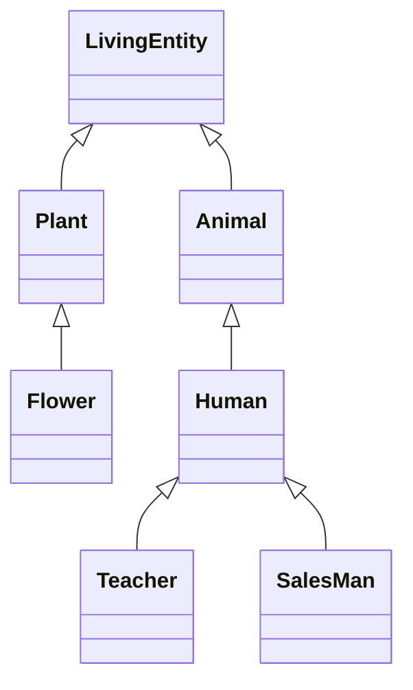
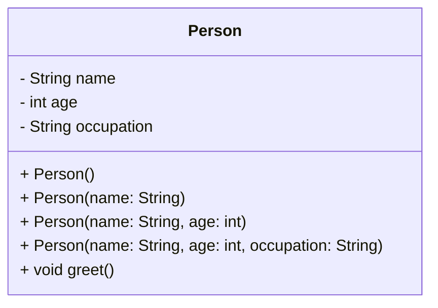
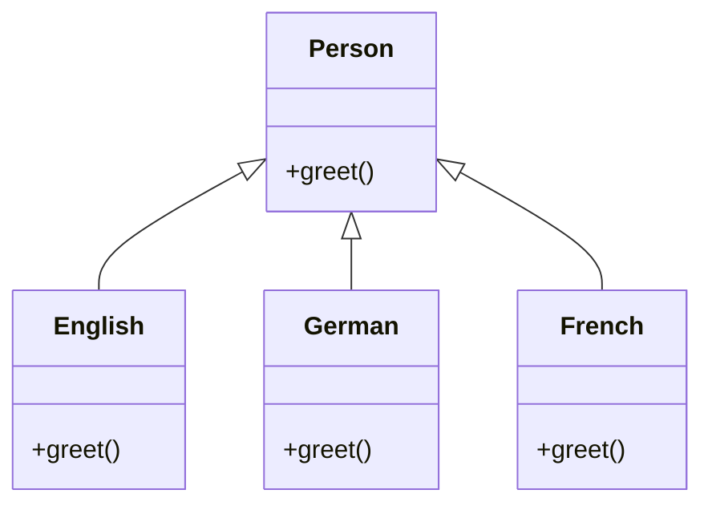

# Java From Functions to Classes

## Motivations

### The present


### The past


(see more: [Most Popular Programming Languages 1965-2020 - YouTube](https://www.youtube.com/watch?v=YqxeLodyyqA))


### The future?


### Lines of code


_Lines of code per kernel version_


_Lines of code per space mission_


_Lines of code per product_

(see more: [Million Lines of Code - Information is Beautiful](http://www.informationisbeautiful.net/visualizations/million-lines-of-code/))


### Tools and artifacts

In the early days of computing science it appeared increasingly evident that with
**increasing complexity** the lines of code contained in a software became more and more
numerous, making its **maintenance more and more complex**.

A great example of a severe misalignment between available tools and artifacts' complexity took place during the 1970s in a period remembered as [software crisis](https://en.wikipedia.org/wiki/Software_crisis). 
* Projects running over-budget
* Projects running over-time
* Software was inefficient
* Software was difficult to maintain


| Tools                             | Artifacts                     |
|-----------------------------------|-------------------------------|
|  |  |
|  |  | 


### Errors / 1K SLOC
A simple and informal rule to understand the quality of a software is to measure the amount of
errors per thousand lines of code (_errors / 1K SLOC_).

- Industry Average, 25 errors / 1K SLOC
- Corporate Applications, 5 errors / 1K SLOC
- Cleanroom development technique, 0.5 errors / 1K SLOC


Various processes and methodologies have been developed over the last few decades to improve
software quality management such as procedural programming and object-oriented programming.

### Software maintenance costs
- Procedural programming languages (e.g., C) are **not suitable for building large
  software infrastructures** because code reuse is limited. Limited reuse increases both development costs (code written from scratch) and maintenance costs (code written from scratch is less tested than older code).
- OOP aims at secure, re-usable, flexible, extensible software. Instead of focusing on algorithms, optimization, and efficiency, **OOP focus on programming techniques**.


## Procedural vs Objected Oriented
### Procedural approach

* Data and functions are separate
* Functions process data: _operation(object, params)_

```c++
int main() {
  int v[100];
  int n = sizeof(v) / sizeof(v[0]);

  init(v, n);
  sort(v, n);
  search(v, n, 10);
}
```

```c++
void init(int v[], int size) {
  int i;
  for (i = 0; i < size; i++) {
    v[i] = rand() % 100;
  }
}

void sort(int v[], int n) {
  int i, j, tmp, changed;
  for (i = 0; i < n - 1; i++) {
    changed = FALSE;
    for (j = 0; j < n - i - 1; j++) {
      if (v[j] > v[j + 1]) {
        changed = TRUE;
        tmp = v[j];
        v[j] = v[j + 1];
        v[j + 1] = tmp;
      }
    }
    if (!changed) break;
  }
}

int search(const int v[], int size, int value) {
  int i;
  for (i = 0; i < size; i++) {
    if (v[i] == value) {
      return i;
    }
  }
  return -1;
}

void show(int v[], int size) {
  int i;
  for (i = 0; i < size; i++) {
    printf("[%d] %d\n", i, v[i]);
  }
}
```

**Issues**


- **Reuse of code limited**: data and operations are separate. This makes it complex to reuse existing code in
  other projects
- **Data protection limited**: unprotected data accessible from vast portions of the source code. After a certain
  stage, debug becomes a nightmare!
- **Decomposition limited**: large scale projects require a large scale working force (many teams). Unprotected
  data, separate from operations, makes it hard to decompose
  
    
### Object-oriented approach

* Data and functions are coupled together within classes
* Objects deliver services using internal data: _object.operation(params)_


```java
public class App {
  public static void main(String[] args) {
    Vector vector = new Vector();
    vector.sort();
    vector.search(10);
  }
}
```


```Java
public class Vector {
    int[] v;

    public Vector(int capacity) {
        this.v = new int[capacity];
        init();
    }

    void sort() {
        boolean changed;
        for (int i = 0; i < v.length - 1; i++) {
            changed = false;
            for (int j = 0; j < v.length - i - 1; j++) {
                if (v[j] > v[j + 1]) {
                    changed = true;
                    int tmp = v[j];
                    v[j] = v[j + 1];
                    v[j + 1] = tmp;
                }
            }
            if (!changed) break;
        }
    }
    
    void init() {
      Random rnd = new Random();
      for (int i = 0; i < v.length; i++) {
        v[i] = rnd.nextInt(100);
      }
    }
  
    int search(int value) {
      for (int i = 0; i < v.length; i++) {
        if (v[i] == value) {
          return i;
        }
      }
      return -1;
    }
  
    void show() {
      for (int i = 0; i < v.length; i++) {
        System.out.printf("[%d] %d\n", i, v[i]);
      }
    }
  }
  ```

## OOP Features

### Encapsulation

Encapsulation is the mechanism of bundling code and data together within a protective shield. In this model, data is wrapped inside the code, preventing it from being accessed directly by external parts of the program. Only a carefully selected set of public methods—known as the *public interface*—can interact with the encapsulated data.


Was this possible in earlier languages? In C, data is public by default, meaning it can be accessed freely from anywhere in the program. However, some level of encapsulation can be achieved:

* **Structs:** Their internal fields can be hidden by declaring the struct in a `.c` file and only exposing an incomplete type (a pointer) in the header (`.h`). External code can then access the data only through the functions provided in the header.
* **Global variables:** Declaring them as `static` in a `.c` file makes them private to that file, preventing external access.

#### **point.h**

```c
#ifndef POINT_H
#define POINT_H

// Opaque type
typedef struct Point Point;

// Public interface
Point* makePoint(double x, double y);
double distance(const Point* p1, const Point* p2);
void destroyPoint(Point* p);

#endif
```

#### **point.c**

```c
#include "point.h"
#include <stdlib.h>
#include <math.h>

// Private struct definition
struct Point {
    double x;
    double y;
};

Point* makePoint(double x, double y) {
    Point* p = malloc(sizeof(Point));
    if (p) {
        p->x = x;
        p->y = y;
    }
    return p;
}

double distance(const Point* p1, const Point* p2) {
    double dx = p1->x - p2->x;
    double dy = p1->y - p2->y;
    return sqrt(dx * dx + dy * dy);
}

void destroyPoint(Point* p) {
    free(p);
}
```

### Inheritance

Inheritance is a mechanism by which one class acquires the properties and behaviors of another, allowing you to build new classes based on existing ones.

* The class that inherits is called a **subclass** or **child class**.
* It can **reuse** methods and fields from the parent class (**superclass**) and also **add new methods/fields** or **override** existing ones.
* Each subclass **specializes its ancestor**, introducing more specific behavior.
* Inheritance creates an **IS-A relationship** (*child IS-A parent*).
* It promotes **code reuse** and simplifies maintenance.




Before object-oriented languages, C can simulate **single inheritance** by embedding the parent struct as the **first member** of the derived struct.

For example, instead of creating a `NamedPoint` from scratch, you can “inherit” the common attributes from an existing `Point` and add only what is unique (like a name).

```c
// namedPoint.h
struct NamedPoint {
    double x;     // inherited from Point
    double y;     // inherited from Point
    char* name;   // new field
};

struct NamedPoint* makeNamedPoint(double x, double y, char* name);
void setName(struct NamedPoint* np, char* name);
char* getName(struct NamedPoint* np);
```

```c
// namedPoint.c
#include "namedPoint.h"
#include <stdlib.h>

struct NamedPoint* makeNamedPoint(double x, double y, char* name) {
    struct NamedPoint* p = malloc(sizeof(struct NamedPoint));
    p->x = x;
    p->y = y;
    p->name = name;
    return p;
}

void setName(struct NamedPoint* np, char* name) {
    np->name = name;
}

char* getName(struct NamedPoint* np) {
    return np->name;
}
```

```c
// main.c
#include "point.h"
#include "namedPoint.h"
#include <stdio.h>

int main() {
    struct NamedPoint* origin = makeNamedPoint(0.0, 0.0, "origin");
    struct NamedPoint* upperRight = makeNamedPoint(1.0, 1.0, "upperRight");

    // Cast to Point* to reuse existing distance function
    printf("distance = %f\n", distance((struct Point*) origin, (struct Point*) upperRight));

    return 0;
}
```

### Polymorphism

**Polymorphism** means that an entity (such as an object) can take on **many forms**. Java supports two main types of polymorphism:

#### Static (Compile-time) Polymorphism

Static polymorphism occurs when a function behaves differently depending on the **type or number of arguments** it receives. In Java, this is implemented as **method overloading**.



> The compiler determines which method to call based on the method signature.

#### Dynamic (Run-time) Polymorphism

Dynamic polymorphism allows the program to select the **appropriate subclass method** at run-time, depending on the actual object type rather than the declared type. In Java, this is implemented as **method overriding**.



> **Tell-Don't-Ask Principle**
> Rather than querying an object about its state and then acting on it, simply **tell the object what to do** and let it decide how to perform the action internally.


C does not have built-in polymorphism, but it can be simulated using **function pointers inside structs**. By initializing a “default structure” with function pointers, the program can **dynamically select behavior** at runtime depending on the data type or situation.


```c
#include <stdio.h>

// Base “class” with a function pointer
struct Person {
    const char* name;
    void (*greet)(struct Person*);  // function pointer
};

// Different “subclass” behaviors
void englishGreet(struct Person* p) {
    printf("%s says hi!\n", p->name);
}

void frenchGreet(struct Person* p) {
    printf("%s says bonjour!\n", p->name);
}

void germanGreet(struct Person* p) {
    printf("%s says hallo!\n", p->name);
}

int main() {
    struct Person john  = { "John", englishGreet };
    struct Person jean  = { "Jean", frenchGreet };
    struct Person elias = { "Elias", germanGreet };

    // Call greet dynamically, based on assigned function
    john.greet(&john);
    jean.greet(&jean);
    elias.greet(&elias);

    return 0;
}
```

**Output:**

```
John says hi!
Jean says bonjour!
Elias says hallo!
```


## Resources