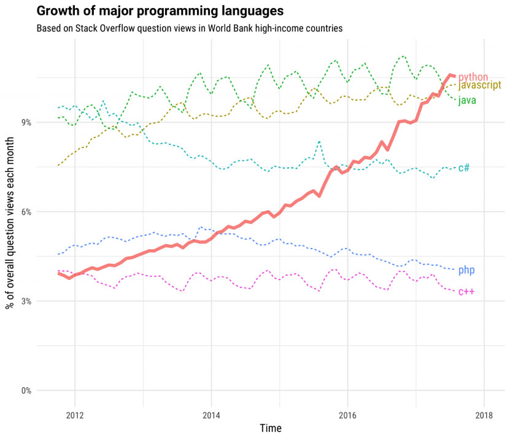

# Java From Functions to Classes

## Motivations



(see more: [Most Popular Programming Languages 1965-2020 - YouTube](https://www.youtube.com/watch?v=YqxeLodyyqA))


### High-Performance Backend & Cloud

**Java + Spring Boot** power large-scale APIs, microservices and enterprise systems.

* High throughput and scalability
* Strong concurrency support
* Mature ecosystem for cloud-native development
* Extensive production tooling and monitoring

### 2+ billion devices

**Java → Kotlin → Android**
→ Java remains a fundamental part of the Android/JVM ecosystem

### Enterprise & mission-critical software

Widely used in systems that need to be **reliable, maintainable and supported for decades**

### One ecosystem, many languages

Learn the **JVM** and your knowledge transfers to **Java, Kotlin, Scala, Groovy…**

Huge ecosystem of **libraries, frameworks, IDEs, profilers and developer tools**


### Lines of code


_Lines of code per kernel version_


_Lines of code per space mission_


_Lines of code per product_

(see more: [Million Lines of Code - Information is Beautiful](http://www.informationisbeautiful.net/visualizations/million-lines-of-code/))


### Tools and artifacts

In the early days of computing science it appeared increasingly evident that with
**increasing complexity** the lines of code contained in a software became more and more
numerous, making its **maintenance more and more complex**.

A great example of a severe misalignment between available tools and artifacts' complexity took place during the 1970s in a period remembered as [software crisis](https://en.wikipedia.org/wiki/Software_crisis). 
* Projects running over-budget
* Projects running over-time
* Software was inefficient
* Software was difficult to maintain


| Tools                             | Artifacts                     |
|-----------------------------------|-------------------------------|
|  |  |
|  |  | 


### Errors / 1K SLOC

A simple (informal) way to think about software quality is to measure the number of defects per thousand lines of code (*defects / 1K SLOC*).

| Development Approach    | Typical Defect Density |
| ----------------------- | ---------------------: |
| Industry average        |  ~25 defects / 1K SLOC |
| Corporate applications  |   ~5 defects / 1K SLOC |
| Cleanroom development   | ~0.5 defects / 1K SLOC |
| AI-assisted development |    **Highly variable** |

Without adequate tools and engineering practices, increasing the size of a software system generally increases the number of potential defects.

* More lines of code → more opportunities for mistakes
* More code interactions → greater complexity
* More complexity → harder testing and maintenance

The challenge is not simply writing more code, but controlling complexity as software grows.

### Software Maintenance Costs

Software is rarely written once and forgotten.

Over its lifetime, a significant portion of software costs comes from:

* Fixing bugs
* Adapting to new requirements
* Extending existing functionality
* Understanding and modifying code written by others

> The larger the system, the more important it becomes to manage complexity and reuse existing solutions.


## Procedural vs Objected Oriented
### Procedural approach

* Data and functions are separate
* Functions process data: _operation(object, params)_

```c++
int main() {
  int v[100];
  int n = sizeof(v) / sizeof(v[0]);

  init(v, n);
  sort(v, n);
  search(v, n, 10);
}
```

```c++
void init(int v[], int size) {
  int i;
  for (i = 0; i < size; i++) {
    v[i] = rand() % 100;
  }
}

void sort(int v[], int n) {
  int i, j, tmp, changed;
  for (i = 0; i < n - 1; i++) {
    changed = FALSE;
    for (j = 0; j < n - i - 1; j++) {
      if (v[j] > v[j + 1]) {
        changed = TRUE;
        tmp = v[j];
        v[j] = v[j + 1];
        v[j + 1] = tmp;
      }
    }
    if (!changed) break;
  }
}

int search(const int v[], int size, int value) {
  int i;
  for (i = 0; i < size; i++) {
    if (v[i] == value) {
      return i;
    }
  }
  return -1;
}

void show(int v[], int size) {
  int i;
  for (i = 0; i < size; i++) {
    printf("[%d] %d\n", i, v[i]);
  }
}
```

**Issues**


- **Reuse of code limited**: data and operations are separate. This makes it complex to reuse existing code in
  other projects
- **Data protection limited**: unprotected data accessible from vast portions of the source code. After a certain
  stage, debug becomes a nightmare!
- **Decomposition limited**: large scale projects require a large scale working force (many teams). Unprotected
  data, separate from operations, makes it hard to decompose
  
    
### Object-oriented approach

* Data and functions are coupled together within classes
* Objects deliver services using internal data: _object.operation(params)_


```java
public class App {
  public static void main(String[] args) {
    Vector vector = new Vector();
    vector.sort();
    vector.search(10);
  }
}
```


```Java
public class Vector {
    int[] v;

    public Vector(int capacity) {
        this.v = new int[capacity];
        init();
    }

    void sort() {
        boolean changed;
        for (int i = 0; i < v.length - 1; i++) {
            changed = false;
            for (int j = 0; j < v.length - i - 1; j++) {
                if (v[j] > v[j + 1]) {
                    changed = true;
                    int tmp = v[j];
                    v[j] = v[j + 1];
                    v[j + 1] = tmp;
                }
            }
            if (!changed) break;
        }
    }
    
    void init() {
      Random rnd = new Random();
      for (int i = 0; i < v.length; i++) {
        v[i] = rnd.nextInt(100);
      }
    }
  
    int search(int value) {
      for (int i = 0; i < v.length; i++) {
        if (v[i] == value) {
          return i;
        }
      }
      return -1;
    }
  
    void show() {
      for (int i = 0; i < v.length; i++) {
        System.out.printf("[%d] %d\n", i, v[i]);
      }
    }
  }
  ```

## Object-Oriented Programming

OOP is a set of programming techniques designed to manage complexity in large software systems.

> Instead of focusing exclusively on individual algorithms, OOP focuses on organizing software around reusable and interacting components.

* **Abstraction** — expose only what is necessary
* **Reuse** — build new functionality on existing components
* **Extensibility** — adapt and extend systems without rewriting everything

### Encapsulation

Encapsulation is a mechanism that bundles data and the methods that operate on it within a class, while controlling how that data can be accessed from outside.

* The class provides a **public interface** through which external code can interact with the object.
* It hides **implementation details**, exposing only what is necessary to use the object.
* It creates a clear **separation between interface and implementation**.
* It allows the internal implementation to change without affecting the code that uses the class.

**Encapsulation → Abstraction**

> **Encapsulation promotes abstraction by exposing only the essential interface while hiding the implementation details.**


```java
// The public interface of Point class
public class Point {

  public Point(double x, double y) {
    // not implemented yet
  }

  public double distance(Point other) {
    // not implemented yet
  }
}
```

```java
// Point concrete implementation
public class Point {
  private double x;
  private double y;

  public Point(double x, double y) {
    this.x = x;
    this.y = y;
  }

  public double distance(Point other) {
    double dx = this.x - other.x;
    double dy = this.y - other.y;
    return Math.sqrt(dx * dx + dy * dy);
  }

  // Private method: accessible only inside Point
  private void dummy() {
    System.out.println("This is an internal method");
  }
}
```

### Inheritance

Inheritance is a mechanism by which one class acquires the properties and behaviors of another, allowing you to build new classes based on existing ones.

* The class that inherits is called a **subclass** or **child class**.
* It can **reuse** methods and fields from the **superclass** and add or override behavior.
* A subclass **specializes** its parent by introducing more specific behavior.
* Inheritance creates an **IS-A relationship** (*child IS-A parent*).

**Inheritance → Reuse**

> **Inheritance promotes reuse by allowing new classes to build on existing classes, reusing their state and behavior instead of rewriting it.**


```java
public class Point {
    private double x;
    private double y;

    public Point(double x, double y) {
        this.x = x;
        this.y = y;
    }

    public double distance(Point other) {
        double dx = this.x - other.x;
        double dy = this.y - other.y;
        return Math.sqrt(dx * dx + dy * dy);
    }
}
```

```java
public class ColoredPoint extends Point {
    private String color;

    public ColoredPoint(double x, double y, String color) {
        super(x, y);
        this.color = color;
    }

    public String getColor() {
        return color;
    }
}
```


### Polymorphism

**Polymorphism** means that the same interface can be used with **different types of objects**, with each object providing its own behavior.

Java supports two main forms of polymorphism:

#### (1) Static (Compile-time) Polymorphism

Static polymorphism occurs when methods have the **same name but different parameter lists**. In Java, this is implemented through **method overloading**.

```java
public class Point {
    public void move(double dx, double dy) {
        // Move by dx, dy
    }

    public void move(double distance) {
        // Move by distance along a default direction
    }
}
```

> The compiler determines which method to call based on the **arguments provided**.


#### (2) Dynamic (Run-time) Polymorphism

A superclass reference can refer to objects of different subclasses. When an overridden method is called, Java selects the implementation based on the **actual object type at run-time**.

**Polymorphism → Extensibility**

> **Polymorphism promotes extensibility by allowing new types to provide new behavior without modifying the code that uses the common interface.**

```java
class Point {
    public void draw() {
        System.out.println("Drawing a point");
    }
}

class ColoredPoint extends Point {
    @Override
    public void draw() {
        System.out.println("Drawing a colored point");
    }
}

class LabeledPoint extends Point {
    @Override
    public void draw() {
        System.out.println("Drawing a labeled point");
    }
}
```

The same interface works for different objects:

```java
void main() {
  Point[] points = {
          new ColoredPoint(3, 4, "red"),
          new LabeledPoint(5, 2, "A")
  };

  // No `if` or knowledge of the concrete type is required
  for (Point p : points) {
    p.draw();
  }

  // The alternative is to inspect the type and handle every case explicitly
  // Every time a new kind of `Point` is introduced, the `if` chain must be modified.
  for (Point p : points) {
    if (p instanceof ColoredPoint) {
      // draw colored point
    }
    else if (p instanceof LabeledPoint) {
      // draw labeled point
    }
    else {
      // draw regular point
    }
  }
}
```

## Resources