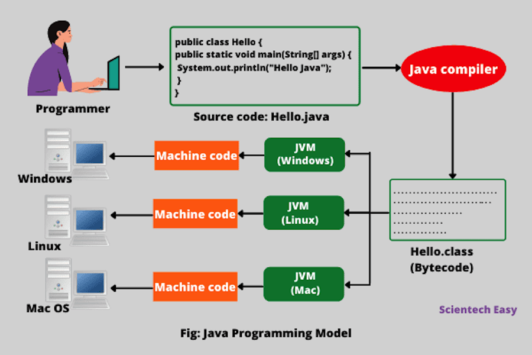
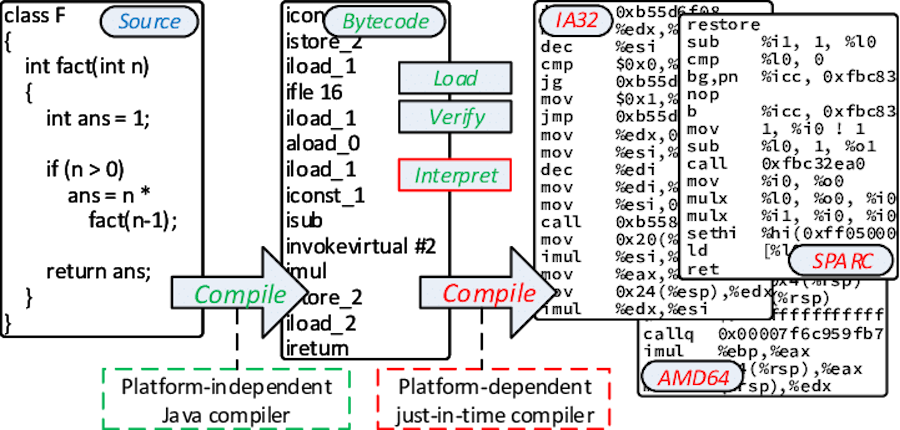
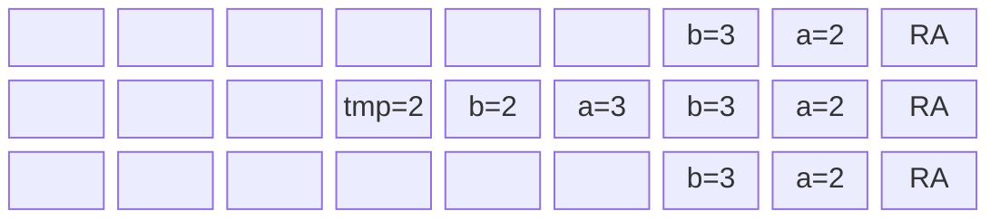

# Java Basics

## History
- **1991**: a group led by James Gasling and Patrick Naughton at Sun 
Microsystems designed a programming languages, code-named _Green_, for
use in consumer devices, such as intelligent television.
- **1996**: Java 1 (Netscape browser supports Java, popularity begins)
- **2005**: Java 5 (major enhancements)
- **2014**: **Java 8 LTS (support until 2022)**
- **2018**: **Java 11 LTS (support until 2023)**

-- 6 months release cycle begins --

- **2019**: Java 12, Java 13
- **2020**: Java 14, Java 15
- **2021**: Java 16, **Java 17 LTS (support until 2026)**
- **2022**: Java 18, Java 19
- **2023**: Java 20, **Java 21 LTS (support until 2030)**

see: [Java version history](https://en.wikipedia.org/wiki/Java_version_history), [25 reasons why java is still around in 2024](https://medium.com/javarevisited/25-reasons-why-java-is-still-around-in-2024-452c582d55d0)

## Building and running




see: [List of Java virtual machines - Wikipedia](https://en.wikipedia.org/wiki/List_of_Java_virtual_machines), [Java class file - Wikipedia](https://en.wikipedia.org/wiki/Java_class_file#General_layout), [Compiled vs Interpreted Programming Languages](https://www.youtube.com/watch?app=desktop&v=y6VvxGHCxa4)

## Program, files and classes
A Java program is made of one or more packages, containing one or more files. A file contains one public class and, optionally, multiple package-private classes. **The name of each file must be equal to the name of its public class.**


## Methods
In Java there are no traditional functions, but methods within classes. Methods are basic form of code modularization: they are in fact blocks of code with a name that run when they are called. Methods receive a list of parameters and return a single value. Java programs always start from a call to the **main** method.

```java
public class HelloWorld {
    public static void main(String[] args) {
        System.out.println("Hello world!");
    }
}
```

```java
public class HelloWorld {
    public static void main(String[] args) {
        int n = multiplyByTwo(20);
        System.out.println(n);
    }

    public static int multiplyByTwo(int n) {
        return 2 * n;
    }
}
```

## Code blocks and scope
Java code blocks are the same as in C. Each block is enclosed by **braces** { } and starts a new **scope** for local variables. Variables can be declared everywhere within a scope.

```java
public class HelloWorld {
    public static void counter(int n) {
        // here you can define variable local to the counter() method
        int a = 1;
        for (int i = 0; i < n; i++) {
            // here you can define variable local to the for loop
            int aInsideLoop = 2;
        }
    }
}
```

## Primitive types

| Type      | Size (bits) | Minimum   | Maximum          | Example                             |
|-----------|-------------|-----------|------------------|-------------------------------------|
| _byte_    | 8           | \-2^7     | 2^7 – 1          | _byte b = 100;_                     |
| _short_   | 16          | \-2^15    | 2^15 – 1         | _short s = 30\_000;_                |
| _int_     | 32          | \-2^31    | 2^31 – 1         | _int i = 100\_000\_000;_            |
| _long_    | 64          | \-2^63    | 2^63 – 1         | _long l = 100\_000\_000\_000\_000;_ |
| _float_   | 32          | \-2^-149  | (2-2^-23)·2^127  | _float f = 1.456f;_                 |
| _double_  | 64          | \-2^-1074 | (2-2^-52)·2^1023 | _double f = 1.456789012345678;_     |
| _char_    | 16          | 0         | 2^16 – 1         | _char c = ‘c’;_                     |
| _boolean_ | 1           | –         | –                | _boolean b = true;_                 |

## Literals

### Integral Literals
Integral literals consist of digit sequences and are broken down into these sub-types:

* **Decimal Integer**: Decimal integers use a base ten and digits ranging from 0 to 9. They can have a negative (-) or a positive (+), but non-digit characters or commas aren’t allowed between characters. Example: int d = 2022, +42, -68.
* **Octal Integer**: Octal integers use a base eight and digits ranging from 0 to 7. Octal integers always begin with a "0" Example: int o = 007, 0295.
* **Hexa-Decimal**: Hexa-decimal integers work with a base 16 and use digits from 0 to 9 and the characters of A through F. The characters are case-sensitive and represent a 10 to 15 numerical range. Example: int e = 0xFF, 0x9A.
* **Binary Integer**: Binary integers uses a base two, consisting of the digits "0" and "1". The prefix "0b" represents the Binary system. Example: int b = 0b11011.

### Floating-Point Literals

Floating-point literals are expressed as exponential notations or as decimal fractions. They can represent either a positive or negative value, but if it’s not specified, the value defaults to positive. Floating-point literals come in these formats:

- **Floating format single precision** end with an "f" or "F". Example: float f = 4F. 
- **Floating format double precision** end with a "d" or "D". Example: double d = 3.14D.
- **Decimal in Exponent form**: the exponent form may use an optional sign, such as a "-," and an exponent indicator, such as "e" or "E". Example: double d = 314159E-05.

### Char Literals

Character (Char) literals are expressed as an escape sequence or a character, enclosed in single quote marks, and always a type of character in Java. Char literals are sixteen-bit Unicode characters ranging from 0 to 65535. 

Example: char ch = 077.

### String Literals

String literals are sequences of characters enclosed between double quote ("") marks. These characters can be alphanumeric, special characters, blank spaces, etc.

Examples: String s = "John", "2468", "\n", etc.

### Boolean Literals

Boolean literals have only two values and so are divided into two literals: *true* and *false*. These values aren't case-sensitive and are equally valid if rendered in uppercase or lowercase mode. Boolean literals can also use the values of "0" and "1". 

Examples: boolean b = true.

### Null Literals

Null literals represent a null value and refer to *no object*. Nulls are typically used as a marker to indicate that a reference type object isn’t available. They often describe an uninitialized state in the program. It is a mistake to try to dereference a null value. Example: Patient age = NULL;

## Constants
**Constants are variables whose value cannot be changed once assigned**. Constants are also used to make the code safer and more readable. When declaring constants, it's good practice to use all uppercase letters for the constant name. This makes it easier to identify constants in code.

There are several cases where using constants can be helpful:
* To make code more readable by giving names to values
* To prevent a variable from being changed accidentally
* To enforce the immutability of an object

To declare a constant in a class, we often use the **final** and **static** keywords:

```java
public class HelloWorld {
    public static final int NUM_STUDENTS = 100;
    
    public static void addStudent() {
        NUM_STUDENTS += 1; // ERROR, no changes allowed
        
    }
}
```

## Random numbers

Math.random()
```
double randd = Math.random();
```

java.util.Random
```  
Random generator = new Random();
  
int randi = generator.nextInt()	// [MIN_VALUE, MAX_VALUE]
double randd = generator.nextDouble()	// [0, 1]
boolean randb = generator.nextBoolean()	// [true, false]
```

java.util.random.RandomGenerator
```
RandomGenerator generator = RandomGenerator.getDefault();
// it is eventually possible to choose a specific random generator
RandomGenerator generator = RandomGenerator.of("L128X256MixRandom");

int randi = generator.nextInt()	// [MIN_VALUE, MAX_VALUE]
double randd = generator.nextDouble()	// [0, 1]
boolean randb = generator.nextBoolean()	// [true, false]
```

## Operators
Operators are special symbols that perform specific operations on one, two, or three operands, and then return a result.

As we explore the operators of the Java programming language, it may be helpful for you to know ahead of time which operators have the highest precedence. The operators in the following table are listed according to precedence order. The closer to the top of the table an operator appears, the higher its precedence. Operators with higher precedence are evaluated before operators with relatively lower precedence. Operators on the same line have equal precedence. When operators of equal precedence appear in the same expression, a rule must govern which is evaluated first. All binary operators except for the assignment operators are evaluated from left to right; assignment operators are evaluated right to left.

| Operators            | Precedence                                |
|----------------------|-------------------------------------------|
| postfix              | `expr++ expr--`                           |
| unary                | `++expr --expr +expr -expr ~ !`           |
| multiplicative       | `* / %`                                   |
| additive             | `+ -`                                     |
| shift                | `<< >> >>>`                               |
| relational           | `< > <= >= instanceof`                    |
| equality             | `== !=`                                   |
| bitwise AND          | `&`                                       |
| bitwise exclusive OR | `^`                                       |
| bitwise inclusive OR | `\|`                                      |
| logical AND          | `&&`                                      |
| logical OR           | `\|\|`                                    |
| ternary              | `? :`                                     |
| assignment           | `= += -= *= /= %= &= ^= \|= <<= >>= >>>=` |

## The var keyword
Java's *var* keyword allows developers to declare local variables without specifying a data type such as int, long, String or char. A new language feature introduced in the 2018 JDK 10 release, the Java var keyword performs type inference. Java, *var* and inferred types. Type inference means Java will guess the data type when the variable is created, and enforce that typing throughout the program.

The *var* keyword can not be used:
* to declare instance and global variables 
* as a generic type

```java

/**
 * Java program to show that var can be used to declare any datatype
 */
class DemoVar {
  public static void main(String[] args) {
    var x = 100;     // int
    var y = 1.90;    // double
    var z = 'a';     // char
    var p = "tanu";  // string
    var q = false;   // boolean
  }
}
```

```java
/**
 * Java program to show that var cannot be used to declare instance and global variables
 */
class DemoVar {
    // error! instance variable
    var x = 50;

    public static void main(String[] args) {
        System.out.println(x);
    }
}
```

```java
import java.util.*;

/**
 * Java program to show that var cannot be used with generic types
 */
class DemoVar {
    public static void main(String[] args) {
        // error! generic list using var
        List<var> al = new ArrayList<>(List.of(10, 20, 30));
        // ...
    }
}
```

## Casting
### Implicit casting
The compiler automatically performs **implicit casting** when the target type is wider than the source type. The picture below illustrates the direction of this casting. Any value of a given type can be assigned to the one on the right implicitly or below in the case of char.

Normally, there is no loss of information when the target type is wider than the source type, for example, when we cast int to long. 

```
            char ---|      
                    V
byte --> short --> int --> long --> float --> double
```

### Explicit casting
**Implicit casting does not work when the target type is narrower than the source type**. Programmers can apply **explicit casting** to a source type to get the type they want. **Explicit casting might cause information loss**.

```java
public class CastingTest {
    public static void main(String[] args) {
        double d = 2.00003;

        // it loses the fractional part
        long l = (long) d; // 2

        // requires explicit casting because long is wider than int
        int i = (int) l; // 2 

        // requires explicit casting because the result is long (indicated by L)
        int val = (int) (3 + 2L); // 5

        // casting from a long literal to char
        char ch = (char) 65L; // 'A'
    }
}
```

see: [ASCII Table](https://www.asciitable.com/)

## Reference variables
A **reference** is a variable that provides a way to access an **object**. Generally, you can't access an object without a reference to it. References are primitive variables and are stored in the stack. 

Objects, instead, are dynamically allocated and reside in the heap memory. Because of this, the objects' lifecycle does not depend on any specific method.

References and objects are the Java equivalent of struct pointers and dynamically allocated structs in C. 

```C
// C
typedef struct point {
    float x;
    float y;
} point_t;

point_t *allocate_point(float x, float y) {
    point_t *p = malloc(sizeof(point_t));
    p->x = x;
    p->y = y;
    return p;
}

void free_point(point_t *p) {
    free(p);
}

int main() {
    point_t *p = allocate_point(2, 3);
    printf("(%f, %f)\n", p->x, p->y);
    free_point(p);
}
```

```java
// Java
public class Point {
    int x;
    int y;
    
    public Point(int x, int y) {
        this.x = x;
        this.y = y;
    }
    
    int getX() {
        return x;
    }
    
    //...
    
    public static void main(String[] args) {
        // p is a reference to a Point object
        Point p = new Point(2, 3);
        System.out.printf("point=(%d, %d)\n", p.getX(), p.getY());

        // s is a reference to a String object
        String s = new String("Hello world!");
        System.out.printf("lenght=%d\n, s.length());
    }
}
```

## Passing parameters to methods
Developers can pass parameters to a method. Parameters have to be **primitive types** (which include **object references**). Parameters are always **passed by value** (i.e., copied) to stack area of the receiving method. 

```java
public class PassingParametersNotWorking {
    public static void swap(int a, int b) {
        int tmp = a;
        a = b;
        b = tmp;
    }

    public static void main(String[] args) {
        int a = 2;
        int b = 3;

        System.out.println(a);  // 2
        System.out.println(b);  // 3
        swap(a, b);
        System.out.println(a);  // 2
        System.out.println(b);  // 3
    }
}
```




**However, copying references allows to successfully modify the received entities (when used correctly).**

```java
public class PassingParametersNotWorking {
    public static void swap(Point a, Point b) {
        Point tmp = a;
        a = b;
        b = tmp;
    }
  
  public static void main(String[] args) {
      Point p1 = new Point(0, 0);
      Point p2 = new Point(10, 10);
      
      System.out.println(p1);  // 0, 0
      System.out.println(p2);  // 10, 10
      swap(p1, p2);
      System.out.println(p1);  // 0, 0
      System.out.println(p2);  // 10, 10
  }
}
```

```java
public class PassingParametersWorking {
  public static void swap(Point p1, Point p2) {
      Point tmp = new Point(p1);
      p1.setLocation(p2);
      p2.setLocation(tmp);
  }
  
  public static void main(String[] args) {
      Point p1 = new Point(0, 0);
      Point p2 = new Point(10, 10);
      
      System.out.println(p1);  // 0, 0
      System.out.println(p2);  // 10, 10
      swap(p1, p2);
      System.out.println(p1);  // 10, 10
      System.out.println(p2);  // 0, 0
  }
}
```


## Comments

```java
// comment on one line 

/* 
 * this comment is so long 
 * that it needs two lines 
 */ 

/**
  * This is a JavaDoc comment.
  * Set x, y, and z coordinates. 
  * 
  * @param x the x coordinate. 
  * @param y the y coordinate. 
  * @param z the z coordinate. 
  */
```


## Coding conventions

```java
class CodingStandards {
	public final double PI = 3.14;
	private int attributeName;
	
	public void methodName(int index) {
		int var;
		if (index < 0) {
			/* this is a comment*/
		}
	}
}
```

see: [Java Coding Standard - pdf](../books/Java-Coding-Standard.pdf)


## Flow-control statements

#### if statement
```
if (condition1) {
  // executed if 
  // condition1 is true
} else if (condition2) {
  // executed if 
  // condition1 is false and condition2 is true
} else {
  // executed if
  // condition1 is false and condition2 is false
}
```

```
int time = 22;
if (time < 10) {
  System.out.println("Good morning.");
} else if (time < 20) {
  System.out.println("Good day.");
} else {
  System.out.println("Good evening.");
}
```

#### switch statement

```
switch(expression) {
  case x:
    // code block
    break;
  case y:
    // code block
    break;
  default:
    // code block
}
```

```
char grade = ‘B’;

switch(grade) {
    case 'A':
        System.out.println("Excellent!");
        break;
    case 'B':
    case 'C':
        System.out.println("Well done");
        break;
    case 'D':
        System.out.println("Danger zone");
        break;
    default:
        System.out.println("Invalid grade");
}
```

#### switch statement (enhanced)
```
switch(expression) {
  case x -> // code block
  case y, z -> // code black 
  default -> // code block
}
```

```
switch (grade) {
  case 'A' -> System.out.println("Excellent!");
  case 'B', 'C' -> System.out.println("Well done");
  case 'D' -> System.out.println("Danger zone");
  default -> System.out.println("Invalid grade");
}
```

#### do-while statement

```
do {
    // code block to be executed
} while (condition);
```

```
int i = 0;
do {
    System.out.println(i++);
} while (i < 5);
```

#### while statement

```
while (condition) {
    // code block to be executed
}
```

```
int i = 0;
while (i < 5) {
    System.out.println(i++);
}
```

#### for statement

```
for (statement 1; statement 2; statement 3) {
    // code block to be executed
}
```

```
for (int i = 0; i <= 10; i++) {
    System.out.println(i);
}
```

#### for statement (enhanced)

```
for (type variableName: arrayName) {
    // code block to be executed
}
```

```
String[] cars = {
  "Supra",
  "Lancer",
  "Impreza"
};

for (String car : cars) {
    System.out.println(car);
}
```

#### break-continue statements

- The **break** statement can be used to jump out of a loop.
- The **continue** statement breaks one iteration (in the loop), but continues with the next iteration instead of jumping out.

```
for (int i = 0; i < 10; i++) {
  if (i == 4) {
    break;
  }
  System.out.println(i);
} // 0,1,2,3
```

```
for (int i = 0; i < 10; i++) {
  if (i == 4) {
    continue;
  }
  System.out.println(i);
} // 0,1,2,3,5,6,7,8,9
```


# Resources
* https://www.baeldung.com/java-primitives
* https://www.baeldung.com/java-switch-pattern-matching
* https://www.baeldung.com/java-generating-random-numbers