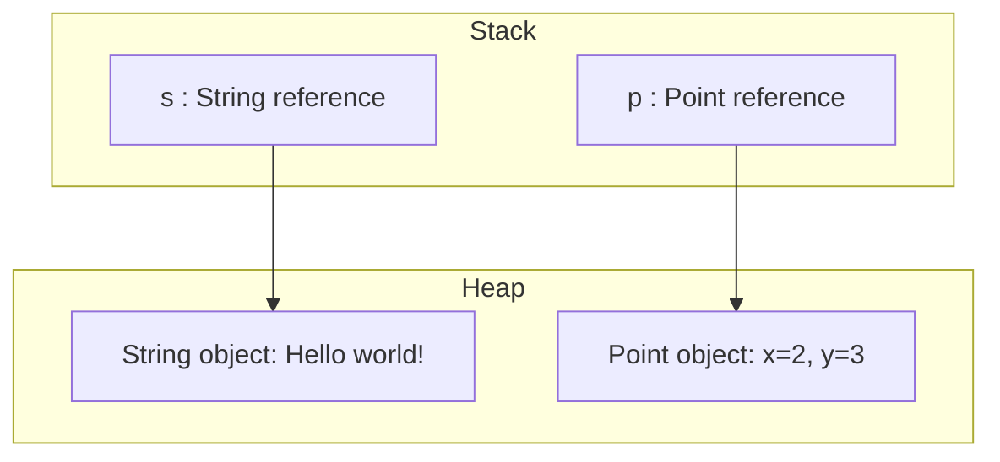
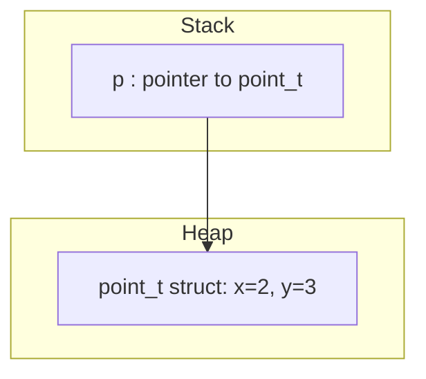
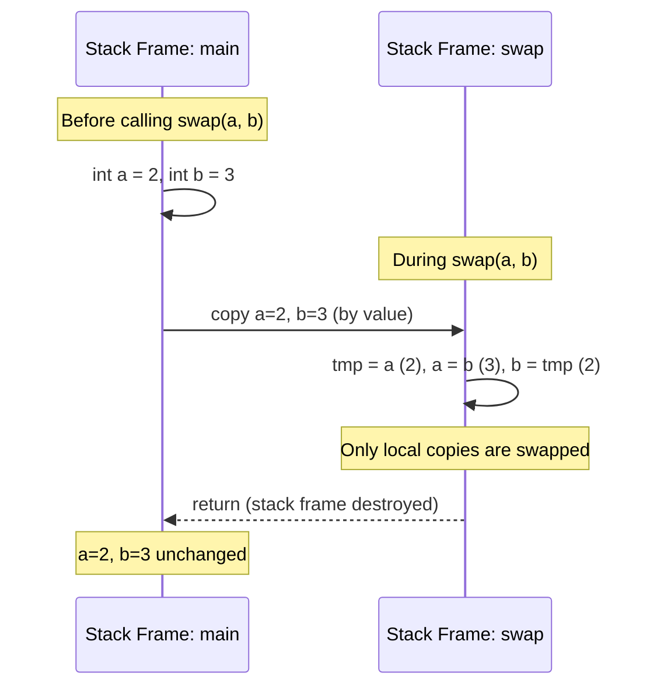
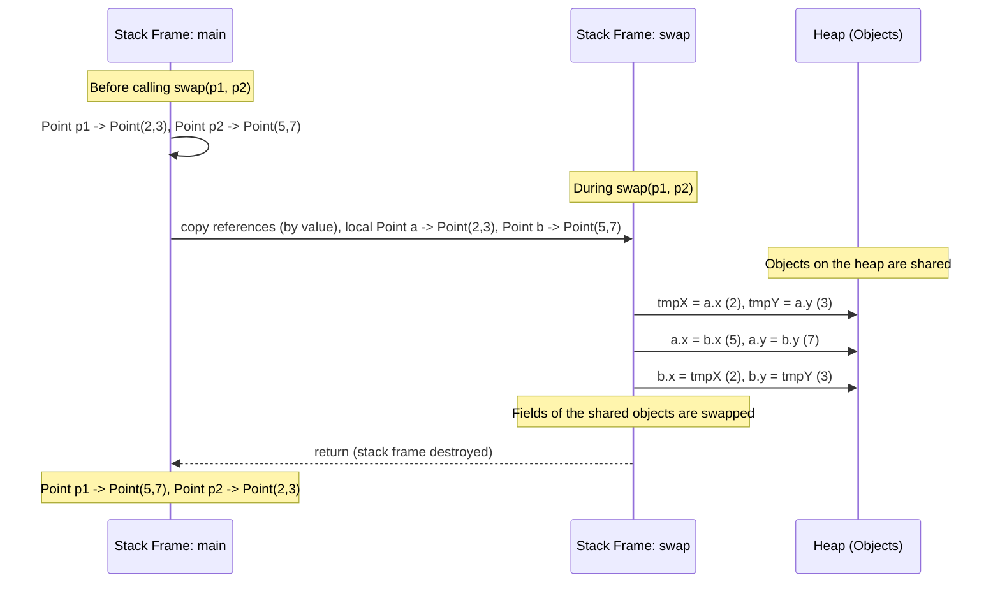
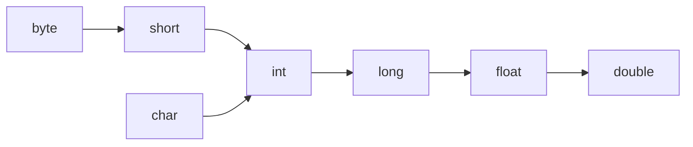

# Java Basics

## Why Java?

* **Platform independence**: *write once, run anywhere* thanks to the JVM
* **Mature ecosystem**: decades of libraries, frameworks, tools, and best practices
* **Strong typing & safety**: compile-time checks reduce runtime errors
* **Performance**: JIT compilation, modern GC, continuous improvements
* **Scalability**: proven at scale (enterprise systems, cloud, microservices)
* **Longevity & stability**: long-term support (LTS) releases and backward compatibility
* **Industry adoption**: widely used in enterprise, backend, big data, Android

## History
- **1991**: a group led by James Gasling and Patrick Naughton at Sun 
Microsystems designed a programming languages, code-named _Green_, for
use in consumer devices, such as intelligent television.
- **1996**: Java 1 (Netscape browser supports Java, popularity begins)
- **2005**: Java 5 (major enhancements)
- **2014**: **Java 8 LTS (support until 2022)**
- **2018**: **Java 11 LTS (support until 2023)**

-- 6 months release cycle begins --

- **2019**: Java 12, Java 13
- **2020**: Java 14, Java 15
- **2021**: Java 16, **Java 17 LTS (support until 2026)**
- **2022**: Java 18, Java 19
- **2023**: Java 20, **Java 21 LTS (support until 2028)**
- **2024**: Java 22, Java 23
- **2025**: Java 24, **Java 25 LTS (support until 2030)**

see: [Java version history](https://en.wikipedia.org/wiki/Java_version_history), [25 reasons why java is still around in 2024](https://medium.com/javarevisited/25-reasons-why-java-is-still-around-in-2024-452c582d55d0), [Don’t call it a comeback: Why Java is still champ](https://github.com/readme/featured/java-programming-language)

## Programs, files and classes
A Java program is made of one or more packages, containing one or more files. A file contains one public class and, optionally, multiple package-private classes. **The name of each file must be equal to the name of its public class.**


## Building and running


see: [List of Java virtual machines - Wikipedia](https://en.wikipedia.org/wiki/List_of_Java_virtual_machines), [Java class file - Wikipedia](https://en.wikipedia.org/wiki/Java_class_file#General_layout), [Compiled vs Interpreted Programming Languages](https://www.youtube.com/watch?app=desktop&v=y6VvxGHCxa4)

## Build tools

* **Purpose**: automate compilation, dependency management, testing, and packaging
* **Apache Maven**

    * Declarative build configuration (`pom.xml`)
    * Convention over configuration
    * Strong dependency management via repositories
* **Gradle**

    * Flexible and expressive (Groovy / Kotlin DSL)
    * Faster builds via incremental compilation and caching
    * Popular in modern projects and Android
* **Common tasks**

    * Compile source code
    * Run tests
    * Resolve dependencies
    * Package artifacts (JAR, WAR)

## Maven project structure

A standard Maven project follows a **convention-based directory layout**, which simplifies builds and tooling integration.

```
project-root/
 ├─ pom.xml
 └─ src/
    ├─ main/
    │  ├─ java/        (application source code)
    │  └─ resources/   (configuration files, static resources)
    └─ test/
       ├─ java/        (test source code)
       └─ resources/   (test resources)
```

* **`pom.xml`**: project configuration (dependencies, plugins, build lifecycle)
* **`src/main/java`**: production Java code
* **`src/main/resources`**: non-code resources (e.g., `application.properties`)
* **`src/test/java`**: unit and integration tests
* **`src/test/resources`**: resources used during testing

This standardized structure enables **tool interoperability**, **IDE support**, and **repeatable builds** across projects and teams.


## Methods
In Java there are no traditional functions, but methods within classes. Methods are basic form of code modularization: they are in fact blocks of code with a name that run when they are called. Methods receive a list of parameters and return a single value. Java programs always start from a call to the **main** method.

```java
public class HelloWorld {
    public static void main(String[] args) {
        System.out.println("Hello world!");
    }
}
```

```java
public class HelloWorld {
    public static void main(String[] args) {
        int n = multiplyByTwo(20);
        System.out.println(n);
    }

    public static int multiplyByTwo(int n) {
        return 2 * n;
    }
}
```

## Code blocks and scope
Java code blocks are the same as in C. Each block is enclosed by **braces** { } and starts a new **scope** for local variables. Variables can be declared everywhere within a scope.

```java
public class HelloWorld {
    public static void counter(int n) {
        // here you can define variable local to the counter() method
        int a = 1;
        for (int i = 0; i < n; i++) {
            // here you can define variable local to the for loop
            int aInsideLoop = 2;
        }
    }
}
```

## Conventions

### Coding conventions

```java
package com.nbicocchi.myapp;

public class SomeClass {
    private int someField;
    private double anotherField;

    public SomeClass() {                    // constructor
        someField = 1;
        anotherField = 3.14;
    }

    public int someMethod(int n, float m) {
        int localVariable;              // must initialize local variables
        float anotherLocalVariable = 1;     // this one, too

        localVariable = n - 2;
        anotherLocalVariable = localVariable + m * 3;

        for (int i = 0; i < someField; i++) {
            localVariable = localVariable * 2;
            localVariable = localVariable - someField;
        }

        return localVariable + n;
    }
}
```

* **Packages** are lowercase.
* **Fields and Local Variables**: A noun phrase, starting with a lower-case letter, with multiple words distinguished by capitalization, e.g., eventCount, numberOfBasicOperations.
* **Constants**: A noun phrase in all capitals, with multiple words separated by underscore “_”, e.g., MAX_SIZE.
* **Classes**: Same as field and variable names except starting with a capital letter, e.g., Point, GeometryDemo. Interfaces should usually be an adjective, e.g., Throwable, Comparable.
* **Methods**: A imperative verb phrase (if possible), otherwise in same format as with field and variable names, e.g., findMedian(), incrementEventCount(). Accessor methods should start with “get”, mutator methods should start with “set”, and a method returning a boolean should (if possible) start with “is” or “has”, e.g., getEventCount(), setEventCount(), isDone(), hasNext().
* **Curly brace** goes at the end of the line that starts the class, method, loop, etc., and the closing brace is on a line by itself, lined up vertically with the start of the first line.

see: [Java Coding Standard - pdf](../books/Java-Coding-Standard.pdf), In IntelliJ Reformat Code (Ctlr+Alt+L)

### Comments

```java
// comment on one line 

/* 
 * this comment is so long 
 * that it needs two lines 
 */

/**
 * This is a JavaDoc comment! (The best approach for commenting code)
 * Swaps the coordinates of two Points
 * @param p1 The first point
 * @param p2 The second point
 */
public static void swap(Point p1, Point p2) {
    Point tmp = new Point(p1);
    p1.setLocation(p2);
    p2.setLocation(tmp);
}
```


## Primitive types

| Type      | Size (bits) | Minimum   | Maximum          | Example                             |
|-----------|-------------|-----------|------------------|-------------------------------------|
| _byte_    | 8           | \-2^7     | 2^7 – 1          | _byte b = 100;_                     |
| _short_   | 16          | \-2^15    | 2^15 – 1         | _short s = 30\_000;_                |
| _int_     | 32          | \-2^31    | 2^31 – 1         | _int i = 100\_000\_000;_            |
| _long_    | 64          | \-2^63    | 2^63 – 1         | _long l = 100\_000\_000\_000\_000;_ |
| _float_   | 32          | \-2^-149  | (2-2^-23)·2^127  | _float f = 1.456f;_                 |
| _double_  | 64          | \-2^-1074 | (2-2^-52)·2^1023 | _double f = 1.456789012345678;_     |
| _char_    | 16          | 0         | 2^16 – 1         | _char c = ‘c’;_                     |
| _boolean_ | 1           | –         | –                | _boolean b = true;_                 |

### Literals

| **Literal Type**            | **Description**                                                                                                  | **Examples**             |
| --------------------------- |------------------------------------------------------------------------------------------------------------------|--------------------------|
| **Integral Literals**       |                                                                                                                  |                          |
| Decimal Integer             | Base 10, digits 0–9. Can be positive (+) or negative (-). No commas or non-digit characters allowed.             | `int d = -68;`           |
| Octal Integer               | Base 8, digits 0–7. Always begin with `0`.                                                                       | `int o = 0275;`          |
| Hexadecimal                 | Base 16, digits 0–9 and A–F (case-sensitive). A–F represent 10–15.                                               | `int e = 0x9A;`          |
| Binary Integer              | Base 2, digits 0 and 1. Prefix `0b` indicates binary.                                                            | `int b = 0b11011;`       |
| **Floating-Point Literals** |                                                                                                                  |                          |
| Single Precision            | Ends with `f` or `F`.                                                                                            | `float f = 4F;`          |
| Double Precision            | Ends with `d` or `D`.                                                                                            | `double d = 3.14D;`      |
| Exponent Form               | Optional sign, uses `e` or `E` as exponent indicator.                                                            | `double d = 314159E-05;` |
| **Char Literals**           | Enclosed in single quotes. 16-bit Unicode characters (0–65535). Can use escape sequences.                        | `char ch = 077;`         |
| **String Literals**         | Enclosed in double quotes. Can include alphanumeric, special characters, blank spaces, etc.                      | `String s = "John Doe";` |
| **Boolean Literals**        | Only two values: `true` or `false`. Case-insensitive. Can also be represented as 0 or 1.                         | `boolean b = true;`      |
| **Null Literals**           | Represent a null value, indicating no object. Used for uninitialized references. Dereferencing null is an error. | `Patient p = NULL;`      |

### Constants
**Constants are variables whose value cannot be changed once assigned**. Constants are also used to make the code safer and more readable. When declaring constants, it's good practice to use all uppercase letters for the constant name. This makes it easier to identify constants in code.

There are several cases where using constants can be helpful:
* To make code more readable by giving names to values
* To prevent a variable from being changed accidentally
* To enforce the immutability of an object

To declare a constant in a class, use the **final** keyword:

```java
public class Location {
    double x = 0;
    double y = 0;
    
    final double MAX_X = 100;
    final double MIN_X = -100;

    public static void main(String[] args) {
        Location l = new Location();
        l.x++;
        l.MAX_X++; // Cannot assign a value to final variable 'y'
    }
}
```

## Reference variables
A **reference** is a variable that provides a way to access an **object**. Generally, you can't access an object without a reference to it. References are primitive variables and are stored in the stack.

Objects, instead, are dynamically allocated and reside in the heap memory. Because of this, the objects' lifecycle does not depend on any specific method.

```java
public class Point {
    int x;
    int y;

    public Point(int x, int y) {
        this.x = x;
        this.y = y;
    }

    int getX() {
        return x;
    }

    int getY() {
        return y;
    }

    //...

    public static void main(String[] args) {
        // s is a reference to a String object
        String s = new String("Hello world!");
        System.out.println("length = " + s.length());

        // p is a reference to a Point object
        Point p = new Point(2, 3);
        System.out.printf("point=(%d, %d)\n", p.getX(), p.getY());
    }
}
```




References and objects are the Java equivalent of struct pointers and dynamically allocated structs in C.

```
typedef struct point {
    float x;
    float y;
} point_t;

point_t *allocate_point(float x, float y) {
    point_t *p = malloc(sizeof(point_t));
    p->x = x;
    p->y = y;
    return p;
}

void free_point(point_t *p) {
    free(p);
}

int main() {
    point_t *p = allocate_point(2, 3);
    printf("(%f, %f)\n", p->x, p->y);
    free_point(p);
}
```



## Passing parameters to methods

Developers can pass parameters to a method. Parameters have to be primitive types (which include object references). Parameters are always passed by value (i.e., copied to the stack of the receiving method).

This means that when you call a method, Java creates **a new local variable on the callee’s stack frame** for each parameter, and copies the value of the argument into it.

* For **primitive types** (`int`, `double`, `boolean`, etc.), the actual value is copied.
* For **object references**, the reference (the memory address pointing to the object) is copied, not the object itself.

```java
public class PassingParametersNotWorking {
    public static void swap(int a, int b) {
        int tmp = a;
        a = b;
        b = tmp;
    }

    public static void main(String[] args) {
        int a = 2;
        int b = 3;

        System.out.println(a);  // 2
        System.out.println(b);  // 3
        swap(a, b);
        System.out.println(a);  // 2
        System.out.println(b);  // 3
    }
}
```

In the `swap(int a, int b)` example, the values of `a` and `b` from `main` (`2` and `3`) are copied into the new local variables `a` and `b` inside the `swap` method. Inside `swap`, those local copies are swapped correctly, but the original variables in `main` are unaffected, because there is **no link** between the local variables of `swap` and the originals in `main`. After the method finishes, its stack frame (including the local copies of `a` and `b`) is destroyed, so the changes are lost.



To make a real swap in Java, you’d need to wrap the integers inside a mutable object (e.g., a `Point` or a simple holder class) and swap the **fields of that object**, or return the swapped values explicitly.


```java
import java.awt.*;

public class PassingParametersWorking {
    // Swap the fields of two Point objects
    public static void swap(Point a, Point b) {
        int tmpX = a.x;
        int tmpY = a.y;

        a.x = b.x;
        a.y = b.y;

        b.x = tmpX;
        b.y = tmpY;
    }

    public static void main(String[] args) {
        Point p1 = new Point(2, 3);
        Point p2 = new Point(5, 7);

        System.out.println("Before swap:");
        System.out.println("p1 = " + p1);
        System.out.println("p2 = " + p2);

        swap(p1, p2);

        System.out.println("After swap:");
        System.out.println("p1 = " + p1);
        System.out.println("p2 = " + p2);
    }
}
```




## Working with numbers

### The Math library
The class java.lang.Math contains methods for performing basic numeric operations such as the elementary exponential, logarithm, square root, and trigonometric functions.

```java
public class MathDemo {

   public static void main(String[] args) {
      // get two double numbers
      double x = 60984.1;
      double y = -497.99;

      // get the natural logarithm for x
      System.out.println("Math.log(" + x + ")=" + Math.log(x));

      // get the natural logarithm for y
      System.out.println("Math.log(" + y + ")=" + Math.log(y));

      // get the max value
      System.out.println("Math.max(" + x + ", y" + ")=" + Math.max(x,y));

      // get the min value
      System.out.println("Math.min(" + x + ", y" + ")=" + Math.min(x,y));
   }
}	
```

### Random numbers

The RandomGenerator interface is designed to provide a common protocol for objects that generate random or (more typically) pseudorandom sequences of numbers (or Boolean values). Such a sequence may be obtained by either repeatedly invoking a method that returns a single pseudorandom chosen value, or by invoking a method that returns a stream of pseudorandom chosen values.

```java
public class RandomDemo {

    public static void main(String[] args) {
        RandomGenerator rnd = RandomGenerator.getDefault();

        int i1 = rnd.nextInt();            // [Integer.MIN_VALUE, Integer.MAX_VALUE]
        int i2 = rnd.nextInt(100);        // [0, 100)
        int i3 = rnd.nextInt(10, 20);    // [10, 20)

        long l1 = rnd.nextLong();        // [Long.MIN_VALUE, Long.MAX_VALUE]
        long l2 = rnd.nextLong(100);    // [0, 100)
        long l3 = rnd.nextLong(10, 20);    // [10, 20)

        double d1 = rnd.nextDouble();            // [0, 1)
        double d2 = rnd.nextDouble(100.0);        // [0, 100.0)
        double d3 = rnd.nextDouble(10.0, 20.0);    // [10.0, 20.0)

        boolean b = rnd.nextBoolean();            // [true, false]
    }
}
```

### Operators
Operators are special symbols that perform specific operations on one, two, or three operands, and then return a result.

As we explore the operators of the Java programming language, it may be helpful for you to know ahead of time which operators have the highest precedence. The operators in the following table are listed according to precedence order. The closer to the top of the table an operator appears, the higher its precedence. Operators with higher precedence are evaluated before operators with relatively lower precedence. Operators on the same line have equal precedence. When operators of equal precedence appear in the same expression, a rule must govern which is evaluated first. All binary operators except for the assignment operators are evaluated from left to right; assignment operators are evaluated right to left.

| Operators            | Precedence                                |
|----------------------|-------------------------------------------|
| postfix              | `expr++ expr--`                           |
| unary                | `++expr --expr +expr -expr ~ !`           |
| multiplicative       | `* / %`                                   |
| additive             | `+ -`                                     |
| shift                | `<< >> >>>`                               |
| relational           | `< > <= >= instanceof`                    |
| equality             | `== !=`                                   |
| bitwise AND          | `&`                                       |
| bitwise exclusive OR | `^`                                       |
| bitwise inclusive OR | `\|`                                      |
| logical AND          | `&&`                                      |
| logical OR           | `\|\|`                                    |
| ternary              | `? :`                                     |
| assignment           | `= += -= *= /= %= &= ^= \|= <<= >>= >>>=` |

## Casting
### Implicit casting
The compiler automatically performs **implicit casting** when the target type is wider than the source type. The picture below illustrates the direction of this casting. Any value of a given type can be assigned to the one on the right implicitly or below in the case of char.

Normally, there is no loss of information when the target type is wider than the source type, for example, when we cast int to long. 




### Explicit casting
**Implicit casting does not work when the target type is narrower than the source type**. Programmers can apply **explicit casting** to a source type to get the type they want. **Explicit casting might cause information loss**.

```java
public class CastingTest {
    public static void main(String[] args) {
        double d = 2.00003;

        // it loses the fractional part
        long l = (long) d; // 2

        // requires explicit casting because long is wider than int
        int i = (int) l; // 2 

        // requires explicit casting because the result is long (indicated by L)
        int val = (int) (3 + 2L); // 5

        // casting from a long literal to char
        char ch = (char) 65L; // 'A'
    }
}
```

see: [ASCII Table](https://www.asciitable.com/)


## Flow-control statements

### Decision statements

#### if statement

The **if** statement is a basic decision-making structure in programming. It allows a program to test a condition and choose which block of code to execute based on whether the condition is true or false. Using if, else if, and else, a program can handle multiple possible cases in sequence, ensuring that only the first matching block runs.

```
if (condition1) {
  // executed if 
  // condition1 is true
} else if (condition2) {
  // executed if 
  // condition1 is false and condition2 is true
} else {
  // executed if
  // condition1 is false and condition2 is false
}
```

```
int time = 22;
if (time < 10) {
  System.out.println("Good morning.");
} else if (time < 20) {
  System.out.println("Good day.");
} else {
  System.out.println("Good evening.");
}
```

#### switch statement

The **switch** statement is a control structure used to select one of many possible code blocks to execute based on the value of a variable or expression. Each possible value is defined in a case, and the corresponding block runs when the value matches. An optional default case can be included to handle values that do not match any case.


```
switch(expression) {
  case x:
    // code block
    break;
  case y:
    // code block
    break;
  default:
    // code block
}
```

```
char grade = ‘B’;

switch(grade) {
    case 'A':
        System.out.println("Excellent!");
        break;
    case 'B':
    case 'C':
        System.out.println("Well done");
        break;
    case 'D':
        System.out.println("Danger zone");
        break;
    default:
        System.out.println("Invalid grade");
}
```

#### switch statement (enhanced)

```
switch(expression) {
  case x -> // code block
  case y, z -> // code black 
  default -> // code block
}
```

```
switch (grade) {
  case 'A' -> System.out.println("Excellent!");
  case 'B', 'C' -> System.out.println("Well done");
  case 'D' -> System.out.println("Danger zone");
  default -> System.out.println("Invalid grade");
}
```

### Iterative statements

#### do-while statement

The **do-while** statement is a loop that executes a block of code **at least once** and then repeats it as long as a specified condition remains true. Unlike a regular while loop, the condition is checked **after** the code block executes, ensuring that the loop body runs at least one time.


```
do {
    // code block to be executed
} while (condition);
```

```
int i = 0;
do {
    System.out.println(i++);
} while (i < 5);
```

#### while statement

The **while** statement is a loop that repeatedly executes a block of code **as long as a specified condition is true**. The condition is evaluated before each iteration, so if it is false from the beginning, the code block may not execute at all.


```
while (condition) {
    // code block to be executed
}
```

```
int i = 0;
while (i < 5) {
    System.out.println(i++);
}
```

#### for statement

The **for** statement is a loop used to execute a block of code a specific number of times. It consists of an **initialization**, a **condition**, and an **update** expression, allowing the loop variable to be controlled precisely. The loop continues as long as the condition evaluates to true.


```
for (statement 1; statement 2; statement 3) {
    // code block to be executed
}
```

```
for (int i = 0; i <= 10; i++) {
    System.out.println(i);
}
```

#### for statement (enhanced)

```
for (type variableName: arrayName) {
    // code block to be executed
}
```

```
String[] cars = {
  "Supra",
  "Lancer Evo",
  "Impreza"
};

for (String car : cars) {
    System.out.println(car);
}
```

#### break-continue statements

The **break** statement can be used to jump out of a loop. The **continue** statement breaks one iteration (in the loop), but continues with the next iteration instead of jumping out.

```
for (int i = 0; i < 10; i++) {
  if (i == 4) {
    break;
  }
  System.out.println(i);
} // 0,1,2,3
```

```
for (int i = 0; i < 10; i++) {
  if (i == 4) {
    continue;
  }
  System.out.println(i);
} // 0,1,2,3,5,6,7,8,9
```

# Resources
* https://www.baeldung.com/java-primitives
* https://www.baeldung.com/java-switch-pattern-matching
* https://www.baeldung.com/java-generating-random-numbers