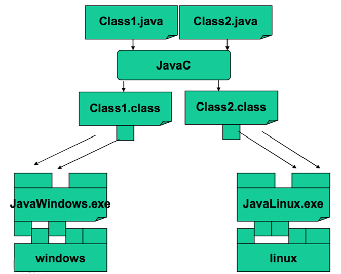
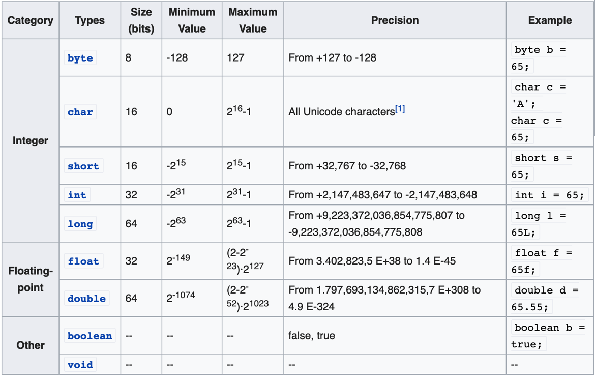

# Java Basics

## History
- **1991**: a group led by James Gasling and Patrick Naughton at Sun 
Microsystems designed a programming languages, code-named _Green_, for
use in consumer devices, such as intelligent television.
- **1996**: Java 1 (Netscape browser supports Java, popularity begins)
- **2005**: Java 5 (major enhancements)
- **2014**: **Java 8 LTS (support until 2022)**
- **2018**: **Java 11 LTS (support until 2023)**

-- 6 months release cycle begins --

- **2019**: Java 12, Java 13
- **2020**: Java 14, Java 15
- **2021**: Java 16, **Java 17 LTS (support until 2026)**
- **2022**: Java 18, Java 19
- **2023**: Java 20, **Java 21 LTS (support until 2030)**

see: 
* [Java version history](https://en.wikipedia.org/wiki/Java_version_history)
* [25 reasons why java is still around in 2024](https://medium.com/javarevisited/25-reasons-why-java-is-still-around-in-2024-452c582d55d0)

## Building and running


see: [Java class file - Wikipedia](https://en.wikipedia.org/wiki/Java_class_file#General_layout)

## Compiled vs interpreted

_Compiled_


_Interpreted_

see: [List of Java virtual machines - Wikipedia](https://en.wikipedia.org/wiki/List_of_Java_virtual_machines)

watch: [Compiled vs Interpreted Programming Languages](https://www.youtube.com/watch?app=desktop&v=y6VvxGHCxa4)

## Program, files and classes
- A Java program is made of one or more packages, containing one or more files
- A file contains one public class and, optionally, multiple package-private classes. The file
name must be equal to the public class name.


## Methods
- In Java there are no traditional functions, but methods within classes
- Methods are blocks of code with a name that run when they are called
- Methods are functions contained within a class
- Methods receive parameters and return a single value
- Java programs always start from a call to the **main** method

```
public class Hello {
  public static void main(String[] args) {
    System.out.println("Hello world!");
  }
}
```

```
public class Hello {
  public static int double(int n) {
    return 2 * n;
  }
  
  public static void main(String[] args) {
    int n = double(20);
    System.out.println(n);
  }
}
```

## Code blocks and scope
- Java code blocks are the same as in C
- Each block is enclosed by **braces** { } and starts a new **scope** for the variables
- Variables can be declared everywhere within a scope

```
for (int i = 0; i < 10; i++) {
  int = 12;
  // ...
  int y;
  // ...
}
```

## Primitive types


```
public static void main(String[] args) {
  byte a = 13;
  char chAscii = 65; 
  char chChar = 'p';
  char chUnicode = '\u0021';
  short c = 34;
  int intDecimal = 987;
  int intHex = 0x7e4;
  int intBinary = 0b11010;
  int intOctal = 067;
  long e = 122L;
  float f = 73.644F; 
  double g = 12.332;
  boolean h = true;
}
```

## Constants
- A **constant** is a variable whose value cannot change once it has been assigned.
- Constants can make programs more readable.
- Constants are cached by the JVM, so using constants might improve performance.
- To define a variable as a constant, add the keyword **final** in front of its declaration.

```
final float PI = 3.1415F;
PI = 3.18;   // ERROR, no changes allowed
```

## Operators
- Operators follow C syntax:
  - arithmetical: ```+``` ```-``` ```*``` ```/``` ```%```
  - relational: ```==``` ```!=``` ```>``` ```<``` ```>=``` ```<=```
  - bitwise: ```&``` ```|``` ```^``` ```!``` ```>>``` ```<<```
  - logical: ```&&``` ```||``` ```!``` ```^```
  - assignment: ```=``` ```+=``` ```-=``` ```*=``` ```/=``` ```%=``` ```&=``` ```|=``` ```^=```
  - increment: ```++``` ```--```


- Chars can be treated as integers (e.g. switch)
- **Logical operators work only on boolean variables** (int is NOT considered a boolean value like in C)


## The var keyword
- The **var** keyword (introduced in Java 10) allows the compiler to detect automatically the type of variable based on its context
  - it can not be used to declare instance and global variables
  - it can not be used as a generic type

```
// Java program to show that var 
// can use to declare any datatype

class Demo1 {
  public static void main(String[] args) {
    var x = 100;     // int
    var y = 1.90;    // double
    var z = 'a';     // char
    var p = "tanu";  // string
    var q = false;   // boolean
  }
}
```

```
// Java program to show that var 
// cannot be used to declare instance and global variables
class Demo3 {
  // instance variable
  var x = 50;

  public static void main(String[] args) {
    System.out.println(x);
  }
}

```

```
// Java program to show that var
// cannot be used as a Generic type
import java.util.*;

class Demo4 {
  public static void main(String[] args) {
    // Generic list using var
    List<var> al = new ArrayList<>();
        
    // add elements
    al.add(10);
    al.add(20);
    al.add(30);
    
    // print the list
    System.out.println(al);
  }
}
```

## Implicit casting
- The compiler automatically performs **implicit casting** when the target type is wider than the source type. The picture below illustrates the direction of this casting. Any value of a given type can be assigned to the one on the right implicitly or below in the case of char.
- Normally, there is no loss of information when the target type is wider than the source type, for example, when we cast int to long. But it is not possible to automatically cast in the backward order (e.g. from long to int or from double to float).


## Explicit casting
- Implicit casting does not work when the target type is narrower than the source type.
- Programmers can apply **explicit casting** to a source type to get the type they want. 
- Explicit casting might cause information loss.

```
double d = 2.00003;

// it loses the fractional part
long l = (long) d; // 2

// requires explicit casting because long is wider than int
int i = (int) l; // 2 

// requires explicit casting because the result is long (indicated by L)
int val = (int) (3 + 2L); // 5

// casting from a long literal to char
char ch = (char) 55L; // '7'
```

## Reference variables
- A **reference** is a variable that provides a way to access an **object**. Generally, you can't access an object without a reference to it.
- References are primitive variables and are stored in the stack memory
- Objects, instead, are dynamically allocated and reside in the heap memory. Because of this, their lifecycle does not depend on any specific method’s lifecycle.


```
// p is a reference to a Point object
Point p = new Point(2,3);
p.getX();
p.magnitude();

// s is a reference to a String object
String s = new String("Hello world!");
s.length()
```

- References and objects are the Java version of struct pointers and dynamically allocated structs in C. 

```
// C
typedef struct point {
    float x;
    float y;
} point_t;

point_t *allocate_point(float x, float y) {
    point_t *p = malloc(sizeof(point_t));
    p->x = x;
    p->y = y;
    return p;
}

void free_point(point_t *p) {
    free(p);
}

int main() {
    point_t *p = allocate_point(2, 3);
    printf("(%f, %f)\n", p->x, p->y);
    free_point(p);
}
```

```
// Java
public class Point {
    int x;
    int y;
    
    public Point(int x, int y) {
        this.x = x;
        this.y = y;
    }
}

public class Application {
  public static void main(String[] args) {
    Point p = new Point(2, 3);
    System.out.printf("(%d, %d)\n", p.x, p.y);
  }
}
```

## Passing parameters to methods
- Developers can pass parameters to a method. Parameters have to be **primitive types** (which include **object references**)
- Parameters are **passed by value** (i.e., copied)

```
public class Parameters {
    public static void swap(int a, int b) {
        int tmp = a;
        a = b;
        b = tmp;
    }

    public static void main(String[] args) {
        int a = 2;
        int b = 3;

        System.out.println(a);  // 2
        System.out.println(b);  // 3
        swap(a, b);
        System.out.println(a);  // 2
        System.out.println(b);  // 3
    }
}
```


```
public class Parameters {
    public static void swap(Point a, Point b) {
        Point tmp = a;
        a = b;
        b = tmp;
    }
  
  public static void main(String[] args) {
      Point p1 = new Point(0, 0);
      Point p2 = new Point(10, 10);
      
      System.out.println(p1);  // 0, 0
      System.out.println(p2);  // 10, 10
      swap(p1, p2);
      System.out.println(p1);  // 0, 0
      System.out.println(p2);  // 10, 10
  }
}
```

```
public class Parameters {
  public static void swap(Point p1, Point p2) {
      Point tmp = new Point(p1);
      p1.setLocation(p2);
      p2.setLocation(tmp);
  }
  
  public static void main(String[] args) {
      Point p1 = new Point(0, 0);
      Point p2 = new Point(10, 10);
      
      System.out.println(p1);  // 0, 0
      System.out.println(p2);  // 10, 10
      swap(p1, p2);
      System.out.println(p1);  // 10, 10
      System.out.println(p2);  // 0, 0
  }
}
```


## Comments

```
// comment on one line 

/* 
 * this comment is so long 
 * that it needs two lines 
 */ 

/**
  * This is a JavaDoc comment.
  * Set x, y, and z coordinates. 
  * 
  * @param x the x coordinate. 
  * @param y the y coordinate. 
  * @param z the z coordinate. 
  */
```


## Coding conventions

```
class ClassName {
	public final double PI = 3.14;
	private int attributeName;
	
	public void methodName {
		int var;
		if (var == 0) {
			/* this is a comment*/
		}
	}
}
```

(see more: [Java Coding Standard - pdf](https://github.com/nbicocchi/java-core/blob/main/assets/books/Java-Coding-Standard.pdf)
(see more: [Java Coding Standard - xml](https://github.com/nbicocchi/java-core/blob/main/assets/books/Java-Coding-Standard.xml))

_In IntelliJ: Code -> Reformat File... -> Import ->**Java-Coding-Standard.xml**_


## Flow-control statements

#### if statement
```
if (condition1) {
  // executed if 
  // condition1 is true
} else if (condition2) {
  // executed if 
  // condition1 is false and condition2 is true
} else {
  // executed if
  // condition1 is false and condition2 is false
}
```

```
int time = 22;
if (time < 10) {
  System.out.println("Good morning.");
} else if (time < 20) {
  System.out.println("Good day.");
} else {
  System.out.println("Good evening.");
}
```

#### switch statement

```
switch(expression) {
  case x:
    // code block
    break;
  case y:
    // code block
    break;
  default:
    // code block
}
```

```
char grade = ‘B’;

switch(grade) {
    case 'A':
        System.out.println("Excellent!");
        break;
    case 'B':
    case 'C':
        System.out.println("Well done");
        break;
    case 'D':
        System.out.println("Danger zone");
        break;
    default:
        System.out.println("Invalid grade");
}
```

#### switch statement (enhanced)
```
switch(expression) {
  case x -> // code block
  case y, z -> // code black 
  default -> // code block
}
```

```
switch (grade) {
  case 'A' -> System.out.println("Excellent!");
  case 'B', 'C' -> System.out.println("Well done");
  case 'D' -> System.out.println("Danger zone");
  default -> System.out.println("Invalid grade");
}
```

#### do-while statement

```
do {
    // code block to be executed
} while (condition);
```

```
int i = 0;
do {
    System.out.println(i++);
} while (i < 5);
```

#### while statement

```
while (condition) {
    // code block to be executed
}
```

```
int i = 0;
while (i < 5) {
    System.out.println(i++);
}
```

#### for statement

```
for (statement 1; statement 2; statement 3) {
    // code block to be executed
}
```

```
for (int i = 0; i <= 10; i++) {
    System.out.println(i);
}
```

#### for statement (enhanced)

```
for (type variableName: arrayName) {
    // code block to be executed
}
```

```
String[] cars = {
  "Supra",
  "Lancer",
  "Impreza"
};

for (String i: cars) {
    System.out.println(i);
}
```

#### break-continue statements

- The **break** statement can be used to jump out of a loop.
- The **continue** statement breaks one iteration (in the loop), but continues with the next iteration instead of jumping out.

```
for (int i = 0; i < 10; i++) {
  if (i == 4) {
    break;
  }
  System.out.println(i);
} // 0,1,2,3
```

```
for (int i = 0; i < 10; i++) {
  if (i == 4) {
    continue;
  }
  System.out.println(i);
} // 0,1,2,3,5,6,7,8,9
```

## Random numbers

Math.random()
```
double randd = Math.random();
```

java.util.Random
```  
Random generator = new Random();
  
int randi = generator.nextInt()	// [MIN_VALUE, MAX_VALUE]
double randd = generator.nextDouble()	// [0, 1]
boolean randb = generator.nextBoolean()	// [true, false]
```

java.util.random.RandomGenerator
```
RandomGenerator generator = RandomGenerator.getDefault();
// it is eventually possible to choose a specific random generator
RandomGenerator generator = RandomGenerator.of("L128X256MixRandom");

int randi = generator.nextInt()	// [MIN_VALUE, MAX_VALUE]
double randd = generator.nextDouble()	// [0, 1]
boolean randb = generator.nextBoolean()	// [true, false]
```


## Resources
