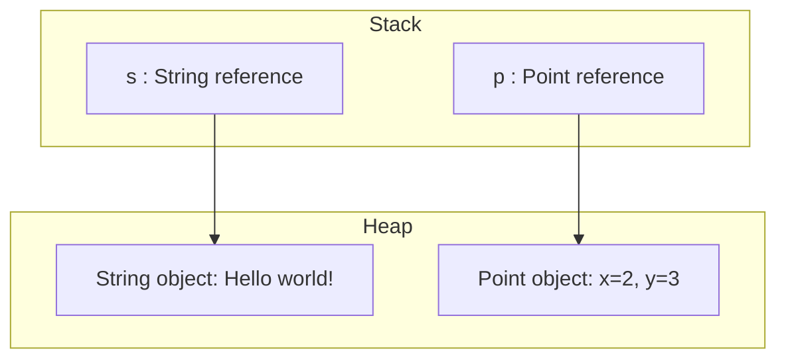
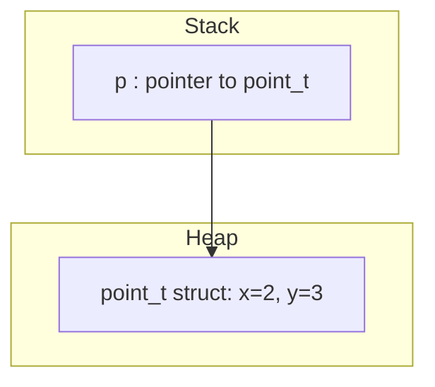
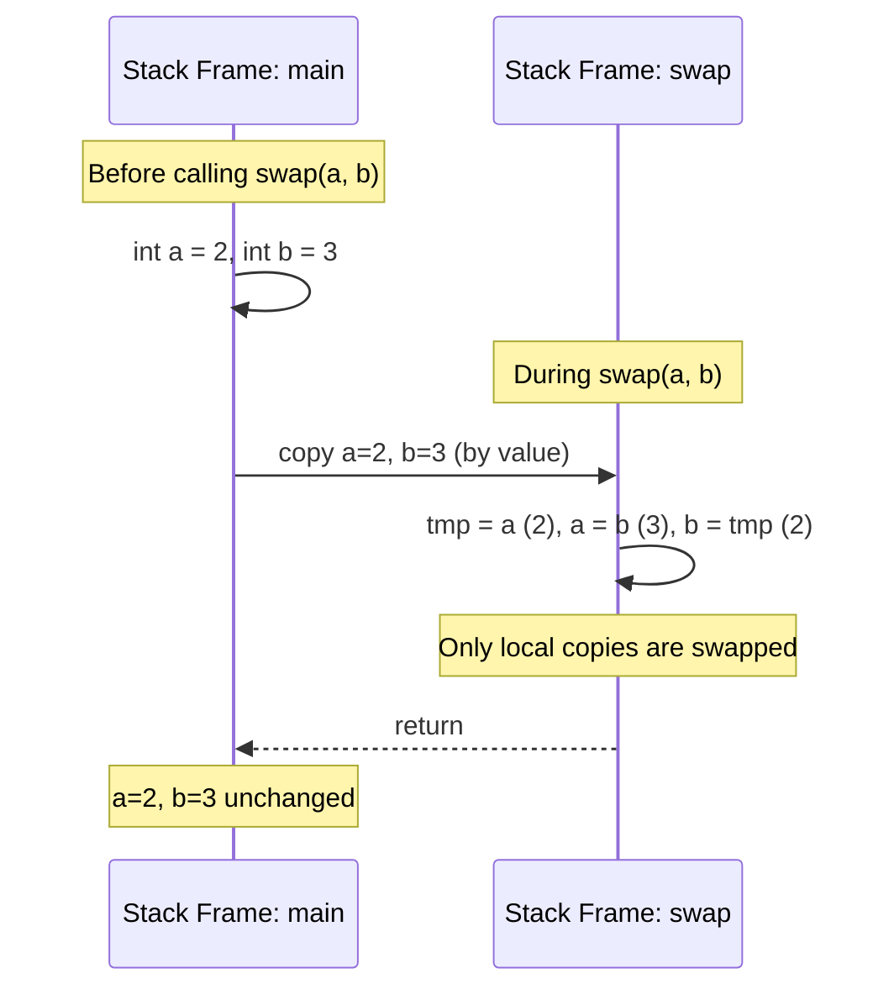
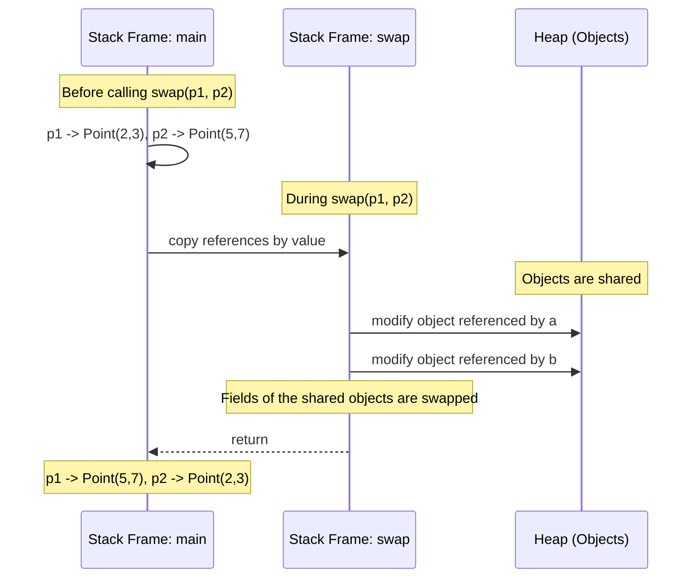
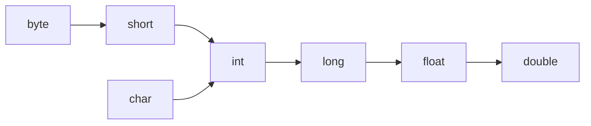

# Java Basics

## Why Java?

* **Platform independence**: *write once, run anywhere* thanks to the JVM
* **Mature ecosystem**: decades of libraries, frameworks, tools, and best practices
* **Strong typing & safety**: compile-time checks help detect errors early
* **Performance**: JIT compilation, modern garbage collectors, and continuous runtime improvements
* **Scalability**: widely used for large-scale enterprise, cloud, and distributed systems
* **Longevity & stability**: long-term support (LTS) releases and strong backward compatibility
* **Industry adoption**: widely used in enterprise, backend, big data, and Android

## History

* **1991**: a group led by James Gosling and Patrick Naughton at Sun Microsystems began the Green project, initially targeting consumer electronic devices.
* **1995**: Java was officially introduced.
* **1996**: JDK 1.0 was released.
* **2004**: Java 5 introduced major language features such as generics, annotations, enums, and the enhanced `for` loop.
* **2014**: **Java 8 LTS**
* **2018**: **Java 11 LTS**
* **2021**: **Java 17 LTS**
* **2023**: **Java 21 LTS**
* **2025**: **Java 25 LTS**

Java follows a **six-month feature-release cycle**, with an **LTS release every two years**.

see: [Java version history](https://en.wikipedia.org/wiki/Java_version_history), [Don’t call it a comeback: Why Java is still champ](https://github.com/readme/featured/java-programming-language), [The Java Story | The Official Documentary](https://www.youtube.com/watch?v=ZqGSg4b_cZA)

## Programs, files and classes

A Java program is made of one or more packages, containing one or more source files. A Java source file can contain multiple top-level classes, interfaces, enums, or records, but at most one of them can be `public`.

**The name of a `.java` file must match the name of its public top-level class.**


## Building and running


Java source code is compiled into **bytecode**, which is stored in `.class` files. The JVM loads and executes this bytecode. Modern JVMs use **Just-In-Time (JIT) compilation** to compile frequently executed bytecode into native machine code at runtime.

see: [List of Java virtual machines - Wikipedia](https://en.wikipedia.org/wiki/List_of_Java_virtual_machines), [Java class file - Wikipedia](https://en.wikipedia.org/wiki/Java_class_file#General_layout), [Compiled vs Interpreted Programming Languages](https://www.youtube.com/watch?app=desktop&v=y6VvxGHCxa4)

## Build tools

* **Purpose**: automate compilation, dependency management, testing, and packaging
* **Apache Maven**

  * Declarative build configuration (`pom.xml`)
  * Convention over configuration
  * Strong dependency management via repositories
* **Gradle**

  * Flexible and expressive (Groovy / Kotlin DSL)
  * Faster builds via incremental compilation and caching
  * Popular in modern projects and Android
* **Common tasks**

  * Compile source code
  * Run tests
  * Resolve dependencies
  * Package artifacts (JAR, WAR)

## Maven project structure

A standard Maven project follows a **convention-based directory layout**, which simplifies builds and tooling integration.

```text
project-root/
 ├─ pom.xml
 └─ src/
    ├─ main/
    │  ├─ java/        (application source code)
    │  └─ resources/   (configuration files, static resources)
    └─ test/
       ├─ java/        (test source code)
       └─ resources/   (resources used during testing)
```

* **`pom.xml`**: project configuration (dependencies, plugins, build lifecycle)
* **`src/main/java`**: production Java code
* **`src/main/resources`**: non-code resources (e.g., `application.properties`)
* **`src/test/java`**: unit and integration tests
* **`src/test/resources`**: resources used during testing

This standardized structure enables **tool interoperability**, **IDE support**, and **repeatable builds** across projects and teams.

## Methods

In Java, there are no traditional standalone functions; executable behavior is defined through **methods**, which belong to classes or interfaces. Methods are a basic form of code modularization: they are named blocks of code that execute when they are called.

Methods may receive parameters and may return a value. A `void` method does not return a value.

A Java application can start from a call to a `main` method.

```java
public class HelloWorld {
    public static void main(String[] args) {
        System.out.println("Hello world!");
    }
}
```

```java
public class HelloWorld {
    public static void main(String[] args) {
        int n = multiplyByTwo(20);
        System.out.println(n);
    }

    public static int multiplyByTwo(int n) {
        return 2 * n;
    }
}
```

## Code blocks and scope

Java code blocks are similar to those in C. Each block is enclosed by **braces** `{ }` and starts a new **scope** for local variables.

Variables can be declared anywhere within a scope, but a local variable must be initialized before it is used.

```java
public class HelloWorld {
    public static void counter(int n) {
        // here you can define variables local to the counter() method
        int a = 1;

        for (int i = 0; i < n; i++) {
            // here you can define variables local to the for loop
            int aInsideLoop = 2;
        }
    }
}
```

## Conventions

### Coding conventions

```java
package com.nbicocchi.myapp;

public class SomeClass {
    private int someField;
    private double anotherField;

    public SomeClass() {                    // constructor
        someField = 1;
        anotherField = 3.14;
    }

    public int someMethod(int n, float m) {
        int localVariable;                  // must initialize before use
        float anotherLocalVariable = 1;

        localVariable = n - 2;
        anotherLocalVariable = localVariable + m * 3;

        for (int i = 0; i < someField; i++) {
            localVariable = localVariable * 2;
            localVariable = localVariable - someField;
        }

        return localVariable + n;
    }
}
```

* **Packages** are lowercase.
* **Fields and Local Variables**: A noun phrase, starting with a lower-case letter, with multiple words distinguished by capitalization, e.g., `eventCount`, `numberOfBasicOperations`.
* **Constants**: A noun phrase in all capitals, with multiple words separated by underscore `_`, e.g., `MAX_SIZE`.
* **Classes**: Same as field and variable names except starting with a capital letter, e.g., `Point`, `GeometryDemo`. Interfaces should usually be an adjective, e.g., `Throwable`, `Comparable`.
* **Methods**: An imperative verb phrase (if possible), otherwise in the same format as field and variable names, e.g., `findMedian()`, `incrementEventCount()`. Accessor methods should start with `get`, mutator methods should start with `set`, and a method returning a boolean should, if possible, start with `is` or `has`, e.g., `getEventCount()`, `setEventCount()`, `isDone()`, `hasNext()`.
* **Curly braces** go at the end of the line that starts the class, method, loop, etc., and the closing brace is on a line by itself, lined up vertically with the start of the corresponding statement.

see: [Java Coding Standard - pdf](../books/Java-Coding-Standard.pdf), In IntelliJ Reformat Code (`Ctrl+Alt+L`)

### Comments

```java
// comment on one line

/*
 * this comment is so long
 * that it needs two lines
 */

/**
 * This is a JavaDoc comment!
 * Swaps the coordinates of two Points.
 *
 * @param p1 The first point
 * @param p2 The second point
 */
public static void swap(Point p1, Point p2) {
    Point tmp = new Point(p1);
    p1.setLocation(p2);
    p2.setLocation(tmp);
}
```


## Primitive types

| Type      | Size (bits) | Minimum                | Maximum               | Example                          |
| --------- | ----------- | ---------------------- | --------------------- | -------------------------------- |
| `byte`    | 8           | -2^7                   | 2^7 - 1               | `byte b = 100;`                  |
| `short`   | 16          | -2^15                  | 2^15 - 1              | `short s = 30_000;`              |
| `int`     | 32          | -2^31                  | 2^31 - 1              | `int i = 100_000_000;`           |
| `long`    | 64          | -2^63                  | 2^63 - 1              | `long l = 100_000_000_000_000L;` |
| `float`   | 32          | approx. ±1.4 × 10^-45  | approx. ±3.4 × 10^38  | `float f = 1.456f;`              |
| `double`  | 64          | approx. ±4.9 × 10^-324 | approx. ±1.8 × 10^308 | `double d = 1.456789012345678;`  |
| `char`    | 16          | 0                      | 2^16 - 1              | `char c = 'c';`                  |
| `boolean` | —           | `false`                | `true`                | `boolean b = true;`              |

### Literals

| **Literal Type**            | **Description**                                                                                                                                                       | **Examples**             |
| --------------------------- | --------------------------------------------------------------------------------------------------------------------------------------------------------------------- | ------------------------ |
| **Integral Literals**       |                                                                                                                                                                       |                          |
| Decimal Integer             | Base 10, digits 0–9. Can be positive (`+`) or negative (`-`).                                                                                                         | `int d = -68;`           |
| Octal Integer               | Base 8, digits 0–7. Begins with `0`.                                                                                                                                  | `int o = 0275;`          |
| Hexadecimal                 | Base 16, digits 0–9 and A–F. Prefix `0x` or `0X`.                                                                                                                     | `int e = 0x9A;`          |
| Binary Integer              | Base 2, digits 0 and 1. Prefix `0b` or `0B`.                                                                                                                          | `int b = 0b11011;`       |
| **Floating-Point Literals** |                                                                                                                                                                       |                          |
| Single Precision            | Ends with `f` or `F`.                                                                                                                                                 | `float f = 4F;`          |
| Double Precision            | May optionally end with `d` or `D`; `double` is the default floating-point type.                                                                                      | `double d = 3.14;`       |
| Exponent Form               | Uses `e` or `E` to specify the exponent.                                                                                                                              | `double d = 314159E-05;` |
| **Char Literals**           | Enclosed in single quotes. Represents a UTF-16 code unit. Can use escape sequences.                                                                                   | `char ch = '\u0041';`    |
| **String Literals**         | Enclosed in double quotes.                                                                                                                                            | `String s = "John Doe";` |
| **Boolean Literals**        | Only two values: `true` and `false`. They are case-sensitive and cannot be represented by `0` or `1`.                                                                 | `boolean b = true;`      |
| **Null Literal**            | The `null` literal represents a null reference, meaning that a reference does not refer to an object. Dereferencing a null reference causes a `NullPointerException`. | `Patient p = null;`      |

### Constants

A `final` variable can be assigned only once. For primitive values, this means that the value cannot be changed after initialization. For reference variables, `final` prevents the reference from being reassigned, but it does **not** make the referenced object immutable.

Constants are commonly declared using `static final` and are typically named using uppercase letters.

There are several cases where using constants can be helpful:

* To make code more readable by giving names to values
* To prevent a variable from being reassigned accidentally
* To represent values that are conceptually constant

To declare a constant in a class, use the `final` keyword:

```java
public class Location {
    double x = 0;
    double y = 0;

    static final double MAX_X = 100;
    static final double MIN_X = -100;

    public static void main(String[] args) {
        Location l = new Location();

        l.x++;
        // l.MAX_X++; // Cannot assign a value to final variable 'MAX_X'
    }
}
```

## Reference variables

A **reference variable** holds a reference to an object. Unlike primitive variables, reference variables have a reference type such as `String`, `Point`, or `Object`.

Objects are created dynamically and are managed by the JVM. The JVM typically stores objects in the heap, while local variables and method parameters are associated with stack frames.

```java
public class Point {
    int x;
    int y;

    public Point(int x, int y) {
        this.x = x;
        this.y = y;
    }

    int getX() {
        return x;
    }

    int getY() {
        return y;
    }

    public static void main(String[] args) {
        // s is a reference to a String object
        String s = new String("Hello world!");
        System.out.println("length = " + s.length());

        // p is a reference to a Point object
        Point p = new Point(2, 3);
        System.out.printf("point=(%d, %d)%n", p.getX(), p.getY());
    }
}
```


```mermaid
graph TD
    %% Stack
    subgraph Stack
        s["s : String reference"]
        p["p : Point reference"]
    end

    %% Heap
    subgraph Heap
        sObj["String object: Hello world!"]
        pObj["Point object: x=2, y=3"]
    end

    %% References
    s --> sObj
    p --> pObj
```

References and objects are conceptually similar to pointers and dynamically allocated structures in C, although Java references are managed by the JVM and are not directly equivalent to C pointers.

```c
typedef struct point {
    float x;
    float y;
} point_t;

point_t *allocate_point(float x, float y) {
    point_t *p = malloc(sizeof(point_t));
    p->x = x;
    p->y = y;
    return p;
}

void free_point(point_t *p) {
    free(p);
}

int main() {
    point_t *p = allocate_point(2, 3);
    printf("(%f, %f)\n", p->x, p->y);
    free_point(p);
}
```


```mermaid
graph TD
    subgraph Stack
        p["p : pointer to point_t"]
    end

    subgraph Heap
        pObj["point_t struct: x=2, y=3"]
    end

    p --> pObj
```

## Passing parameters to methods

Java is **always pass-by-value**.

When a method is called, the value of each argument is copied into a new parameter variable in the called method.

* For **primitive types** (`int`, `double`, `boolean`, etc.), the actual value is copied.
* For **object references**, the reference value is copied, not the object itself.

```java
public class PassingParametersNotWorking {
    public static void swap(int a, int b) {
        int tmp = a;
        a = b;
        b = tmp;
    }

    public static void main(String[] args) {
        int a = 2;
        int b = 3;

        System.out.println(a);  // 2
        System.out.println(b);  // 3

        swap(a, b);

        System.out.println(a);  // 2
        System.out.println(b);  // 3
    }
}
```

In the `swap(int a, int b)` example, the values of `a` and `b` from `main` (`2` and `3`) are copied into the new local variables `a` and `b` inside the `swap` method. Inside `swap`, those local copies are swapped correctly, but the original variables in `main` are unaffected because the parameters are independent local variables.

After the method finishes, its local variables are no longer accessible.


```mermaid
sequenceDiagram
    participant MainStack as Stack Frame: main
    participant SwapStack as Stack Frame: swap

    Note over MainStack: Before calling swap(a, b)
    MainStack->>MainStack: int a = 2, int b = 3

    Note over SwapStack: During swap(a, b)
    MainStack->>SwapStack: copy a=2, b=3 (by value)

    SwapStack->>SwapStack: tmp = a (2), a = b (3), b = tmp (2)

    Note over SwapStack: Only local copies are swapped
    SwapStack-->>MainStack: return

    Note over MainStack: a=2, b=3 unchanged
```

To modify the state of an object inside a method, the method can receive a reference to that object. The reference itself is still passed **by value**, but both the caller and the method can use their references to access the same object.

```java
import java.awt.*;

public class PassingParametersWorking {
    // Swap the fields of two Point objects
    public static void swap(Point a, Point b) {
        int tmpX = a.x;
        int tmpY = a.y;

        a.x = b.x;
        a.y = b.y;

        b.x = tmpX;
        b.y = tmpY;
    }

    public static void main(String[] args) {
        Point p1 = new Point(2, 3);
        Point p2 = new Point(5, 7);

        System.out.println("Before swap:");
        System.out.println("p1 = " + p1);
        System.out.println("p2 = " + p2);

        swap(p1, p2);

        System.out.println("After swap:");
        System.out.println("p1 = " + p1);
        System.out.println("p2 = " + p2);
    }
}
```


```mermaid
sequenceDiagram
    participant MainStack as Stack Frame: main
    participant SwapStack as Stack Frame: swap
    participant Heap as Heap (Objects)

    Note over MainStack: Before calling swap(p1, p2)
    MainStack->>MainStack: p1 -> Point(2,3), p2 -> Point(5,7)

    Note over SwapStack: During swap(p1, p2)
    MainStack->>SwapStack: copy references by value

    Note over Heap: Objects are shared
    SwapStack->>Heap: modify object referenced by a
    SwapStack->>Heap: modify object referenced by b

    Note over SwapStack: Fields of the shared objects are swapped
    SwapStack-->>MainStack: return

    Note over MainStack: p1 -> Point(5,7), p2 -> Point(2,3)
```

## Working with numbers

### The Math library

The class `java.lang.Math` contains methods for performing basic numeric operations such as logarithms, square roots, trigonometric functions, and finding minimum and maximum values.

```java
public class MathDemo {

    public static void main(String[] args) {
        double x = 60984.1;
        double y = -497.99;

        System.out.println("Math.log(" + x + ")=" + Math.log(x));
        System.out.println("Math.log(" + y + ")=" + Math.log(y));

        System.out.println("Math.max(" + x + ", y)=" + Math.max(x, y));
        System.out.println("Math.min(" + x + ", y)=" + Math.min(x, y));
    }
}
```

### Random numbers

The `RandomGenerator` interface provides a common API for generating pseudorandom values.

```java
public class RandomDemo {

    public static void main(String[] args) {
        RandomGenerator rnd = RandomGenerator.getDefault();

        int i1 = rnd.nextInt();             // [Integer.MIN_VALUE, Integer.MAX_VALUE]
        int i2 = rnd.nextInt(100);          // [0, 100)
        int i3 = rnd.nextInt(10, 20);       // [10, 20)

        long l1 = rnd.nextLong();           // [Long.MIN_VALUE, Long.MAX_VALUE]
        long l2 = rnd.nextLong(100);        // [0, 100)
        long l3 = rnd.nextLong(10, 20);     // [10, 20)

        double d1 = rnd.nextDouble();       // [0, 1)
        double d2 = rnd.nextDouble(100.0);  // [0, 100.0)
        double d3 = rnd.nextDouble(10.0, 20.0); // [10.0, 20.0)

        boolean b = rnd.nextBoolean();      // true or false
    }
}
```

## Operators

Operators are special symbols that perform specific operations on one, two, or three operands, and then produce a result.

As we explore the operators of the Java programming language, it may be helpful to know which operators have the highest precedence. The following table lists common operators according to precedence order. Operators higher in the table are generally evaluated before operators lower in the table.

When operators of equal precedence appear in the same expression, their **associativity** determines the evaluation order.

| Operators            | Precedence                                |
| -------------------- | ----------------------------------------- |
| postfix              | `expr++ expr--`                           |
| unary                | `++expr --expr +expr -expr ~ !`           |
| multiplicative       | `* / %`                                   |
| additive             | `+ -`                                     |
| shift                | `<< >> >>>`                               |
| relational           | `< > <= >= instanceof`                    |
| equality             | `== !=`                                   |
| bitwise AND          | `&`                                       |
| bitwise exclusive OR | `^`                                       |
| bitwise inclusive OR | `\|`                                      |
| logical AND          | `&&`                                      |
| logical OR           | `\|\|`                                    |
| ternary              | `? :`                                     |
| assignment           | `= += -= *= /= %= &= ^= \|= <<= >>= >>>=` |

## Casting

### Implicit casting

The compiler automatically performs a **widening primitive conversion** when Java defines a widening conversion between the source and target types.

The picture below illustrates the main direction of these conversions:


```mermaid
graph LR
    byte --> short
    short --> int
    int --> long
    long --> float
    float --> double
    char --> int
```

Widening conversions generally do not require an explicit cast.

```java
int i = 10;
long l = i;
double d = l;
```

A widening conversion does not necessarily mean that no information can be lost. For example, converting `long` to `float` can result in a loss of numerical precision.

### Explicit casting

A **narrowing primitive conversion** generally requires an explicit cast and may cause loss of information.

```java
public class CastingTest {
    public static void main(String[] args) {
        double d = 2.00003;

        // loses the fractional part
        long l = (long) d; // 2

        // requires explicit casting: long -> int
        int i = (int) l; // 2

        // the expression 3 + 2L has type long
        int val = (int) (3 + 2L); // 5

        // narrowing conversion from long to char
        char ch = (char) 65L; // 'A'
    }
}
```

see: [ASCII Table](https://www.asciitable.com/)

## Flow-control statements

### Decision statements

#### if statement

The **if** statement is a basic decision-making structure in programming. It allows a program to test a condition and choose which block of code to execute based on whether the condition is true or false. Using `if`, `else if`, and `else`, a program can handle multiple possible cases in sequence, ensuring that only the first matching block runs.

```java
if (condition1) {
    // executed if condition1 is true
} else if (condition2) {
    // executed if condition1 is false
    // and condition2 is true
} else {
    // executed if both conditions are false
}
```

```java
int time = 22;

if (time < 10) {
    System.out.println("Good morning.");
} else if (time < 20) {
    System.out.println("Good day.");
} else {
    System.out.println("Good evening.");
}
```

#### switch statement

The **switch** statement is a control structure used to select one of several possible code blocks based on the value of an expression.

```java
switch (expression) {
    case x:
        // code block
        break;
    case y:
        // code block
        break;
    default:
        // code block
}
```

```java
char grade = 'B';

switch (grade) {
    case 'A':
        System.out.println("Excellent!");
        break;
    case 'B':
    case 'C':
        System.out.println("Well done");
        break;
    case 'D':
        System.out.println("Danger zone");
        break;
    default:
        System.out.println("Invalid grade");
}
```

#### switch statement (enhanced)

Modern Java also supports the arrow form of `switch`, which does not require `break` statements.

```java
switch (expression) {
    case x -> // code block
    case y, z -> // code block
    default -> // code block
}
```

```java
switch (grade) {
    case 'A' -> System.out.println("Excellent!");
    case 'B', 'C' -> System.out.println("Well done");
    case 'D' -> System.out.println("Danger zone");
    default -> System.out.println("Invalid grade");
}
```

### Iterative statements

#### do-while statement

The **do-while** statement is a loop that executes a block of code **at least once** and then repeats it as long as a specified condition remains true. Unlike a regular `while` loop, the condition is checked **after** the code block executes, ensuring that the loop body runs at least one time.

```java
do {
    // code block to be executed
} while (condition);
```

```java
int i = 0;

do {
    System.out.println(i++);
} while (i < 5);
```

#### while statement

The **while** statement repeatedly executes a block of code **as long as a specified condition is true**. The condition is evaluated before each iteration, so if it is false from the beginning, the code block may not execute at all.

```java
while (condition) {
    // code block to be executed
}
```

```java
int i = 0;

while (i < 5) {
    System.out.println(i++);
}
```

#### for statement

The **for** statement is a loop used to execute a block of code while controlling a loop variable through an initialization, condition, and update expression.

```java
for (statement 1; statement 2; statement 3) {
    // code block to be executed
}
```

```java
for (int i = 0; i <= 10; i++) {
    System.out.println(i);
}
```

#### for statement (enhanced)

The **enhanced `for` statement** is used to iterate over arrays and other iterable data structures.

```java
for (type variableName : arrayName) {
    // code block to be executed
}
```

```java
String[] cars = {
    "Supra",
    "Lancer Evo",
    "Impreza"
};

for (String car : cars) {
    System.out.println(car);
}
```

#### break-continue statements

The **break** statement can be used to terminate the nearest enclosing loop or `switch` statement.

The **continue** statement skips the remainder of the current loop iteration and continues with the next iteration.

```java
for (int i = 0; i < 10; i++) {
    if (i == 4) {
        break;
    }

    System.out.println(i);
} // 0, 1, 2, 3
```

```java
for (int i = 0; i < 10; i++) {
    if (i == 4) {
        continue;
    }

    System.out.println(i);
} // 0, 1, 2, 3, 5, 6, 7, 8, 9
```

# Resources

* https://www.baeldung.com/java-primitives
* https://www.baeldung.com/java-switch-pattern-matching
* https://www.baeldung.com/java-generating-random-numbers
