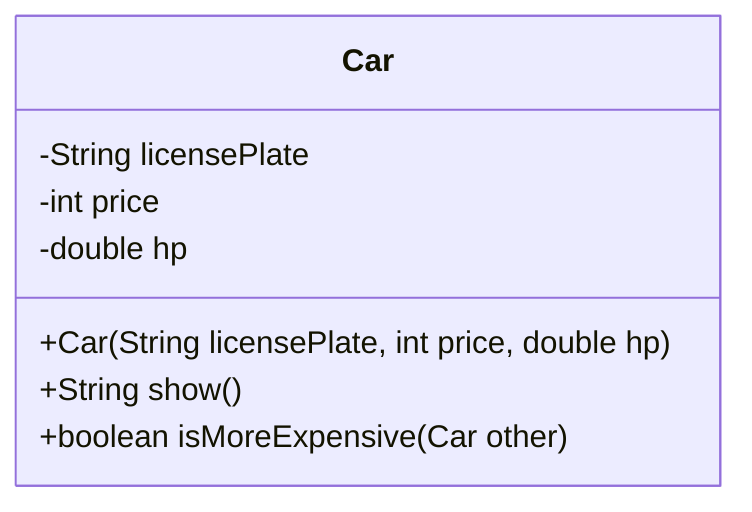

# Java Classes (Encapsulation)


## Declaring new classes

A new class is declared with the `class` keyword followed by the name of the class. A class body can include fields, methods, and constructors. **Fields** store data, **methods** define behavior and **constructors** allow us to create and initialize new objects of the class.


```java
public class Car {
    private String licensePlate;
    private double price;
    private double hp;

    public Car(String licensePlate, double price, double hp) {
        this.licensePlate = licensePlate;
        this.price = price;
        this.hp = hp;
    }

    public String show() {
        return "Car{" +
                "licensePlate='" + licensePlate + '\'' +
                ", price=" + price +
                ", hp=" + hp +
                '}';
    }

    public boolean isMoreExpensive(Car other) {
        return hp > other.hp;
    }
}
```

Let's create **instances** of the class `Car`:

```java
public static void main(String[] args) {
    Car economy = new Car("DD654ZF", 3000, 60.0);
    Car expensive = new Car("GH345II", 72000, 460.0);

    System.out.println(economy.show()); // Car{licensePlate='DD654ZF', price=3000, hp=60.0}
    System.out.println(expensive.isMoreExpensive(economy)); // true
}
```

UML diagram of the `Car` class:



## Constructors
**Constructors** are special methods that initialize a **new object** of the class. A constructor of a class is invoked when an instance is created using the keyword `new`. Constructors initialize **instances** (objects) of the class. They set values to the fields when the object is created. Also, constructors can take parameters for initializing fields by the given values.


A constructor is different from other methods in that:
* it has the same name as the class that contains it.
* it has no return type.


To initialize the fields, the keyword `this` is used, which is a reference to the current object. Usually, the keyword `this` is used when an instance variable and a method variable share the same name. This keyword helps to disambiguate these situations as shown below.

```java
public Car(String licensePlate, int price, double hp) {
    this.licensePlate = licensePlate;
    this.price = price;
    this.hp = hp;
}
```

### Default and no-argument constructor

The compiler automatically provides **a default no-argument constructor** for any class without constructors.

```java
public class Car {
    private String licensePlate;
    private double price;
    private double hp;
}
```

We can create an instance of the class using the no-argument default constructor:

```java
public static void main(String[] args) {
    Car car = new Car();
    System.out.println(car.licensePlate); // null
    System.out.println(car.price); // 0
    System.out.println(car.hp);  // 0.0
}
```

**Whenever you define a custom constructor, the default constructor is disabled.**


### Constructor overloading
You can define multiple constructors within a class, as needed. Each constructor must have the same name as the class but must differ in the number or types of parameters.

This practice of having multiple constructors with different parameter lists is known as **constructor overloading**.

It is commonly used to provide flexibility when initializing objects, for example, allowing the creation of objects with only a subset of attributes specified, rather than requiring all of them.

```java
public class Car {
    String licensePlate;
    int price;
    double hp;

    public Car(String licensePlate, int price, double hp) {
        this.licensePlate = licensePlate;
        this.price = price;
        this.hp = hp;
    }

    // overloaded constructor
    public Car(String licensePlate, int price) {
        this.licensePlate = licensePlate;
        this.price = price;
        this.hp = 0.0;
    }

    // overloaded constructor
    public Car(String licensePlate) {
        this.licensePlate = licensePlate;
        this.price = 0;
        this.hp = 0.0;
    }

    public String show() {
        return "Car{" +
                "licensePlate='" + licensePlate + '\'' +
                ", price=" + price +
                ", hp=" + hp +
                '}';
    }

    public boolean isMoreExpensive(Car other) {
        return hp > other.hp;
    }
}
```

We can also invoke a constructor from another one (usually more concise). It allows you to initialize one part of an object by one constructor and another part by another constructor.

```java
public class Car {
    String licensePlate;
    int price;
    double hp;

    public Car(String licensePlate, int price, double hp) {
        this.licensePlate = licensePlate;
        this.price = price;
        this.hp = hp;
    }

    // overloaded constructor invoking another constructor
    public Car(String licensePlate, int price) {
        super(licensePlate, price, 0.0);
    }

    // overloaded constructor invoking another constructor
    public Car(String licensePlate) {
        super(licensePlate, 0, 0,0);
    }

    public String show() {
        return "Car{" +
                "licensePlate='" + licensePlate + '\'' +
                ", price=" + price +
                ", hp=" + hp +
                '}';
    }

    public boolean isMoreExpensive(Car other) {
        return hp > other.hp;
    }
}
```

##  Encapsulation
According to the **data encapsulation** principle, the fields of a class cannot be directly accessed from other classes. Instead, they should be accessed only through the methods of that particular class.

###  Members visibility
An **access modifier** is a special keyword that specifies who is allowed to use your code or a special part of it. It can be placed in front of any field, method or the entire class.

* **Code clarity**: Access control allows developers to hide complex internal logic (like an engine in a washing machine) and expose only the necessary interfaces (like buttons), making code easier to use and understand.

* **Code safety**: By restricting access to critical variables or methods, you prevent unintended modifications by others, ensuring that your code behaves as intended and remains reliable when reused in other projects.

Access modifiers are:
-   **private** available only inside a class;
-   **package-private** (also known as **default**, implicit) available for all classes in the same package;
-   **protected** available for classes in the same package and for subclasses (will be covered later);
-   **public** available for all classes everywhere.

| Modifier  | Class | Package | Subclass | All |
|-----------|-------|---------|----------|-----|
| Public    | Yes   | Yes     | Yes      | Yes |
| Protected | Yes   | Yes     | Yes      | No  |
| Default   | Yes   | Yes     | No       | No  |
| Private   | Yes   | No      | No       | No  |


###  Getters and Setters
According to the **data encapsulation** principle:
* the fields of a class cannot be directly accessed from other classes.
* the fields can be accessed only through the methods of that particular class.

To access hidden fields, programmers write special types of methods: **getters** and **setters**. Getters can only read fields, and setters can only write (modify) the fields. Both types of methods should be `public`.  Using these methods gives some advantages:

* the fields of a class can be made read-only, write-only, or both;
* a class can have total control over what values are stored in the fields;
* users of a class don't know how the class stores its data and don't depend on the fields.

See [this](https://stackoverflow.com/questions/1568091/why-use-getters-and-setters-accessors) interesting discussion on the topic! In particular, answer #2.

```java
public class Car {
    String licensePlate;
    int price;
    double hp;

    public Car(String licensePlate, int price, double hp) {
        this.licensePlate = licensePlate;
        this.price = price;
        this.hp = hp;
    }

    public String getLicensePlate() {
        return licensePlate;
    }

    public void setLicensePlate(String licensePlate) {
        this.licensePlate = licensePlate;
    }

    public int getPrice() {
        return price;
    }

    public void setPrice(int price) {
        this.price = price;
    }

    public double getHp() {
        return hp;
    }

    public void setHp(double hp) {
        this.hp = hp;
    }
    
    // ...
}
```

In the following example, we define a setter implementing actual controls.

```java
public class Car {
    String licensePlate;
    int price;
    double hp;

    public Car(String licensePlate, int price, double hp) {
        // we call the setter from the constructor 
        // to always enforce controls on fields
        setLicencePlate(licensePlate);
        this.price = price;
        this.hp = hp;
    }
    
    // ...
    
    public String getLicencePlate() {
        return licencePlate;
    }

    public void setLicencePlate(String licencePlate) {
        if (licencePlate.length() != 7) {
            throw new IllegalArgumentException("Licence plate invalid");
        }
        if (!Character.isLetter(licencePlate.charAt(0)) ||
                !Character.isLetter(licencePlate.charAt(1))||
                !Character.isLetter(licencePlate.charAt(5))||
                !Character.isLetter(licencePlate.charAt(6))) {
            throw new IllegalArgumentException("Licence plate invalid");
        }
        if (!Character.isDigit(licencePlate.charAt(2)) ||
                !Character.isDigit(licencePlate.charAt(3))||
                !Character.isDigit(licencePlate.charAt(4))) {
            throw new IllegalArgumentException("Licence plate invalid");
        }
        this.licencePlate = licencePlate;
    }
    
    // ...
}
```

## Static methods and fields

### Static methods
Static methods can be invoked directly on the class, instead of an instance. They are often used as **utility methods** that are the same for the whole project. The Java library provides a lot of static methods for different classes. Here are just a few of them:

* the `Math` class has a lot of static methods, such as `Math.min(a, b)`, `Math.abs(val)`, `Math.pow(x, y)` and so on;
* the `Arrays` class has a lot of static methods for processing arrays such as `toString(...)`;

Static methods have several special features:
* a static method can access only static fields and cannot access non-static fields;
* a static method can invoke another static method, but it cannot invoke an instance method;
* a static method cannot refer to `this` keyword because there is no instance in the static context.

```java
public class SomeClass {

    public SomeClass() {
        invokeAnInstanceMethod(); // this is possible here
        invokeAStaticMethod();    // this is possible here too
    }

    public static void invokeAStaticMethod() {
        // it's impossible to invoke invokeAnInstanceMethod() here
    }

    public void invokeAnInstanceMethod() {
        invokeAStaticMethod();  // this is possible
    }
}
```

To invoke the methods:

```java
public static void main(String[] args) {
    // static method
    SomeClass.invokeAStaticMethod();
    
    // instance method
    SomeClass sc = new SomeClass();
    sc.invokeAnInstanceMethod();
}
```

### Static fields
A **static field** is a field declared with the `static` keyword. It can have any primitive or reference type, just like a regular instance field. A static field has the same value for all instances of the class. It belongs to the class, rather than to an instance of the class.

If we want all instances of a class to share a common value, for example, a global variable, it's better to declare it as static. Static variables can be accessed directly by the class name.

```java
public final class Math {
    public static final double E = 2.718281828459045;
    public static final double PI = PI;
    public static final double TAU = (PI * 2D);
    public static final double MY_MAGIC_NUMBER = 1.23456789;
    // ...
}
```

To use the constants:

```java
public static void main(String[] args) {
    System.out.println(Math.E);
    System.out.println(Math.PI);
}
```

Static fields with the `final` keyword are **class constants**, which means they cannot be changed. According to the naming convention, constant fields should always be written in uppercase with an underscore (`_`) to separate parts of the name.

## Resources
