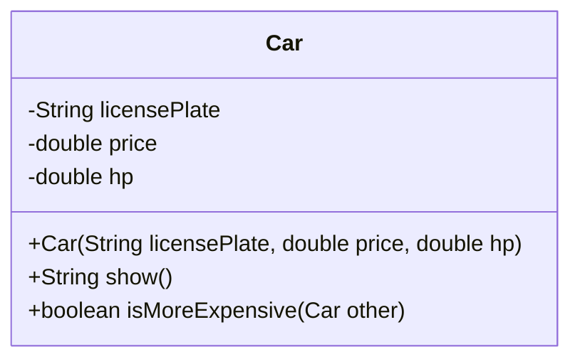
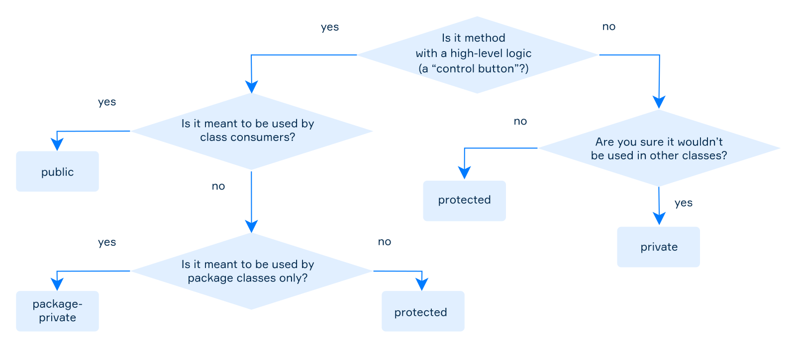

# Java Classes (Encapsulation)


## Declaring new classes

A new class is declared with the `class` keyword followed by a name. A class body can include fields, methods, constructors, and other members.

**Fields** store the state of an object, **methods** define its behavior, and **constructors** initialize new objects of the class.

```java
public class Car {
    private String licensePlate;
    private double price;
    private double hp;

    public Car(String licensePlate, double price, double hp) {
        this.licensePlate = licensePlate;
        this.price = price;
        this.hp = hp;
    }

    public String show() {
        return "Car{" +
                "licensePlate='" + licensePlate + '\'' +
                ", price=" + price +
                ", hp=" + hp +
                '}';
    }

    public boolean isMoreExpensive(Car other) {
        return price > other.price;
    }
}
```

Let's create **instances** of the class `Car`:

```java
public static void main(String[] args) {
    Car economy = new Car("DD654ZF", 3000, 60.0);
    Car expensive = new Car("GH345II", 72000, 460.0);

    System.out.println(economy.show()); // Car{licensePlate='DD654ZF', price=3000.0, hp=60.0}
    System.out.println(expensive.isMoreExpensive(economy)); // true
    System.out.println(economy.isMoreExpensive(expensive)); // false
}
```

UML Class Diagram of the `Car` class:


```mermaid
classDiagram
    class Car {
        -String licensePlate
        -double price
        -double hp
        +Car(String licensePlate, double price, double hp)
        +String show()
        +boolean isMoreExpensive(Car other)
    }
```

## Constructors

**Constructors** are special members used to initialize a **new object** of a class.

* A constructor is invoked when an instance is created using the keyword `new`.
* Constructors initialize the state of newly created objects.
* Constructors can initialize fields using values provided as parameters.
* A constructor has the same name as the class.
* A constructor has **no return type**, not even `void`.

For example:

```java
public Car(String licensePlate, double price, double hp) {
    this.licensePlate = licensePlate;
    this.price = price;
    this.hp = hp;
}
```

To initialize the fields, the keyword `this` refers to the **current object**.

It is especially useful when a constructor parameter has the same name as an instance field:

```java
public Car(String licensePlate, double price, double hp) {
    this.licensePlate = licensePlate;
    this.price = price;
    this.hp = hp;
}
```

Here:

* `this.licensePlate` refers to the instance field;
* `licensePlate` refers to the constructor parameter.

### Default and no-argument constructor

If a class declares **no constructor**, the compiler provides a **default constructor** with no parameters.

For example:

```java
public class Car {
    private String licensePlate;
    private double price;
    private double hp;
}
```

We can create an instance of the class using the compiler-provided constructor:

```java
public static void main(String[] args) {
    Car car = new Car();
}
```

The fields are initialized to their default values:

```text
licensePlate = null
price        = 0.0
hp           = 0.0
```

A class does **not** receive a compiler-provided default constructor if it declares any constructor itself.

For example, after declaring:

```java
public Car(String licensePlate, double price, double hp) {
    this.licensePlate = licensePlate;
    this.price = price;
    this.hp = hp;
}
```

the expression:

```java
new Car();
```

is no longer valid unless we explicitly provide a no-argument constructor.

> **NOTE:** A **default constructor** is specifically the no-argument constructor automatically provided by the compiler when no constructor is declared. A programmer-defined no-argument constructor is simply a **no-argument constructor**, not a default constructor in the strict sense.

### Constructor overloading

You can define multiple constructors within a class. Each constructor must have the same name as the class but must differ in its parameter list.

This practice is known as **constructor overloading**.

It can provide different ways to initialize objects, for example by allowing some attributes to be omitted.

```java
public class Car {
    String licensePlate;
    int price;
    double hp;

    public Car(String licensePlate, int price, double hp) {
        this.licensePlate = licensePlate;
        this.price = price;
        this.hp = hp;
    }

    // overloaded constructor
    public Car(String licensePlate, int price) {
        this.licensePlate = licensePlate;
        this.price = price;
        this.hp = 0.0;
    }

    // overloaded constructor
    public Car(String licensePlate) {
        this.licensePlate = licensePlate;
        this.price = 0;
        this.hp = 0.0;
    }

    public String show() {
        return "Car{" +
                "licensePlate='" + licensePlate + '\'' +
                ", price=" + price +
                ", hp=" + hp +
                '}';
    }

    public boolean isMoreExpensive(Car other) {
        return price > other.price;
    }
}
```

We can also invoke one constructor from another constructor using `this(...)`.

This is useful because it avoids duplicating initialization logic.

```java
public class Car {
    String licensePlate;
    int price;
    double hp;

    public Car(String licensePlate, int price, double hp) {
        this.licensePlate = licensePlate;
        this.price = price;
        this.hp = hp;
    }

    // overloaded constructor invoking another constructor
    public Car(String licensePlate, int price) {
        this(licensePlate, price, 60.0);
    }

    // overloaded constructor invoking another constructor
    public Car(String licensePlate) {
        this(licensePlate, 10, 60.0);
    }

    public String show() {
        return "Car{" +
                "licensePlate='" + licensePlate + '\'' +
                ", price=" + price +
                ", hp=" + hp +
                '}';
    }

    public boolean isMoreExpensive(Car other) {
        return price > other.price;
    }
}
```

When using `this(...)` to invoke another constructor:

* it must be the **first statement** of the constructor;
* it invokes another constructor of the same class;
* it is commonly used to avoid duplicated initialization code.

## Members visibility

An **access modifier** is a keyword that specifies where a class member can be accessed.

For top-level classes, only `public` and package-private access are allowed. For members such as fields and methods, all four access levels are available.

The four access levels are:

* **private** — accessible only within the declaring class;
* **package-private** — accessible by classes in the same package. It is the implicit access level when no modifier is specified;
* **protected** — accessible by classes in the same package and by subclasses, including subclasses in other packages under specific access rules;
* **public** — accessible wherever the containing type is accessible.

| Modifier        | Class | Package | Subclass | All |
| --------------- | ----- | ------- | -------- | --- |
| `public`        | Yes   | Yes     | Yes      | Yes |
| `protected`     | Yes   | Yes     | Yes      | No  |
| package-private | Yes   | Yes     | No       | No  |
| `private`       | Yes   | No      | No       | No  |



> **NOTE:** The table above describes member access. A top-level class cannot be declared `private` or `protected`; a top-level class can be `public` or package-private.

Access control improves:

* **Code clarity**: implementation details can be hidden while exposing only the operations that clients need.
* **Code safety**: direct access to internal state can be restricted, allowing the class to enforce its own invariants.
* **Maintainability**: the internal implementation can change without requiring users of the class to access its fields directly.

## Getters and Setters

A common technique for encapsulating fields is to provide **getters** and **setters**.

* A **getter** reads the value of a field.
* A **setter** changes the value of a field.

Getters and setters are usually `public`, but they do not have to be. Their visibility should depend on how the class is intended to be used.

Encapsulation does **not** mean that every field must have both a getter and a setter. A class can deliberately expose:

* a getter without a setter, making the state externally read-only;
* a setter without a getter, when write-only access is appropriate;
* neither, when the field should remain completely internal;
* both, when both reading and controlled modification are required.

Using methods instead of exposing fields directly gives the class control over how its state is accessed and modified.

For example:

```java
public class Car {
    private String licensePlate;
    private int price;
    private double hp;

    public Car(String licensePlate, int price, double hp) {
        this.licensePlate = licensePlate;
        this.price = price;
        this.hp = hp;
    }

    public String getLicensePlate() {
        return licensePlate;
    }

    public void setLicensePlate(String licensePlate) {
        this.licensePlate = licensePlate;
    }

    public int getPrice() {
        return price;
    }

    public void setPrice(int price) {
        this.price = price;
    }

    public double getHp() {
        return hp;
    }

    public void setHp(double hp) {
        this.hp = hp;
    }

    // ...
}
```

See [this interesting discussion](https://stackoverflow.com/questions/1568091/why-use-getters-and-setters-accessors) on the topic, in particular answer #2.

In the following example, we define a setter that implements actual validation.

```java
public class Car {
    private String licensePlate;
    private int price;
    private double hp;

    public Car(String licensePlate, int price, double hp) {
        // We call the setter from the constructor
        // to enforce the same validation during initialization.
        setLicensePlate(licensePlate);
        this.price = price;
        this.hp = hp;
    }

    // ...

    public String getLicensePlate() {
        return licensePlate;
    }

    public void setLicensePlate(String licensePlate) {
        if (licensePlate == null || licensePlate.length() != 7) {
            throw new IllegalArgumentException("License plate invalid");
        }

        if (!Character.isLetter(licensePlate.charAt(0)) ||
                !Character.isLetter(licensePlate.charAt(1)) ||
                !Character.isLetter(licensePlate.charAt(5)) ||
                !Character.isLetter(licensePlate.charAt(6))) {
            throw new IllegalArgumentException("License plate invalid");
        }

        if (!Character.isDigit(licensePlate.charAt(2)) ||
                !Character.isDigit(licensePlate.charAt(3)) ||
                !Character.isDigit(licensePlate.charAt(4))) {
            throw new IllegalArgumentException("License plate invalid");
        }

        this.licensePlate = licensePlate;
    }

    // ...
}
```

The setter does more than simply assign a value: it **enforces a rule** about which values are valid.

This is one of the main advantages of encapsulation. The class can guarantee that its state satisfies the rules defined by the class itself.

> **NOTE:** Calling an overridable instance method such as a setter from a constructor can be dangerous when inheritance is involved, because a subclass override may execute before the subclass has been fully initialized. In a class that is not designed for inheritance, this pattern can be acceptable; otherwise, validation can be placed in a private helper or directly in the constructor.

## Static methods and fields

### Static methods

A **static method** belongs to the class rather than to a particular object. It can be invoked using the class name without creating an instance.

Static methods are often used for operations that do not depend on the state of a particular object, such as utility methods.

The Java library provides many static methods. For example:

* the `Math` class provides methods such as `Math.min(a, b)`, `Math.abs(val)`, and `Math.pow(x, y)`;
* the `Arrays` class provides utility methods for working with arrays;
* the `Collections` class provides utility methods for working with collections;
* the `Objects` class provides utility methods for working with objects.

Static methods have some important characteristics:

* a static method can directly access only static fields;
* a static method can directly invoke another static method;
* a static method cannot directly access instance fields or invoke instance methods without an object reference;
* a static method cannot use `this`, because `this` refers to a specific object and a static context is not associated with an instance.

```java
public class SomeClass {

    public SomeClass() {
        invokeAnInstanceMethod(); // possible: this object is being constructed
        invokeAStaticMethod();    // possible
    }

    public static void invokeAStaticMethod() {
        // Cannot directly invoke invokeAnInstanceMethod() here
    }

    public void invokeAnInstanceMethod() {
        invokeAStaticMethod();  // possible
    }
}
```

To invoke the methods:

```java
public static void main(String[] args) {
    // static method
    SomeClass.invokeAStaticMethod();

    // instance method
    SomeClass sc = new SomeClass();
    sc.invokeAnInstanceMethod();
}
```

The distinction is:

```text
Class.method()       -> static method
object.method()      -> instance method
```

A static method can still work with objects if they are explicitly passed as parameters or accessed through an object reference.

For example:

```java
public static double calculatePrice(Car car) {
    return car.getPrice();
}
```

The method is static, but it can access the `Car` object's state through the `car` reference.

### Static fields

A **static field** is a field declared with the `static` keyword.

Unlike an instance field, which belongs to each individual object, a static field belongs to the **class**. There is normally one class-level field shared by all instances of that class.

For example:

```java
public class Car {
    private static int numberOfCars = 0;

    public Car() {
        numberOfCars++;
    }

    public static int getNumberOfCars() {
        return numberOfCars;
    }
}
```

All `Car` objects share the same `numberOfCars` field.

Static fields can be accessed using the class name:

```java
System.out.println(Car.getNumberOfCars());
```

When a static field represents a value that should not be reassigned, it can also be declared `final`.

The Java `Math` class, for example, provides mathematical constants:

```java
public final class Math {
    public static final double E = 2.718281828459045;
    public static final double PI = 3.141592653589793;
    public static final double TAU = 2 * PI;
    // ...
}
```

To use the constants:

```java
public static void main(String[] args) {
    System.out.println(Math.E);
    System.out.println(Math.PI);
}
```

Static fields declared with `final` are commonly used as **constants**.

By convention, constants are named using uppercase letters with underscores separating words:

```java
public static final int MAX_SPEED = 200;
public static final double TAX_RATE = 0.22;
```

> **NOTE:** `final` prevents the field from being assigned a different value after initialization. For a primitive constant, this means the value cannot change. For a reference type, `final` prevents the reference from being reassigned, but it does **not** make the referenced object immutable.

## Resources
- https://www.baeldung.com/java-information-hiding-vs-encapsulation
- https://www.baeldung.com/java-oop
