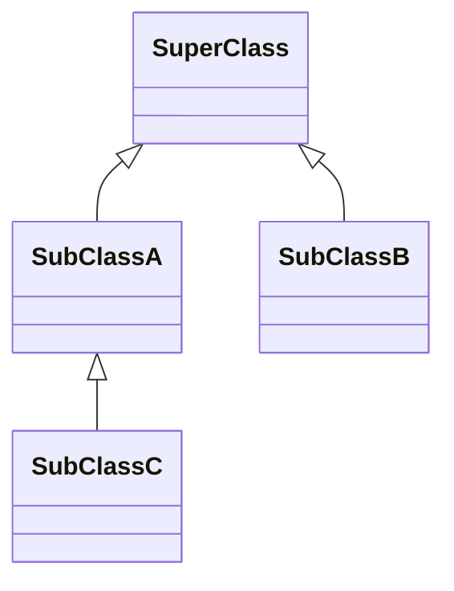
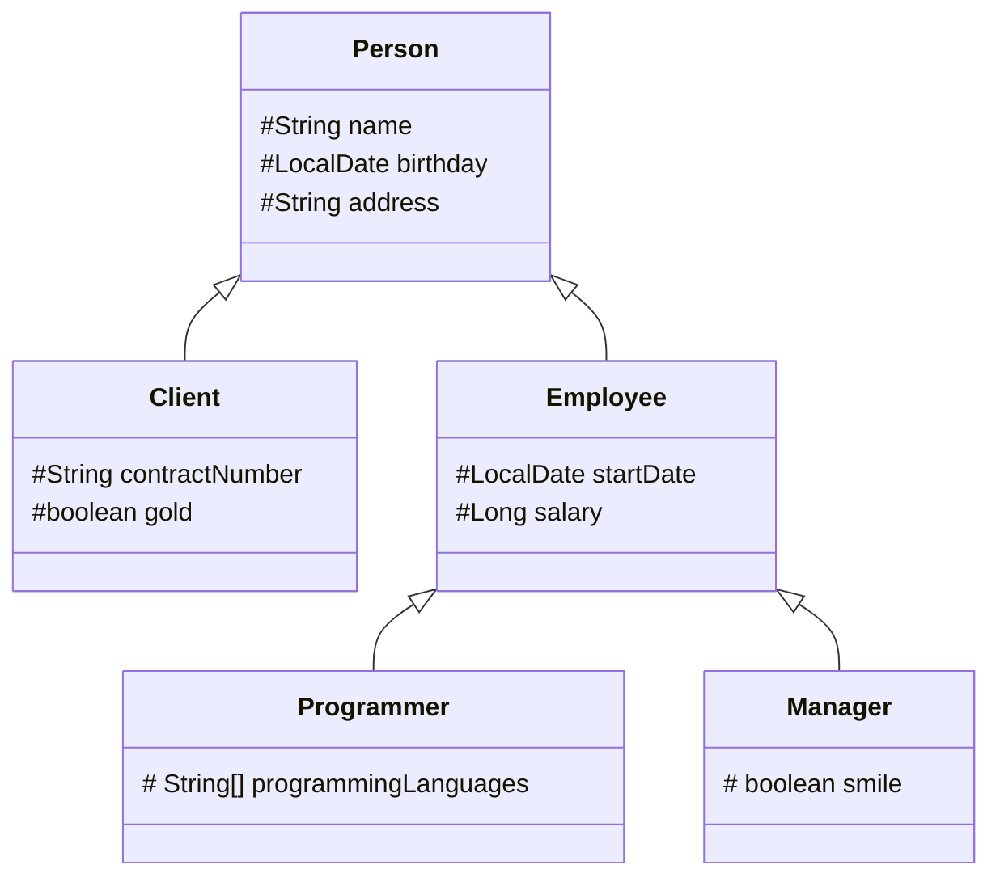

# Java Classes (Inheritance + Polymorphism)

## Inheritance

**Inheritance** is a mechanism for deriving a new class from another class. It allows developers to build convenient class hierarchies and reuse existing code. **Inheritance** represents the **IS-A** relationship.

**The new class acquires fields and methods of the base class (without the need of rewriting them).**


A class **derived** from another class is called:
* **subclass**
* **derived class**
* **extended class**
* **child class** 

The class from which the subclass is derived is called:
* **superclass**
* **base class**
* **parent class**

The following example represents a simple inheritance hierarchy:

1. **SuperClass** is the base (or parent) class.
2. **SubClassA** and **SubClassB** both inherit from **SuperClass**, meaning they are direct subclasses of it.
3. **SubClassC** inherits from **SubClassA**, making it a subclass of **SubClassA** and an indirect subclass of **SuperClass**.

```java
class SuperClass { }

class SubClassA extends SuperClass { }

class SubClassB extends SuperClass { }

class SubClassC extends SubClassA { }
```



There are important points about inheritance in Java:
- **No Multiple Inheritance**: Java does not support multiple inheritance for classes, meaning a class can inherit from only one superclass.

- **Multi-Level Inheritance**: A class can extend another class that itself extends a third class (e.g., class C extends class B, which extends class A).

- **Multiple Subclasses**: A single superclass can have multiple subclasses.

- **Inheritance of Members**:
    - A subclass inherits all **public** and **protected** fields and methods from its superclass.
    - A subclass can define new fields and methods, which can be used like the inherited ones.

- **Constructor Inheritance**:
    - Constructors are **not** inherited.
    - A subclass can invoke the constructor of its superclass using the `super` keyword.
- **Final Classes**: If a class is declared with the `final` keyword, it **cannot be extended** (cannot have subclasses).


### An example of a class hierarchy

* the base class `Person` has fields for storing common data: name, birthday, and address;
* the class `Client` has additional fields to store the contract number and status (gold or not);
* the class `Employee` stores the start date of work for the company and the salary;
* the class `Programmer` has an array of the programming languages a programmer uses;
* the class `Manager` may have a dazzling smile.




This hierarchy has three levels and five classes overall. **All fields are `protected`, which means they are always visible to subclasses, even if located in a different package**. Each class also has public getters and setters and an all-arguments constructor.

```java
import java.time.LocalDate;

public class Person {
  protected String name;
  protected LocalDate birthday;
  protected String address;

  public Person(String name, LocalDate birthday, String address) {
    this.name = name;
    this.birthday = birthday;
    this.address = address;
  }

  // getters and setters here
}
```

```java
public class Client extends Person {
    protected String contractNumber;
    protected boolean gold;

    public Client(String name, int yearOfBirth, String address, String contractNumber, boolean gold) {
        super(name, yearOfBirth, address);
        this.contractNumber = contractNumber;
        this.gold = gold;
    }

    // getters and setters here
}
```

```java
public class Employee extends Person {
    protected LocalDate startDate;
    protected Long salary;

    public Employee(String name, int yearOfBirth, String address, LocalDate startDate, Long salary) {
        super(name, yearOfBirth, address);
        this.startDate = startDate;
        this.salary = salary;
    }

    // getters and setters here
}
```

```java
public class Manager extends Employee {
    protected boolean smile;

    public Manager(String name, int yearOfBirth, String address, LocalDate startDate, Long salary, boolean smile) {
        super(name, yearOfBirth, address, startDate, salary);
        this.smile = smile;
    }

    // getters and setters here

}
```

```java
public class Programmer extends Employee {
    protected String[] programmingLanguages;

    public Programmer(String name, int yearOfBirth, String address, LocalDate startDate, Long salary, String[] programmingLanguages) {
        super(name, yearOfBirth, address, startDate, salary);
        this.programmingLanguages = programmingLanguages;
    }

    // getters and setters here
}
```


Let's create an object of the `Programmer` class and fill the inherited fields using the inherited setters. To read the values of the fields, we can use inherited getters.

```java
public class CompanyApp {
    public static void main(String[] args) {
        Programmer john = new Programmer(
                "John Elephant",
                1985,
                "Some street 15",
                LocalDate.of(2023, 15, 6),
                500_000L,
                new String[] { "Java", "Scala", "Kotlin" });
    }
}
```

### How to refer to a subclass object

**Subclass reference**

```java
Person person = new Person(); // the reference is Person, the object is Person
Client client = new Client(); // the reference is Client, the object is Client
Employee employee = new Employee(); // the reference is Employee, the object is Employee
```

**Superclass reference**

```java
Person client = new Client(); // the reference is Person, the object is Client
Person employee = new Employee(); // the reference is Person, the object is Employee
```

The basic rule goes like this: If class A is a superclass of class B and class B is a superclass of class C then a variable of class A can reference any object derived from that class (for instance, objects of the class B and the class C).

```java
Client whoIsIt = new Employee(); // compile-time error
Client client = new Person(); // compile-time error
```

### Accessing fields and methods through a superclass reference

**We can use a superclass reference for any subclass object derived from it. However, **we cannot access specific members of the subclass through the base class reference**. We have access only to those members of the object that are defined by the type of reference.**

```java
public static void main(String[] args) {
    Person employee = new Employee();

    employee.setName("Ginger R. Lee"); // Ok
    employee.setYearOfBirth(1980); // Ok
    employee.setSalary(30000); // Compile-time error, the base class "doesn't know" about the metho
}
```

The superclass `Person` doesn't have the method `setSalary` of the class `Employee`. You cannot invoke the method through the superclass reference. The same rule holds for fields.

### Casting between superclass and subclass

You can cast an object of a subclass to its superclass only if the object is an instance of this subclass, otherwise a `ClassCastException` will be thrown.

```java
Person person = new Client();

Client clientAgain = (Client) person; // it's ok
Employee employee = (Employee) person; // the ClassCastException occurs here
```

To avoid runtime errors, use `instanceof`:

```java
public static void main(String[] args) {
  Person person = new Client();
  if (person instanceof Client clientAgain) {
      // call Client methods here
  }
}
```

After successfully casting a superclass to a subclass, we can access subclass-specific members.

### When to use the superclass reference

When to use a superclass reference in practice? In general, when processing an array (or another collection) of objects which have different types from the same hierarchy.

```java
public static void showPersons(Person[] persons) {
    for (Person person : persons) {
        System.out.println(person.getName());
    }
}

public static void main(String[] args) {
    Person person = new Employee();
    person.setName("Ginger R. Lee");

    Client client = new Client();
    client.setName("Pauline E. Morgan");

    Employee employee = new Employee();
    employee.setName("Lawrence V. Jones");

    Person[] persons = {person, client, employee};
    
    showPersons(persons);
}
```

### Invoking superclass constructor

Constructors are not inherited by subclasses, but a superclass constructor can be invoked from a subclass using the keyword `super` **with parentheses**. We can also pass some arguments to the superclass constructor.

Two important points:
* Invoking `super(...)` must be the first statement in a subclass constructor, otherwise, the code cannot be compiled; 
* The default constructor of a subclass automatically calls the no-argument constructor of the superclass.


## The Object class
The Java Standard Library has a class named `Object` that is the default parent of all standard classes and your custom classes. Every class extends this one implicitly, therefore it's the root of inheritance in Java programs. 

```java
Object anObject = new Object();
```

The `Object` class can refer to an instance of any class because any instance is a kind of `Object` (*upcasting*).

```java
Long number = 1_000_000L;
Object obj1 = number; // an instance of Long can be cast to Object

String str = "str";
Object obj2 = str; // the same with an instance of String
```

When we declare a class, we can explicitly extend the `Object` class. However, there is no point, since the extension is already done implicitly. 

```java
class A extends Object { }
```

The `Object` class provides some common methods to all subclasses. It has nine instance methods (excluding overloaded methods) which can be divided into four groups:

* **object identity**: `hashCode`, `equals`;
* **human-readable representation**: `toString`;  
* **thread synchronization:** `wait`, `notify`, `notifyAll`;
* **object management**: `finalize`*, *`clone`*, *`getClass`*;*

### equals()
Object class defined equals() method like this:

```java
public boolean equals(Object obj) {
    return (this == obj);
}
```

According to the documentation of `equals()` method, any implementation should adhere to following principles.

* For any object x, `x.equals(x)` should return `true`.
* For any two object x and y, `x.equals(y)` should return `true` if and only if `y.equals(x)` returns `true`.
* For multiple objects x, y, and z, if `x.equals(y)` returns `true` and `y.equals(z)` returns `true`, then `x.equals(z)` should return `true`.
* Multiple invocations of `x.equals(y)` should return same result, unless any of the object properties is modified that is being used in the `equals()` method implementation.
* Object class equals() method implementation returns `true` only when both the references are pointing to same object.

Standard classes have to override it to enable comparison based on their internal state. Different implementations of the `equals` method enable different criteria to define when two objects are equal.

### hashCode()
Java Object `hashCode()` is a native method and returns the integer hash code value of the object. The general contract of `hashCode()` method is:

* Multiple invocations of `hashCode()` should return the same integer value, unless the object property is modified.
* An object hash code value can change in multiple executions of the same application.
* **If two objects are equal according to `equals()` method, then their hash code must be same**.
* If two objects are unequal according to `equals()` method, their hash code are not required to be different. Their hash code value may or may-not be equal.

In this example, two persons are considered equal if they have the same name, lastname, and birthday.

```java
public class Person {
    String name;
    String lastname;
    LocalDate birthDate;

    @Override
    public boolean equals(Object o) {
        if (this == o)
            return true;
        if (o == null || getClass() != o.getClass())
            return false;
        Person person = (Person) o;
        return Objects.equals(name, person.name) && Objects.equals(lastname, person.lastname) && Objects.equals(birthDate, person.birthDate);
    }
    
    @Override
    public int hashCode() {
        return Objects.hash(name, lastname, birthDate);
    }
}
```

Alternatively, here lastname, and birthday are considered sufficient equality.

```java
public class Person {
    String name;
    String lastname;
    LocalDate birthDate;

    @Override
    public boolean equals(Object o) {
        if (this == o)
            return true;
        if (o == null || getClass() != o.getClass())
            return false;
        Person person = (Person) o;
        return Objects.equals(lastname, person.lastname) && Objects.equals(birthDate, person.birthDate);
    }
    
    @Override
    public int hashCode() {
        return Objects.hash(lastname, birthDate);
    }
}
```

## Overriding methods
Java provides an opportunity to declare a method in a subclass with the same name as a method in the superclass. This is known as **method overriding**. The benefit of overriding is that a subclass can give its own specific implementation of a superclass method.

More specifically, instance methods can be overridden if they are inherited by the subclass. The overriding method must have the same name, parameters (number and type of parameters), and the return type (or a subclass of the type) as the overridden method.

```java
class Mammal {

    public String sayHello() {
        return "random stuff";
    }
}
```

```java
class Cat extends Mammal {

    @Override
    public String sayHello() {
        return "meow";
    }
}
```

```java
class Human extends Mammal {

    @Override
    public String sayHello() {
        return "hello";
    }
}
```

The hierarchy includes three classes: `Mammal`, `Cat` and `Human`. The class `Mammal` has the method `sayHello`. Each subclass overrides this method. The `@Override` annotation indicates that the method is overridden. This annotation is optional but helpful for improving readability.

Let's create instances and invoke the method.

```java
public static void main(String[] args) {
    Mammal mammal = new Mammal();
    System.out.println(mammal.sayHello()); // it prints "random stuff"

    Cat cat = new Cat();
    System.out.println(cat.sayHello()); // it prints "meow"

    Human human = new Human();
    System.out.println(human.sayHello()); // it prints "hello"
}
```

### Key Rules

There are several rules for methods of subclasses which should override methods of a superclass:

- the method must have the same name as in the superclass;
- the arguments should be exactly the same as in the superclass method;
- the return type should be the same type or a subtype of the return type declared in the method of the superclass;
- the access level must be the same or more open than the overridden method's access level;
- a private method cannot be overridden because it's not inherited by subclasses;
- static methods cannot be overridden.

### Forbidding overriding

If you'd like to forbid overriding of a method, declare it with the keyword `final`.

```java
public final void method() {
    // do something
}
```

Now, if you try to override this method in a subclass, a compile-time error will occur.

### Overriding static methods?

Static methods cannot be overridden. If a subclass has a static method with the same signature (name and parameters) as a static method in the superclass then the method in the subclass hides the one in the superclass. It's completely different from method overriding.

```java
class SuperClass {
    public static void staticMethod() {
        System.out.println("super");
    }
}
```

```java
class SubClass extends SuperClass {
    public static void staticMethod() {
        System.out.println("sub");
    }
}
```

```java
class Main {
    public static void main(String[] args) {
        SuperClass.staticMethod();          // it prints "super"
        new SuperClass().staticMethod();    // it prints "super"
        SubClass.staticMethod();            // it prints "sub"
        new SubClass().staticMethod();      // it prints "sub"

        SuperClass ss = new SubClass();
        ss.staticMethod();                  // it prints "super", because static method belongs to a class, not to an instance
    }
}
```

## Polymorphism

In general, **polymorphism** means that something (an object or another entity) has many forms.

Java provides three types of polymorphism:
* **Static (compile-time) polymorphism** refers to polymorphic functions that can be applied to arguments of different types, but behave differently depending on the type of the argument to which they are applied. Java supports it as **method overloading**.
* **Dynamic (run-time) polymorphism** is the possibility to use an instance of a subclass (and its methods) based on the object type used at run-time instead of the object type declared by the programmer (often the base class type). Java supports it as **method overriding**.
* **Parametric polymorphism** is when the code is written without mention of any specific type and thus can be used transparently with any number of new types. Java supports it as **generics** or **generic programming**.

### Static polymorphism

```java
class Mammal {
    public String sayHello() {
        return "hi, i'm a mammal";
    }

    public String sayHello(int count) {
        return "hi, i'm a mammal".repeat(Math.max(0, count));
    }
}
```

```java
public static void main(String[] args) {
    Mammal m = new Mammal();
        
    // prints "hi, i'm a mammal" 1 time
    System.out.println(m.sayHello());
    
    // prints "hi, i'm a mammal" 12 times
    System.out.println(m.sayHello(12));
}
```

### Dynamic polymorphism

Dynamic polymorphism works when an overridden method is called through the reference variable of a superclass. Java determines at runtime which version of the method (superclass/subclasses) is to be executed based on the type of the object being referred, **not the type of reference**.

```java
class Mammal {

    public String sayHello() {
        return "hi, i'm a mammal";
    }
}
```

```java
class Cat extends Mammal {

    @Override
    public String sayHello() {
        return "meow";
    }
}
```

```java
class Human extends Mammal {

    @Override
    public String sayHello() {
        return "hello";
    }
}
```

```java
public static void main(String[] args) {
  Mammal[] mammals = new Mammal[]{new Mammal(), new Cat(), new Human()};
    for (Mammal mammal : mammals) {
        System.out.println(mammal.sayHello());
    }
}
```

Will print:

```text
hi, i'm a mammal
meow
hello
```

## References
* https://www.programiz.com/java-programming/inheritance
* https://www.programiz.com/java-programming/method-overriding
* https://www.programiz.com/java-programming/super-keyword
