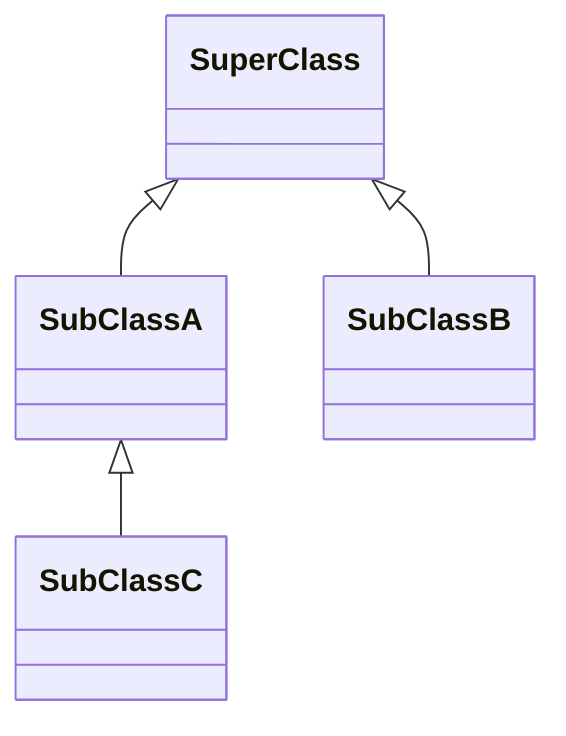
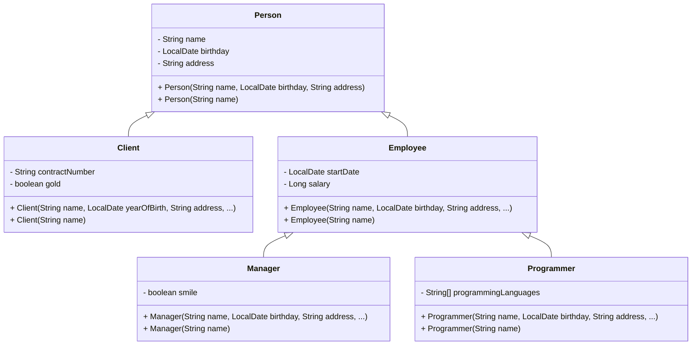

# Java Classes (Inheritance + Polymorphism)

## Inheritance

**Inheritance** is a mechanism for deriving a new class from another class. It allows developers to build convenient class hierarchies and reuse existing code. **Inheritance** represents the **IS-A** relationship.

**The new class acquires fields and methods of the base class (without the need of rewriting them).**


A class **derived** from another class is called:
* **subclass**
* **derived class**
* **extended class**
* **child class** 

The class from which the subclass is derived is called:
* **superclass**
* **base class**
* **parent class**

The following example represents a simple inheritance hierarchy:

1. **SuperClass** is the base (or parent) class.
2. **SubClassA** and **SubClassB** both inherit from **SuperClass**, meaning they are direct subclasses of it.
3. **SubClassC** inherits from **SubClassA**, making it a subclass of **SubClassA** and an indirect subclass of **SuperClass**.

```java
class SuperClass { }

class SubClassA extends SuperClass { }

class SubClassB extends SuperClass { }

class SubClassC extends SubClassA { }
```



There are important points about inheritance in Java:
- **Multi-Level Inheritance**: A class can extend another class that itself extends a third class (e.g., class C extends class B, which extends class A).

- **Only One Parent**: Java does not support multiple inheritance for classes, meaning a class can inherit from only one superclass.

- **Multiple Children**: A single superclass can have multiple subclasses.

- **Inheritance of Members**:
    - A subclass inherits all **public** and **protected** fields and methods from its superclass.
    - A subclass can define new fields and methods, which can be used like the inherited ones.

- **Constructor Inheritance**:
    - Constructors are **not** inherited.
    - A subclass can invoke the constructor of its superclass using the `super` keyword.
    - The default constructor of a subclass automatically calls the no-argument constructor of the superclass.

- **Final Classes**: If a class is declared with the `final` keyword, it **cannot be extended** (cannot have subclasses).

### An example of a class hierarchy

This example hierarchy has three levels and five classes overall. **All fields are `protected`, which means they are always visible to subclasses, even if located in a different package**. Each class also has public getters and setters and an all-arguments constructor.
* the base class `Person` has fields for storing common data: name, birthday, and address;
* the class `Client` has additional fields to store the contract number and status (gold or not);
* the class `Employee` stores the start date of work for the company and the salary;
* the class `Programmer` has an array of the programming languages a programmer uses;
* the class `Manager` may have a dazzling smile.




```java
import java.time.LocalDate;

public class Person {
  protected String name;
  protected LocalDate birthday;
  protected String address;

  public Person(String name, LocalDate birthday, String address) {
    this.name = name;
    this.birthday = birthday;
    this.address = address;
  }

  public Person(String name) {
    this(name, null, null);
  }

  // getters and setters here
}

```

```java
import java.time.LocalDate;

public class Client extends Person {
  protected String contractNumber;
  protected boolean gold;

  public Client(String name, LocalDate yearOfBirth, String address, String contractNumber, boolean gold) {
    super(name, yearOfBirth, address);
    this.contractNumber = contractNumber;
    this.gold = gold;
  }

  public Client(String name) {
    super(name);
  }

  // getters and setters here
}
```

```java
import java.time.LocalDate;

public class Employee extends Person {
  protected LocalDate startDate;
  protected Long salary;

  public Employee(String name, LocalDate birthday, String address, LocalDate startDate, Long salary) {
    super(name, birthday, address);
    this.startDate = startDate;
    this.salary = salary;
  }

  public Employee(String name) {
    super(name);
  }

  // getters and setters here
}
```

```java
import java.time.LocalDate;

public class Manager extends Employee {
  protected boolean smile;

  public Manager(String name, LocalDate birthday, String address, LocalDate startDate, Long salary, boolean smile) {
    super(name, birthday, address, startDate, salary);
    this.smile = smile;
  }

  public Manager(String name) {
    super(name);
  }

  // getters and setters here

}
```

```java
import java.time.LocalDate;

public class Programmer extends Employee {
  protected String[] programmingLanguages;

  public Programmer(String name, LocalDate birthday, String address, LocalDate startDate, Long salary, String[] programmingLanguages) {
    super(name, birthday, address, startDate, salary);
    this.programmingLanguages = programmingLanguages;
  }

  public Programmer(String name) {
    super(name);
  }

  // getters and setters here
}
```

Let's create an object of the `Programmer` class and get his name using a getter method inherited from the `Person` class.

```java
public class CompanyApp {
    public static void main(String[] args) {
      Programmer programmer1 = new Programmer(
              "John Elephant",
              LocalDate.of(2000, 6, 15),
              "Some street 15",
              LocalDate.of(2023, 6, 15),
              500_000L,
              new String[] { "Java", "Scala", "Kotlin" });

      // or...
      Programmer programmer2 = new Programmer("Henry McCarty");

      System.out.println(programmer1.getName()); // John Elephant
      System.out.println(programmer2.getName()); // Henry McCarty
    }
}
```

### Choosing references

The basic rule goes like this: If class A is a superclass of class B and class B is a superclass of class C then a reference of class A can be used with any object derived from that class (for instance, objects of the class B and the class C).

**Same class reference**

```java
Person person = new Person("John Doe"); // the reference is Person, the object is Person
Employee employee = new Employee("John Doe"); // the reference is Employee, the object is Employee
Programmer programmer = new Programmer("John Doe"); // the reference is Programmer, the object is Programmer
```

**Superclass reference**

```java
Person person = new Person("John Doe"); // the reference is Person, the object is Person
Person employee = new Employee("John Doe"); // the reference is Person, the object is Employee
Person programmer = new Programmer("John Doe"); // the reference is Person, the object is Programmer
```

**Wrong reference**

```java
Client whoIsIt = new Employee("John Doe"); // compile-time error
Client client = new Person("John Doe"); // compile-time error
```

### Upcast

**Upcast**: Assigning a subclass object to a superclass reference. **Safe and implicit**.  

In general, **upcast** is useful when working with arrays or other collections that contain objects of different types belonging to the same hierarchy.

```java
public static void showPersons(Person[] persons) {
    for (Person person : persons) {
        System.out.println(person.getName());
    }
}

public static void main(String[] args) {
    Person person = new Employee("Ginger R. Lee");
    Client client = new Client("Pauline E. Morgan");
    Employee employee = new Employee("Lawrence V. Jones");
    
    Person[] persons = {person, client, employee}; // automatic upcasting of three objects
    
    showPersons(persons);
}
```

**We can use a superclass reference for any subclass object derived from it. However, **we cannot access specific members of the subclass through the base class reference**. We have access only to those members of the object that are defined by the type of reference.**

```java
public static void showPersons(Person[] persons) {
  for (Person person : persons) {
    System.out.println(person.getName()); // ok, all persons have a name
    System.out.printf(person.getSalary()); // does not compile, Person class do not have getSalary()
  }
}
```


### Downcast

**Downcast**: Assigning a superclass reference (that actually refers to a subclass object) to a subclass reference. **Needs an explicit cast and can throw `ClassCastException` at runtime if incorrect**.

```java
public static void showPersons(Person[] persons) {
  for (Person person : persons) {
      System.out.println(person.getName()); // ok, all persons have a name
      Employee employee = (Employee) person; // downcast, possible ClassCastException at runtime
      System.out.printf(employee.getSalary());
  }
}
```

When dealing with references of a generic type, it is often necessary to determine the actual type of the object they point to. In Java, this can be done using the `instanceof` operator, which allows us to check at runtime whether an object belongs to a specific class or subclass. This is particularly useful when working with collections of heterogeneous objects from the same hierarchy, where different processing may be required depending on the concrete type.

```java
public static void showPersons(Person[] persons) {
  for (Person person : persons) {
    System.out.println(person.getName()); // ok, all persons have a name
    if (person instanceof Employee) { // verify is downcast is possible
        Employee employee = (Employee) person; // downcast
        System.out.println(employee.getSalary());
    }
  }
}
```

After successfully casting a superclass to a subclass, we can access subclass-specific members.

## The Object class
The Java Standard Library has a class named `Object` that is the default parent of all standard classes and your custom classes. Every class extends this one implicitly, therefore it's the root of inheritance in Java programs. 

```java
Object anObject = new Object();
```

The `Object` class can refer to an instance of any class because any instance is a kind of `Object` (*upcasting*).

```java
Long number = 1_000_000L;
Object obj1 = number; // an instance of Long can be cast to Object

String str = "str";
Object obj2 = str; // the same with an instance of String
```

When we declare a class, we can explicitly extend the `Object` class. However, there is no point, since the extension is already done implicitly. 

```java
class A extends Object { }
```

The `Object` class provides some common methods to all subclasses. It has nine instance methods (excluding overloaded methods) which can be divided into four groups:

* **object identity**: `hashCode`, `equals`;
* **human-readable representation**: `toString`;  
* **thread synchronization:** `wait`, `notify`, `notifyAll`;
* **object management**: `finalize`*, *`clone`*, *`getClass`*;*

### equals()
Java Object `equals()` is a method used to compare two objects for equality. 

```java
// Example: equals() not overridden
class Person {
  String name;

  Person(String name) {
    this.name = name;
  }
}

public class EqualsFailExample {
  public static void main(String[] args) {
    Person p1 = new Person("Alice");
    Person p2 = new Person("Alice");

    // Default Object.equals() compares references
    System.out.println(p1.equals(p2)); // false, different instances
  }
}
```

**Explanation:** `p1` and `p2` have the same name, but `equals()` in `Object` only checks if `p1` and `p2` are the **same object in memory**. Without overriding `equals()`, objects with identical fields will not be considered equal.

```java
// Example 2: Using equals() with custom objects
class Person {
    String name;
    
    Person(String name) {
        this.name = name;
    }

    // Overriding equals() to compare names
    @Override
    public boolean equals(Object obj) {
        if (this == obj) return true;
        if (obj == null || getClass() != obj.getClass()) return false;
        Person other = (Person) obj;
        return name.equals(other.name);
    }
}

public class EqualsExample {
    public static void main(String[] args) {
        Person p1 = new Person("Alice");
        Person p2 = new Person("Alice");
        Person p3 = new Person("Bob");

        System.out.println(p1.equals(p2)); // true, same name
        System.out.println(p1.equals(p3)); // false, different name
    }
}
```

The general contract of the `equals()` method is:

1. **Reflexive**: For any non-null reference value `x`, `x.equals(x)` must return `true`.
2. **Symmetric**: For any non-null reference values `x` and `y`, `x.equals(y)` must return `true` if and only if `y.equals(x)` returns `true`.
3. **Transitive**: For any non-null reference values `x`, `y`, and `z`, if `x.equals(y)` returns `true` and `y.equals(z)` returns `true`, then `x.equals(z)` must return `true`.
4. **Consistent**: For any non-null reference values `x` and `y`, repeated calls to `x.equals(y)` consistently return `true` or consistently return `false`, provided no information used in `equals` comparisons on the objects is modified.
5. **Non-nullity**: For any non-null reference value `x`, `x.equals(null)` must return `false`.


### hashCode()

Java Object `hashCode()` is a method that returns an integer value (the hash code) representing the object. It is used primarily in hash-based collections like `HashMap`, `HashSet`, and `Hashtable`. The general contract of `hashCode()` is closely related to `equals()`:

1. If two objects are equal according to `equals()`, they **must** have the same hash code.
2. If two objects are unequal according to `equals()`, they **may** have different hash codes (different hash codes are preferred for performance in hash-based collections).

```java
// Example: hashCode() not overridden
class Person {
    String name;

    Person(String name) {
        this.name = name;
    }
}

public class HashCodeFailExample {
    public static void main(String[] args) {
        Person p1 = new Person("Alice");
        Person p2 = new Person("Alice");

        // Default Object.hashCode() uses memory address
        System.out.println(p1.hashCode()); // e.g., 12345678
        System.out.println(p2.hashCode()); // e.g., 87654321 (different!)
    }
}
```

**Explanation:** The default implementation of `hashCode()` in `Object` typically uses the object's memory address. Even if `p1` and `p2` have identical fields, their hash codes are different unless `hashCode()` is overridden.

```java
// Example 2: Overriding hashCode() for custom objects
class Person {
    String name;

    Person(String name) {
        this.name = name;
    }

    @Override
    public boolean equals(Object obj) {
        if (this == obj) return true;
        if (obj == null || getClass() != obj.getClass()) return false;
        Person other = (Person) obj;
        return name.equals(other.name);
    }

    @Override
    public int hashCode() {
        return name.hashCode(); // Hash code based on the name field
    }
}

public class HashCodeExample {
    public static void main(String[] args) {
        Person p1 = new Person("Alice");
        Person p2 = new Person("Alice");
        Person p3 = new Person("Bob");

        System.out.println(p1.hashCode() == p2.hashCode()); // true, same name
        System.out.println(p1.hashCode() == p3.hashCode()); // false, different name
    }
}
```

**Key points:**

* `hashCode()` and `equals()` must be consistent:
  If `a.equals(b)` is `true`, then `a.hashCode() == b.hashCode()` must also be `true`.
* Using `hashCode()` correctly ensures objects work properly in hash-based collections.
* Default `hashCode()` considers the object's memory location. Overriding allows defining hash codes based on significant attributes (like `name` in the example).


## Overriding methods
Java provides an opportunity to declare a method in a subclass with the same name as a method in the superclass. This is known as **method overriding**. The benefit of overriding is that a subclass can give its own specific implementation of a superclass method.

The overriding method must have the same:
- name;
- parameters;
- return type (or a subclass);

```java
class Mammal {

    public String sayHello() {
        return "random stuff";
    }
}
```

```java
class Cat extends Mammal {

    @Override
    public String sayHello() {
        return "meow";
    }
}
```

```java
class Human extends Mammal {

    @Override
    public String sayHello() {
        return "hello";
    }
}
```

The hierarchy includes three classes: `Mammal`, `Cat` and `Human`. The class `Mammal` has the method `sayHello`. Each subclass overrides this method. The `@Override` annotation indicates that the method is overridden. This annotation is optional but helpful for improving readability.

Let's create instances and invoke the method.

```java
public static void main(String[] args) {
    Mammal mammal = new Mammal();
    System.out.println(mammal.sayHello()); // it prints "random stuff"

    Cat cat = new Cat();
    System.out.println(cat.sayHello()); // it prints "meow"

    Human human = new Human();
    System.out.println(human.sayHello()); // it prints "hello"
}
```


### Forbidding overriding

If you'd like to forbid overriding of a method, declare it with the keyword `final`.

```java
public final void method() {
    // do something
}
```

### Overriding static methods?

Static methods cannot be overridden. If a subclass has a static method with the same signature (name and parameters) as a static method in the superclass then the method in the subclass hides the one in the superclass. It's completely different from method overriding.

```java
class SuperClass {
    public static void staticMethod() {
        System.out.println("super");
    }
}
```

```java
class SubClass extends SuperClass {
    public static void staticMethod() {
        System.out.println("sub");
    }
}
```

```java
class Main {
    public static void main(String[] args) {
        SuperClass.staticMethod();          // it prints "super"
        new SuperClass().staticMethod();    // it prints "super"
        SubClass.staticMethod();            // it prints "sub"
        new SubClass().staticMethod();      // it prints "sub"

        SuperClass ss = new SubClass();
        ss.staticMethod();                  // it prints "super", because static method belongs to a class, not to an instance
    }
}
```

## Polymorphism

**Polymorphism** is a fundamental concept in object-oriented programming that allows objects to be treated as instances of their parent class while behaving according to their actual subclass type. It enables flexibility and code reuse by allowing the same interface to represent different underlying forms. Polymorphism can be **static (compile-time)**, achieved through method overloading, or **dynamic (run-time)**, achieved through method overriding.


### Static polymorphism

**Static (compile-time) polymorphism** is the ability of a function to operate on arguments of different types while exhibiting behavior specific to each type. In Java, this is achieved through **method overloading**.


```java
class Mammal {
    public static void main(String[] args) {
        Mammal m = new Mammal();

        // prints "hi, i'm a mammal" 1 time
        System.out.println(m.sayHello());

        // prints "hi, i'm a mammal" 12 times
        System.out.println(m.sayHello(12));

        // prints "hi Gemma, i'm a mammal"
        System.out.println(m.sayHello("Gemma"));

        // prints "lammam a m'i ,ih"
        System.out.println(m.sayHello(true));

        // prints "hi, i'm a mammal"
        System.out.println(m.sayHello(false));
    }

    public String sayHello() {
        return "hi, i'm a mammal";
    }

    public String sayHello(int count) {
        return "hi, i'm a mammal".repeat(Math.max(0, count));
    }

    public String sayHello(String name) {
        return "hi " + name + ", i'm a mammal";
    }

    public String sayHello(boolean reverse) {
        return reverse ? "lammam a m'i ,ih" : "hi, i'm a mammal";
    }
}


```

### Dynamic polymorphism

**Dynamic (run-time) polymorphism** allows a program to invoke methods on an object based on its actual runtime type rather than the type declared by the programmer (often a superclass). In Java, this is implemented through **method overriding**.


```java
class Mammal {

    public String sayHello() {
        return "hi, i'm a mammal";
    }
}
```

```java
class Cat extends Mammal {

    @Override
    public String sayHello() {
        return "meow";
    }
}
```

```java
class Human extends Mammal {

    @Override
    public String sayHello() {
        return "hello";
    }
}
```

```java
public static void main(String[] args) {
  Mammal[] mammals = new Mammal[]{new Mammal(), new Cat(), new Human()};
    for (Mammal mammal : mammals) {
        System.out.println(mammal.sayHello());
    }
}
```

Will print:

```text
hi, i'm a mammal
meow
hello
```

### Consequences of Dynamic Polymorphism

1. **Flexibility & Extensibility**

  * Dynamic polymorphism allows subclasses to provide specialized behavior for methods defined in a superclass. This means new subclasses can be added to a system without changing the existing code that uses the superclass.
  * Example: If you have a `Mammal` class and a method `sayHello()`, you can add subclasses like `Dog` or `Elephant` with their own `sayHello()` implementation, and existing code that works with `Mammal` objects will automatically handle the new subclasses correctly.
  * This promotes a **plug-and-play style of development**, making it easier to extend functionality over time and support future requirements without breaking existing functionality.

2. **Abstraction & Decoupling**

  * Polymorphism encourages programming to an abstract type (superclass or interface) rather than a concrete implementation. This reduces the coupling between different parts of a system.
  * Example: You can define a `List<Mammal>` and store any subclass instances (`Cat`, `Human`, `Dog`) without needing to know their concrete types. The code interacts with the abstract `Mammal` type, which makes it **easier to swap or extend implementations**.
  * This approach improves maintainability and makes unit testing easier, since components can be tested independently using abstract references or mocks.


## References
* https://www.programiz.com/java-programming/inheritance
* https://www.programiz.com/java-programming/method-overriding
* https://www.programiz.com/java-programming/super-keyword
