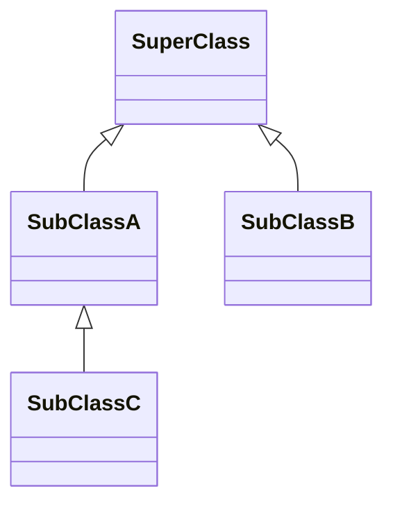
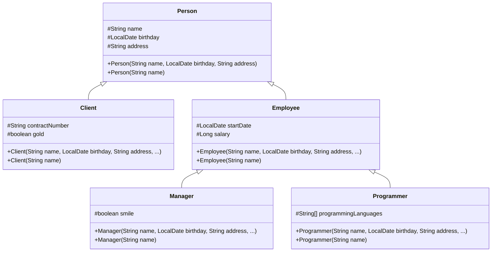

# Java Classes (Inheritance + Polymorphism)

## Inheritance

**Inheritance** is a mechanism for deriving a new class from another class. It allows developers to build class hierarchies and reuse existing code. Inheritance represents an **IS-A** relationship.

A subclass can reuse accessible members of its superclass and can define additional fields and methods or override inherited methods.

A class **derived** from another class is called:

* **subclass**
* **derived class**
* **child class**

The class from which the subclass is derived is called:

* **superclass**
* **base class**
* **parent class**

The following example represents a simple inheritance hierarchy:

1. **SuperClass** is the base (or parent) class.
2. **SubClassA** and **SubClassB** both inherit from **SuperClass**, meaning they are direct subclasses of it.
3. **SubClassC** inherits from **SubClassA**, making it a subclass of **SubClassA** and an indirect subclass of **SuperClass**.

```java
class SuperClass { }

class SubClassA extends SuperClass { }

class SubClassB extends SuperClass { }

class SubClassC extends SubClassA { }
```


```mermaid
classDiagram
  class SuperClass { }
  class SubClassA { }
  class SubClassB { }
  class SubClassC { }

  SuperClass <|-- SubClassA
  SuperClass <|-- SubClassB
  SubClassA <|-- SubClassC
```

There are important points about inheritance in Java:

* **Multi-Level Inheritance**: A class can extend another class that itself extends a third class (e.g., `C extends B`, where `B extends A`).

* **Single Inheritance for Classes**: Java does not support multiple inheritance for classes. A class can directly extend only one superclass.

* **Multiple Children**: A single superclass can have multiple subclasses.

* **Inheritance of Members**:

  * A subclass inherits accessible members of its superclass.
  * `public` and `protected` members are accessible from the subclass according to Java's access rules.
  * Package-private members are accessible only when the subclass is in the same package.
  * `private` members are not directly accessible from the subclass.
  * A subclass can define new fields and methods in addition to the inherited ones.

* **Constructor Inheritance**:

  * Constructors are **not inherited**.
  * A subclass can invoke a superclass constructor using the `super(...)` constructor invocation.
  * If a constructor does not explicitly invoke another constructor of the same class using `this(...)`, it implicitly invokes `super()` as its first action.
  * Therefore, the superclass must have an accessible no-argument constructor unless the subclass explicitly invokes another accessible superclass constructor.

* **Final Classes**: If a class is declared with the `final` keyword, it **cannot be extended**.

### An example of a class hierarchy

Each class also has public getters and setters and an all-arguments constructor.

* the base class `Person` has fields for storing common data: name, birthday, and address;
* the class `Client` has additional fields to store the contract number and status (gold or not);
* the class `Employee` stores the start date of work for the company and the salary;
* the class `Programmer` has an array of the programming languages a programmer uses;
* the class `Manager` has a boolean field representing whether the manager has a smile.

**The fields are `protected`, which allows direct access from subclasses and from classes in the same package. For a subclass in a different package, `protected` access is more restricted: the inherited member can be accessed through the subclass relationship, not through an arbitrary superclass reference.**

In UML (Unified Modeling Language):

* `+` → **public**
* `-` → **private**
* `#` → **protected**
* `~` → **package** or **default**


```mermaid
classDiagram
  class Person {
    #String name
    #LocalDate birthday
    #String address
    +Person(String name, LocalDate birthday, String address)
    +Person(String name)
  }

  class Client {
    #String contractNumber
    #boolean gold
    +Client(String name, LocalDate birthday, String address, ...)
    +Client(String name)
  }

  class Employee {
    #LocalDate startDate
    #Long salary
    +Employee(String name, LocalDate birthday, String address, ...)
    +Employee(String name)
  }

  class Manager {
    #boolean smile
    +Manager(String name, LocalDate birthday, String address, ...)
    +Manager(String name)
  }

  class Programmer {
    #String[] programmingLanguages
    +Programmer(String name, LocalDate birthday, String address, ...)
    +Programmer(String name)
  }

  Person <|-- Client
  Person <|-- Employee
  Employee <|-- Manager
  Employee <|-- Programmer
```

```java
import java.time.LocalDate;

public class Person {
  protected String name;
  protected LocalDate birthday;
  protected String address;

  public Person(String name, LocalDate birthday, String address) {
    this.name = name;
    this.birthday = birthday;
    this.address = address;
  }

  public Person(String name) {
    this(name, null, null);
  }

  // getters and setters here
}
```

```java
import java.time.LocalDate;

public class Client extends Person {
  protected String contractNumber;
  protected boolean gold;

  public Client(
          String name,
          LocalDate birthday,
          String address,
          String contractNumber,
          boolean gold) {

    super(name, birthday, address);
    this.contractNumber = contractNumber;
    this.gold = gold;
  }

  public Client(String name) {
    super(name);
  }

  // getters and setters here
}
```

```java
import java.time.LocalDate;

public class Employee extends Person {
  protected LocalDate startDate;
  protected Long salary;

  public Employee(
          String name,
          LocalDate birthday,
          String address,
          LocalDate startDate,
          Long salary) {

    super(name, birthday, address);
    this.startDate = startDate;
    this.salary = salary;
  }

  public Employee(String name) {
    super(name);
  }

  // getters and setters here
}
```

```java
import java.time.LocalDate;

public class Manager extends Employee {
  protected boolean smile;

  public Manager(
          String name,
          LocalDate birthday,
          String address,
          LocalDate startDate,
          Long salary,
          boolean smile) {

    super(name, birthday, address, startDate, salary);
    this.smile = smile;
  }

  public Manager(String name) {
    super(name);
  }

  // getters and setters here
}
```

```java
import java.time.LocalDate;

public class Programmer extends Employee {
  protected String[] programmingLanguages;

  public Programmer(
          String name,
          LocalDate birthday,
          String address,
          LocalDate startDate,
          Long salary,
          String[] programmingLanguages) {

    super(name, birthday, address, startDate, salary);
    this.programmingLanguages = programmingLanguages;
  }

  public Programmer(String name) {
    super(name);
  }

  // getters and setters here
}
```

Let's create an object of the `Programmer` class and get its name using a getter method inherited from the `Person` class.

```java
import java.time.LocalDate;

public class CompanyApp {
  public static void main(String[] args) {
    Programmer programmer1 = new Programmer(
            "John Elephant",
            LocalDate.of(2000, 6, 15),
            "Some street 15",
            LocalDate.of(2023, 6, 15),
            500_000L,
            new String[] { "Java", "Scala", "Kotlin" });

    // or...
    Programmer programmer2 = new Programmer("Henry McCarty");

    System.out.println(programmer1.getName()); // John Elephant
    System.out.println(programmer2.getName()); // Henry McCarty
  }
}
```

### Choosing references

The basic rule is:

> If class `A` is a superclass of class `B`, then a reference of type `A` can refer to an object whose type is `B` or any subclass of `B`.

For example, because `Programmer` extends `Employee` and `Employee` extends `Person`, a `Person` reference can refer to a `Programmer` object.

**Same class reference**

```java
Person person = new Person("John Doe");
// reference type: Person
// object type:    Person

Employee employee = new Employee("John Doe");
// reference type: Employee
// object type:    Employee

Programmer programmer = new Programmer("John Doe");
// reference type: Programmer
// object type:    Programmer
```

**Superclass reference**

```java
Person person = new Person("John Doe");
// reference type: Person
// object type:    Person

Person employee = new Employee("John Doe");
// reference type: Person
// object type:    Employee

Person programmer = new Programmer("John Doe");
// reference type: Person
// object type:    Programmer
```

**Wrong reference**

```java
Client whoIsIt = new Employee("John Doe"); // compile-time error
Client client = new Person("John Doe");    // compile-time error
```

The reason is that an `Employee` is not necessarily a `Client`, and a `Person` is not necessarily a `Client`.

### Upcast

**Upcasting** means assigning a subclass object to a superclass reference.

It is safe and performed **implicitly** by Java.

Upcasting is particularly useful when working with collections or arrays containing objects of different types belonging to the same hierarchy.

```java
public static void showPersons(Person[] persons) {
  for (Person person : persons) {
    System.out.println(person.getName());
  }
}

public static void main(String[] args) {
  Person person = new Employee("Ginger R. Lee");
  Client client = new Client("Pauline E. Morgan");
  Employee employee = new Employee("Lawrence V. Jones");

  Person[] persons = { person, client, employee };
  // automatic upcasting of the elements

  showPersons(persons);
}
```

We can use a superclass reference for any subclass object derived from it.

However, **the reference type determines which members can be accessed at compile time**.

```java
public static void showPersons(Person[] persons) {
  for (Person person : persons) {
    System.out.println(person.getName()); // OK

    // System.out.println(person.getSalary());
    // Does not compile: Person does not declare getSalary()
  }
}
```

The object may actually be an `Employee`, but the compiler only knows that `person` has type `Person`.

This distinction between the **reference type** and the **actual object type** is fundamental to understanding polymorphism.

### Downcast

**Downcasting** means converting a superclass reference to a subclass reference.

It requires an explicit cast and can throw a `ClassCastException` at runtime if the object is not actually an instance of the target subclass.

```java
public static void showPersons(Person[] persons) {
  for (Person person : persons) {
    System.out.println(person.getName());

    Employee employee = (Employee) person;
    System.out.println(employee.getSalary());
  }
}
```

The cast is valid only when `person` actually refers to an `Employee` object or to an object of a subclass of `Employee`.

For example, the following array would cause a `ClassCastException` when `client` is processed:

```java
Person[] persons = {
        new Employee("Alice"),
        new Client("Bob")
};
```

A safer approach is to use the `instanceof` operator.

```java
public static void showPersons(Person[] persons) {
  for (Person person : persons) {
    System.out.println(person.getName());

    if (person instanceof Employee) {
      Employee employee = (Employee) person;
      System.out.println(employee.getSalary());
    }
  }
}
```

The `instanceof` operator checks at runtime whether an object is compatible with a given type.

Modern Java also provides **pattern matching for `instanceof`**, which can combine the type check and cast:

```java
if (person instanceof Employee employee) {
        System.out.println(employee.getSalary());
        }
```

After successfully casting a superclass reference to a subclass type, we can access subclass-specific members.

## The Object class

The Java Standard Library provides a class named `Object`, which is the root of the Java class hierarchy.

Every class that does not explicitly extend another class implicitly extends `Object`.

For example:

```java
class A { }
```

is effectively a subclass of `Object`.

We can also explicitly write:

```java
class A extends Object { }
```

but this is unnecessary.

The `Object` class can refer to an instance of any class because every class ultimately extends `Object`.

```java
Object anObject = new Object();
```

For example:

```java
Long number = 1_000_000L;
Object obj1 = number;

String str = "str";
Object obj2 = str;
```

These assignments are examples of **upcasting**.

The `Object` class provides methods that are inherited by all classes, including:

* **object identity and equality**: `equals()`, `hashCode()`;
* **string representation**: `toString()`;
* **runtime type information**: `getClass()`;
* **thread coordination**: `wait()`, `notify()`, `notifyAll()`;
* **object copying**: `clone()` is a protected method of `Object` and has special rules.

> **NOTE:** `finalize()` should not be used. It has been deprecated since Java 9 and was removed from the Java SE API in Java 18. Modern Java applications should use explicit resource-management mechanisms such as `try-with-resources` instead.

### equals()

`equals()` is a method defined by `Object` and is used to determine whether two objects are considered equal.

The default implementation inherited from `Object` compares object identity. Therefore, two different objects are not equal unless a subclass overrides `equals()` with a different definition.

```java
// Example: equals() not overridden

class Person {
  String name;

  Person(String name) {
    this.name = name;
  }
}

public class EqualsFailExample {
  public static void main(String[] args) {
    Person p1 = new Person("Alice");
    Person p2 = new Person("Alice");

    // Object.equals() uses object identity
    System.out.println(p1.equals(p2)); // false
  }
}
```

**Explanation:** `p1` and `p2` have the same name, but they are two different `Person` objects. Since `Person` does not override `equals()`, the implementation inherited from `Object` considers them unequal.

To define logical equality, we can override `equals()`:

```java
// Example 2: Using equals() with custom objects

class Person {
  String name;

  Person(String name) {
    this.name = name;
  }

  // Overriding equals() to compare names
  @Override
  public boolean equals(Object obj) {
    if (this == obj) return true;
    if (obj == null || getClass() != obj.getClass()) return false;

    Person other = (Person) obj;
    return name.equals(other.name);
  }
}

public class EqualsExample {
  public static void main(String[] args) {
    Person p1 = new Person("Alice");
    Person p2 = new Person("Alice");
    Person p3 = new Person("Bob");

    System.out.println(p1.equals(p2)); // true
    System.out.println(p1.equals(p3)); // false
  }
}
```

The general contract of `equals()` is:

1. **Reflexive**: for any non-null reference `x`, `x.equals(x)` must return `true`.
2. **Symmetric**: for any non-null references `x` and `y`, `x.equals(y)` must return `true` if and only if `y.equals(x)` returns `true`.
3. **Transitive**: for any non-null references `x`, `y`, and `z`, if `x.equals(y)` is `true` and `y.equals(z)` is `true`, then `x.equals(z)` must also be `true`.
4. **Consistent**: repeated calls to `x.equals(y)` should consistently return the same result as long as no information used by the comparison changes.
5. **Non-nullity**: for any non-null reference `x`, `x.equals(null)` must return `false`.

> **NOTE:** Whenever `equals()` is overridden, `hashCode()` should also be overridden so that equal objects have equal hash codes.

### hashCode()

`hashCode()` is a method defined by `Object` that returns an `int`.

It is used primarily by hash-based collections such as `HashMap` and `HashSet`.

The most important rule of the `hashCode()` contract is:

> If two objects are equal according to `equals()`, they **must** have the same hash code.

The reverse is not required:

> Two objects with the same hash code do **not** have to be equal.

Different objects can therefore have the same hash code. This is called a **hash collision**.

```java
// Example: hashCode() not overridden

class Person {
  String name;

  Person(String name) {
    this.name = name;
  }
}

public class HashCodeFailExample {
  public static void main(String[] args) {
    Person p1 = new Person("Alice");
    Person p2 = new Person("Alice");

    System.out.println(p1.hashCode());
    System.out.println(p2.hashCode());
  }
}
```

The two values may be different because `Person` does not override `hashCode()`.

> **NOTE:** The default `Object.hashCode()` is not specified as a memory address. Its implementation is JVM-dependent. Therefore, it is better not to describe the default hash code as a memory address.

If `equals()` is overridden, `hashCode()` should be overridden consistently:

```java
import java.util.Objects;

// Example 2: Overriding hashCode() for custom objects

class Person {
  String name;

  Person(String name) {
    this.name = name;
  }

  @Override
  public boolean equals(Object obj) {
    if (this == obj) return true;
    if (obj == null || getClass() != obj.getClass()) return false;

    Person other = (Person) obj;
    return Objects.equals(name, other.name);
  }

  @Override
  public int hashCode() {
    return Objects.hash(name);
  }
}

public class HashCodeExample {
  public static void main(String[] args) {
    Person p1 = new Person("Alice");
    Person p2 = new Person("Alice");
    Person p3 = new Person("Bob");

    System.out.println(p1.hashCode() == p2.hashCode()); // true
    System.out.println(p1.hashCode() == p3.hashCode()); // typically true
    // Different objects are allowed to have the same hash code.
  }
}
```

The last comparison should **not** be assumed to be `false`: unequal objects may have the same hash code because hash collisions are possible.

### equals() and hashCode() consistency problem

Consider the following incorrect implementation:

```java
import java.util.Objects;
import java.util.HashSet;

class Person {

  private int id;
  private String name;

  public Person(int id, String name) {
    this.id = id;
    this.name = name;
  }

  // Two persons are equal if they have the same id
  @Override
  public boolean equals(Object o) {
    if (this == o) return true;
    if (!(o instanceof Person)) return false;

    Person p = (Person) o;
    return id == p.id;
  }

  // WRONG: hashCode uses an extra field (name)
  @Override
  public int hashCode() {
    return Objects.hash(id, name);
  }
}
```

```java
public class Test {

  public static void main(String[] args) {

    Person p1 = new Person(1, "Alice");
    Person p2 = new Person(1, "Bob");

    System.out.println(p1.equals(p2)); // true

    HashSet<Person> set = new HashSet<>();
    set.add(p1);
    set.add(p2);

    System.out.println(set.size()); // 2 (unexpected)
  }
}
```

**Explanation**

* `equals()` says that **p1 and p2 are equal** because they have the same `id`.
* `hashCode()` uses both `id` and `name`, so the two objects can produce different hash codes.
* A `HashSet` uses the hash code to determine where an object should be stored.
* If equal objects have different hash codes, they may be placed in different hash buckets, so the set can fail to recognize them as equal.

The correct implementation must use the **same equality-significant state** in both methods:

```java
@Override
public int hashCode() {
  return Integer.hashCode(id);
}
```

## Overriding methods

Java allows a subclass to provide a new implementation of an **instance method** inherited from its superclass. This is known as **method overriding**.

Method overriding allows a subclass to provide behavior that is more specific to that subclass.

For an instance method to override a superclass method, it must have:

* the same method name;
* the same parameter types;
* a compatible return type (the same type or a **covariant return type**);
* an access level that is not more restrictive than the overridden method.

The overriding method must also satisfy Java's other rules for overriding, including restrictions involving `final`, `static`, and private methods.

```java
class Mammal {

  public String sayHello() {
    return "random stuff";
  }
}
```

```java
class Cat extends Mammal {

  @Override
  public String sayHello() {
    return "meow";
  }
}
```

```java
class Human extends Mammal {

  @Override
  public String sayHello() {
    return "hello";
  }
}
```

The hierarchy includes three classes: `Mammal`, `Cat`, and `Human`.

The class `Mammal` declares the method `sayHello()`. Each subclass overrides this method.

The `@Override` annotation indicates that a method is intended to override a superclass method. The annotation is optional, but strongly recommended because the compiler can detect accidental mistakes.

Let's create instances and invoke the method:

```java
public static void main(String[] args) {
  Mammal mammal = new Mammal();
  System.out.println(mammal.sayHello()); // random stuff

  Cat cat = new Cat();
  System.out.println(cat.sayHello()); // meow

  Human human = new Human();
  System.out.println(human.sayHello()); // hello
}
```

### Overriding static methods?

**Static methods cannot be overridden.**

If a subclass declares a static method with the same signature as a static method in the superclass, the subclass method **hides** the superclass method.

This is different from method overriding because static method calls are resolved according to the reference or class type, not according to the runtime type of the object.

```java
class SuperClass {
  public static void staticMethod() {
    System.out.println("super");
  }
}
```

```java
class SubClass extends SuperClass {
  public static void staticMethod() {
    System.out.println("sub");
  }
}
```

```java
class Main {
  public static void main(String[] args) {
    SuperClass.staticMethod();          // super
    new SuperClass().staticMethod();    // super

    SubClass.staticMethod();            // sub
    new SubClass().staticMethod();      // sub

    SuperClass ss = new SubClass();
    ss.staticMethod();                  // super
  }
}
```

The last call prints `super` because the static method is selected based on the **reference type** (`SuperClass`), not the runtime type (`SubClass`).

> **NOTE:** Although Java allows static methods to be called through an object reference, this is discouraged because it can make the code misleading. Prefer `ClassName.staticMethod()`.

## Polymorphism

**Polymorphism** is the ability to use a common type to work with objects of different concrete types.

In Java, polymorphism is particularly visible when a superclass or interface reference refers to an object of a subclass and an overridden instance method is invoked.

Polymorphism allows the same method call to produce different behavior depending on the object's actual runtime type.

Two commonly discussed forms are:

* **compile-time polymorphism**, usually associated with method overloading;
* **run-time polymorphism**, implemented through method overriding and dynamic method dispatch.

### Static polymorphism

**Compile-time polymorphism** is commonly associated with **method overloading**.

Method overloading occurs when a class declares multiple methods with the same name but different parameter lists.

```java
class Mammal {

  public String sayHello() {
    return "hi, i'm a mammal";
  }

  public String sayHello(int count) {
    return "hi, i'm a mammal".repeat(Math.max(0, count));
  }

  public String sayHello(String name) {
    return "hi " + name + ", i'm a mammal";
  }

  public String sayHello(boolean reverse) {
    return reverse
            ? "lammam a m'i ,ih"
            : "hi, i'm a mammal";
  }
}
```

The compiler determines which overloaded method to call based on the **compile-time types and number of the arguments**.

### Dynamic polymorphism

**Run-time polymorphism** allows an overridden instance method to be selected according to the **runtime type of the object**.

```java
class Mammal {

  public String sayHello() {
    return "hi, i'm a mammal";
  }
}
```

```java
class Cat extends Mammal {

  @Override
  public String sayHello() {
    return "meow";
  }
}
```

```java
class Human extends Mammal {

  @Override
  public String sayHello() {
    return "hello";
  }
}
```

```java
public static void main(String[] args) {
  Mammal[] mammals = {
          new Mammal(),
          new Cat(),
          new Human()
  };

  for (Mammal mammal : mammals) {
    System.out.println(mammal.sayHello());
  }
}
```

Will print:

```text
hi, i'm a mammal
meow
hello
```

The important point is that all three objects are accessed through a `Mammal` reference, but the overridden `sayHello()` implementation is selected according to the actual object.

### Consequences of Dynamic Polymorphism

**Flexibility and extensibility:** Dynamic polymorphism allows code to depend on a common abstraction instead of explicitly checking every concrete type.

This is closely related to the **Tell, Don't Ask** principle, which suggests that objects should be **told what to do rather than asked for their internal state and then manipulated externally**.

Instead of checking an object's type and deciding externally what action to perform, the program can invoke a common method and let the actual object provide the appropriate behavior.

For example, consider the following design:

```java
public class Mammal {
  String type;

  public Mammal(String type) {
    this.type = type;
  }
}
```

The following approach is not scalable because it centralizes all behavior in a `switch` statement and requires the code to know all possible types in advance.

Every time a new type is introduced, the `switch` statement must be modified.

```java
public static void main(String[] args) {
  Mammal mammal = new Mammal("mammal");
  Mammal cat = new Mammal("cat");
  Mammal human = new Mammal("human");

  Mammal[] mammals = { mammal, cat, human };

  for (Mammal m : mammals) {
    switch (m.type) {
      case "dog" -> System.out.println("woof");
      case "cat" -> System.out.println("meow");
      case "human" -> System.out.println("hello!");
    }
  }
}
```

With polymorphism, the behavior can instead be associated with the objects themselves:

```java
class Mammal {
  public void sayHello() {
    System.out.println("hi, i'm a mammal");
  }
}

class Cat extends Mammal {
  @Override
  public void sayHello() {
    System.out.println("meow");
  }
}

class Human extends Mammal {
  @Override
  public void sayHello() {
    System.out.println("hello!");
  }
}
```

Now the calling code does not need to know the concrete type:

```java
public static void makeItSpeak(Mammal mammal) {
  mammal.sayHello();
}
```

**Abstraction and decoupling:** Polymorphism encourages developers to write code that depends on **abstract types**, such as superclasses or interfaces, rather than concrete implementations.

For instance, a `List<Mammal>` can store objects of different subclasses such as `Cat`, `Human`, or `Dog`, while the program interacts with them through the common `Mammal` type.

This can reduce coupling between components and make systems easier to extend and maintain.

```java
/**
 * This method does not depend on any specific mammal.
 *
 * @param mammal the mammal that should speak
 */
public void makeItSpeak(Mammal mammal) {
  mammal.sayHello();
}
```

The method does not need to know whether `mammal` is a `Cat`, `Human`, `Dog`, or another subclass. It simply relies on the behavior guaranteed by the `Mammal` type.

**Polymorphism promotes extensibility by allowing new types to provide new behavior without modifying the code that uses the common type.**

## References

* https://www.programiz.com/java-programming/inheritance
* https://www.programiz.com/java-programming/method-overriding
* https://www.programiz.com/java-programming/super-keyword
