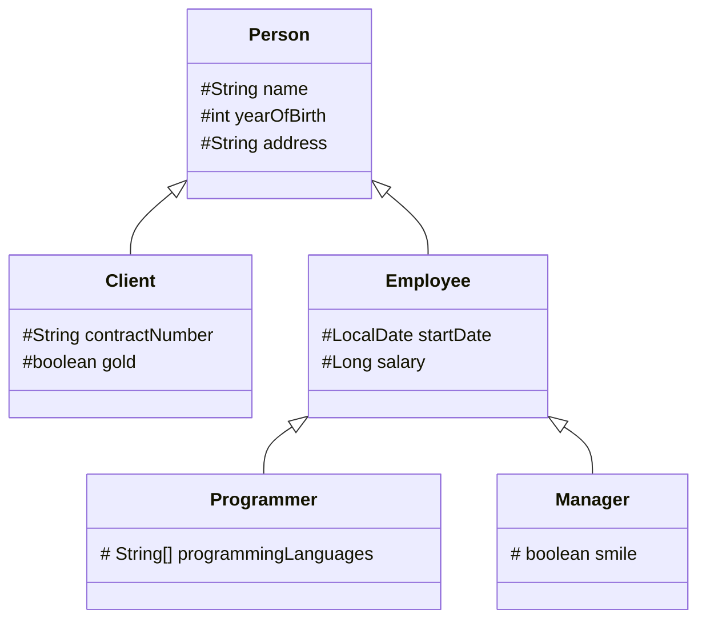

# Java Classes (Inheritance)

**Inheritance** is a mechanism for deriving a new class from another class. The new class acquires fields and methods of the base class (without the need of rewriting them). **Inheritance** represents the **IS-A** relationship. It is one of the main principles of object-oriented programming. It allows developers to build convenient class hierarchies and reuse existing code.

A class **derived** from another class is called a **subclass** (it's also known as a **derived class**, **extended class** or **child class**). The class from which the subclass is derived is called a **superclass** (also a **base class** or a **parent class)**.

```java
class SuperClass { }

class SubClassA extends SuperClass { }

class SubClassB extends SuperClass { }

class SubClassC extends SubClassA { }
```

There are important points about inheritance in Java:

* Java doesn't support multiple-class inheritance, meaning that a class can only inherit from a single superclass
* A class hierarchy can have multiple levels (class `C` can extend class `B` that extends class `A`); 
* A superclass can have more than one subclass. 
* A subclass inherits all public and protected fields and methods from the superclass. A subclass can also add new fields and methods. The inherited and added members will be used in the same way. 
* A subclass doesn't inherit private fields and methods from the superclass. However, if the superclass has public or protected methods for accessing its private fields, these members can be used inside subclasses. If you'd like the base class members to be accessible from all subclasses but not from the outside code (excluding the same package), use the access modifier `protected`.
* Constructors are not inherited, but the superclass constructor can be invoked from the subclass using the special keyword `super`. This keyword is discussed in more detail in another topic.
* If a class is declared with the keyword `final`, it cannot have subclasses at all.


## An example of a class hierarchy

* the base class `Person` has fields for storing common data: name, year of birth, and address;
* the class `Client` has additional fields to store the contract number and status (gold or not);
* the class `Employee` stores the start date of work for the company and the salary;
* the class `Programmer` has an array of the programming languages a programmer uses;
* the class `Manager` may have a dazzling smile.





```java
public class Person {
    protected String name;
    protected int yearOfBirth;
    protected String address;

    public Person(String name, int yearOfBirth, String address) {
        this.name = name;
        this.yearOfBirth = yearOfBirth;
        this.address = address;
    }

    // getters and setters here
}
```

```java
public class Client extends Person {
    protected String contractNumber;
    protected boolean gold;

    public Client(String name, int yearOfBirth, String address, String contractNumber, boolean gold) {
        super(name, yearOfBirth, address);
        this.contractNumber = contractNumber;
        this.gold = gold;
    }

    // getters and setters here
}
```

```java
public class Employee extends Person {
    protected LocalDate startDate;
    protected Long salary;

    public Employee(String name, int yearOfBirth, String address, LocalDate startDate, Long salary) {
        super(name, yearOfBirth, address);
        this.startDate = startDate;
        this.salary = salary;
    }

    // getters and setters here
}
```

```java
public class Manager extends Employee {
    protected boolean smile;

    public Manager(String name, int yearOfBirth, String address, LocalDate startDate, Long salary, boolean smile) {
        super(name, yearOfBirth, address, startDate, salary);
        this.smile = smile;
    }

    // getters and setters here

}
```

```java
public class Programmer extends Employee {
    protected String[] programmingLanguages;

    public Programmer(String name, int yearOfBirth, String address, LocalDate startDate, Long salary, String[] programmingLanguages) {
        super(name, yearOfBirth, address, startDate, salary);
        this.programmingLanguages = programmingLanguages;
    }

    // getters and setters here
}
```


This hierarchy has three levels and five classes overall. All fields are `protected` , which means they are visible to subclasses. Each class also has public getters and setters and an all-arguments constructor.

Let's create an object of the `Programmer` class and fill the inherited fields using the inherited setters. To read the values of the fields, we can use inherited getters.

```java
public class CompanyApp {
    public static void main(String[] args) {
        Programmer john = new Programmer(
                "John Elephant",
                1985,
                "Some street 15",
                LocalDate.of(2023, 15, 6),
                500_000L,
                new String[] { "Java", "Scala", "Kotlin" });
    }
}
```

## How to refer to a subclass object

There are two ways to refer to a subclass object:

**Subclass reference**. We can create instances of the subclasses using the constructor:

```java
Person person = new Person(); // the reference is Person, the object is Person
Client client = new Client(); // the reference is Client, the object is Client
Employee employee = new Employee(); // the reference is Employee, the object is Employee
```

**Superclass reference**. When creating objects using the constructor, we can refer to a subclass object using the reference to the superclass:

```java
Person client = new Client(); // the reference is Person, the object is Client
Person employee = new Employee(); // the reference is Person, the object is Employee
```

Remember, that:
* you cannot assign an object of one subclass to a reference of another subclass because they don't inherit each other.

```java
Client whoIsIt = new Employee(); // it's impossible
```

* you cannot assign an object of the parent class to the reference of its subclass:

```java
Client client = new Person();    // it's impossible
```

The basic rule goes like this: *If class A is a superclass of class B and class B is a superclass of class C then a variable of class A can reference any object derived from that class (for instance, objects of the class B and the class C). This is possible because each subclass object is an object of its superclass but not vice versa.*

### Accessing fields and methods through a superclass reference

**We can use a superclass reference for any subclass object derived from it. However, we cannot access specific members of the subclass through the base class reference. We have access only to those members of the object that are defined by the type of reference.**

```
Person employee = new Employee();

employee.setName("Ginger R. Lee"); // Ok
employee.setYearOfBirth(1980); // Ok
employee.setSalary(30000); // Compile-time error, the base class "doesn't know" about the method
```

The superclass `Person` doesn't have the method `setSalary` of the class `Employee`. You cannot invoke the method through the superclass reference. The same rule holds for fields.

### Casting between superclass and subclass

You can always cast an object of a subclass to its superclass. It may also be possible to cast an object from a superclass type to a subclass, but only if the object is an instance of this subclass, otherwise a `ClassCastException` will be thrown. Be careful when casting a class to its subclass.

```java
Person person = new Client();

Client clientAgain = (Client) person; // it's ok
Employee employee = (Employee) person; // the ClassCastException occurs here
```

After successfully casting a superclass to a subclass, we can access subclass-specific members.

### When to use the superclass reference

When to use a superclass reference in practice may not be so obvious. Moreover, using a superclass reference imposes some restrictions on accessing class members. There are two common cases:

-   processing an array (or another collection) of objects which have different types from the same hierarchy;
-   a method that accepts an object of the base class, but can also work with objects of its subclasses.

```java
public static void printNames(Person[] persons) {
    for (Person person : persons) {
        System.out.println(person.getName());
    }
}

public static void main(String[] args) {
    Person person = new Employee();
    person.setName("Ginger R. Lee");

    Client client = new Client();
    client.setName("Pauline E. Morgan");

    Employee employee = new Employee();
    employee.setName("Lawrence V. Jones");

    Person[] persons = {person, client, employee};

    printNames(persons);
    
}
```

What we did is we combined both of these cases into a single example. Our method called `printNames` takes an array of `Person` and displays the names. This method will work for an array with `Person`, `Client` and `Employee` objects.

## Accessing superclass fields and methods

The keyword `super` can be used to access instance methods or fields of the superclass. In a sense, it is similar to the keyword `this`, but it refers to the immediate parent class object.

The keyword `super` is optional if members of a subclass have different names from members of the superclass. Otherwise, using `super` is the right way to access hidden (with the same name) members of the base class.

In the following example there are two classes: `SuperClass` and `SubClass`. Each class has a field and a method.

```java
class SuperClass {
    protected int field;

    protected void printBaseValue() {
        System.out.println(field);
    }
}
```

```java
class SubClass extends SuperClass {

    protected int field;

    public SubClass() {
        this.field = 30;  // It initializes the field of SubClass
        super.field = 20; // It initializes the field of SuperClass
    }
    
    public void printSubValue() {
        super.printBaseValue(); // It invokes the method of SuperClass, super is optional here
        System.out.println(field);
    }
}
```

In the constructor of `SubClass` , the superclass field is initialized using the keyword `super`. We need to use the keyword here because the subclass field hides the base class field with the same name.

In the body of the method `printSubValue` , the superclass method `printBaseValue` is invoked. Here, the keyword `super` is optional. It is required when a subclass method has the same name as a method in the base class. This case will be considered in the topic concerning overriding.

### Invoking superclass constructor

Constructors are not inherited by subclasses, but a superclass constructor can be invoked from a subclass using the keyword `super` **with parentheses**. We can also pass some arguments to the superclass constructor.

Two important points:
* Invoking `super(...)` must be the first statement in a subclass constructor, otherwise, the code cannot be compiled; 
* The default constructor of a subclass automatically calls the no-argument constructor of the superclass.

### Overriding equals() & hashCode() in subclasses considering fields of the parent class

In subclasses, you can eventually override `equals() & hashCode()` methods to use parent equality, and then compare additional fields:

```java
@Override  
    public boolean equals(Object obj) {
    if (obj == null) {
        return false;
    }
    if (getClass() != obj.getClass()) {
        return false;
    }
    if (!super.equals(obj)) return false;
    else {
        // compare subclass fields here
    }
}
```

## The Object class
The Java Standard Library has a class named `Object` that is the default parent of all standard classes and your custom classes. Every class extends this one implicitly, therefore it's the root of inheritance in Java programs. The class belongs to the `java.lang` package that is imported by default.

```java
Object anObject = new Object();
```

The `Object` class can refer to an instance of any class because any instance is a kind of `Object` (*upcasting*).

```java
Long number = 1_000_000L;
Object obj1 = number; // an instance of Long can be cast to Object

String str = "str";
Object obj2 = str; // the same with an instance of String
```

When we declare a class, we can explicitly extend the `Object` class. However, there is no point, since the extension is already done implicitly. 

```java
class A extends Object { }
```

The `Object` class provides some common methods to all subclasses. It has nine instance methods (excluding overloaded methods) which can be divided into four groups:

* **object identity**: `hashCode`, `equals`;
* **human-readable representation**: `toString`;  
* **thread synchronization:** `wait`, `notify`, `notifyAll`;
* **object management**: `finalize`*, *`clone`*, *`getClass`*;*

### equals()
Object class defined equals() method like this:

```java
public boolean equals(Object obj) {
    return (this == obj);
}
```

According to the documentation of `equals()` method, any implementation should adhere to following principles.

* For any object x, `x.equals(x)` should return `true`.
* For any two object x and y, `x.equals(y)` should return `true` if and only if `y.equals(x)` returns `true`.
* For multiple objects x, y, and z, if `x.equals(y)` returns `true` and `y.equals(z)` returns `true`, then `x.equals(z)` should return `true`.
* Multiple invocations of `x.equals(y)` should return same result, unless any of the object properties is modified that is being used in the `equals()` method implementation.
* Object class equals() method implementation returns `true` only when both the references are pointing to same object.

Standard classes have to override it to enable comparison based on their internal state. Different implementations of the `equals` method enable different criteria to define when two objects are equal.

### hashCode()
Java Object `hashCode()` is a native method and returns the integer hash code value of the object. The general contract of `hashCode()` method is:

* Multiple invocations of `hashCode()` should return the same integer value, unless the object property is modified that is being used in the equals() method.
* An object hash code value can change in multiple executions of the same application.
* **If two objects are equal according to `equals()` method, then their hash code must be same**.
* If two objects are unequal according to `equals()` method, their hash code are not required to be different. Their hash code value may or may-not be equal.

In this example, two persons are considered equal if they have the same name, lastname, and birthday.

```java
public class Person {
    String name;
    String lastname;
    LocalDate birthDate;

    @Override
    public boolean equals(Object o) {
        if (this == o)
            return true;
        if (o == null || getClass() != o.getClass())
            return false;
        Person person = (Person) o;
        return Objects.equals(name, person.name) && Objects.equals(lastname, person.lastname) && Objects.equals(birthDate, person.birthDate);
    }
    
    @Override
    public int hashCode() {
        return Objects.hash(name, lastname, birthDate);
    }
}
```

Alternatively, here having the same lastname, and birthday is considered sufficient for considering two persons equal.

```java
public class Person {
    String name;
    String lastname;
    LocalDate birthDate;

    @Override
    public boolean equals(Object o) {
        if (this == o)
            return true;
        if (o == null || getClass() != o.getClass())
            return false;
        Person person = (Person) o;
        return Objects.equals(lastname, person.lastname) && Objects.equals(birthDate, person.birthDate);
    }
    
    @Override
    public int hashCode() {
        return Objects.hash(lastname, birthDate);
    }
}
```

## Overriding instance methods
Java's **method overriding** is a pivotal feature that allows subclasses to redefine behaviors inherited from their superclasses. Think of it as Java's way of letting classes add their own unique flair to inherited methods. It's like giving a classic recipe your own special twist. In this tutorial, we'll explore the essentials of instance method overriding in Java, its rules, and the role of the `@Override` annotation.

Java provides an opportunity to declare a method in a subclass with the same name as a method in the superclass. This is known as **method overriding**. The benefit of overriding is that a subclass can give its own specific implementation of a superclass method.

**Overriding methods** in subclasses allows a class to inherit from a superclass whose behavior is **close enough** and then to change this behavior as the subclass needs.

Instance methods can be overridden if they are inherited by the subclass. The overriding method must have the same name, parameters (number and type of parameters), and the return type (or a subclass of the type) as the overridden method.

```java
class Mammal {

    public String sayHello() {
        return "random stuff";
    }
}
```

```java
class Cat extends Mammal {

    @Override
    public String sayHello() {
        return "meow";
    }
}
```

```java
class Human extends Mammal {

    @Override
    public String sayHello() {
        return "hello";
    }
}
```

The hierarchy includes three classes: `Mammal`, `Cat` and `Human`. The class `Mammal` has the method `sayHello`. Each subclass overrides this method. The `@Override` annotation indicates that the method is overridden. This annotation is optional but helpful.

Let's create instances and invoke the method.

```java
public static void main(String[] args) {
    Mammal mammal = new Mammal();
    System.out.println(mammal.sayHello()); // it prints "random stuff"

    Cat cat = new Cat();
    System.out.println(cat.sayHello()); // it prints "meow"

    Human human = new Human();
    System.out.println(human.sayHello()); // it prints "hello"
}
```

### Rules for overriding methods

There are several rules for methods of subclasses which should override methods of a superclass:

- the method must have the same name as in the superclass;
- the arguments should be exactly the same as in the superclass method;
- the return type should be the same type or a subtype of the return type declared in the method of the superclass;
- the access level must be the same or more open than the overridden method's access level;
- a private method cannot be overridden because it's not inherited by subclasses;
- if the superclass and its subclass are in the same package, then package-private methods can be overridden;
- static methods cannot be overridden.

To verify these rules, there is a special annotation `@Override`. It allows you to know whether a method will be actually **overridden** or not. If for some reason, the compiler decides that the method cannot be overridden, it will generate an error. But, remember, the annotation is not required, it's only for convenience.

### Forbidding overriding

If you'd like to forbid overriding of a method, declare it with the keyword `final`.

```java
public final void method() {
    // do something
}
```

Now, if you try to override this method in a subclass, a compile-time error will occur.

### Overriding and overloading methods together

Recall, that **overloading** is a feature that allows a class to have more than one method with the same name, if their arguments are different.

We can also override and overload an instance method in a subclass at the same time. Overloaded methods do not override superclass instance methods. They are new methods, unique to the subclass.

The following example demonstrates it.

```java
class SuperClass {

    public void invokeInstanceMethod() {
        System.out.println("SuperClass: invokeInstanceMethod");
    }
}
```

```java
class SubClass extends SuperClass {

    @Override
    public void invokeInstanceMethod() {
        System.out.println("SubClass: invokeInstanceMethod is overridden");
    }

    // @Override -- method doesn't override anything
    public void invokeInstanceMethod(String s) {
        System.out.println("SubClass: overloaded invokeInstanceMethod(String)");
    }
}
```

The following code creates an instance and calls both methods:

```
SubClass sub = new SubClass();

sub.invokeInstanceMethod();    // SubClass: invokeInstanceMethod() is overridden
sub.invokeInstanceMethod("s"); // SubClass: overloaded invokeInstanceMethod(String)
```

Remember, overriding and overloading are different mechanisms, but you can mix them together in one class hierarchy.

### Hiding static methods

Static methods cannot be overridden. If a subclass has a static method with the same signature (name and parameters) as a static method in the superclass then the method in the subclass hides the one in the superclass. It's completely different from method overriding.

```java
class SuperClass {
    public static void staticMethod() {
        System.out.println("super");
    }
}
```

```java
class SubClass extends SuperClass {
    public static void staticMethod() {
        System.out.println("sub");
    }
}
```

```java
class Main {
    public static void main(String[] args) {
        SuperClass.staticMethod();          // it prints "super"
        new SuperClass().staticMethod();    // it prints "super"
        SubClass.staticMethod();            // it prints "sub"
        new SubClass().staticMethod();      // it prints "sub"

        SuperClass ss = new SubClass();
        ss.staticMethod();                  // it prints "super", because static method belongs to a class, not to an instance
    }
}
```

## Kinds of polymorphism

In general, **polymorphism** means that something (an object or another entity) has many forms.

Java provides three types of polymorphism:
* **Static (compile-time) polymorphism** refers to polymorphic functions that can be applied to arguments of different types, but behave differently depending on the type of the argument to which they are applied. Java supports it as **method overloading**.
* **Dynamic (run-time) polymorphism** is the possibility to use an instance of a subclass (and its methods) based on the object type used at run-time instead of the object type declared by the programmer (often the base class type). Java supports it as **method overriding**.
* **Parametric polymorphism** is when the code is written without mention of any specific type and thus can be used transparently with any number of new types. Java supports it as **generics** or **generic programming**.

### Static polymorphism

A reminder: *method overloading* allows programmers to define multiple methods with the same name but different parameters. This allows a simple form a polymorphism established at compile-time because it is known which method will be actually called.

```java
class Mammal {
    public String sayHello() {
        return "hi, i'm a mammal";
    }

    public String sayHello(int count) {
        return "hi, i'm a mammal".repeat(Math.max(0, count));
    }
}
```

```java
public static void main(String[] args) {
    Mammal m = new Mammal();
        
    // prints "hi, i'm a mammal" 1 time
    System.out.println(m.sayHello());
    
    // prints "hi, i'm a mammal" 12 times
    System.out.println(m.sayHello(12));
}
```

### Dynamic polymorphism

A reminder: *method overriding* is when a subclass redefines a method of the superclass with the same signature.

Run-time polymorphism works when an overridden method is called through the reference variable of a superclass. Java determines at runtime which version of the method (superclass/subclasses) is to be executed based on the type of the object being referred, not the type of reference. It uses a mechanism known as **dynamic method dispatching**.

```java
class Mammal {

    public String sayHello() {
        return "hi, i'm a mammal";
    }
}
```

```java
class Cat extends Mammal {

    @Override
    public String sayHello() {
        return "meow";
    }
}
```

```java
class Human extends Mammal {

    @Override
    public String sayHello() {
        return "hello";
    }
}
```

```java
public static void main(String[] args) {
    for (Mammal mammal : new Mammal[]{
            new Mammal(), 
            new Cat(), 
            new Human()}) {
        System.out.println(mammal.sayHello());
    }
}
```

Will print:

```text
hi, i'm a mammal
meow
hello
```

So, the result of a method call depends on the actual type of instance, not the reference type. It's a polymorphic feature in Java. The JVM calls the appropriate method for the object that is referred to in each variable.

Subtype polymorphism allows a class to specify methods that will be common to all of its subclasses. Subtype polymorphism also makes it possible for subclasses to override the implementations of those methods. 

### A practical example

In the following example, we have a hierarchy of files. The parent class `File` represents a description of a single file in the file system. It has a subclass named `ImageFile`. It overrides the method `getFileInfo` of the parent class.

```java
class File {

    protected String fullName;

    // constructor with a single parameter

    // getters and setters

    public void printFileInfo() {
        String info = this.getFileInfo(); // here is polymorphic behavior!!!
        System.out.println(info);
    }

    protected String getFileInfo() {
        return "File: " + fullName;
    }
}

class ImageFile extends File {

    protected int width;
    protected int height;
    protected byte[] content;

    // constructor

    // getters and setters

    @Override
    protected String getFileInfo() {
        return String.format("Image: %s, width: %d, height: %d", fullName, width, height);
    }
}
```

The parent class has a public method `printFileInfo` and a protected method `getFileInfo`. The second method is overridden in the subclass, but the subclass doesn't override the first method.


```
File img = new ImageFile("/path/to/file/img.png", 480, 640, someBytes); // assigning an object

img.printFileInfo(); // It prints "Image: /path/to/file/img.png, width: 480, height: 640"
```

## References
* https://www.programiz.com/java-programming/inheritance
* https://www.programiz.com/java-programming/method-overriding
* https://www.programiz.com/java-programming/super-keyword
