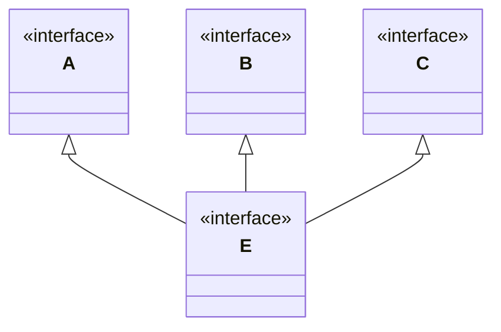
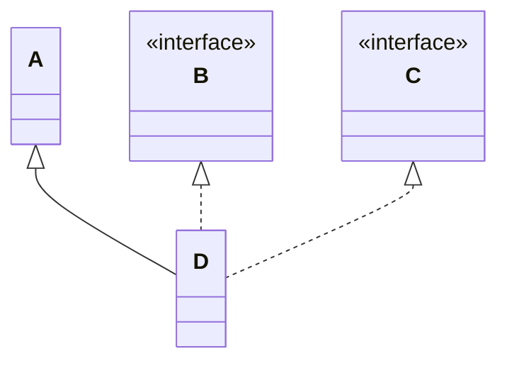
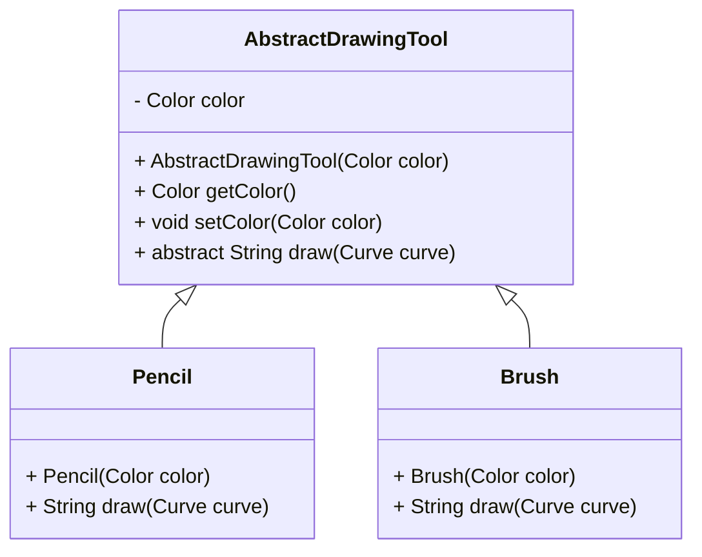
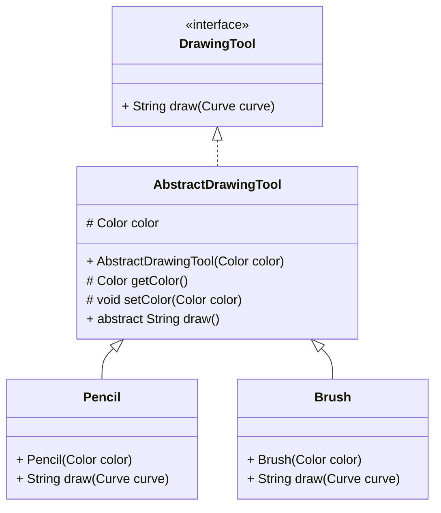
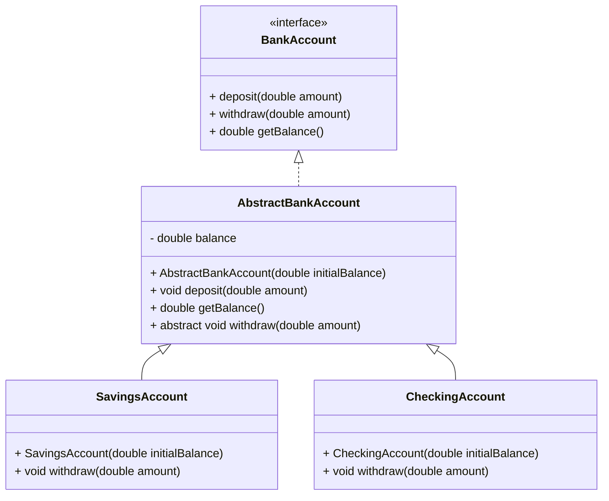
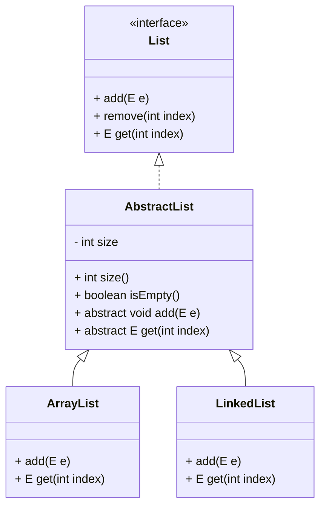

# Java Classes (Interfaces, abstract classes)

## Decoupling and Abstraction


```java
class Pencil {
    public void draw() {
        System.out.println("Pencil in use...");
    }
}

class Brush {
    public void draw() {
        System.out.println("Brush in use...");
    }
}

class DrawingApplication {
    private Pencil pencil;
    private Brush brush;

    public DrawingApplication(Pencil pencil, Brush brush) {
        this.pencil = pencil;
        this.brush = brush;
    }

    public void usePencil() {
        pencil.draw();
    }

    public void useBrush() {
        brush.draw();
    }
}

public class Main {
    public static void main(String[] args) {
        Pencil pencil = new Pencil();
        Brush brush = new Brush();
        DrawingApplication app = new DrawingApplication(pencil, brush);

        app.useBrush();
        app.usePencil();
    }
}
```

**Limitations of This Approach:**

* **Tight Coupling**:
    - If we want to use a different type of Pencil (e.g., a RedPencil), we must modify the `DrawingApplication` class.
    - If we want to use a different type of Brush (e.g., a LargeBrush), we must modify the `DrawingApplication` class.

* **No Common Abstraction**:
    - `Pencil` and `Brush` have no shared abstraction, meaning **we cannot treat all tools generically**.
    - The `DrawingApplication` class **must know about every specific tool type**.

Alternatively, we can organize our project as follows:

```java
interface DrawingTool {
    public void draw();
}

class Pencil implements DrawingTool {

    @Override
    public void draw() {
        System.out.println("Pencil in use...");
    }
}

class Brush implements DrawingTool {

    @Override
    public void draw() {
        System.out.println("Brush in use...");
    }
}

class DrawingApplication {
    private DrawingTool tool;

    public DrawingApplication(DrawingTool tool) {
        this.tool = tool;
    }

    public void useTool() {
        tool.draw();
    }
}

public class Main {
    public static void main(String[] args) {
        DrawingTool pencil = new Pencil();
        //DrawingTool brush = new Brush();
        DrawingApplication app = new DrawingApplication(pencil);

        app.useTool();
    }
}
```

**How This Approach Helps:**

1. **Decoupling**:
    - `DrawingApplication` depends on the `DrawingTool` interface, **not on specific implementations**.
    - We can easily swap in a Pencil or Brush without modifying `DrawingApplication`.

2. **Better Extensibility**:
    - We can add new tools (e.g., `RedPencil`, `LargeBrush`) **without modifying existing classes**.


## Interfaces
An interface can be considered a special kind of class that can't be instantiated. An interface represents an abstract concept by defining only behavior, expressed through method declarations without implementation. To declare an interface, you should use the keyword `interface` instead of `class`. Key points:

* Interfaces cannot have constructors, as they cannot be instantiated.
* **All** methods declared in an interface are implicitly **public** and **abstract**.
* Other classes can **implement** an interface by providing concrete implementations for its abstract methods.
* A common drawback of using interfaces directly is the potential for **code duplication** across implementing classes.

**Abstract methods** are declared by adding the keyword **`abstract`**. They have a declaration (modifiers, a return type, and a signature) but don't have an implementation. Each concrete (non-abstract) subclass must implement these methods.


```java
interface DrawingTool {
    void draw(Curve curve);
    Color getColor();
    void setColor(Color color);
}
```

```java
class Pencil implements DrawingTool {
    Color color;
    
    public Pencil(Color color) {
        this.color = color;
    }
    
    public Color getColor() {
        return color;
    }
    
    public void setColor(Color color) {
        this.color = color;
    }

    @Override
    public String draw(Curve curve) {
        return "Pencil drawing a " + curve.draw();
    }
}
```


```java
class Brush implements DrawingTool {
   Color color;

   public Pencil(Color color) {
      this.color = color;
   }

   public Color getColor() {
      return color;
   }

   public void setColor(Color color) {
      this.color = color;
   }

    @Override
    public String draw(Curve curve) {
        return "Brush drawing a " + curve.draw();
    }
}
```


### Key rules

An interface can extend one or more other interfaces using the keyword `extends`:

```java
interface A { }
interface B { }
interface C { }

interface E extends A, B, C { }
```



A class can extend only one class and implement multiple interfaces:

```java
class A { }

interface B { }
interface C { }

class D extends A implements B, C { }
```



Multiple interfaces are often used in the standard library. The class String, for example, implements three interfaces at once:

```java
public final class String implements Serializable, Comparable<String>, CharSequence {
    // ...
}
```

### Methods with a body
#### Static methods

You can declare and implement a static method in an interface

```java
interface DrawingTool {
    static final Color DEFAULT_COLOR = Color.BLACK;
    
    static boolean hasSameColor(DrawingTool a, DrawingTool b) {
        return a.getColor().equals(b.getColor());
    }
    // ...
}
```

To use a static method you just need to invoke it directly from an interface

```
DrawingTool.hasSameColor(pencil, brush);
```

The main purpose of interface static methods is to define utility functionality that is common for all classes implementing the interface. They help to avoid code duplication.

#### Default methods
**Interface methods are abstract by default**. One kind of method can have a body nevertheless. Such methods are called `default` and are available since Java 8.

Suppose many classes already implemented the `DrawingTool` interface. For example `pencil`, `pen`, `brush`, `fuzzybrush` etc. They all draw in different ways when `draw()` is called.

```java
interface DrawingTool {
    void draw(Curve curve);
    Color getColor();
    void setColor(Color color);
}
```

Then you decide that characters should be always able to draw with a default color. That means:
* you need to add the `drawWithDefaultColor` method to the `DrawingTool` interface **and modify all implementing classes**
* **if implementing classes are a lot this could become very time-consuming!**. 

**The key motivation behind default methods in interfaces is supporting backward compatibility**. `default` methods provide a quicker solution in that you don't have to implement them in all classes.

```java
interface DrawingTool {
    static final Color DEFAULT_COLOR = Color.BLACK;
    
    void draw(Curve curve);
    Color getColor();
    void setColor(Color color);

    default void drawWithDefaultColor(Curve curve) {
        Color original = getColor();
        setColor(DEFAULT_COLOR);
        draw(curve);
        setColor(original);
    }
}
```


Although default methods are implemented, you cannot invoke them directly from an interface like `DrawingTool.drawWithDefaultColor()`. You still need to have an object of a class that implements the interface:

```
DrawingTool pencil = new Pencil();
pencil.drawWithDefaultColor();
```

#### Private methods
Sometimes default methods are huge. To make it possible to decompose such methods, **Java allows declaring private methods inside an interface**:

```java
interface Feature {
    default void action() {
        String answer = subAction();
        System.out.println(answer);
    }

    private String subAction() {
        return "Default action";
    }
}
```


## Abstract classes

An **abstract class** is a class declared using the `abstract` keyword. It represents a **generalized concept** meant to be **extended by subclasses**, rather than instantiated directly.

* It can define **both abstract methods** (without implementation) and **concrete methods** (with implementation).
* It can include **constructors**, which are typically used by its subclasses.
* You **cannot create instances** of an abstract class directly — it may contain methods that are not fully implemented.
* An abstract class can **extend another class**, including another abstract class.



```java
public abstract class AbstractDrawingTool {

    protected Color color;

    protected DrawingTool(Color color) {
        this.color = color;
    }

    protected Color getColor() {
        return color;
    }

    protected void setColor(Color color) {
        this.color = color;
    }

    public abstract String draw(Curve curve); // an abstract method
}
```

Since `AbstractDrawingTool` is an abstract class we cannot create instances of this class:

```java
AbstractDrawingTool pencil = new AbstractDrawingTool(Color.RED); // this throws a compile time error
```

The method `draw()` is declared abstract because, at this level of abstraction, its implementation is unknown. Concrete subclasses of the class `AbstractDrawingTool` should have an implementation of this method.

```java
class Pencil extends AbstractDrawingTool {

    // It can have additional fields as well

    public Pencil(Color color) {
        super(color);
    }

    @Override
    public String draw(Curve curve) {
        return "Pencil drawing a " + curve.draw();
    }
}
```


```java
class Brush extends AbstractDrawingTool {

    // It can have additional fields as well

    public Pencil(Color color) {
        super(color);
    }

    @Override
    public String draw(Curve curve) {
        return "Brush drawing a " + curve.draw();
    }
}
```

## Mixing Abstract classes and Interfaces: Example 1

Often interfaces and abstract classes are used together to make a class hierarchy more flexible. 

* **Interface**: Defines basic banking operations that any account type must implement.

* **Abstract Class**: Implements common state and behavior (like managing the balance) and provides a foundation for concrete account types.

* **Concrete Classes**: Specialize behavior for each type of account (e.g., overdraft rules, interest application).



```java
interface DrawingTool {
    String draw(Curve curve);
}
```


```java
abstract class AbstractDrawingTool implements DrawingTool {
    protected Color color;

    protected AbstractDrawingTool(Color color) {
        this.color = color;
    }

    protected Color getColor() {
        return color;
    }

    protected void setColor(Color color) {
        this.color = color;
    }

    public abstract String draw(); // an abstract method
}
```

```java
class Pencil extends AbstractDrawingTool {

    // It can have additional fields as well

    public Pencil(Color color) {
        super(color);
    }

    @Override
    public String draw(Curve curve) {
        return "Pencil drawing a " + curve.draw();
    }
}
```

```java
class Brush extends AbstractDrawingTool {

    // It can have additional fields as well

    public Pencil(Color color) {
        super(color);
    }

    @Override
    public String draw(Curve curve) {
        return "Brush drawing a " + curve.draw();
    }
}
```

## Mixing Abstract classes and Interfaces: Example 2

Here is another example of **mixing abstract classes and interfaces**, this time to model **two types of bank accounts**: a **SavingsAccount** and a **CheckingAccount**. The interface defines general bank operations, and the abstract class handles shared logic (e.g., balance management).



```java
interface BankAccount {
    void deposit(double amount);
    void withdraw(double amount);
    double getBalance();
}
```

```java
abstract class AbstractBankAccount implements BankAccount {
    protected double balance;

    public AbstractBankAccount(double initialBalance) {
        this.balance = initialBalance;
    }

    @Override
    public void deposit(double amount) {
        if (amount > 0) {
            balance += amount;
        }
    }

    @Override
    public double getBalance() {
        return balance;
    }

    @Override
    public abstract void withdraw(double amount);
}
```

```java
class SavingsAccount extends AbstractBankAccount {

    public SavingsAccount(double initialBalance) {
        super(initialBalance);
    }

    @Override
    public void withdraw(double amount) {
        if (amount > 0 && balance >= amount) {
            balance -= amount;
        } else {
            throw new IllegalArgumentException("Insufficient funds in SavingsAccount");
        }
    }
}
```

```java
class CheckingAccount extends AbstractBankAccount {

    private static final double OVERDRAFT_LIMIT = 100.0;

    public CheckingAccount(double initialBalance) {
        super(initialBalance);
    }

    @Override
    public void withdraw(double amount) {
        if (amount > 0 && balance + OVERDRAFT_LIMIT >= amount) {
            balance -= amount;
        } else {
            throw new IllegalArgumentException("Overdraft limit exceeded in CheckingAccount");
        }
    }
}
```

## Mixing Abstract classes and Interfaces: Example 3

The **Java Collections Framework** is a classic example of how **interfaces and abstract classes are combined** to create a **flexible and extensible hierarchy**.

* **Interfaces** define *what* a collection can do (e.g., `add`, `remove`, `iterate`).
* **Abstract classes** provide *reusable logic* and *partial implementations* to reduce code duplication.
* **Concrete classes** specialize behavior for different use cases (e.g., lists vs. sets vs. queues).



## Comparison: Interface vs Abstract Class vs Concrete Class

| Feature                  | **Interface**                             | **Abstract Class**                             | **Concrete Class**            |
| ------------------------ |-------------------------------------------|------------------------------------------------| ----------------------------- |
| **Purpose**              | Define *what* should be done              | Define *partial behavior* and common structure | Provide *full implementation* |
| **Implementation**       | No method bodies (except `default` methods) | Can include both abstract and concrete methods | All methods are implemented   |
| **Can be instantiated?** | ❌ No                                      | ❌ No                                           | ✅ Yes                         |
| **Constructors**         | ❌ Not allowed                             | ✅ Can define constructors                      | ✅ Can define and use constructors |
| **Fields**               | Only `public static final` constants      | Full use                                       | Full use                |
| **Use Case**             | Define capabilities or roles              | Share common behavior and enforce contracts    | Actual working implementation |
| **Polymorphism**         | ✅ Yes                                     | ✅ Yes                                          | ✅ Yes                         |


## Resources
