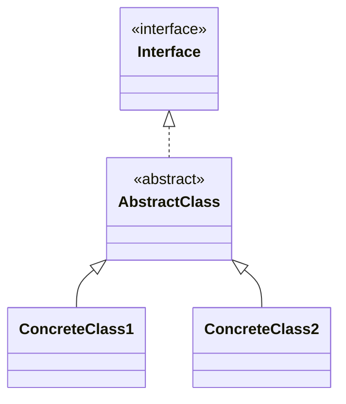
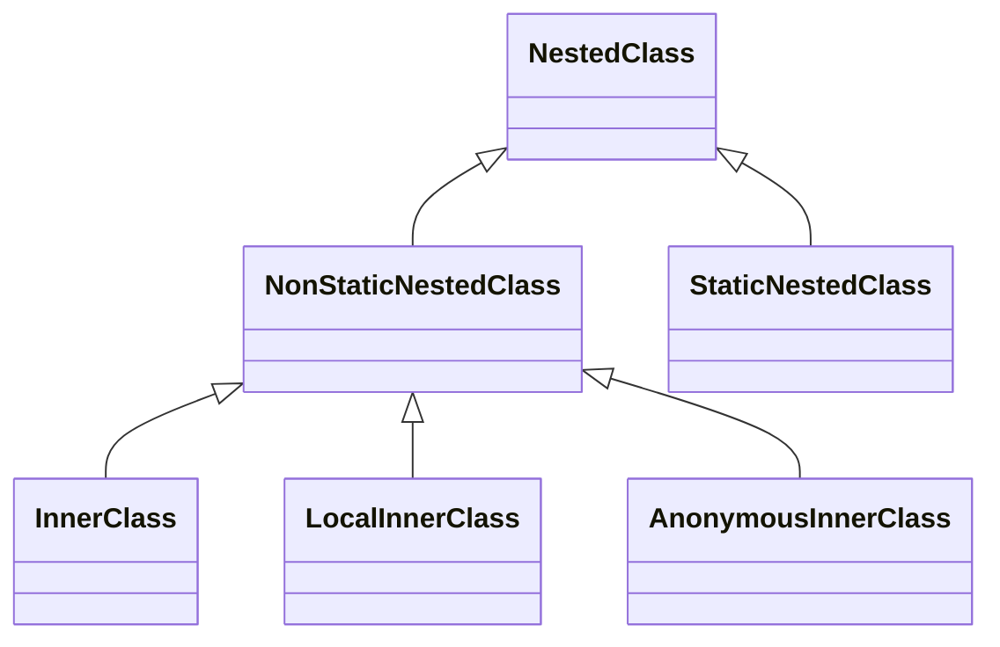

# Java Classes (Interfaces, abstract classes)

## Interfaces

Imagine we need to create a graphical editor program. Suppose `Curve` is a class that represents some curve:

```java
public class Curve {
    public String draw() {
        return "standard curve";
    }
}
```

and `Pencil` and `Brush` abstract two different drawing tools:

```java
class Pencil {
    // ...
    public String draw(Curve curve) {
        // ...
    }
}
```

```java
class Brush {
    // ...
    public String draw(Curve curve) {
        // ...
    }
}
```

Each of them has the method `draw`, although uses it in its own fashion. The ability to draw is a common feature for all of them. Let's call this feature `DrawingTool`. Then we can say that if a class has the `DrawingTool` feature, then it should be able to draw, which means the class should have the `String draw(Curve curve) {...}` method.

Java allows declaring this feature by introducing interfaces. This is what our interface looks like:

```java
interface DrawingTool {
    String draw(Curve curve);
}
```

It declares the `draw` method without implementation.

Now let's mark classes that are able to draw by adding `implements DrawingTool` to the class declaration. If a class implements an interface, it has to implement all declared methods:

```java
public class Pencil implements DrawingTool {
    @Override
    public String draw(Curve curve) {
        return "Pencil drawing a " + curve.draw();
    }
}
```

```java 
public class Brush implements DrawingTool {
    @Override
    public String draw(Curve curve) {
        return "Brush drawing a " + curve.draw();
    }
}
```

Now just a quick look at the class declaration is enough to understand that the class is able to draw. In other words, the main idea of an interface is *declaring functionality*.

Another important advantage of introducing interfaces is that you can use them as a type:

```java
public class DrawingApp {
    public static void main(String[] args) {
        Curve curve = new Curve();
        DrawingTool[] drawingTools = new DrawingTool[]{new Pencil(), new Brush()};
        for (DrawingTool tool : drawingTools) {
            System.out.println(tool.draw(curve));
        }
    }
}
```
Outputs:

```text
Pencil drawing a standard curve
Brush drawing a standard curve
```

Now, both a pencil and a brush objects have the same type. It means that both classes can be treated similarly as a `DrawingTool`. This is another way of supporting **polymorphism**.

### Declaring interfaces
An interface can be considered a special kind of class that can't be instantiated. To declare an interface, you should use the keyword `interface` instead of `class`. An interface can contain:

* public constants;
* abstract methods without an implementation (the keyword `abstract` is not required here);
* static methods with implementation (the keyword `static` is required); 
* default methods with implementation (the keyword `default` is required); 
* private methods with implementation.

If the modifiers are not specified once the method is declared, its parameters will be **public abstract** by default.

An interface can't contain constructors, non-public abstract methods, or any fields other than `public static final` (**constants**). Let's declare an interface containing all possible members:

```java
interface Interface {

    int INT_CONSTANT = 0; // it's a constant, the same as public static final int INT_CONSTANT = 0

    void instanceMethod1();

    void instanceMethod2();

    static void staticMethod() {
        System.out.println("Interface: static method");
    }

    default void defaultMethod() {
        System.out.println("Interface: default method. It can be overridden");
    }

    private void privateMethod() {
        System.out.println("Interface: private methods in interfaces are acceptable but should have a body");
    }
}
```

Static, default, and private methods should have an implementation in the interface!

Let's take a closer look at this interface. The variable `INT_CONSTANT` is not the same as a class field here -- it's a static final constant. Two methods `instanceMethod1()` and `instanceMethod2()` are abstract methods. The `staticMethod()` is just a regular static method. The default method `defaultMethod()` has an implementation, but it can be overridden in subclasses. The `privateMethod` has an implementation as well and can be used to decompose `default` methods.

### Implementing and extending multiple interfaces

One of the important interface features is **multiple inheritances**.

An interface can extend one or more other interfaces using the keyword `extends`:

```java
interface A { }
interface B { }
interface C { }

interface E extends A, B, C { }
```

A class can extend another class and implement multiple interfaces:

```java
class A { }

interface B { }
interface C { }

class D extends A implements B, C { }
```

All the examples above do not pose any problems.

Multiple inheritances of interfaces are often used in the Java standard class library. The class String, for example, implements three interfaces at once:

```java
public final class String implements Serializable, Comparable<String>, CharSequence {
    // ...
}
```

### Marker interfaces

In some situations, an interface has no members at all. Such interfaces are called **marker** or **tagged interfaces**. For example, a well-known interface `Serializable` is a marker interface:

```java
public interface Serializable {
    
}
```

Other examples of marker interfaces are `Cloneable`, `Remote`, etc. They are used to provide essential information to the JVM.


### Methods with a body
#### Static methods

You can declare and implement a static method in an interface

```java
interface Car {
    static double convertToMilesPerHour(double kmh) {
        return 0.62 * kmh;
    }
    // ...
}
```

To use a static method you just need to invoke it directly from an interface

```
Car.convertToMilesPerHour(4.5);
```

The main purpose of interface static methods is to define utility functionality that is common for all classes implementing the interface. They help to avoid code duplication and create additional utility classes.


#### Default methods
**Interface methods are abstract by default**. It means that they can't have a body. Instead, they just declare a signature. One kind of method can have a body nevertheless. Such methods are called `default` and are available since Java 8.

Default methods are opposite to abstract ones. They have an implementation:

```java
interface Feature {
    default void action() {
        System.out.println("Default action");
    }
}
```

To denote that a method is `default`, the keyword `default` is reserved. Remember that an interface method is treated as `abstract` by default. So you need to indicate this explicitly by putting the `default` keyword before methods with a body, otherwise, a compilation error happens.

Although default methods are implemented, you cannot invoke them directly from an interface like `Feature.action()`. You still need to have an object of a class that implements the interface:

```java
class FeatureImpl implements Feature {
    // ...
}
```

```
Feature feature = new FeatureImpl();
feature.action(); // Default action
```

If you want to customize a default method in a class, just override it like a regular method:

```java
class FeatureImpl implements Feature {
    public void action() {
        System.out.println("FeatureImpl-specific action");
    }
}
```

```
Feature feature = new FeatureImpl();
feature.action(); // FeatureImpl-specific action
```

Sometimes default methods are huge. To make it possible to decompose such methods, Java allows declaring private methods inside an interface:

```java
interface Feature {
    default void action() {
        String answer = subAction();
        System.out.println(answer);
    }

    private String subAction() {
        return "Default action";
    }
}
```

#### Why are they needed?
The main idea of an interface is declaring functionality. Default methods extend that idea. They don't just declare functionality but also implement it. **The main reason is supporting backward compatibility**. Let's consider an example.

Suppose you program a game that has several types of characters. These characters are able to move within a map. That is represented by the `Movable` interface:

```java
interface Movable {
    void stepForward();
    void stepBackward();
    void turnLeft();
    void turnRight();
}
```

So we have the interface and many classes that implement it. For example, `Batman`, `Robin`, `Joker` characters:

```java
class Batman implements Movable {
    void stepForward() { /*...*/ }
    void stepBackward() { /*...*/ }
    public void turnLeft() { /*...*/ }
    public void turnRight() {/*...*/ }
}
```

Then you decide that characters should be able to turn around. That means you need to add the `turnAround` method to `Movable`. **You have to implement the method for all classes implementing the interface**. Another way is declaring a `default` method in the interface. Then you don't have to implement it in all classes.

```java
interface Movable {
    void stepForward();
    void stepBackward();
    void turnLeft();
    void turnRight();
    default void turnAround() {
        turnLeft();
        turnRight();
    }
}
```

Another, more critical, example: suppose Java maintainers decided to enhance a commonly used interface with a new method in the next release. It means if you are going to upgrade the Java version and there are classes implementing the interface in your code, you have to implement the new method. Otherwise, your code won't compile.

#### The diamond problem

Suppose we have another interface `Jumpable` that represents the ability to jump. The interface contains abstract methods for jumping in place and jumping with turning left and right. It also has a `default` method for a turnaround jump with the same signature as `Movable`.

```java
interface Jumpable {
    void jump();
    void turnLeftJump();
    void turnRightJump();
    default void turnAround() {
        turnLeftJump();
        turnLeftJump();
    }
}
```

`Spiderman` has both abilities of `Movable` and `Jumpable`, so its class implements both interfaces. Note both interfaces have the `default` method `turnAround` with the same signature, but different implementations. Which one should be chosen for the class? To avoid ambiguity, the compiler forces a programmer to provide the implementation explicitly, otherwise it raises a compilation exception.

```java
class Spiderman implements Movable, Jumpable {
    // define an implementation for abstract methods
    public void stepAhead() {/*...*/}
    public void turnLeft() {/*...*/}
    public void turnRight() {/*...*/}
    public void jump() {/*...*/}
    public void turnLeftJump() {/*...*/}
    public void turnRightJump() {/*...*/}

    // define an implementation for conflicted default method
    public void turnAround() {
        // define turnaround for the spiderman
    }
}
```


## Abstract classes

An **abstract class** is a class declared with the keyword **`abstract`**. It represents an abstract concept that is used as a base class for subclasses. Abstract classes have some special features:

-   it's impossible to create an instance of an abstract class;
-   an abstract class can contain abstract methods that must be implemented in non-abstract subclasses;
-   it can contain fields and non-abstract methods (including static);
-   an abstract class can extend another class, including an abstract one;
-   it can contain a constructor.

As you can see, an abstract class has two main differences from regular (concrete) classes: no instances and abstract methods.

**Abstract methods** are declared by adding the keyword **`abstract`**. They have a declaration (modifiers, a return type, and a signature) but don't have an implementation. Each concrete (non-abstract) subclass must implement these methods.

Note, static methods can't be abstract!

```java
import java.awt.*;

public abstract class DrawingTool {

    protected Color color;

    protected DrawingTool(Color color) {
        this.color = color;
    }

    protected Color getColor() {
        return color;
    }

    protected void setColor(Color color) {
        this.color = color;
    }

    public abstract String draw(); // an abstract method
}
```

The class has two fields, a constructor, and an abstract method.

Since `DrawingTool` is an abstract class we cannot create instances of this class:

```java
DrawingTool pencil = new DrawingTool(Color.RED); // this throws a compile time error
```

The method `draw()` is declared abstract because, at this level of abstraction, its implementation is unknown. Concrete subclasses of the class `DrawingTool` should have an implementation of this method.

```java
class Pencil extends DrawingTool {

    // It can have additional fields as well

    public Pencil(Color color) {
        super(color);
    }

    @Override
    public String draw(Curve curve) {
        return "Pencil drawing a " + curve.draw();
    }
}
```


```java
class Brush extends DrawingTool {

    // It can have additional fields as well

    public Pencil(Color color) {
        super(color);
    }

    @Override
    public String draw(Curve curve) {
        return "Brush drawing a " + curve.draw();
    }
}
```

**Abstract classes** and **interfaces** are both tools to achieve abstraction that allow us to declare abstract methods. We cannot create instances of abstract classes and interfaces directly, we can only do that through classes that inherit them.

Since Java 8, an interface can have default and static methods that contain an implementation. It makes interface more similar to an abstract class. So, the important question is: what is the difference between interfaces and abstract classes?



## Using abstract classes and interfaces together

Often interfaces and abstract classes are used together to make a class hierarchy more flexible. In this case, an abstract class contains common members and implements one or multiple interfaces, and concrete classes extend the abstract class and possibly implement other interfaces.

```java
interface DrawingTool {
    String draw(Curve curve);
}
```


```java
abstract class AbstractDrawingTool implements DrawingTool {
    protected Color color;

    protected AbstractDrawingTool(Color color) {
        this.color = color;
    }

    protected Color getColor() {
        return color;
    }

    protected void setColor(Color color) {
        this.color = color;
    }

    public abstract String draw(); // an abstract method
}
```

```java
class Pencil extends AbstractDrawingTool {

    // It can have additional fields as well

    public Pencil(Color color) {
        super(color);
    }

    @Override
    public String draw(Curve curve) {
        return "Pencil drawing a " + curve.draw();
    }
}
```

```java
class Brush extends AbstractDrawingTool {

    // It can have additional fields as well

    public Pencil(Color color) {
        super(color);
    }

    @Override
    public String draw(Curve curve) {
        return "Brush drawing a " + curve.draw();
    }
}
```

Using both concepts (interfaces and abstract classes) makes your code more flexible. Use suitable abstractions or their combination when designing your class hierarchies.

As an example, you may see class hierarchies in the standard Java class library. An example of that is the collections' hierarchy. It combines abstract classes and interfaces to make the hierarchy more maintainable and flexible to use in your code.

 ## Anonymous classes

Java provides a mechanism for creating a class in a single statement without having to declare a new named class. Such classes are called **anonymous** because they don't have name identifiers.

Let's assume we have the following interface with two methods:

```java
interface SpeakingEntity {

    void sayHello();

    void sayBye();
}
```

Here is an anonymous class that represents an English-speaking person:

```java
SpeakingEntity englishSpeakingPerson = new SpeakingEntity() {

    @Override
    public void sayHello() {
        System.out.println("Hello!");
    }

    @Override
    public void sayBye() {
        System.out.println("Bye!");
    }
};
```

The anonymous class is declared and instantiated at the same time as an expression. It overrides both methods of the interface.

We assign an instance of the **anonymous class** to the variable of the interface type. Now, we can invoke overridden methods:

```
englishSpeakingPerson.sayHello();
englishSpeakingPerson.sayBye();
```

Let's declare and instantiate another anonymous class:

```java
SpeakingEntity cat = new SpeakingEntity() {

    @Override
    public void sayHello() {
        System.out.println("Meow!");
    }

    @Override
    public void sayBye() {
        System.out.println("Meow!");
    }
};
```

So, `englishSpeakingPerson` and `cat` are instances of different anonymous classes that implement the same interface.


 ## Nested classes
You can call a class **nested** when it is declared inside another class.



### Inner classes
Imagine that you are writing a class `Cat` representing cats. Let's say you want a cat to have a bow. Then you need to create a new class `Bow`. This class `Bow` would be quite small and specific, and you know you won't need a bow without a cat. The solution is to create the class `Bow` inside the `Cat` class:

```java
public class Cat {

    private String name;

    public Cat(String name) {
        this.name = name;
    }

    public class Bow {
        String color;

        public Bow(String color) {
            this.color = color;
        }

        public void printColor() {
            System.out.println("Cat " + Cat.this.name + " has a " + this.color + " bow.");
        }
    }
}
```

Let's create a cat `Bob` with a red bow:

```java
public class Main {

    public static void main(String[] args) {

        Cat cat = new Cat("Bob");
        Cat.Bow bow = cat.new Bow("red");

        bow.printColor();
    }
}
```

```text
Cat Bob has a red bow.
```

#### Scope of the inner class

Now let's discuss what we can see from the inner class and who can access the inner class from outside.

```java
public class Cat {

    private String name;

    public Cat(String name) {
        this.name = name;
    }

    private void sayMeow() {
        System.out.println(this.name + " says: \"Meow\".");
    }

    public class Bow {
        String color;

        public Bow(String color) {
            this.color = color;
        }

        public void putOnABow() {
            Cat.this.sayMeow();
            System.out.println("Bow is on!");
        }

        public void printColor() {
            System.out.println("Cat " + Cat.this.name + " has a " + this.color + " bow.\n");
        }
    }
}
```

From inside the inner class, we can see all methods and fields of the outer class even if they are `private`. And don't forget that we can use everything else according to access modifiers as well.

An inner class is associated with an instance of its enclosing class. So to instantiate an inner class and get access to it, you need to instantiate the outer class first:

```java
Outer outer = new Outer();
Outer.InnerClass inner = outer.new InnerClass();
```

Remember about access modifiers **:** if you make an inner class `private`, then it can only be accessed from inside the outer class. The same works for fields and methods.


### Static nested classes

Imagine, that one day you woke up and decided to draw. Obviously, you would do so with the help of some Java code. Your ultimate goal is to draw a painting. But how to create a masterpiece? That'll require doing some sketches first.

How would you organize your code? It's a good idea to use a nested class here. But if you choose to employ an inner class then a `Sketch` would only exist if the `Painting` was instantiated previously. So, we'd prefer something different. And the **static nested class** is going to help us.

It allows us to create a `Sketch` first, and then, only if you're ready to become an author of a masterpiece, you can create a `Painting`.

```java
public class Painting {

    private String name;

    public static class Sketch {

        private int id;

        public Sketch(int id) {
            this.id = id;
        }

        public void drawSketch() {
            drawForest();
            drawBear();
        }

        private void drawForest() {
             System.out.println("Forest was drawn in a sketch!");
        }

        private void drawBear() {
            System.out.println("Bear was drawn in a sketch!");
        }
    }
}
```

Let's try it:

```java
public class Main {
    public static void main(String[] args) {

        Painting.Sketch sketch = new Painting.Sketch(0);

        sketch.drawSketch();
    }
}
```

Greetings to our bear in a forest!

```text
Forest was drawn in a sketch!
Bear was drawn in a sketch!
```

 #### Scope of a static nested class

Let's modify our example a little bit with `Sketch` and `Painting` and talk about their scope.

```java
public class Painting {

    private String name;

    private static double length;
    private static double width;

    public static void setLength(double length) {
        Painting.length = length;
    }

    public static void setWidth(double width) {
        Painting.width = width;
    }

    public static class Sketch {

        private int id;

        public Sketch(int id) {
            this.id = id;
        }

        public void drawSketch() {
            drawForest();
            drawBear();
        }

        private void drawForest() {
            if (Painting.length > 5 && Painting.width > 3) {
                System.out.println("Big forest was drawn in a sketch!");
            } else {
                System.out.println("Small forest was drawn in a sketch!");
            }
        }

        private void drawBear() {
            System.out.println("Bear was drawn in a sketch!");
        }
    }
}
```

We've added two `static` fields to the `Painting` class, namely `length` and `width`. And we've also added a condition to the method `drawForest` of the class `Sketch`.

With setters, we decide what sizes our `Painting` will be and then use that information inside the method `drawForest`.

```java
public class Main {

    public static void main(String[] args) {

        Painting.setLength(10);
        Painting.setWidth(7);

        Painting.Sketch sketch = new Painting.Sketch(1);
        sketch.drawSketch();
    }
}
```

And here is a big forest with a bear:

```text
Big forest was drawn in a sketch!
Bear was drawn in a sketch!
```

So, we've got access to`private static` fields from a static nested class!

And is there anything that we can't see? Yes, instance variables and methods of an outer class, including the field `name` in our example.

From the outside everything works as usual: we create an instance of a static nested class and good luck! Just mind the syntax:

```java
OuterClass.NestedClass nested = new OuterClass.NestedClass();
```

Remember about access modifiers **:** if you make a static nested class `private`, then it can only be accessed inside the outer class. The same works with fields and methods.

 ### Local inner class

In real life, you won't face local inner classes often, but it is worth knowing how to use them if you want to be a proper programmer.

You can define a local inner class *inside any block*. But, usually, local inner classes are defined inside a method body.\
Let's move to an example now:

```java
public class Outer {

    private int number = 10;

    void someMethod() {

        class LocalInner {

            private void print() {
                System.out.println("number = " + Outer.this.number);
            }
        }

        LocalInner inner = new LocalInner();
        inner.print();
    }

    public static void main(String[] args) {
        Outer outer = new Outer();
        outer.someMethod();
    }
}
```

Here we have an outer class `Outer` and a method `someMethod` in it. We define our local inner class inside `someMethod` and we also create an instance of `LocalInner` there.

Have you noticed that our class `LocalInner` *doesn't have* an access modifier? And it can't!

There are other restrictions. Inside a local inner class you *cannot* define any static members, enums or interfaces.

 #### Scope of a Local Inner class

The scope of the local inner class is restricted to its containing block, which is `someMethod` in our example.

```java
public class Outer {

    private int number = 10;

    void someMethod() {
        final int x = 5;

        class Inner {
            private void print() {
                System.out.println("x = " + x);
                System.out.println("number = " + Outer.this.number);
            }
        }

        Inner inner = new Inner();
        inner.print();
    }

    public static void main(String[] args) {
        Outer outer = new Outer();
        outer.someMethod();
    }
}
```

What can we see inside the local inner class? Members of the outer class, including the field `number`. And local variables of the enclosing block, such as void `someMethod`. Local variables must be declared as `final` or be effectively final, the latter means their value is never changed after initialization and there's no need for the keyword `final`.

Remember, a local inner class can be instantiated only *within the block* where the inner class is defined.\
So other parts of the code *don't know* that it exists.

## Resources
