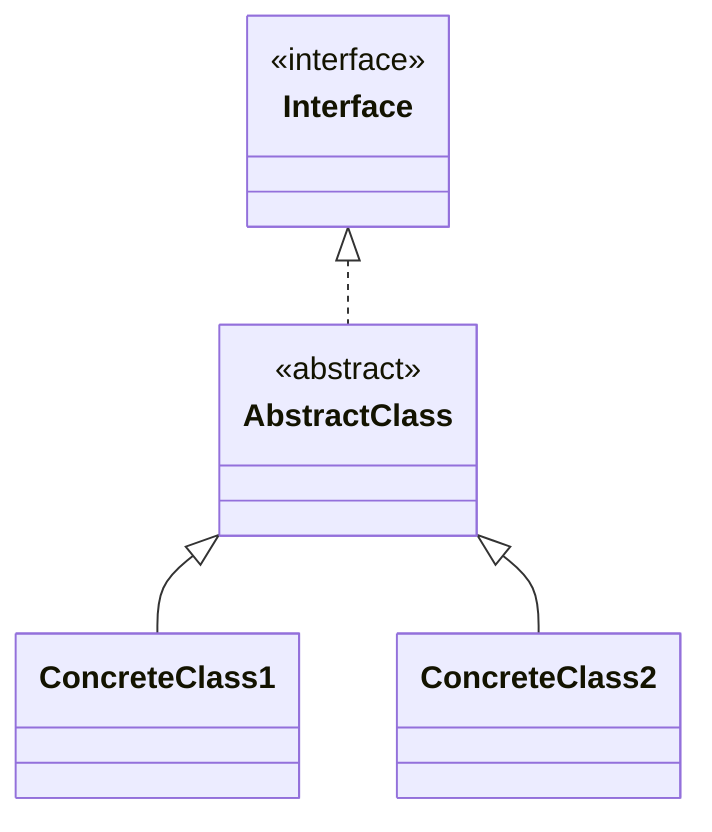
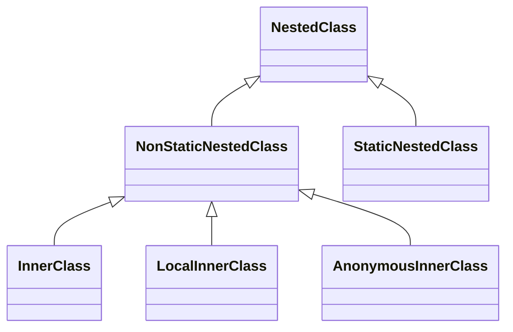

# Java Classes (Interfaces, abstract classes)

## Interfaces

### Motivation


```java
// Concrete Keyboard class
class Keyboard {
    public void useKeyboard() {
        System.out.println("Keyboard in use...");
    }
}

// Concrete Monitor class
class Monitor {
    public void useMonitor() {
        System.out.println("Monitor in use...");
    }
}

// Computer class directly depends on specific implementations
class Computer {
    private Keyboard keyboard;
    private Monitor monitor;

    public Computer(Keyboard keyboard, Monitor monitor) {
        this.keyboard = keyboard;
        this.monitor = monitor;
    }

    public void useKeyboard() {
        keyboard.useKeyboard();
    }

    public void useMonitor() {
        monitor.useMonitor();
    }
}

// Main class to demonstrate tight coupling
public class Main {
    public static void main(String[] args) {
        Keyboard keyboard = new Keyboard();
        Monitor monitor = new Monitor();

        Computer computer = new Computer(keyboard, monitor);
        computer.useKeyboard();  // Output: Keyboard in use...
        computer.useMonitor();   // Output: Monitor in use...
    }
}
```

**Limitations of This Approach**

1. **Tight Coupling**:
    - If we want to use a different type of keyboard (e.g., a **WirelessKeyboard**), we **must modify the `Computer` class** to support it.
    - If a third-party library provides a new `TouchScreen`, we'd have to modify `Computer` again.

3. **No Common Abstraction**:
    - `Keyboard` and `Monitor` have no shared abstraction, meaning **we cannot treat all peripherals generically**.
    - The `Computer` class must know about **every specific peripheral type**.

4. **Redundant Code**:
    - If we add more peripherals, we'd need to create separate methods like `useMouse()`, `usePrinter()`, etc., leading to **code duplication**.

**Using interfaces for decoupling the design**
   
```java
// Keyboard interface - Defines keyboard-specific behavior
interface Keyboard {
    void useKeyboard();
}

// Monitor interface - Defines monitor-specific behavior
interface Monitor {
    void useMonitor();
}

// Concrete implementation of a Mechanical Keyboard
class MechanicalKeyboard implements Keyboard {
    @Override
    public void useKeyboard() {
        System.out.println("Typing on a mechanical keyboard...");
    }
}

// Concrete implementation of an LED Monitor
class LEDMonitor implements Monitor {
    @Override
    public void disuseMonitorplay() {
        System.out.println("Displaying on an LED monitor...");
    }
}

// Computer class depends on the interfaces, not concrete implementations
class Computer {
    private Keyboard keyboard;
    private Monitor monitor;

    public Computer(Keyboard keyboard, Monitor monitor) {
        this.keyboard = keyboard;
        this.monitor = monitor;
    }

    public void useKeyboard() {
        keyboard.useKeyboard();
    }

    public void useMonitor() {
        monitor.useMonitor();
    }
}

// Main class to demonstrate decoupling
public class Main {
    public static void main(String[] args) {
        Keyboard keyboard = new MechanicalKeyboard();
        Monitor monitor = new LEDMonitor();

        Computer computer = new Computer(keyboard, monitor);

        computer.useKeyboard();  // Output: Typing on a mechanical keyboard...
        computer.useMonitor();   // Output: Displaying on an LED monitor...
    }
}
```

**How This Approach Helps**

1. **Decoupling**:
    - `Computer` depends on the `Keyboard` and `Monitor` interfaces, **not on specific implementations**.
    - We can easily swap in a **WirelessKeyboard** or **OLEDMonitor** without modifying `Computer`.

2. **Better Extensibility**:
    - We can add new keyboard and monitor types (e.g., `TouchscreenMonitor`, `GamingKeyboard`) **without modifying existing classes**.


### Declaring interfaces
An interface can be considered a special kind of class that can't be instantiated. To declare an interface, you should use the keyword `interface` instead of `class`. Key points:

* Interfaces cannot have constructors (no instantiation). 
* Methods in an interface are implicitly **public** and **abstract**.


```java
interface Mouse {
    public static final int K = 0; 

    void click();

    void doubleclick();
}
```


### Implementing and extending multiple interfaces

An interface can extend one or more other interfaces using the keyword `extends`:

```java
interface A { }
interface B { }
interface C { }

interface E extends A, B, C { }
```

A class can extend only one class and implement multiple interfaces:

```java
class A { }

interface B { }
interface C { }

class D extends A implements B, C { }
```

Multiple interfaces are often used in the standard library. The class String, for example, implements three interfaces at once:

```java
public final class String implements Serializable, Comparable<String>, CharSequence {
    // ...
}
```

### Marker interfaces

In some situations, an interface has no members at all. Such interfaces are called **marker** or **tagged interfaces**. For example, a well-known interface `Serializable` is a marker interface:

```java
public interface Serializable {
    
}
```

Other examples of marker interfaces are `Cloneable`, `Remote`, etc. They are used to provide essential information to the JVM.


### Methods with a body
#### Static methods

You can declare and implement a static method in an interface

```java
interface Car {
    static final double kmhToMph = 0.62;
    
    static double convertToMilesPerHour(double kmh) {
        return kmhToMph * kmh;
    }
    // ...
}
```

To use a static method you just need to invoke it directly from an interface

```
Car.convertToMilesPerHour(4.5);
```

The main purpose of interface static methods is to define utility functionality that is common for all classes implementing the interface. They help to avoid code duplication.


#### Default methods
**Interface methods are abstract by default**. One kind of method can have a body nevertheless. Such methods are called `default` and are available since Java 8.

```java
interface Feature {
    default void action() {
        System.out.println("Default action");
    }
}
```

Although default methods are implemented, you cannot invoke them directly from an interface like `Feature.action()`. You still need to have an object of a class that implements the interface:

```java
class FeatureImpl implements Feature {
    // ...
}
```

```
Feature feature = new FeatureImpl();
feature.action(); // Default action
```

If you want to customize a default method in a class, just override it like a regular method:

```java
class FeatureImpl implements Feature {
    public void action() {
        System.out.println("FeatureImpl-specific action");
    }
}
```

```
Feature feature = new FeatureImpl();
feature.action(); // FeatureImpl-specific action
```

Sometimes default methods are huge. To make it possible to decompose such methods, Java allows declaring private methods inside an interface:

```java
interface Feature {
    default void action() {
        String answer = subAction();
        System.out.println(answer);
    }

    private String subAction() {
        return "Default action";
    }
}
```

#### Why are they needed?
The main idea of an interface is declaring functionality. Default methods extend that idea. They don't just declare functionality but also implement it. **The main reason is supporting backward compatibility**. Let's consider an example.

Suppose you program a game that has several types of characters. These characters are able to move within a map. That is represented by the `Movable` interface:

```java
interface Movable {
    void stepForward();
    void stepBackward();
    void turnLeft();
    void turnRight();
}
```

So we have the interface and many classes that implement it. For example, `Batman`, `Robin`, `Joker` characters:

```java
class Batman implements Movable {
    public void stepForward() { /*...*/ }
    public void stepBackward() { /*...*/ }
    public void turnLeft() { /*...*/ }
    public void turnRight() {/*...*/ }
}
```

Then you decide that characters should be able to turn around. That means you need to add the `turnAround` method to the `Movable` interface **and implement the method for all classes implementing the interface** (if those classes are a lot this could become very time-consuming!). 

Another way is declaring a `default` method in the interface. Then you don't have to implement it in all classes.

```java
interface Movable {
    void stepForward();
    void stepBackward();
    void turnLeft();
    void turnRight();
    default void turnAround() {
        turnLeft();
        turnRight();
    }
}
```

## Abstract classes

An **abstract class** is a class declared with the keyword **`abstract`**. It represents an abstract concept that is used as a base class for subclasses. Abstract classes have some special features:

-   it's impossible to create an instance of an abstract class;
-   it can contain abstract methods (implemented in non-abstract subclasses);
-   it can contain non-abstract methods;
-   an abstract class can extend another class, including an abstract one;
-   it can contain a constructor.

As you can see, an abstract class has two main differences from regular (concrete) classes: no instances and abstract methods.

**Abstract methods** are declared by adding the keyword **`abstract`**. They have a declaration (modifiers, a return type, and a signature) but don't have an implementation. Each concrete (non-abstract) subclass must implement these methods.

Note, static methods can't be abstract!

```java
import java.awt.*;

public abstract class DrawingTool {

    protected Color color;

    protected DrawingTool(Color color) {
        this.color = color;
    }

    protected Color getColor() {
        return color;
    }

    protected void setColor(Color color) {
        this.color = color;
    }

    public abstract String draw(); // an abstract method
}
```

The class has a field, a constructor, two non-abstract methods and an abstract method.

Since `DrawingTool` is an abstract class we cannot create instances of this class:

```java
DrawingTool pencil = new DrawingTool(Color.RED); // this throws a compile time error
```

The method `draw()` is declared abstract because, at this level of abstraction, its implementation is unknown. Concrete subclasses of the class `DrawingTool` should have an implementation of this method.

```java
class Pencil extends DrawingTool {

    // It can have additional fields as well

    public Pencil(Color color) {
        super(color);
    }

    @Override
    public String draw(Curve curve) {
        return "Pencil drawing a " + curve.draw();
    }
}
```


```java
class Brush extends DrawingTool {

    // It can have additional fields as well

    public Pencil(Color color) {
        super(color);
    }

    @Override
    public String draw(Curve curve) {
        return "Brush drawing a " + curve.draw();
    }
}
```

**Abstract classes** and **interfaces** are both tools to achieve abstraction that allow us to declare abstract methods. We cannot create instances of abstract classes and interfaces directly, we can only do that through classes that inherit them.

Since Java 8, an interface can have default and static methods that contain an implementation. It makes interface more similar to an abstract class. So, the important question is: what is the difference between interfaces and abstract classes?



## Using abstract classes and interfaces together

Often interfaces and abstract classes are used together to make a class hierarchy more flexible. In this case, an abstract class contains common members and implements one or multiple interfaces, and concrete classes extend the abstract class and possibly implement other interfaces.

```java
interface DrawingTool {
    String draw(Curve curve);
}
```


```java
abstract class AbstractDrawingTool implements DrawingTool {
    protected Color color;

    protected AbstractDrawingTool(Color color) {
        this.color = color;
    }

    protected Color getColor() {
        return color;
    }

    protected void setColor(Color color) {
        this.color = color;
    }

    public abstract String draw(); // an abstract method
}
```

```java
class Pencil extends AbstractDrawingTool {

    // It can have additional fields as well

    public Pencil(Color color) {
        super(color);
    }

    @Override
    public String draw(Curve curve) {
        return "Pencil drawing a " + curve.draw();
    }
}
```

```java
class Brush extends AbstractDrawingTool {

    // It can have additional fields as well

    public Pencil(Color color) {
        super(color);
    }

    @Override
    public String draw(Curve curve) {
        return "Brush drawing a " + curve.draw();
    }
}
```

Using both concepts (interfaces and abstract classes) makes your code more flexible. Use suitable abstractions or their combination when designing your class hierarchies.

As an example, you may see class hierarchies in the standard Java class library. An example of that is the collections' hierarchy. It combines abstract classes and interfaces to make the hierarchy more maintainable and flexible to use in your code.

## Nested classes
You can call a class **nested** when it is declared inside another class.




### Anonymous Inner Classes

Java provides a mechanism for creating a class in a single statement without having to declare a new named class. Such classes are called **anonymous** because they don't have name identifiers.

Let's assume we have the following interface with two methods:

```java
interface SpeakingEntity {

    void sayHello();

    void sayBye();
}
```

Here, two anonymous classes are defined to represent an English-speaking person and a cat, respectively.

```java
SpeakingEntity englishSpeakingPerson = new SpeakingEntity() {

    @Override
    public void sayHello() {
        System.out.println("Hello!");
    }

    @Override
    public void sayBye() {
        System.out.println("Bye!");
    }
};
```

```java
SpeakingEntity cat = new SpeakingEntity() {

    @Override
    public void sayHello() {
        System.out.println("Meow!");
    }

    @Override
    public void sayBye() {
        System.out.println("Meow!");
    }
};
```

The anonymous class is declared and instantiated at the same time as an expression. It overrides both methods of the interface. We assign an instance of the **anonymous class** to the variable of the interface type. Now, we can invoke overridden methods:

```
englishSpeakingPerson.sayHello();
cat.sayBye();
```

### Inner Classes

In this example, the `Bow` class will be a non-static inner class of the `Cat` class. The `Bow` class will have access to the instance variables of the `Cat` class, such as the `color` and `size` of the bow.

```java
class Cat {
    private String name = "Whiskers";  // Instance variable of the Cat class
    private String color = "Red";      // Instance variable for Bow color
    
    // Non-static inner class Bow
    class Bow {
        void tieBow() {
            // Accessing outer class's instance fields
            System.out.println(name + " wears a " + color + " bow.");
        }
    }

    void createBow() {
        // Creating and using the Bow instance
        Bow bow = new Bow();
        bow.tieBow();  // Calling the method in the Bow class
    }
}

public class Main {
    public static void main(String[] args) {
        // Creating an instance of the Cat class
        Cat cat = new Cat();
        cat.createBow();  // Using the inner Bow class
    }
}
```

- The `Bow` class is a non-static inner class of `Cat`. It can access the `name` and `color` instance variables of `Cat`.
- The `createBow()` method in the `Cat` class creates an instance of `Bow` and calls the `tieBow()` method to display a message.
- The `main()` method creates an instance of `Cat` and invokes `createBow()` to use the inner `Bow` class.

### Static Inner Classes

Now, let's make the `Bow` class a static inner class. This means that `Bow` can only access static members of `Cat`, and we can instantiate it without needing an instance of `Cat`.

```java
class Cat {
    private static String type = "Persian";  // Static field in Cat class
    
    // Static inner class Bow
    static class Bow {
        void tieBow() {
            // Accessing outer class's static field
            System.out.println("The cat is a " + type + " and wears a bow.");
        }
    }
}

public class Main {
    public static void main(String[] args) {
        // Creating an instance of the static Bow class without an instance of Cat
        Cat.Bow bow = new Cat.Bow();
        bow.tieBow();  // Calling the method in the static Bow class
    }
}
```

- The `Bow` class is a static inner class of `Cat`. It can only access static fields, like `type`, from `Cat`.
- The `main()` method in `Main` creates an instance of the `Bow` class directly using `Cat.Bow`, without needing an instance of `Cat`.
- The `tieBow()` method of `Bow` is called to display a message about the cat type and the bow.

### Key Differences between Non-static and Static Inner Classes

- **Non-static Inner Class**: If each `Cat` object has its own bow and specific details about that bow (like color), we use the non-static inner class. Each `Bow` is tied to a specific `Cat` instance.

- **Static Inner Class**: If the `Bow` class doesn’t need to access instance-specific fields but is logically related to the `Cat` class, we can make it static. This is useful when the bow’s characteristics are universal for all cats, like the type of cat they belong to, rather than individual attributes like color.

## Resources
