# Java Classes (Interfaces, abstract classes)

## Motivation

The first task to solve is to make the player draw using different tools. Our employer gave us full freedom to handle the situation in the best way we see fit.

For the first proof of concept, we’re focusing only on using pencils to draw in different colors.

Our first intuition is to create two classes: **Player** and **Pencil**.

* The **Pencil** class provide methods to draw in red, green, or blue.
* The **Player** class can use a Pencil to perform drawing operations.

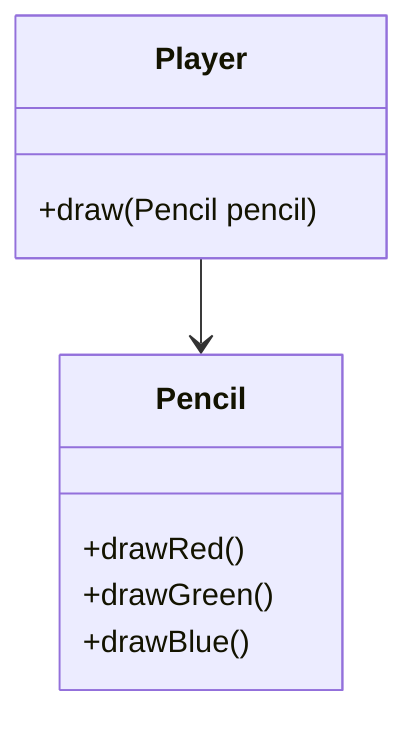

The only thing we need to do is to invoke the draw() method of the Player class and pass a Pencil instance.

We implement everything, and it works like a charm. However, we get our next task. On top of drawing with a Pencil, we must support drawing with a Brush, as well.

No problem, we introduce the Brush class and the Player.draw(Brush) method:


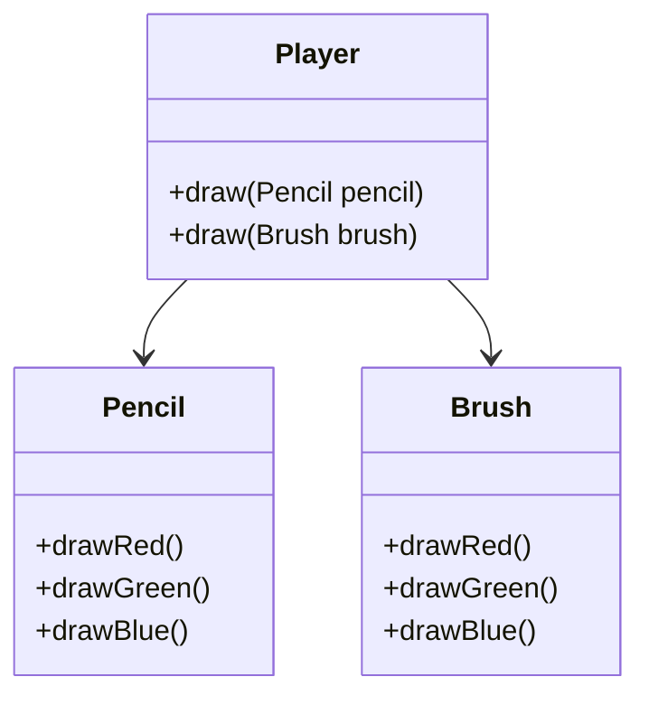

So far, so good. But then we face the next task: adding more drawing tools.

We could repeat the same process we did with the Pencil and Brush. However, we start wondering: how many other tools might we need to support? We look at the design notes and see dozens of additional tools coming up (markers, crayons, spray cans, highlighters, and even digital tablets).

**Limitations of This Approach:**

* **No Common Abstraction**: `Pencil` and `Brush` have no shared abstraction, meaning **we cannot treat all tools generically**.
* **Tight Coupling**: If we want to use a different type of Pencil or Brush (e.g., a RedPencil, LargeBrush), we must modify the `Player` class. The `Player` class **must know about every specific tool type**.
* **Dependencies follow the flow of control**: functions are executed in a predefined order, and later computations often depend directly on the results of earlier ones. As the system grows, the strict sequencing of operations can lead to rigid designs, where a small change in one part of the control flow may ripple through the entire program, increasing complexity and reducing maintainability.


Wouldn’t it be nice to have the possibility to design our application so that tools like `Pencil`, `Brush`, or even new ones such as `RedPencil` or `LargeBrush`, could all be treated in a *uniform way*? Instead of having the `DrawingApplication` class tightly coupled to every specific tool, we could define a **common abstraction** that all tools share.

## Using abstraction

Abstractions to the rescue! We decide that we’ll create an abstract DrawingTool class, which will be the superclass of the Pencil, Brush and all future classes.

Also, this way, we’ll need a single draw(DrawingTool) method in the Player class:

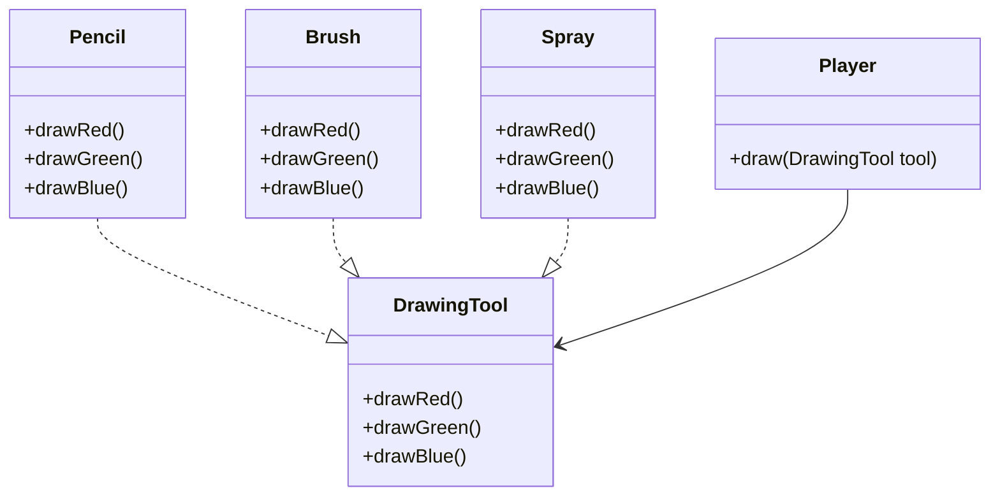

We can also use interfaces like `ColoredTool`, `Erasable`, and `Resizable`, which define separate capabilities that drawing tools can have.

Now, `Pencil`, `Brush`, and `Spray` can implement one or more of these interfaces according to their abilities.

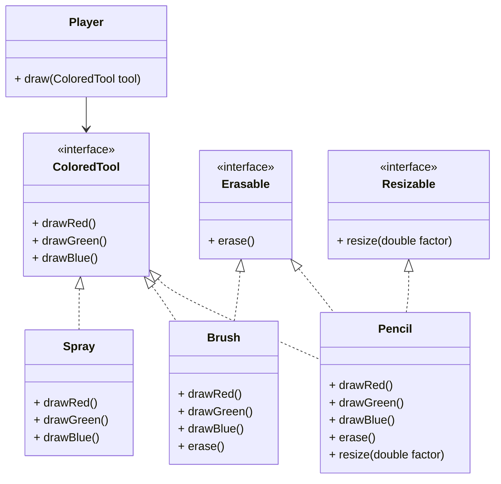

By using **abstractions**, we gain several advantages:

* We can express the *essential capabilities* of all tools without tying the application to a concrete implementation.
* New tools can be added without modifying existing code, improving **extensibility** and **maintainability**.
* Dependencies are no longer strictly tied to the flow of control; instead, the application depends on stable abstractions, making the overall design more flexible and robust.

This is exactly where object-oriented programming (OOP) provides value: by separating the *what* (interfaces, abstract behavior) from the *how* (concrete implementations).

## Interfaces
An interface can be considered a special kind of class that can't be instantiated. An interface represents an abstract concept by defining only behavior, expressed through method declarations without implementation. To declare an interface, you should use the keyword `interface` instead of `class`. Key points:

* Interfaces cannot have constructors, as they cannot be instantiated.
* **All** methods declared in an interface are implicitly **public** and **abstract**.
* Other classes can **implement** an interface by providing concrete implementations for its abstract methods.
* A common drawback of using interfaces directly is the potential for **code duplication** across implementing classes.

**Abstract methods** are declared by adding the keyword **`abstract`**. They have a declaration (modifiers, a return type, and a signature) but don't have an implementation. Each concrete (non-abstract) subclass must implement these methods.

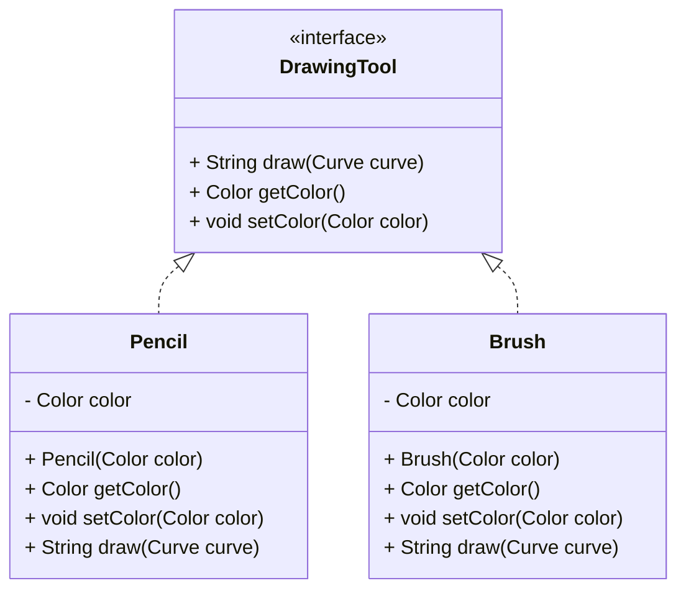

```java
interface DrawingTool {
    void draw(Curve curve);
    Color getColor();
    void setColor(Color color);
}
```

```java
class Pencil implements DrawingTool {
    Color color;
    
    public Pencil(Color color) {
        this.color = color;
    }
    
    public Color getColor() {
        return color;
    }
    
    public void setColor(Color color) {
        this.color = color;
    }

    @Override
    public String draw(Curve curve) {
        return "Pencil drawing a " + curve.draw();
    }
}
```


```java
class Brush implements DrawingTool {
   Color color;

   public Brush(Color color) {
      this.color = color;
   }

   public Color getColor() {
      return color;
   }

   public void setColor(Color color) {
      this.color = color;
   }

    @Override
    public String draw(Curve curve) {
        return "Brush drawing a " + curve.draw();
    }
}
```

> Connection to SOLID Principles
>
>Programming to interfaces makes it easier to follow multiple SOLID principles:
>
>- **Single Responsibility Principle (SRP):**  
   > By creating small interfaces, we define clear responsibilities for implementing
   classes. This makes it easier to follow SRP, especially when classes implement only
   a handful—or even a single—interface.
>
>- **Open/Closed Principle (OCP):**  
   >  With loose coupling and hidden implementations, following OCP becomes straightforward. Since client code depends only on the interface, new subclasses can be introduced without modifying existing code.
>
>- **Liskov Substitution Principle (LSP):**  
   >  LSP is not directly tied to this technique. However, careful design of the inheritance hierarchy is required to ensure substitutability.
>
>- **Interface Segregation Principle (ISP):**  
   >  ISP is a good practice to follow when programming interfaces. Defining small, well-scoped interfaces helps adhere to this principle.
>
>- **Dependency Inversion Principle (DIP):**  
   >  By depending on abstractions, much of DIP is already achieved. The final step is to rely on externally provided dependencies rather than instantiating them internally.


### Key rules

An interface can extend one or more other interfaces using the keyword `extends`:

```java
interface A { }
interface B { }
interface C { }

interface E extends A, B, C { }
```

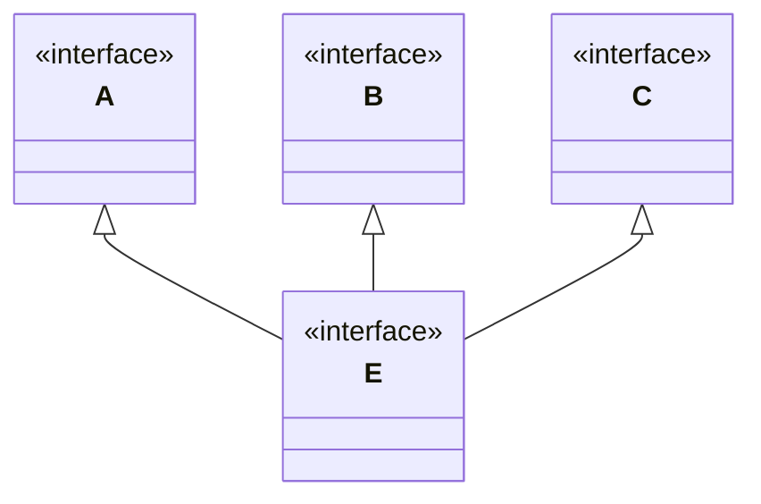

A class can extend only one class and implement multiple interfaces:

```java
class A { }

interface B { }
interface C { }

class D extends A implements B, C { }
```

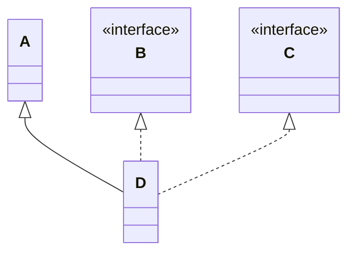

Multiple interfaces are often used in the standard library. The class String, for example, implements three interfaces at once:

```java
public final class String implements Serializable, Comparable<String>, CharSequence {
    // ...
}
```

### Methods with a body
#### Static methods

You can declare and implement a static method in an interface

```java
interface DrawingTool {
    static final Color DEFAULT_COLOR = Color.BLACK;
    
    static boolean hasSameColor(DrawingTool a, DrawingTool b) {
        return a.getColor().equals(b.getColor());
    }
    // ...
}
```

To use a static method you just need to invoke it directly from an interface

```
DrawingTool.hasSameColor(pencil, brush);
```

The main purpose of interface static methods is to define utility functionality that is common for all classes implementing the interface. They help to avoid code duplication.

#### Default methods
**Interface methods are abstract by default**. One kind of method can have a body nevertheless. Such methods are called `default` and are available since Java 8.

Suppose many classes already implemented the `DrawingTool` interface. For example `pencil`, `pen`, `brush`, `fuzzybrush` etc. They all draw in different ways when `draw()` is called.

```java
interface DrawingTool {
    void draw(Curve curve);
    Color getColor();
    void setColor(Color color);
}
```

Then you decide that all tools should be always able to draw with a default color. That means:
* you need to add the `drawWithDefaultColor` method to the `DrawingTool` interface **and modify all implementing classes**
* **if implementing classes are a lot this could become very time-consuming!**. 

**The key motivation behind default methods in interfaces is supporting backward compatibility**. `default` methods provide a quicker solution in that you don't have to implement them in all classes.

```java
interface DrawingTool {
    static final Color DEFAULT_COLOR = Color.BLACK;
    
    void draw(Curve curve);
    Color getColor();
    void setColor(Color color);

    default void drawWithDefaultColor(Curve curve) {
        Color original = getColor();
        setColor(DEFAULT_COLOR);
        draw(curve);
        setColor(original);
    }
}
```


Although default methods are implemented, you cannot invoke them directly from an interface like `DrawingTool.drawWithDefaultColor()`. You still need to have an object of a class that implements the interface:

```
DrawingTool pencil = new Pencil();
pencil.drawWithDefaultColor();
```

#### Private methods
Sometimes default methods are huge. To make it possible to decompose such methods, **Java allows declaring private methods inside an interface**:

```java
interface Feature {
    default void action() {
        String answer = subAction();
        System.out.println(answer);
    }

    private String subAction() {
        return "Default action";
    }
}
```


## Abstract classes

An **abstract class** is a class declared using the `abstract` keyword. It represents a **generalized concept** meant to be **extended by subclasses**, rather than instantiated directly.

* It can define **both abstract methods** (without implementation) and **concrete methods** (with implementation).
* It can include **constructors**, which are typically used by its subclasses.
* You **cannot create instances** of an abstract class directly — it may contain methods that are not fully implemented.
* An abstract class can **extend another class**, including another abstract class.

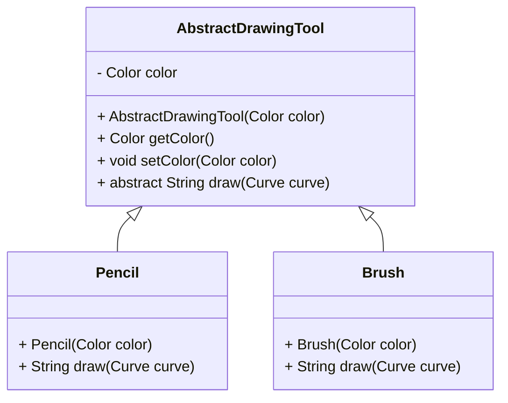

```java
public abstract class AbstractDrawingTool {

    protected Color color;

    protected AbstractDrawingTool(Color color) {
        this.color = color;
    }

    protected Color getColor() {
        return color;
    }

    protected void setColor(Color color) {
        this.color = color;
    }

    public abstract String draw(Curve curve); // an abstract method
}
```

Since `AbstractDrawingTool` is an abstract class we cannot create instances of this class:

```java
AbstractDrawingTool pencil = new AbstractDrawingTool(Color.RED); // this throws a compile time error
```

The method `draw()` is declared abstract because, at this level of abstraction, its implementation is unknown. Concrete subclasses of the class `AbstractDrawingTool` should have an implementation of this method.

```java
class Pencil extends AbstractDrawingTool {

    // It can have additional fields as well

    public Pencil(Color color) {
        super(color);
    }

    @Override
    public String draw(Curve curve) {
        return "Pencil drawing a " + curve.draw();
    }
}
```


```java
class Brush extends AbstractDrawingTool {

    // It can have additional fields as well

    public Brush(Color color) {
        super(color);
    }

    @Override
    public String draw(Curve curve) {
        return "Brush drawing a " + curve.draw();
    }
}
```

## In practice

### Example 1

Interfaces and abstract classes can be combined to create a flexible and reusable class hierarchy.

* **Interface**: Defines the core behavior that all drawing tools must provide (e.g., a `draw` method).

* **Abstract Class**: Implements common state and behavior (like managing the tool’s color) and provides a foundation for concrete drawing tools.

* **Concrete Classes**: Specialize behavior for each type of tool (e.g., `Pencil` or `Brush`) and provide specific implementations of the `draw` method.

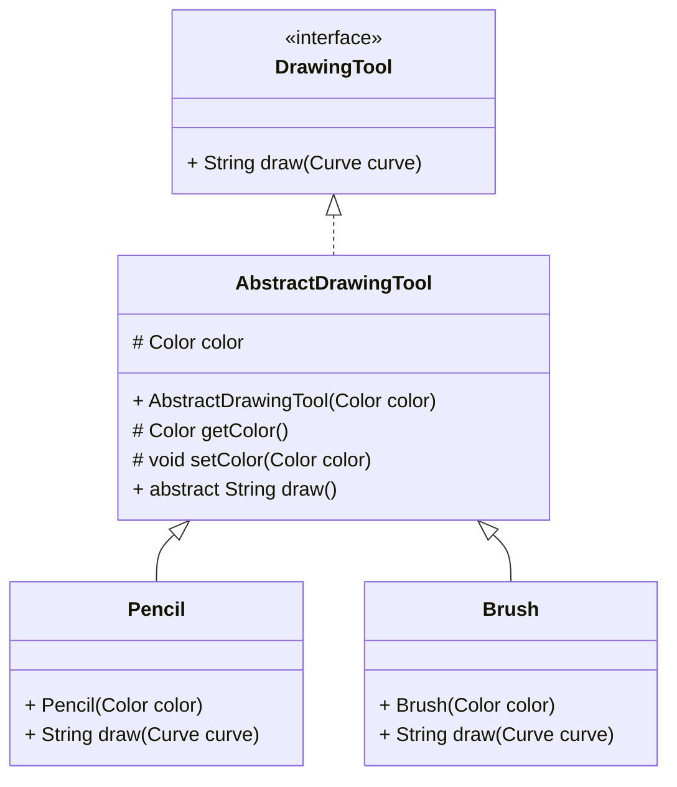

```java
interface DrawingTool {
    String draw(Curve curve);
}
```


```java
abstract class AbstractDrawingTool implements DrawingTool {
    protected Color color;

    protected AbstractDrawingTool(Color color) {
        this.color = color;
    }

    protected Color getColor() {
        return color;
    }

    protected void setColor(Color color) {
        this.color = color;
    }

    public abstract String draw(Curve curve); // an abstract method
}
```

```java
class Pencil extends AbstractDrawingTool {

    // It can have additional fields as well

    public Pencil(Color color) {
        super(color);
    }

    @Override
    public String draw(Curve curve) {
        return "Pencil drawing a " + curve.draw();
    }
}
```

```java
class Brush extends AbstractDrawingTool {

    // It can have additional fields as well

    public Brush(Color color) {
        super(color);
    }

    @Override
    public String draw(Curve curve) {
        return "Brush drawing a " + curve.draw();
    }
}
```

### Example 2

Here is another example of **mixing abstract classes and interfaces**, this time to model **two types of bank accounts**: a **SavingsAccount** and a **CheckingAccount**. The interface defines general bank operations, and the abstract class handles shared logic (e.g., balance management).

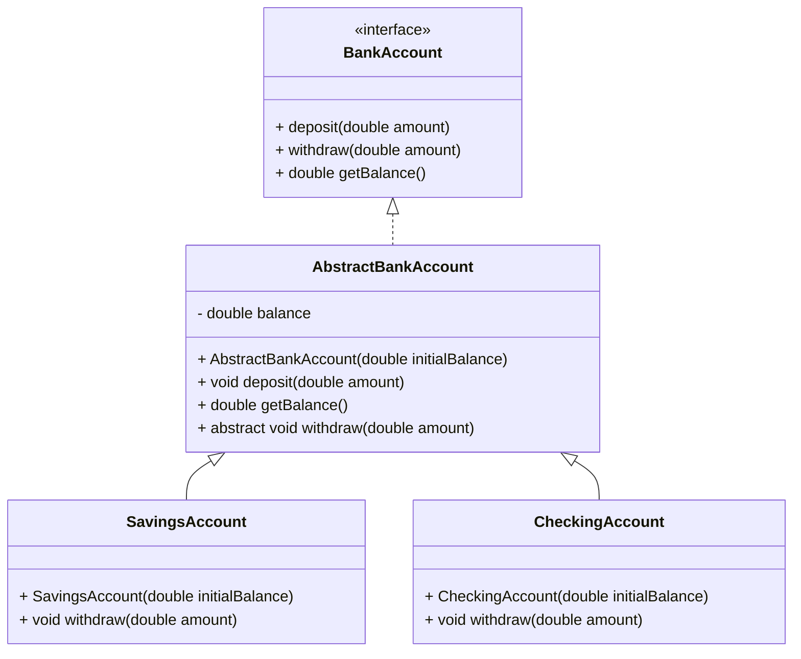

```java
interface BankAccount {
    void deposit(double amount);
    void withdraw(double amount);
    double getBalance();
}
```

```java
abstract class AbstractBankAccount implements BankAccount {
    protected double balance;

    public AbstractBankAccount(double initialBalance) {
        this.balance = initialBalance;
    }

    @Override
    public void deposit(double amount) {
        if (amount > 0) {
            balance += amount;
        }
    }

    @Override
    public double getBalance() {
        return balance;
    }

    @Override
    public abstract void withdraw(double amount);
}
```

```java
class SavingsAccount extends AbstractBankAccount {

    public SavingsAccount(double initialBalance) {
        super(initialBalance);
    }

    @Override
    public void withdraw(double amount) {
        if (amount > 0 && balance >= amount) {
            balance -= amount;
        } else {
            throw new IllegalArgumentException("Insufficient funds in SavingsAccount");
        }
    }
}
```

```java
class CheckingAccount extends AbstractBankAccount {

    private static final double OVERDRAFT_LIMIT = 100.0;

    public CheckingAccount(double initialBalance) {
        super(initialBalance);
    }

    @Override
    public void withdraw(double amount) {
        if (amount > 0 && balance + OVERDRAFT_LIMIT >= amount) {
            balance -= amount;
        } else {
            throw new IllegalArgumentException("Overdraft limit exceeded in CheckingAccount");
        }
    }
}
```

### Example 3

The **Java Collections Framework** is a classic example of how **interfaces and abstract classes are combined** to create a **flexible and extensible hierarchy**.

* **Interfaces** define *what* a collection can do (e.g., `add`, `remove`, `iterate`).
* **Abstract classes** provide *reusable logic* and *partial implementations* to reduce code duplication.
* **Concrete classes** specialize behavior for different use cases (e.g., lists vs. sets vs. queues).

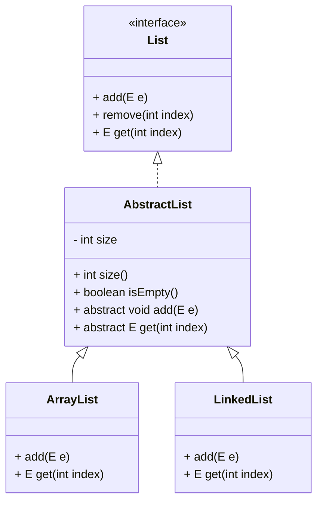

## Summary

| Feature                  | **Interface**                             | **Abstract Class**                             | **Concrete Class**            |
| ------------------------ |-------------------------------------------|------------------------------------------------| ----------------------------- |
| **Purpose**              | Define *what* should be done              | Define *partial behavior* and common structure | Provide *full implementation* |
| **Implementation**       | No method bodies (except `default` methods) | Can include both abstract and concrete methods | All methods are implemented   |
| **Can be instantiated?** | ❌ No                                      | ❌ No                                           | ✅ Yes                         |
| **Constructors**         | ❌ Not allowed                             | ✅ Can define constructors                      | ✅ Can define and use constructors |
| **Fields**               | Only `public static final` constants      | Full use                                       | Full use                |
| **Use Case**             | Define capabilities or roles              | Share common behavior and enforce contracts    | Actual working implementation |
| **Polymorphism**         | ✅ Yes                                     | ✅ Yes                                          | ✅ Yes                         |


## Resources
- https://www.baeldung.com/java-interface-vs-abstract-class
- https://www.baeldung.com/java-interface-default-method-vs-abstract-class
- https://www.baeldung.com/java-abstract-class
- https://www.baeldung.com/java-interfaces

