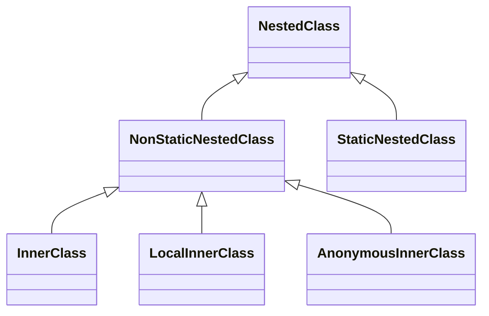
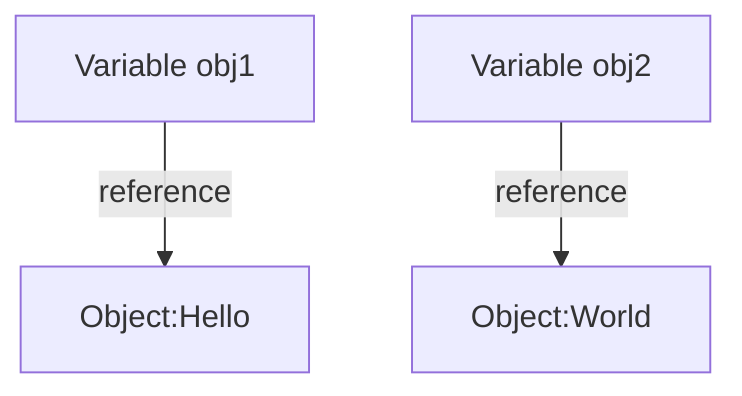
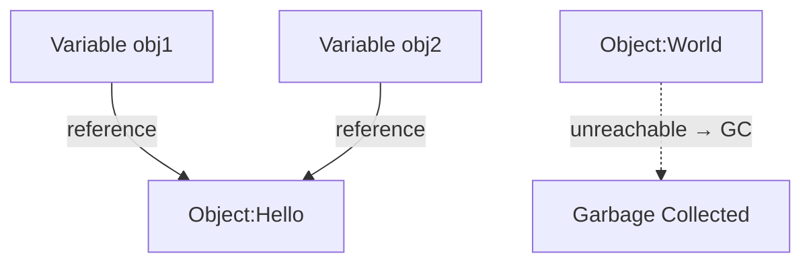

# Java Classes (Details)

## Immutability

There is an important concept in programming called immutability. **Immutable as applied to an object,  means that there are no ways to change its state, i.e. none of its methods change its state, and it has no non-final fields**. 
* Immutability means that an object always stores the same values. If we need to modify these values, we should create a new object. 
* A common example is the standard **`String`** class. Strings are immutable objects so all string operations produce a new string. Immutable types allow you to write programs with fewer errors.

**The class `Patient` is not immutable because it is possible to change any field of an object.**

```
Patient patient = new Patient();

patient.name = "Mary";
patient.name = "Alice";
```

### Records
Passing immutable data between objects is one of the most common tasks in many applications. 
* Classes to simply hold data, such as database results, query results, or information from a service. 
* In many cases, this data is immutable, since immutability ensures the validity of the data.

To accomplish this, we create data classes with the following:
* private, final field for each piece of data
* getter for each field
* public constructor with a corresponding argument for each field
* equals method that returns true for objects of the same class when all fields match
* hashCode method that returns the same value when all fields match
* toString method that includes the name of the class and the name of each field and its corresponding value

For example, we can create a simple Person data class with a name and address:

```java
public class Person {
    private final String name;
    private final String address;

    public Person(String name, String address) {
        this.name = name;
        this.address = address;
    }

    public String getName() {
        return name;
    }
    
    public String getAddress() {
        return address;
    }

    @Override
    public int hashCode() {
        return Objects.hash(name, address);
    }

    @Override
    public boolean equals(Object obj) {
        if (this == obj) {
            return true;
        } else if (!(obj instanceof Person)) {
            return false;
        } else {
            Person other = (Person) obj;
            return Objects.equals(name, other.name)
              && Objects.equals(address, other.address);
        }
    }

    @Override
    public String toString() {
        return "Person [name=" + name + ", address=" + address + "]";
    }
}
```

**Records are immutable data classes that require only the type and name of fields.** The equals, hashCode, and toString methods, as well as the private, final fields and public constructor, are generated by the Java compiler. To create a Person record, we can simply use:

```java
public record Person (String name, String address) {}
```

### Enums
**enum** make the code more readable, allow for compile-time checking, document the list of accepted values upfront, and avoid unexpected behavior due to invalid values being passed in.

```java
public class Pizza {
    public enum PizzaStatus {
        NOT_ASSIGNED,
        ORDERED,
        READY,
        DELIVERED
    }
    private PizzaStatus status = PizzaStatus.NOT_ASSIGNED;
    
    public boolean isDeliverable() {
        return status == PizzaStatus.READY;
    }
}
```

A basic enum type in Java does not contain any public fields, nor any methods that change state. So in this case it would be immutable. However, you can add fields and methods to an enum type. If you add methods that allow you to set fields, for example, then that enum type would be mutable. See the *Resources* Section at the end for more details.


## Nested classes
You can call a class **nested** when it is declared inside another class.




### Anonymous Inner Classes

Java provides a mechanism for creating a class in a single statement without having to declare a new named class. Such classes are called **anonymous** because they don't have name identifiers.

Let's assume we have the following interface with two methods:

```java
interface SpeakingEntity {

    void sayHello();

    void sayBye();
}
```

Here, two anonymous classes are defined to represent an English-speaking person and a cat, respectively.

```java
SpeakingEntity englishSpeakingPerson = new SpeakingEntity() {

    @Override
    public void sayHello() {
        System.out.println("Hello!");
    }

    @Override
    public void sayBye() {
        System.out.println("Bye!");
    }
};
```

```java
SpeakingEntity cat = new SpeakingEntity() {

    @Override
    public void sayHello() {
        System.out.println("Meow!");
    }

    @Override
    public void sayBye() {
        System.out.println("Meow!");
    }
};
```

The anonymous class is declared and instantiated at the same time as an expression. It overrides both methods of the interface. We assign an instance of the **anonymous class** to the variable of the interface type. Now, we can invoke overridden methods:

```
englishSpeakingPerson.sayHello();
cat.sayBye();
```

### Inner Classes

In this example, the `Bow` class will be a non-static inner class of the `Cat` class. The `Bow` class will have access to the instance variables of the `Cat` class, such as the `color` and `size` of the bow.

```java
class Cat {
    private String name = "Whiskers";  // Instance variable of the Cat class
    private String color = "Red";      // Instance variable for Bow color
    
    // Non-static inner class Bow
    class Bow {
        void tieBow() {
            // Accessing outer class's instance fields
            System.out.println(name + " wears a " + color + " bow.");
        }
    }

    void createBow() {
        // Creating and using the Bow instance
        Bow bow = new Bow();
        bow.tieBow();  // Calling the method in the Bow class
    }
}

public class Main {
    public static void main(String[] args) {
        // Creating an instance of the Cat class
        Cat cat = new Cat();
        cat.createBow();  // Using the inner Bow class
    }
}
```

- The `Bow` class is a non-static inner class of `Cat`. It can access the `name` and `color` instance variables of `Cat`.
- The `createBow()` method in the `Cat` class creates an instance of `Bow` and calls the `tieBow()` method to display a message.
- The `main()` method creates an instance of `Cat` and invokes `createBow()` to use the inner `Bow` class.

### Static Inner Classes

Now, let's make the `Bow` class a static inner class. This means that `Bow` can only access static members of `Cat`, and we can instantiate it without needing an instance of `Cat`.

```java
class Cat {
    private static String type = "Persian";  // Static field in Cat class
    
    // Static inner class Bow
    static class Bow {
        void tieBow() {
            // Accessing outer class's static field
            System.out.println("The cat is a " + type + " and wears a bow.");
        }
    }
}

public class Main {
    public static void main(String[] args) {
        // Creating an instance of the static Bow class without an instance of Cat
        Cat.Bow bow = new Cat.Bow();
        bow.tieBow();  // Calling the method in the static Bow class
    }
}
```

- The `Bow` class is a static inner class of `Cat`. It can only access static fields, like `type`, from `Cat`.
- The `main()` method in `Main` creates an instance of the `Bow` class directly using `Cat.Bow`, without needing an instance of `Cat`.
- The `tieBow()` method of `Bow` is called to display a message about the cat type and the bow.

### Key Differences between Non-static and Static Inner Classes

- **Non-static Inner Class**: If each `Cat` object has its own bow and specific details about that bow (like color), we use the non-static inner class. Each `Bow` is tied to a specific `Cat` instance.

- **Static Inner Class**: If the `Bow` class doesn’t need to access instance-specific fields but is logically related to the `Cat` class, we can make it static. This is useful when the bow’s characteristics are universal for all cats, like the type of cat they belong to, rather than individual attributes like color.

## Garbage collection

### Operations on references
Only the relational operators == and != are defined for object references. They are both evaluated on references (not the objects' content) and tell you whether two references point to the same object in memory.

* More than one variable can refer to the same object.
* A variable can be **null** which means it is not initialized yet.

```java
public static void main(String[] args) {
    Patient p1 = new Patient();
    Patient p2 = patient;
    Patient p3 = null;
    
    if (p1 == p2) {
        // true
    }
    
    if (p1 == p3) {
        // false
    }
}
```


### Garbage collector
Given the name, it seems like _Garbage Collection_ would deal with finding and deleting the garbage from the memory. However, in reality, _Garbage Collection_ tracks each and every object available in the JVM heap space, and removes the unused ones.

Basically, _GC_ works in two simple steps, known as Mark and Sweep:

* **Mark** this is where the garbage collector identifies which pieces of memory are in use and which aren’t.
* **Sweep** this step removes objects identified during the “mark” phase.


```java
class Example {
    String name;

    Example(String name) {
        this.name = name;
    }
}

public class Main {
    public static void main(String[] args) {
        Example obj1 = new Example("Hello");
        Example obj2 = new Example("World"); // different object
    }
}
```



```java
class Example {
    String name;

    Example(String name) {
        this.name = name;
    }
}

public class Main {
    public static void main(String[] args) {
        Example obj1 = new Example("Hello");
        Example obj2 = new Example("World"); // different object
        
        obj2 = obj1;
    }
}
```



**Advantages:**

Memory management is automatic: developers don’t need to manually allocate or deallocate memory. This helps prevent common issues such as [*dangling pointers*](https://en.wikipedia.org/wiki/Dangling_pointer) and [*memory leaks*](https://en.wikipedia.org/wiki/Memory_leak). In the example below, we free up memory from a large collection by setting its reference to null.

```java
import java.util.ArrayList;
import java.util.List;

public class LargeCollectionExample {
    public static void main(String[] args) {
        // Create a large collection
        List<String> bigList = new ArrayList<>();
        for (int i = 0; i < 1_000_000; i++) {
            bigList.add("Item " + i);
        }
        
        // Reference set to null, list is now eligible for GC
        bigList = null;
    }
}
```

**Disadvantages:**

Automatic memory management is generally less efficient than carefully tuned manual allocation and deallocation. Because the JVM must continuously track object references, this introduces extra CPU overhead.

Developers have no direct control over when the garbage collector runs. As a result, CPU time may be spent on freeing unused objects at unpredictable moments, potentially impacting performance.

Some examples in which the issue is discussed:
- [9 Tips to Reduce Long Garbage Collection Pauses](https://blog.gceasy.io/reduce-long-garbage-collection-pauses/?utm_source=chatgpt.com) – Practical strategies to minimize GC pause times by tuning JVM settings and selecting appropriate GC algorithms.

- [How I Reduced GC Pause from 1s to 50ms in a High-Load Java Application](https://medium.com/@sibinraziya/how-i-reduced-gc-pause-from-1s-to-50ms-in-a-high-load-java-application-879613d5d8f4?utm_source=chatgpt.com) – A case study detailing the reduction of GC pauses in a high-throughput Java service.

- [Reducing Garbage Collection Pause Time](https://www.dynatrace.com/resources/ebooks/javabook/reduce-garbage-collection-pause-time/?utm_source=chatgpt.com) – Methods to reduce GC pause times, including parallel and concurrent garbage collection strategies.


### GC Implementations

* **Serial GC**: A simple, single-threaded collector. Best suited for applications with a small memory footprint and single-CPU environments.
* **Parallel GC**: A multi-threaded collector focused on maximizing throughput. Well-suited for applications where raw performance is more important than pause times.
* **G1 GC**: A multi-threaded collector designed to balance throughput and latency. It divides the heap into regions and performs garbage collection incrementally to reduce long pauses.
* **ZGC and Shenandoah**: Modern low-latency collectors introduced in newer versions of the JDK (from OpenJDK 15 onward). They aim to keep GC pause times consistently short, even with very large heaps.


## Resources
* https://www.baeldung.com/jvm-garbage-collectors
* https://www.baeldung.com/java-record-keyword
* https://www.baeldung.com/a-guide-to-java-enums
