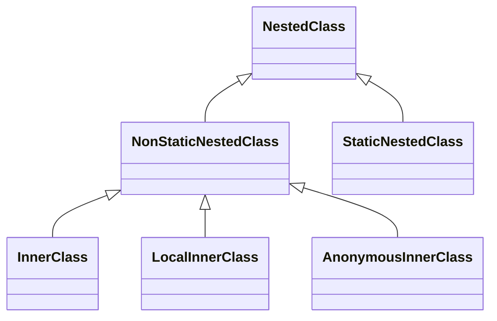

# Java Classes (Details)


## Immutability

There is an important concept in programming called immutability. **Immutable as applied to an object,  means that there are no ways to change its state, i.e. none of its methods change its state, and it has no non-final fields**. 
* Immutability means that an object always stores the same values. If we need to modify these values, we should create a new object. 
* A common example is the standard **`String`** class. Strings are immutable objects so all string operations produce a new string. Immutable types allow you to write programs with fewer errors.

**The class `Patient` is not immutable because it is possible to change any field of an object.**

```
Patient patient = new Patient();

patient.name = "Mary";
patient.name = "Alice";
```

### Records
Passing immutable data between objects is one of the most common tasks in many applications. 
* Classes to simply hold data, such as database results, query results, or information from a service. 
* In many cases, this data is immutable, since immutability ensures the validity of the data.

To accomplish this, we create data classes with the following:
* private, final field for each piece of data
* getter for each field
* public constructor with a corresponding argument for each field
* equals method that returns true for objects of the same class when all fields match
* hashCode method that returns the same value when all fields match
* toString method that includes the name of the class and the name of each field and its corresponding value

For example, we can create a simple Person data class with a name and address:

```java
public class Person {
    private final String name;
    private final String address;

    public Person(String name, String address) {
        this.name = name;
        this.address = address;
    }

    public String getName() {
        return name;
    }
    
    public String getAddress() {
        return address;
    }

    @Override
    public int hashCode() {
        return Objects.hash(name, address);
    }

    @Override
    public boolean equals(Object obj) {
        if (this == obj) {
            return true;
        } else if (!(obj instanceof Person)) {
            return false;
        } else {
            Person other = (Person) obj;
            return Objects.equals(name, other.name)
              && Objects.equals(address, other.address);
        }
    }

    @Override
    public String toString() {
        return "Person [name=" + name + ", address=" + address + "]";
    }
}
```

**Records are immutable data classes that require only the type and name of fields.** The equals, hashCode, and toString methods, as well as the private, final fields and public constructor, are generated by the Java compiler. To create a Person record, we can simply use:

```java
public record Person (String name, String address) {}
```

### Enums
**enum** make the code more readable, allow for compile-time checking, document the list of accepted values upfront, and avoid unexpected behavior due to invalid values being passed in.

```java
public class Pizza {
    public enum PizzaStatus {
        NOT_ASSIGNED,
        ORDERED,
        READY,
        DELIVERED
    }
    private PizzaStatus status = PizzaStatus.NOT_ASSIGNED;
    
    public boolean isDeliverable() {
        return status == PizzaStatus.READY;
    }
}
```

A basic enum type in Java does not contain any public fields, nor any methods that change state. So in this case it would be immutable. However, you can add fields and methods to an enum type. If you add methods that allow you to set fields, for example, then that enum type would be mutable. See the *Resources* Section at the end for more details.

## Garbage collection

### Sharing references
More than one variable can refer to the same object.

```java
public static void main(String[] args) {
    Patient p1 = new Patient();
    Patient p2 = patient;
}
```

### Operations on references
Only the relational operators == and != are defined for object reference:
* The equality condition tells you whether two references point to the same object in memory 
* The equality condition is evaluated on the values of the references (i.e., addresses in memory)!

As for any reference type, a variable of a class type can be **null** which means it is not initialized yet.

```java
Patient patient = null;
```

### Garbage collector
Given the name, it seems like _Garbage Collection_ would deal with finding and deleting the garbage from the memory. However, in reality, _Garbage Collection_ tracks each and every object available in the JVM heap space, and removes the unused ones.

Basically, _GC_ works in two simple steps, known as Mark and Sweep:

* **Mark** this is where the garbage collector identifies which pieces of memory are in use and which aren’t.
* **Sweep** this step removes objects identified during the “mark” phase.

**Advantages:**
* No manual memory allocation/deallocation handling because unused memory space is automatically handled by _GC_
* No overhead of handling _[Dangling Pointer](https://en.wikipedia.org/wiki/Dangling_pointer)_
* Automatic _[Memory Leak](https://en.wikipedia.org/wiki/Memory_leak)_ management

**Disadvantages:**
* Since _JVM_ has to keep track of object reference creation/deletion, this activity requires more CPU power than the original application. It may affect the performance of requests which require large memory. 
* Programmers have no control over the scheduling of CPU time dedicated to freeing objects that are no longer needed. 
* Using some GC implementations might result in the application stopping unpredictably. 
* Automatized memory management won’t be as efficient as the proper manual memory allocation/deallocation.

**GC Implementations**
* Serial: the single-threaded GC, a simple but efficient collector for small memory footprint
* Parallel: the multithreaded GC, ideal for throughput-oriented applications 
* G1: the multithreaded GC, designed to offer a good tradeoff among latency and throughput
* Z and Shenandoah: the new low-latency GCs available from OpenJDK 15


## Wrapper classes

Each primitive type has a class dedicated to it. These classes are known as **wrappers**, and they are **immutable** (just like strings). Wrapper classes can be used in different situations:

* when a variable can be `null` (absence of a value); 
* when you want to use special methods of these classes (e.g., for converting to and from strings).
* when you need to store values in generic collections (will be considered in the next topics); 

The following table lists all primitive types and the corresponding wrapper classes.
As you can see, Java provides eight wrapper classes: one for each primitive type.

| Primitive | Wrapper   |
|-----------|-----------|
| boolean   | Boolean   |
| byte      | Byte      |
| char      | Character |
| int       | Integer   |
| float     | Float     |
| double    | Double    |
| long      | Long      |
| short     | Short     |

### Boxing and unboxing

**Boxing** is the conversion of primitive types to objects of corresponding wrapper classes. **Unboxing** is the reverse process. The following code illustrates both processes:

```java
public static void main(String[] args) {
    int primitive = 100;
    Integer reference;
    
    reference = Integer.valueOf(primitive);         // boxing
    int anotherPrimitive = reference.intValue();    // unboxing
}

```

```java
public static void main(String[] args) {
    double primitive = 10.8;
    Double reference;
    
    reference = primitive;                          // auto-boxing
    double anotherPrimitive = reference;            // auto-unboxing
}
```

### Converting primitive types to and from strings

Wrapper classes can also be used for converting primitive types into strings and vice-versa.

```java
String s = Integer.valueOf(34).toString();
int n = Integer.valueOf("34").intValue();
```

### Comparing wrappers

Just like for any reference type, the operator `==` checks whether two wrapper objects are actually equal, i.e. if they refer to the same object in memory. The method `equals` , on the other hand, checks whether two wrapper objects are meaningfully equal, for example, it checks if two wrappers or strings have the same value.

```java
public static void main(String[] args) {
    Long i1 = Long.valueOf("2000");
    Long i2 = Long.valueOf("2000");
    System.out.println(i1 == i2);      // false
    System.out.println(i1.equals(i2)); // true
}
```

Do not forget about this feature when working with wrappers. Even though they correspond to primitive types, wrapper objects are reference types!

### NPE when unboxing

There is one possible problem when unboxing. If the wrapper object is `null`, the unboxing throws a`NullPointerException`**.**

```java
Long longVal = null;
long primitiveLong = longVal; // It throws an NPE
```

```java
Integer n1 = 50;
Integer n2 = null;
Integer result = n1 / n2; // It throws an NPE
```

## Nested classes
You can call a class **nested** when it is declared inside another class.




### Anonymous Inner Classes

Java provides a mechanism for creating a class in a single statement without having to declare a new named class. Such classes are called **anonymous** because they don't have name identifiers.

Let's assume we have the following interface with two methods:

```java
interface SpeakingEntity {

    void sayHello();

    void sayBye();
}
```

Here, two anonymous classes are defined to represent an English-speaking person and a cat, respectively.

```java
SpeakingEntity englishSpeakingPerson = new SpeakingEntity() {

    @Override
    public void sayHello() {
        System.out.println("Hello!");
    }

    @Override
    public void sayBye() {
        System.out.println("Bye!");
    }
};
```

```java
SpeakingEntity cat = new SpeakingEntity() {

    @Override
    public void sayHello() {
        System.out.println("Meow!");
    }

    @Override
    public void sayBye() {
        System.out.println("Meow!");
    }
};
```

The anonymous class is declared and instantiated at the same time as an expression. It overrides both methods of the interface. We assign an instance of the **anonymous class** to the variable of the interface type. Now, we can invoke overridden methods:

```
englishSpeakingPerson.sayHello();
cat.sayBye();
```

### Inner Classes

In this example, the `Bow` class will be a non-static inner class of the `Cat` class. The `Bow` class will have access to the instance variables of the `Cat` class, such as the `color` and `size` of the bow.

```java
class Cat {
    private String name = "Whiskers";  // Instance variable of the Cat class
    private String color = "Red";      // Instance variable for Bow color
    
    // Non-static inner class Bow
    class Bow {
        void tieBow() {
            // Accessing outer class's instance fields
            System.out.println(name + " wears a " + color + " bow.");
        }
    }

    void createBow() {
        // Creating and using the Bow instance
        Bow bow = new Bow();
        bow.tieBow();  // Calling the method in the Bow class
    }
}

public class Main {
    public static void main(String[] args) {
        // Creating an instance of the Cat class
        Cat cat = new Cat();
        cat.createBow();  // Using the inner Bow class
    }
}
```

- The `Bow` class is a non-static inner class of `Cat`. It can access the `name` and `color` instance variables of `Cat`.
- The `createBow()` method in the `Cat` class creates an instance of `Bow` and calls the `tieBow()` method to display a message.
- The `main()` method creates an instance of `Cat` and invokes `createBow()` to use the inner `Bow` class.

### Static Inner Classes

Now, let's make the `Bow` class a static inner class. This means that `Bow` can only access static members of `Cat`, and we can instantiate it without needing an instance of `Cat`.

```java
class Cat {
    private static String type = "Persian";  // Static field in Cat class
    
    // Static inner class Bow
    static class Bow {
        void tieBow() {
            // Accessing outer class's static field
            System.out.println("The cat is a " + type + " and wears a bow.");
        }
    }
}

public class Main {
    public static void main(String[] args) {
        // Creating an instance of the static Bow class without an instance of Cat
        Cat.Bow bow = new Cat.Bow();
        bow.tieBow();  // Calling the method in the static Bow class
    }
}
```

- The `Bow` class is a static inner class of `Cat`. It can only access static fields, like `type`, from `Cat`.
- The `main()` method in `Main` creates an instance of the `Bow` class directly using `Cat.Bow`, without needing an instance of `Cat`.
- The `tieBow()` method of `Bow` is called to display a message about the cat type and the bow.

### Key Differences between Non-static and Static Inner Classes

- **Non-static Inner Class**: If each `Cat` object has its own bow and specific details about that bow (like color), we use the non-static inner class. Each `Bow` is tied to a specific `Cat` instance.

- **Static Inner Class**: If the `Bow` class doesn’t need to access instance-specific fields but is logically related to the `Cat` class, we can make it static. This is useful when the bow’s characteristics are universal for all cats, like the type of cat they belong to, rather than individual attributes like color.


## Resources
* https://www.baeldung.com/jvm-garbage-collectors
* https://www.baeldung.com/java-record-keyword
* https://www.baeldung.com/a-guide-to-java-enums
