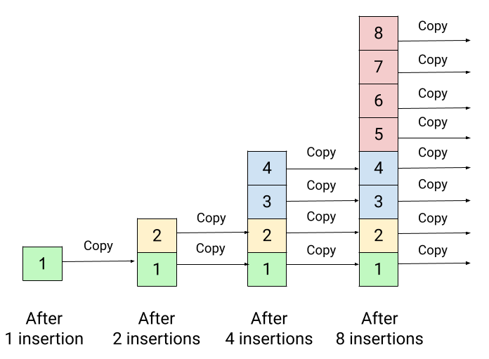
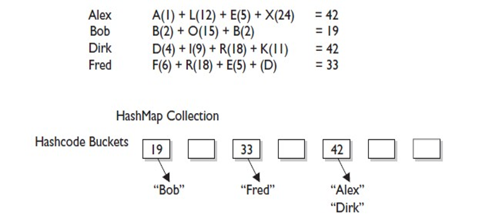
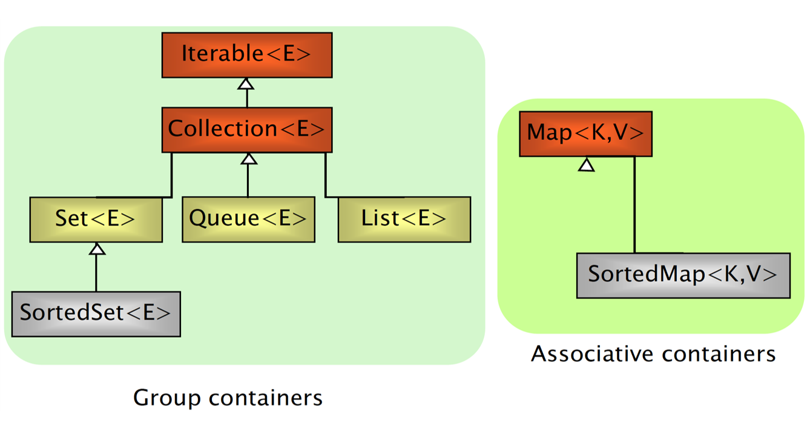
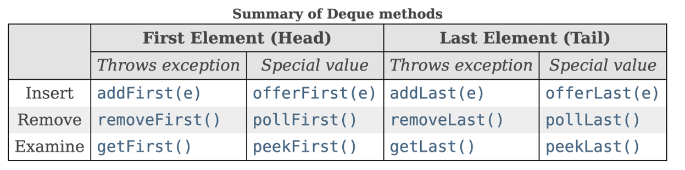

# Java Data Structures

Java Collections Framework is one of the core parts of the Java programming language. Collections are used in almost every programming language. Most of the programming languages support various type of collections such as List, Set, Queue, Stack, etc.

---

### Java Collection Framework
- The Java Collection Framework (JCF) is a set of classes and interfaces implementing commonly reusable data structures.
- The JCF (package java.util) provides
  - **interfaces** defining functionalities
  - **abstract classes** for shared code aggregation
  - **concrete classes** implementing functionalities
  - **algorithms** (java.util.Collections)


### Key technologies
The drawback of regular array is that we cannot adjust their size in the middle of the code execution. In other words, it will fail to add the (n + 1)th element if we allocate an array size equal to n. One idea would be to allocate a large array, which could waste a significant amount of memory. So what is an appropriate solution to this problem? We solve this problem using the idea of the [dynamic array](https://en.wikipedia.org/wiki/Dynamic_array) **~O(n)** where we can *increase the array size dynamically* when we need.



A [linked list](https://en.wikipedia.org/wiki/Linked_list) **~O(n)**, is a linear collection of data elements whose order is not given by their physical placement in memory. Instead, each element points to the next. It is a data structure consisting of a collection of nodes which together represent a sequence. In its most basic form, each node contains data, and a reference (in other words, a link) to the next node in the sequence. This structure allows for efficient insertion or removal of elements from any position in the sequence during iteration. More complex variants add additional links, allowing more efficient insertion or removal of nodes at arbitrary positions. A drawback of linked lists is that data access time is a linear function of the number of nodes for each linked list (I.e., the access time linearly increases as nodes are added to a linked list.) because nodes are serially linked so a node needs to be accessed first to access the next node (so difficult to pipeline). Faster access, such as random access, is not feasible. Arrays have better cache locality compared to linked lists.


A [self-balancing binary search tree](https://en.wikipedia.org/wiki/Self-balancing_binary_search_tree) **~O(log(n))**, is any node-based binary search tree that automatically keeps its height (maximal number of levels below the root) small in the face of arbitrary item insertions and deletions. These operations when designed for a self-balancing binary search tree, contain precautionary measures against boundlessly increasing tree height, so that these abstract data structures receive the attribute "self-balancing".


A [hash table](https://en.wikipedia.org/wiki/Hash_table) **~O(1)**, also known as hash map, is a data structure that implements an associative array or dictionary. It is an abstract data type that maps keys to values. A hash table uses a hash function to compute an index, also called a hash code, into an array of buckets or slots, from which the desired value can be found. During lookup, the key is hashed and the resulting hash indicates where the corresponding value is stored.




### Interfaces and implementations



---

### Iterable and Iterator Interfaces
The **Iterable** interface (java.lang.Iterable) is the root interface of the Java collection framework. Iterable, literally, means that "can be iterated". Technically, it means that an **Iterator** can be returned. **Iterable objects (objects implementing the iterable interface) can be used within for-each loops**

```
public interface Iterable<T> {
    Iterator<T> iterator();    
}

List<Object> l = new ArrayList<Object>();
for(Object o : l){
    // do something 
}
```

The **Iterator** interface extracts the traversal behaviour of a collection into a separate object called an iterator.

```
public interface Iterator<T> {
  boolean hasNext()
  T next()
  void remove()
}

ArrayList<Object> l = new ArrayList<Object>();
for (Iterator<Object> i = l.iterator(); i.hasNext();) {
    Object o = i.next();
    // do something
}
```


(see more: [Design Patterns: Iterator - Refactoring.guru](https://refactoring.guru/design-patterns/iterator))

---

### Collection Interface

The root interface in the collection hierarchy. A collection represents a group of objects, known as its elements. **Some collections allow duplicate elements and others do not. Some are ordered and others unordered**. The JDK does not provide any direct implementations of this interface: it provides implementations of more specific subinterfaces like Set and List. This interface is typically used to pass collections around and manipulate them where maximum generality is desired.


### Collection main methods
  - int **size**()
  - boolean **isEmpty**()
  - boolean **contains**(Object element)
  - boolean **containsAll**(Collection c)
  - boolean **add**(Object element)
  - boolean **addAll**(Collection c)
  - boolean **remove**(Object element)
  - boolean **removeAll**(Collection c)
  - void **clear**()
  - Object[] **toArray**()
  - Iterator **iterator**()

---

### List Interface
- Can contain **duplicate elements**
- **Insertion order is preserved**
- User can select **arbitrary insertion points**
- Elements can be accessed **by position**


### List main methods
- Object **get**(int index)
- Object **set**(int index, Object o)
- Object **remove**(int index)
- void **add**(int index, Object o)
- boolean **addAll**(int index, Collection c)
- int **indexOf**(Object o)
- int **lastIndexOf**(Object o)
- List **subList**(int fromIndex, int toIndex)

### List initialization
```
/* plain, simple, long */
List<Integer> l = new ArrayList<>();
l.add(14);
l.add(73);
l.add(18);

/* more compact version (mutable) */
List <Integer> l = new ArrayList<>(Arrays.asList(14, 73, 18));
List <Integer> l = new ArrayList<>(List.of(14, 73, 18));

/* more compact version (immutable) */
List <Integer > l = List.of(14, 73, 18);
```

### List implementations

There are two general-purpose List implementations — ArrayList and LinkedList. Most of the time, you'll probably use ArrayList, which offers constant-time positional access and is just plain fast. It does not have to allocate a node object for each element in the List, and it can take advantage of System.arraycopy when it has to move multiple elements at the same time. 

If you frequently add elements to the beginning of the List or iterate over the List to delete elements from its interior, you should consider using LinkedList. These operations require constant-time in a LinkedList and linear-time in an ArrayList. But you pay a big price in performance. Positional access requires linear-time in a LinkedList and constant-time in an ArrayList. Furthermore, the constant factor for LinkedList is much worse. If you think you want to use a LinkedList, measure the performance of your application with both LinkedList and ArrayList before making your choice. ArrayList is usually faster.

**ArrayList** implements **List**
  - get(index) -> Constant time
  - add(index, obj) -> Linear time


**LinkedList** implements **List, Deque**
  - get(index) -> Linear time
  - add(index, obj) -> Linear time (but more lightweight)


Decoupling references from implementations allows developers to change implementation (and related performance!) with a single line of code!

```
List<Car> cars = new LinkedList<>();
// List<Car> cars = new ArrayList<>();

cars.add(new SDCar());
cars.add(new SDCar());
cars.add(new Car());
cars.add(new Car());

for(Car car : cars) {
    // do something
}
```
---

### Set Interface
A collection that contains **no duplicate elements**. More formally, sets contain no pair of elements e1 and e2 such that e1.equals(e2), and at most one null element. As implied by its name, this interface models the mathematical set abstraction.


### Set Implementations
- **HashSet** implements **Set**
  - Hash tables as internal data structure (fast!)
  - Insertion order not preserved 
- **LinkedHashSet** extends **HashSet**
  - Insertion order preserved
- **TreeSet** implements **SortedSet (an extension of Set)**
  - R-B trees as internal data structure (provide ordering)
  - User definable internal ordering TreeSet(Comparator c)
  - Slow when compared to hash-based implementations

### Set initialization
```
List<String> l = List.of("Nicola", "Agata", "Marzia", "Agata");

Set<String> hs = new HashSet<>(l);
System.out.println(hs);
// [Marzia, Nicola, Agata]
 
Set<String> lhs = new LinkedHashSet<>(l);
System.out.println(lhs);
// [Nicola, Agata, Marzia]

Set<String> ts = new TreeSet<>(l);
System.out.println(ts);
// [Agata, Marzia, Nicola]
```

### Removing elements from a List
```
List<String> l = List.of("Nicola", "Agata", "Marzia", "Agata");

List<String> noDuplicatesUnordered = new ArrayList<>(new HashSet<>(l));
System.out.println(noDuplicatesUnordered);
// [Marzia, Nicola, Agata]

List<String> noDuplicatesOrdered = new ArrayList<>(new LinkedHashSet<>(l));
System.out.println(noDuplicatesOrdered);
// [Nicola, Agata, Marzia]
```

### Union and intersection between Sets

```

```

### TreeSet Internal Ordering
Depending on the constructor used, TreeSets can use different orderings:
- **TreeSet()**
  - Natural ascending ordering
  - Elements must implement the **Comparable Interface**
- **TreeSet(Comparator c)**
  - Ordering is defined by the Comparator c

```
List<String> l = List.of("Nicola", "Agata", "Marzia", "Agata");

Set<String> naturalOrderSet = new TreeSet<>(l);
System.out.println(naturalOrderSet);
// [Agata, Marzia, Nicola]

Set<String> customOrderSet = new TreeSet<>((o1, o2) -> Character.compare(o1.charAt(1), o2.charAt(1)));
customOrderSet.addAll(l);
System.out.println(customOrderSet);
// [Marzia, Agata, Nicola]
```

### HashSet vs TreeSet
- HashSet stores the objects in random order, whereas TreeSet applies the natural order of the elements.
- HashSet can store null objects, while TreeSet does not allow them.
- HashSet provides constant-time performance for most operations like add(), remove() and contains(), versus the log(n) time offered by the TreeSet.
- TreeSet is richer in functionalities, implementing additional methods like: first(), last(), ceiling(), lower(), …

---

### Queue Interface

A collection designed for holding elements prior to processing. Besides, basic Collection operations, queues provide additional insertion, extraction, and inspection operations. Each of these methods exists in two forms: one throws an exception if the operation fails, the other returns a special value (either null or false, depending on the operation).


### Dequeue Interface

A collection that supports element insertion and removal at both ends. The name deque is short for "double ended queue" and is usually pronounced "deck". Most Deque implementations place no fixed limits on the number of elements they may contain, but this interface supports capacity-restricted dequeue as well as those with no fixed size limit.





### Queue Implementations

- **PriorityQueue** implements **Queue**
  - No capacity restrictions.
  - Elements are ordered.
- **ArrayBlockingQueue** implements **Queue**
  - Limited in capacity.
  - Elements are not ordered.
- **LinkedList** implements **List, Queue, Deque**
  - No capacity restrictions.
  - Elements are not ordered.
- **ArrayDeque** implements **Deque**
  - No capacity restrictions.
  - Elements are not ordered.

### Queue Example

```
Queue<Integer> fifo = new LinkedList<>();
Queue<Integer> pqueue = new PriorityQueue<>();
Queue<Integer> fifoArray = new ArrayDeque<>();

fifo.addAll(List.of(3, 1, 2));
fifoArray.addAll(List.of(3, 1, 2));
pqueue.addAll(List.of(3, 1, 2));

System.out.println(fifo.peek());        // 3
System.out.println(fifoArray.peek());   // 3
System.out.println(pqueue.peek());      // 1
```

### Deque Implementations

...

### Deque Example
...

---

### Map Interface

An object that maps keys to values. A map cannot contain duplicate keys; each key can map to at most one value. The Map interface provides three collection views, which allow a map's contents to be viewed as a set of keys, collection of values, or set of key-value mappings. The order of a map is defined as the order in which the iterators on the map's collection views return their elements. Some map implementations, like the TreeMap class, make specific guarantees as to their order; others, like the HashMap class, do not.


### Map main methods
- Object **put**(Object key, Object value)
- Object **get**(Object key)
- Object **remove**(Object key)
- boolean **containsKey**(Object key)
- boolean **containsValue**(Object value)
- public Set **keySet**()
- public Collection **values**()
- public Set **entrySet**()
- int **size**()
- boolean **isEmpty**()
- void **clear**()

### Map Implementations

_(Similar to Set implementations)_

- **HashMap** implements **Map**
  - Hash tables as internal data structure (fast!)
  - Insertion order not preserved
- **LinkedHashMap** extends **HashMap**
  - Insertion order preserved
- **TreeMap** implements **SortedMap**
  - R-B trees as internal data structure 
  - User definable internal ordering
  - Slow when compared to hash-based implementations

```
Map<Integer, String> src;
src = new HashMap<>();
src.put(77, "Nicola");
src.put(17, "Marzia");
src.put(22, "Agata");
System.out.println(src);
// {17=Marzia, 22=Agata, 77=Nicola}

src = new LinkedHashMap<>();
src.put(77, "Nicola");
src.put(17, "Marzia");
src.put(22, "Agata");
System.out.println(src);
// {77=Nicola, 17=Marzia, 22=Agata}

src = new TreeMap<>();
src.put(77, "Nicola");
src.put(17, "Marzia");
src.put(22, "Agata");
System.out.println(src);
// {17=Marzia, 22=Agata, 77=Nicola}
```

### Map initialization (compact version)
```
/* more compact version (mutable) */
Map<String, Integer> m = new HashMap<>(Map.of("Agata", 2, "Marzia", 3, "Darma", 4, "Nicola", 1));
	
/* note well: when using this kind of initialization, keys must be unique! 
   The following code, in which "Agata" is duplicated, produces a runtime error. */
Map<String, Integer> m = new HashMap<>(Map.of("Agata", 2, "Agata", 3, "Darma", 4, "Nicola", 1));

/* more compact version (immutable) */
Map<String, Integer> m = Map.of("Agata", 2, "Marzia", 3, "Darma", 4, "Nicola", 1);
```

### Map Example

```
Map<String, Integer> m = new HashMap<>(
	Map.of("Agata", 2, "Marzia", 3, "Darma", 4, "Nicola", 1));
	
// contains key
if (m.containsKey("Darma")) {
    System.out.println(m.get("Darma"));
}

// looping keys and accessing values
Set<String> keys = m.keySet();
for(String key : keys) {
    System.out.println(key + " -> " + m.get(key));
}

// looping values
Collection<Integer> values = m.values();
for(int value : values) {
    System.out.println(value);
}

// looping entries
for (Map.Entry<String, Integer> entry : m.entrySet()) {
  System.out.println(entry.getKey());
  System.out.println(entry.getValue());
}
```


---

### Modifying Collections using Iterators

It is **unsafe** to modify (adding or removing elements) a Collection while iterating over it!

```
List<Double> l = new LinkedList<Double>(
List.of(10.8, 11.1, 13.2, 30.2));

int count = 0;
for (double i : l) {
  if (count == 1) l.remove(count);
  if (count == 2) l.add(22.3);
  count++;
} // Run-time error! We modify the list while iterating
```

> Interface **Iterator** provides a transparent means for cycling through all elements of a Collection (**forward only**) and **removing elements**


- boolean **hasNext**()
- Object **next**()
- void **remove**()


> Interface **ListIterator** provides a transparent means for cycling through all elements of a Collection (**forward and backward**) and **removing and adding elements**


- boolean **hasNext**()
- boolean **hasPrevious**()
- object **next**()
- object **previous**()
- void **add**()
- void **set**()
- void **remove**()
- int **nextIndex**()
- int **previousIndex**()

```
// with Iterator remove all elements with a value of 11.1
List<Double> l = new LinkedList<>(List.of(10.8, 11.1, 13.2, 30.2));

for (Iterator<Double> i = l.iterator(); i.hasNext();) {
    double value = i.next();
    if (value == 11.1) i.remove();
}
System.out.println(l); // [10.8, 13.2, 30.2]
```

```
// with ListIterator replace all elements with value 11.1 with their double
List<Double> l = new LinkedList<>(List.of(10.8, 11.1, 13.2, 30.2));

for (ListIterator<Double> i = l.listIterator(); i.hasNext();) {
    double value = i.next();
    if (value == 11.1) {
        i.remove();
        i.add(value * 2);
    }
}
System.out.println(l); // [10.8, 22.2, 13.2, 30.2]
```
---

### Manipulating Arrays: java.util.Collections

- _Alter-ego of java.util.Arrays for Collections_
- This class contains various methods for manipulating arrays such as **sorting, searching, filling, printing or being viewed as an array**


- sort() - merge sort implementation, n log(n)
- binarySearch() - requires ordered collection
- shuffle() - shuffles the collection
- reverse() - requires ordered collection
- rotate() – rotate elements of a given distance
- min(), max() - in a collection 


### Algorithms

```
ArrayList<String> l = new ArrayList<String>(
  List.of("Nicola", "Agata", "Marzia", "Agata"));

Collections.sort(l);
System.out.println(l);     // [Agata, Agata, Marzia, Nicola]

Collections.reverse(l);
System.out.println(l);     // [Nicola, Marzia, Agata, Agata]    

Collections.shuffle(l);    
System.out.println(l);     // [Marzia, Agata, Agata, Nicola]

Collections.rotate(l, 1);
System.out.println(l);     // [Nicola, Marzia, Agata, Agata]
```

```
ArrayList<String> l = new ArrayList<String>(
  List.of("Nicola", "Agata", "Marzia", "Agata"));

Collections.sort(l);
System.out.println(l);   // [Agata, Agata, Marzia, Nicola]

Collections.binarySearch(l, "Nicola");  // 3
Collections.binarySearch(l, "Zuck"));   // -5
```

The **list must be sorted into ascending order** according to the natural ordering of its elements (as by the sort(List) method) prior to making this call. **If it is not sorted, the results are undefined.**


---

### Sorting Collections: Comparator

- For sorting collections of objects, the **Comparable** interface must be implemented for **making objects comparable to each other.**
- **The Comparable Interface is implemented by default in common types in packages java.lang and java.util**
- A collection of T can be sorted if T implements Comparable. The compareTo() method compares the object with the object passed as a parameter. Return value must be:
  - < 0   if this object precedes obj
  - == 0 if this object has the same position as obj
  - \> 0   if this object follows obj

```
public interface Comparable<T> {
    public int compareTo(T obj);
}

public interface Comparator<T> {
    public int compare(T obj1, T obj2);
} 
```


### The Comparable Interface

```
class Person implements Comparable<Person> {
  protected String name; 
  protected String lastname;
  protected int age;
   
  public int compareTo(Person p) {
	// order by surname
	return lastname.compareTo(p.lastname);
  }
}
```

```
class Person implements Comparable<Person> {
  protected String name; 
  protected String lastname;
  protected int age;
   
  public int compareTo(Person p) {
	// order by surname
	cmp = lastname.compareTo(p.lastname);
	if (cmp == 0) 
		// if surnames are equal, order by name
		cmp = firstname.compareTo(s.firstname);
	return cmp;
  }
}
```


### The Comparator Interface

**Given a class already implementing Comparable<E>, we can sort it using alternative orders using a Comparator<E>**

```
public class SortByAge implements Comparator<Person> {
  @Override
  public int compare(Person o1, Person o2) {
    return o1.age - o2.age;
  }
}
class Person implements Comparable<Person> {
  protected String name;
  protected String lastname;
  protected int age;
  
  public int compareTo(Person p) {
    return lastname.compareTo(p.lastname);
  }
} 
```

```
public static void main(String[] args) {
  ArrayList<Person> l = new ArrayList<Person>();
  l.add(new Person("Mario", "Rossi", 68));
  l.add(new Person("Luca", "Bianchi", 28));
  l.add(new Person("Carlo", "Antoni", 34));
  
  // natural ordering (Comparable)
  Collections.sort(l)
  
  // special ordering (Comparator)
  Collections.sort(l, new SortByAge());
  
  // Comparator anonymous class
  Collections.sort(l, new Comparator<Person>() {
    @Override
    public int compare(Person o1, Person o2) {
      return o1.age - o2.age;
    }
  });
}
```


# Wisdom Pills

*Making messes is always slower than staying clean. The only way to go fast, is to go well.*

Robert C. Martin - Clean Architecture