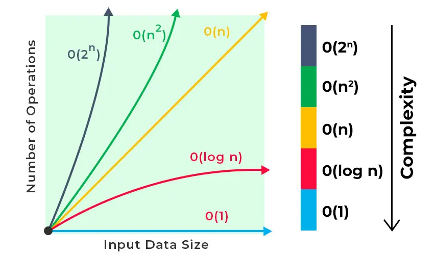
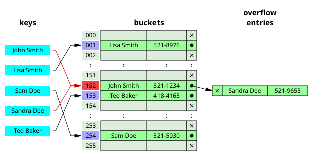
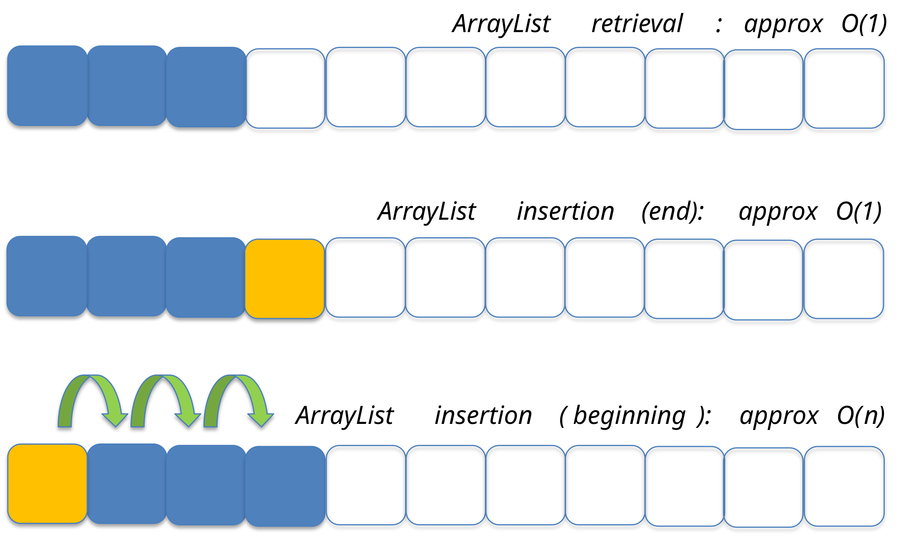
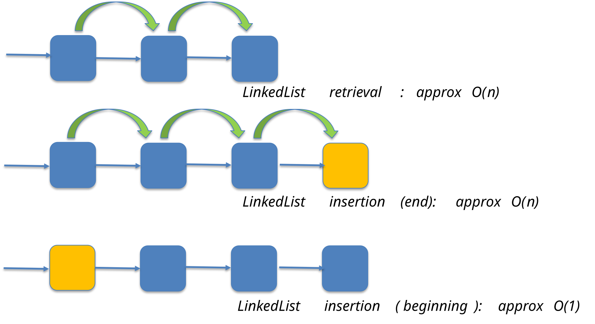

# Java Data Structures

The **Java Collections Framework (JCF)** is a unified architecture for representing and manipulating collections of objects.

It provides:

* **interfaces** defining common collection abstractions and operations
* **abstract classes** providing partial implementations and reusable code
* **concrete classes** implementing the collection interfaces
* **algorithms** for manipulating collections, mainly provided by `java.util.Collections`


### Complexity



When choosing a data structure, it is important to consider the complexity of the operations that will be performed most frequently.

Typical complexities include:

* **O(1)** — constant time
* **O(log n)** — logarithmic time
* **O(n)** — linear time
* **O(n log n)** — typically associated with efficient comparison-based sorting algorithms

The actual performance of a collection also depends on factors such as memory layout, cache locality, resizing, hashing, and the particular implementation.

---

### Key technologies

#### Dynamic array

The main limitation of a regular array is that its size is fixed at the time of allocation.

In other words, if an array is allocated with size `n`, it cannot accommodate the `(n+1)`-th element without creating a new array.

One possible workaround is to allocate a large array in advance, but this can lead to **significant memory waste**.

This limitation is addressed by the concept of a [dynamic array](https://en.wikipedia.org/wiki/Dynamic_array).

A dynamic array maintains:

* a backing array
* a current **size**, representing the number of stored elements
* a **capacity**, representing the number of elements that can currently fit in the backing array

When the capacity is exceeded, a new, larger array is allocated and the existing elements are copied over.

Resizing itself takes **O(n)** time, but with a suitable growth strategy, appending elements is **amortized O(1)**.

Dynamic arrays provide:

* efficient random access: **O(1)**
* efficient iteration
* amortized **O(1)** append operations
* occasional **O(n)** resizing operations


#### Linked list

A [linked list](https://en.wikipedia.org/wiki/Linked_list) is a linear collection of elements whose order is determined by **links** between nodes rather than by contiguous memory locations.

A linked list consists of a sequence of **nodes**, where each node typically contains:

* the stored element
* a reference to the next node
* and, in a doubly linked list, a reference to the previous node

A linked list does not provide efficient random access. To access the element at position `i`, the list generally has to traverse the preceding nodes.

Therefore:

* access by index is **O(n)**
* searching is generally **O(n)**
* insertion/removal can be **O(1)** when the relevant node/position is already known
* finding an arbitrary position by index is **O(n)**

Linked lists can also have **poorer cache locality** than arrays because their nodes are separate objects that may be located in different memory areas.

More advanced variants include:

* **doubly linked lists**
* **circular linked lists**


#### Binary tree

A [tree](https://en.wikipedia.org/wiki/Self-balancing_binary_search_tree) is a hierarchical data structure composed of **nodes** connected by **edges**.

A tree has a **root node** at the top. Nodes can have **child nodes**, forming branches, while nodes without children are called **leaves**.

A **binary tree** is a tree in which each node has at most two children.

A **binary search tree (BST)** maintains an ordering relationship between the elements. In a balanced BST, the height remains approximately logarithmic in the number of elements.

**Self-balancing binary search trees**, such as:

* **AVL trees**
* **Red-Black trees**

maintain a bounded tree height and provide **O(log n)** worst-case search, insertion, and deletion.

Trees are widely used in applications such as:

* file systems
* databases
* search algorithms
* indexing structures
* hierarchical data representation


#### Hash table

A [hash table](https://en.wikipedia.org/wiki/Hash_table) is a data structure that implements an **associative array**, mapping **keys** to **values**.

A hash table uses a **hash function** to transform a key into a hash value. The hash value is then used to determine an appropriate location, or **bucket**, in an internal table.

During a lookup operation:

1. the key is hashed
2. the hash value is used to identify candidate bucket(s)
3. the stored key is compared with the requested key
4. the associated value is returned if the key is found

Hash tables typically provide **O(1) average-case** insertion, deletion, and lookup, although the exact complexity depends on the implementation and the distribution of hash values.

Poor hashing or excessive collisions can degrade performance.



---

### Interfaces and implementations


---

## Iterable and Iterator Interfaces

The **`Iterable<T>`** interface (`java.lang.Iterable`) represents an object whose elements can be traversed by obtaining an `Iterator<T>`.

Objects implementing `Iterable` can be used in **enhanced `for` loops**:

```java
public interface Iterable<T> {
    Iterator<T> iterator();
}
```

For example:

```java
List<Object> l = new ArrayList<>();

for (Object o : l) {
    // do something
}
```

The enhanced `for` loop is syntactic sugar for iterator-based traversal.

The **`Iterator`** interface encapsulates the traversal of a collection in a separate object.

```java
public interface Iterator<T> {
    boolean hasNext();
    T next();
    void remove();
}
```

For example:

```java
ArrayList<Object> l = new ArrayList<>();

for (Iterator<Object> i = l.iterator(); i.hasNext();) {
    Object o = i.next();
    // do something
}
```

The `remove()` method allows an iterator to remove the last element returned by `next()`, when the underlying collection supports this operation.


See more: [Design Patterns: Iterator - Refactoring.guru](https://refactoring.guru/design-patterns/iterator)

> **Note:** `Iterable` is not the root interface of the Java Collections Framework. `Collection` is the main root interface for collections, while `Iterable` is a more general interface for objects that can be iterated over.

---

## Collection Interface

The **`Collection`** interface represents a group of objects, known as its elements.

Some collections:

* allow duplicate elements
* do not allow duplicates
* preserve a defined order
* do not guarantee a particular iteration order

The `Collection` interface is useful when code should work with a collection without depending on a specific implementation.

### Collection main methods

The generic forms of the main methods are:

* `int **size**()`
* `boolean **isEmpty**()`
* `boolean **contains**(Object element)`
* `boolean **containsAll**(Collection<?> c)`
* `boolean **add**(E element)`
* `boolean **addAll**(Collection<? extends E> c)`
* `boolean **remove**(Object element)`
* `boolean **removeAll**(Collection<?> c)`
* `void **clear**()`
* `Object[] **toArray**()`
* `<T> T[] **toArray**(T[] a)`
* `Iterator<E> **iterator**()`

---

## List Interface

A **`List`** is an ordered collection in which:

* duplicate elements are allowed
* **insertion order is preserved**
* elements can be accessed **by position**
* elements can be inserted or removed at arbitrary positions


### List main methods

* `E **get**(int index)`
* `E **set**(int index, E element)`
* `E **remove**(int index)`
* `void **add**(int index, E element)`
* `boolean **addAll**(int index, Collection<? extends E> c)`
* `int **indexOf**(Object o)`
* `int **lastIndexOf**(Object o)`
* `List<E> **subList**(int fromIndex, int toIndex)`

### List implementations

Two general-purpose `List` implementations are **`ArrayList`** and **`LinkedList`**.

In most situations, `ArrayList` is the preferred general-purpose implementation because it provides:

* constant-time positional access
* efficient iteration
* good cache locality
* efficient bulk element movement when elements have to be shifted

`LinkedList` can be useful when elements are frequently inserted or removed through an iterator or when its `Deque` operations are required. However, indexed access is linear, and its node-based representation generally has worse memory locality and higher per-element overhead than `ArrayList`.

**ArrayList** implements **List**

* `get(index)` → **O(1)**
* `add(obj)` at the end → **amortized O(1)**
* `add(index, obj)` → **O(n)** in the general case



**LinkedList** implements **List, Deque**

* `get(index)` → **O(n)**
* `add(obj)` at the end → **O(1)**
* `add(index, obj)` → **O(n)** because locating the position is linear

Once the relevant node is already known, insertion/removal can be performed in **O(1)**.



### List initialization

Decoupling references from implementations allows developers to change the implementation with a single line of code:

```java
/* plain, simple, long */
List<Integer> l = new ArrayList<>();
l.add(14);
l.add(73);
l.add(18);

/* more compact version (mutable) */
List<Integer> l = new ArrayList<>(Arrays.asList(14, 73, 18));
List<Integer> l = new ArrayList<>(List.of(14, 73, 18));

/* more compact version (immutable) */
List<Integer> l = List.of(14, 73, 18);
```

`List.of(...)` returns an **unmodifiable** list. In particular, operations such as `add`, `remove`, and `set` are not supported.

---

## Set Interface

A **`Set`** is a collection that contains **no duplicate elements**.

More formally, a set cannot contain two elements `e1` and `e2` such that:

```java
e1.equals(e2)
```

The `Set` interface models the mathematical set abstraction.

The `Set` interface itself does not guarantee a particular iteration order.


### Set main methods

The `Set` interface does not add methods to those inherited from `Collection`.

Its main characteristic is therefore the **uniqueness constraint**.

### Set implementations

* **`HashSet`** implements **Set**

  * hash-table-based implementation
  * no guaranteed iteration order
  * typically provides O(1) average-time basic operations

* **`LinkedHashSet`** extends **HashSet**

  * maintains a linked structure between entries
  * preserves insertion order during iteration

* **`TreeSet`** implements **NavigableSet**, which extends **SortedSet** and `Set`

  * based on a balanced search tree
  * maintains elements according to a defined ordering
  * typically provides O(log n) basic operations
  * ordering can be defined by natural ordering or a `Comparator`

### Set initialization

```java
public static void main(String[] args) {
    List<String> l = List.of(
        "Nicola", "Denise", "Agata", "Marzia", "Agata"
    );

    Set<String> hs = new HashSet<>(l);
    System.out.println(hs);
    // Order is unspecified

    Set<String> lhs = new LinkedHashSet<>(l);
    System.out.println(lhs);
    // [Nicola, Denise, Agata, Marzia]

    Set<String> ts = new TreeSet<>(l);
    System.out.println(ts);
    // [Agata, Denise, Marzia, Nicola]
}
```

`HashSet` does not preserve insertion order, so its printed order must **not** be relied upon.

`LinkedHashSet` preserves insertion order.

`TreeSet` maintains its elements according to its ordering.

```java
/* more compact version (immutable) */
Set<String> set = Set.of("Nicola", "Denise", "Agata", "Marzia");
```

> **Important:** `Set.of(...)` does not allow duplicate elements. Passing duplicate elements causes an `IllegalArgumentException`.

### Removing duplicate elements from a List

```java
public static void main(String[] args) {
    List<String> l = List.of(
        "Nicola", "Denise", "Agata", "Marzia", "Agata"
    );

    List<String> noDuplicatesUnordered =
        new ArrayList<>(new HashSet<>(l));

    System.out.println(noDuplicatesUnordered);
    // Order is unspecified

    List<String> noDuplicatesOrdered =
        new ArrayList<>(new LinkedHashSet<>(l));

    System.out.println(noDuplicatesOrdered);
    // [Nicola, Denise, Agata, Marzia]
}
```

### Union and intersection between Sets

```java
public static void main(String[] args) {
    Set<Integer> s1 = new HashSet<>(List.of(1, 2, 3, 4, 5));
    Set<Integer> s2 = new HashSet<>(List.of(4, 5, 6, 7, 8));

    Set<Integer> union = new HashSet<>(s1);
    Set<Integer> intersection = new HashSet<>(s1);

    union.addAll(s2);
    intersection.retainAll(s2);

    System.out.println(union);
    // Contains: 1, 2, 3, 4, 5, 6, 7, 8

    System.out.println(intersection);
    // Contains: 4, 5
}
```

### HashSet vs TreeSet

* `HashSet` does not guarantee any particular iteration order, whereas `TreeSet` maintains its elements according to an ordering.
* `HashSet` generally provides **O(1) average-time** `add`, `remove`, and `contains`.
* `TreeSet` generally provides **O(log n)** `add`, `remove`, and `contains`.
* `TreeSet` provides additional navigational operations such as:

  * `first()`
  * `last()`
  * `ceiling()`
  * `floor()`
  * `higher()`
  * `lower()`

`HashSet` permits a single `null` element. A `TreeSet` using natural ordering generally cannot store `null`, because `null` cannot be compared with ordinary elements. A custom comparator may define a different policy.

---

## Queue/Deque Interface

### Queue

A **`Queue`** is a collection designed to hold elements prior to processing.

Queues typically follow a **FIFO (first-in, first-out)** policy, although the interface itself does not require FIFO behavior. For example, `PriorityQueue` orders elements according to priority.

Queue operations are available in two variants:

* one variant throws an exception when the operation fails
* the other returns a special value such as `null` or `false`

### Deque

A **`Deque`** ("double-ended queue") supports insertion and removal of elements at **both ends**.

It can therefore be used as:

* a queue
* a stack


### Queue main methods

|         | Throws exception | Special value |
| ------- | ---------------- | ------------- |
| Insert  | `add(e)`         | `offer(e)`    |
| Remove  | `remove()`       | `poll()`      |
| Examine | `element()`      | `peek()`      |

### Deque main methods

|         | Exception (H)   | Special value (H) | Exception (T)  | Special value (T) |
| ------- | --------------- | ----------------- | -------------- | ----------------- |
| Insert  | `addFirst(e)`   | `offerFirst(e)`   | `addLast(e)`   | `offerLast(e)`    |
| Remove  | `removeFirst()` | `pollFirst()`     | `removeLast()` | `pollLast()`      |
| Examine | `getFirst()`    | `peekFirst()`     | `getLast()`    | `peekLast()`      |

Here **H** means *head* and **T** means *tail*.

### Queue/Deque Implementations

* **`LinkedList`** implements **List, Deque**

  * preserves insertion order as a `List`
  * supports queue and deque operations
  * no fixed capacity restriction

* **`ArrayDeque`** implements **Deque**

  * array-based deque
  * efficient insertion/removal at both ends
  * no fixed capacity restriction
  * does not permit `null` elements

* **`PriorityQueue`** implements **Queue**

  * elements are ordered according to their natural ordering or a supplied `Comparator`
  * the head is the least element according to that ordering
  * iteration is **not guaranteed to produce sorted order**
  * no fixed capacity restriction

* **`LinkedBlockingDeque`** implements **BlockingDeque**

  * supports blocking operations
  * optionally bounded by a capacity

* **`ArrayBlockingQueue`** implements **BlockingQueue**

  * array-based
  * bounded by a fixed capacity

* **`ConcurrentLinkedDeque`** implements **Deque**

  * thread-safe, non-blocking deque
  * designed for concurrent access

### Queue/Deque Example

```java
public class QueueExample {

    public static final List<Integer> VALUES =
        List.of(5, 1, 2, 4, 3);

    public static void fillQueue(Queue<Integer> queue) {
        for (Integer integer : VALUES) {
            queue.add(integer);
        }
    }

    public static void emptyQueue(Queue<Integer> queue) {
        System.out.println(queue.getClass().getName());

        while (!queue.isEmpty()) {
            System.out.print(queue.remove() + ", ");
        }

        System.out.println();
    }

    public static void main(String[] args) {
        Queue<Integer> fifo = new LinkedList<>();
        Queue<Integer> fifoArray = new ArrayDeque<>();
        Queue<Integer> pqueue = new PriorityQueue<>();

        fillQueue(fifo);
        fillQueue(fifoArray);
        fillQueue(pqueue);

        emptyQueue(fifo);      // 5, 1, 2, 4, 3
        emptyQueue(fifoArray); // 5, 1, 2, 4, 3
        emptyQueue(pqueue);    // 1, 2, 3, 4, 5
    }
}
```

The `PriorityQueue` example produces sorted values when repeatedly removing the head. This does **not** mean that iterating directly over a `PriorityQueue` produces sorted order.

---

## Map Interface

A **`Map`** stores associations between **keys and values**.

A map:

* cannot contain duplicate keys
* associates each key with at most one value
* can contain duplicate values
* provides views of its keys, values, and key-value mappings

The main views are:

* `keySet()` → `Set<K>`
* `values()` → `Collection<V>`
* `entrySet()` → `Set<Map.Entry<K, V>>`

Unlike `Collection`, `Map` does not represent a collection of individual elements and therefore does not extend `Collection`.


### Map main methods

For `Map<K, V>`:

* `V **put**(K key, V value)`
* `V **get**(Object key)`
* `V **remove**(Object key)`
* `boolean **containsKey**(Object key)`
* `boolean **containsValue**(Object value)`
* `Set<K> **keySet**()`
* `Collection<V> **values**()`
* `Set<Map.Entry<K, V>> **entrySet**()`
* `int **size**()`
* `boolean **isEmpty**()`
* `void **clear**()`

### Map Implementations

* **`HashMap`** implements **Map**

  * hash-table-based
  * no guaranteed iteration order
  * typically provides O(1) average-time basic operations

* **`LinkedHashMap`** extends **HashMap**

  * maintains a linked ordering between entries
  * normally preserves insertion order during iteration
  * can also be configured for access order

* **`TreeMap`** implements **NavigableMap**, which extends `SortedMap` and `Map`

  * tree-based
  * maintains keys according to an ordering
  * typically provides O(log n) basic operations

```java
public static void main(String[] args) {
    Map<Integer, String> src;

    src = new HashMap<>();
    src.put(77, "Nicola");
    src.put(17, "Marzia");
    src.put(22, "Agata");

    System.out.println(src);
    // Order is unspecified

    src = new LinkedHashMap<>();
    src.put(77, "Nicola");
    src.put(17, "Marzia");
    src.put(22, "Agata");

    System.out.println(src);
    // {77=Nicola, 17=Marzia, 22=Agata}

    src = new TreeMap<>();
    src.put(77, "Nicola");
    src.put(17, "Marzia");
    src.put(22, "Agata");

    System.out.println(src);
    // {17=Marzia, 22=Agata, 77=Nicola}
}
```

### Map initialization

```java
public static void main(String[] args) {

    /* more compact version (mutable) */
    Map<String, Integer> m =
        new HashMap<>(
            Map.of(
                "Agata", 2,
                "Marzia", 3,
                "Denise", 4,
                "Nicola", 1
            )
        );

    /* note well:
       Map.of(...) requires unique keys.

       The following code throws an IllegalArgumentException
       because "Agata" appears twice.
    */

    Map<String, Integer> invalid =
        new HashMap<>(
            Map.of(
                "Agata", 2,
                "Agata", 3,
                "Denise", 4,
                "Nicola", 1
            )
        );

    /* more compact version (unmodifiable) */
    Map<String, Integer> immutable =
        Map.of(
            "Agata", 2,
            "Marzia", 3,
            "Denise", 4,
            "Nicola", 1
        );
}
```

`Map.of(...)` returns an **unmodifiable map**.

---

### Map Example

```java
public static void main(String[] args) {

    Map<String, Integer> m =
        new HashMap<>(
            Map.of(
                "Agata", 2,
                "Marzia", 3,
                "Denise", 4,
                "Nicola", 1
            )
        );

    // contains key
    if (m.containsKey("Denise")) {
        System.out.println(m.get("Denise"));
    }

    // looping keys and accessing values
    Set<String> keys = m.keySet();

    for (String key : keys) {
        System.out.println(key + " -> " + m.get(key));
    }

    // looping values
    Collection<Integer> values = m.values();

    for (int value : values) {
        System.out.println(value);
    }

    // looping entries
    for (Map.Entry<String, Integer> entry : m.entrySet()) {
        System.out.println(entry.getKey());
        System.out.println(entry.getValue());
    }
}
```

When both the key and the value are needed, iterating over `entrySet()` is generally preferable to iterating over `keySet()` and performing an additional `get()`.

---

## Manipulating Collections

### Using Iterators

A collection should generally **not be structurally modified directly while it is being traversed by an iterator or enhanced `for` loop**.

For many standard collections, modifying the collection directly during iteration causes a `ConcurrentModificationException` on a subsequent iterator operation.

For example:

```java
public static void main(String[] args) {

    List<Double> l =
        new LinkedList<>(List.of(10.8, 11.1, 13.2, 30.2));

    int count = 0;

    for (double i : l) {
        if (count == 1) {
            l.remove(count);
        }

        if (count == 2) {
            l.add(22.3);
        }

        count++;
    }

    // Typically results in ConcurrentModificationException
}
```

The important distinction is that **the iterator itself should be used when the operation is supported by the iterator**.

The `Iterator` interface provides forward traversal and supports removal of the last element returned by `next()`:

* `boolean **hasNext**()`
* `E **next**()`
* `void **remove**()`

```java
public static void main(String[] args) {

    // With Iterator, remove all elements with a value of 11.1
    List<Double> l =
        new LinkedList<>(List.of(10.8, 11.1, 13.2, 30.2));

    for (Iterator<Double> i = l.iterator(); i.hasNext();) {
        double value = i.next();

        if (value == 11.1) {
            i.remove();
        }
    }

    System.out.println(l);
    // [10.8, 13.2, 30.2]
}
```

> `ConcurrentModificationException` is part of the **fail-fast behavior** of many collection iterators. It should not be treated as a synchronization mechanism or as a guaranteed result for every collection implementation.

The `ListIterator` interface extends `Iterator` and provides traversal in **both directions**, as well as modification operations:

* `boolean **hasNext**()`
* `boolean **hasPrevious**()`
* `E **next**()`
* `E **previous**()`
* `void **add**(E e)`
* `void **set**(E e)`
* `void **remove**()`
* `int **nextIndex**()`
* `int **previousIndex**()`

```java
public static void main(String[] args) {

    // With ListIterator, replace all elements
    // with value 11.1 with their double
    List<Double> l =
        new LinkedList<>(List.of(10.8, 11.1, 13.2, 30.2));

    for (ListIterator<Double> i = l.listIterator(); i.hasNext();) {
        double value = i.next();

        if (value == 11.1) {
            i.set(value * 2);
        }
    }

    System.out.println(l);
    // [10.8, 22.2, 13.2, 30.2]
}
```

Using `set()` is the simplest way to replace the last element returned by `next()`.

---

## Using `java.util.Collections`

`java.util.Collections` is a utility class containing static methods for operating on collections.

It can be thought of as a counterpart to `java.util.Arrays` for collections.

Common operations include:

* `sort()`
* `binarySearch()`
* `shuffle()`
* `reverse()`
* `rotate()`
* `min()`
* `max()`

```java
public static void main(String[] args) {

    ArrayList<String> l =
        new ArrayList<>(
            List.of("Nicola", "Agata", "Marzia", "Agata")
        );

    Collections.sort(l);
    System.out.println(l);
    // [Agata, Agata, Marzia, Nicola]

    Collections.reverse(l);
    System.out.println(l);
    // [Nicola, Marzia, Agata, Agata]

    Collections.shuffle(l);
    System.out.println(l);
    // Order is random

    Collections.rotate(l, 1);
    System.out.println(l);
    // Depends on the order before rotation

    Collections.sort(l);
    System.out.println(l);
    // [Agata, Agata, Marzia, Nicola]

    // The list must be sorted according to the same ordering
    // used by binarySearch().
    System.out.println(
        Collections.binarySearch(l, "Nicola")
    );
    // 3

    System.out.println(
        Collections.binarySearch(l, "Zane")
    );
    // -5
}
```

For `binarySearch()`:

* the list must be sorted according to the same ordering
* if the element is found, its index is returned
* if it is not found, the result is `-(insertion point) - 1`

For example, if `"Zane"` would be inserted at index `4`:

```text
-(4) - 1 = -5
```

---

## Sorting Collections

Objects can define a **natural ordering** by implementing the `Comparable<T>` interface.

```java
public interface Comparable<T> {
    int compareTo(T obj);
}
```

The `compareTo()` method returns:

* `< 0` if `this` precedes `obj`
* `== 0` if `this` and `obj` are considered equivalent for ordering
* `> 0` if `this` follows `obj`

A collection of `T` can be sorted according to its natural ordering when `T` implements `Comparable<? super T>`.

Many standard Java types, such as `String` and the numeric wrapper classes, implement `Comparable`.

### Sorting Example

The example below defines the natural ordering for the `Person` class as the alphabetical order of surnames.

```java
public class Person implements Comparable<Person> {

    protected String name;
    protected String lastname;
    protected int age;

    @Override
    public int compareTo(Person p) {
        // order by surname
        return lastname.compareTo(p.lastname);
    }
}
```

Eventually, people with the same surname can be sorted by name as well.

```java
public class Person implements Comparable<Person> {

    protected String name;
    protected String lastname;
    protected int age;

    @Override
    public int compareTo(Person p) {

        // order by surname
        int cmp = lastname.compareTo(p.lastname);

        if (cmp == 0) {
            // if surnames are equal, order by name
            cmp = name.compareTo(p.name);
        }

        return cmp;
    }
}
```

> The comparison must be consistent with the intended ordering. If `compareTo()` returns `0`, sorted collections such as `TreeSet` and `TreeMap` may treat the objects as equivalent for ordering purposes.

---

### Comparator

Sometimes a class has a natural ordering, but an application needs to sort its objects in a different way.

For example, `Person` could have a natural ordering by surname, while a particular operation might require sorting by age.

The **`Comparator<T>`** interface allows an ordering to be defined independently of the class being compared.

```java
public interface Comparator<T> {
    int compare(T obj1, T obj2);
}
```

A `Comparator` can be implemented by a separate class:

```java
public class SortByAge implements Comparator<Person> {

    @Override
    public int compare(Person o1, Person o2) {
        return Integer.compare(o1.age, o2.age);
    }
}
```

Using `Integer.compare(...)` is preferable to subtracting the two ages directly because subtraction can overflow for arbitrary integer values.

A `Comparator` can also be provided anonymously where it is needed:

```java
public static void main(String[] args) {

    ArrayList<Person> l = new ArrayList<>();

    l.add(new Person("Mario", "Rossi", 68));
    l.add(new Person("Luca", "Bianchi", 28));
    l.add(new Person("Carlo", "Antoni", 34));

    // natural ordering (Comparable)
    Collections.sort(l);

    // Comparator with named class
    Collections.sort(l, new SortByAge());

    // Comparator with anonymous class
    Collections.sort(l, new Comparator<Person>() {

        @Override
        public int compare(Person o1, Person o2) {
            return Integer.compare(o1.age, o2.age);
        }
    });

    // Comparator with lambda
    Collections.sort(l, (o1, o2) ->
        Integer.compare(o1.age, o2.age)
    );
}
```

A lambda expression is often the most concise way to provide a comparator when the comparison logic is simple.

For example:

```java
l.sort(Comparator.comparingInt(person -> person.age));
```

---

## References

* https://www.baeldung.com/java-collections
* https://www.baeldung.com/java-arraylist
* https://www.baeldung.com/java-linkedlist
* https://www.baeldung.com/java-set-operations
* https://www.baeldung.com/java-queue
* https://www.baeldung.com/java-hashmap
* https://dev.java/learn/api/collections-framework/arraylist-vs-linkedlist/
