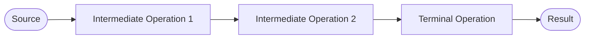

# Java Functional Programming (Streams)

## The basic concept of streams
Java 8 gave us a new tool called **Stream API** that provides a functional approach to processing collections of objects. By using Stream API, a programmer doesn't need to write explicit loops (i.e. use *for* explicitly), since each stream has an internal optimized loop. 

Streams allow us to focus on the question "**what should the code do?"** instead of "**how should the code do it?"**. In addition, such an approach makes **parallel computation easy** (this is important because multicore cpus are cheap).

In a sense, a **stream** may remind us of a collection. But it does not actually store elements. Instead, it conveys elements from a **source** such as a collection, a generator function, a file, an I/O channel, another stream, and then processes the elements by using a sequence of predefined operations combined into a single pipeline.

There are three stages of working with a stream:

1.  Obtaining the stream from a source.
2.  Performing intermediate operations with the stream to process data.
3.  Performing a terminal operation to produce a result.



## Loops vs streams
All classes associated with streams are located in the `java.util.stream` package. There are several common stream classes: `Stream<T>`, `IntStream`, `LongStream` and `DoubleStream`. While the generic stream works with reference types, others work with the corresponding primitive types. 

Let's consider a simple example. Suppose we have a list of numbers, and we'd like to count the numbers that are greater than `5`. A "traditional" way to do it is to write a loop like the following:

```java
import java.util.ArrayList;

public static void main(String[] args) {
    List<Integer> numbers = new ArrayList<>(List.of(1, 4, 7, 6, 2, 9, 7, 8));
    
    long count = 0;
    for (int number : numbers) {
        if (number > 5) {
            count++;
        }
    }
    
    System.out.println(count); // 5

}

```

Using the Stream API, it becomes:

```java
long count = numbers.stream()
        .filter(number -> number > 5)
        .count(); // 5
```

Here we get a stream from the `numbers` list, then filter its elements by using a predicate lambda expression, and then count the numbers that satisfy the condition. The processing of a stream is performed as a chain of method calls separated by dots with a single terminal operation. To improve readability it is recommended to put each call on a new line if the stream contains more than one operation.

Although this code produces the same result, it is easier to read and modify. For example, we can easily change it to skip the first four numbers from the list.

```java
long count = numbers.stream()
        .skip(4)  // skip 1, 4, 7, 6
        .filter(number -> number > 5)
        .count();  // 3
```

## Creating streams
The most common way to create a stream is to take it from a collection. Any collection has the`stream()`method for this purpose.

```java
List<Integer> famousNumbers = List.of(0, 1, 1, 2, 3, 5, 8, 13, 21, 34, 55);
Stream<Integer> numbersStream = famousNumbers.stream();

Set<String> usefulConcepts = Set.of("functions", "lazy", "immutability");
Stream<String> conceptsStream = usefulConcepts.stream();
```

It is also possible to obtain a stream from an array:

```java
Stream<Double> doubleStream = Arrays.stream(new Double[]{ 1.01, 1d, 0.99, 1.02, 1d, 0.99 });
```

or directly from some values:

```java
Stream<String> persons = Stream.of("John", "Demetra", "Cleopatra");
```

or concatenate other streams together:

```java
Stream<String> stream1 = Stream.of(/* some values */);
Stream<String> stream2 = Stream.of(/* some values */);
Stream<String> resultStream = Stream.concat(stream1, stream2);
```

## Groups of stream operations
All stream operations are divided into two groups: **intermediate** and **terminal** operations.

* **Intermediate operations** are not evaluated immediately when invoking. They simply return new streams to call the next operations on them. Such operations are known as **lazy** because they do not actually do anything useful.
* **Terminal operations** begin all evaluations with the stream to produce a result or to make a side effect. As we mentioned before, a stream always has only one terminal operation.

Once a terminal operation has been evaluated, it is **not possible** to reuse the stream again. If you try doing that the program will throw `IllegalStateException`.

### Intermediate operations
* `filter` returns a new stream that includes the elements that match a **predicate**;
* `map` returns a new stream that consists of the elements that were obtained by applying a **function** (i.e. transforming each element).
* `peek` returns the same stream of elements but allows observing the current elements with a **consumer**;
* `sorted` returns a new stream that includes elements sorted according to the natural order or a given **comparator**;
* `limit` returns a new stream that consists of the first `n` elements of this stream;
* `skip` returns a new stream without the first `n` elements of this stream;
* `distinct` returns a new stream consisting of only unique elements according to the results of `equals`;

### Terminal operations
* `count` returns the number of elements in the stream as a `long` value;
* `max` / `min` returns an `Optional` maximum/minimum element of the stream according to the given comparator;
* `reduce` combines values from the stream into a single value (an aggregate value);
* `findFirst` / `findAny` returns the first / any element of the stream as an `Optional`;
* `anyMatch` returns `true` if at least one element matches a predicate (see also: `allMatch`, `noneMatch`);
* `forEach` takes a **consumer** and applies it to each element of the stream (for example, printing it);
* `collect` returns a collection of the values in the stream;
* `toArray` returns an array of the values in a stream.

Some terminal operations return an `Optional` because the stream can be empty, and you need to specify a default value or an action if it is empty.


## Intermediate operations, in detail

### The filter method
To filter elements, streams provide the `filter` method. It returns a new stream consisting only of those elements that match the given predicate.

We'd like to create a new list consisting of prime numbers that belong to the range from 11 to 23 (inclusively).

```java
List<Integer> primeNumbers = List.of(2, 3, 5, 7, 11, 13, 17, 19, 23, 29, 31);

List<Integer> filteredPrimeNumbers = primeNumbers.stream() 
        .filter(n -> n >= 11 && n <= 23)
        .collect(Collectors.toList());
```

Sometimes, two or more filters are used together. We'd like to count how many programming languages start with an upper letter ignoring all the empty strings.

```java
List<String> programmingLanguages = Arrays.asList("Java", "", "scala", "Kotlin", "", "clojure");

long count = programmingLanguages.stream()
        .filter(lang -> lang.length() > 0) 
        .filter(lang -> Character.isUpperCase(lang.charAt(0)))
        .count();
```

These two filter operations can be replaced with a single operation that takes a complex predicate (less readable):

```
filter(lang -> lang.length() > 0 && Character.isUpperCase(lang.charAt(0)))
```

### The map method
The `map` is a method of a `Stream` class that takes a one-argument function as a parameter. 

Let's divide each number by 2. For that, we can *map* each element of the stream to the element divided by 2 and *collect* it in the new list:

```java
List<Double> numbers = List.of(6.28, 5.42, 84.0, 26.0);

List<Double> famousNumbers = numbers.stream()
        .map(number -> number / 2) 
        .collect(Collectors.toList());
```

**Using map for extracting properties**

`map` is often used to get a stream of properties from а stream of objects. For example, given a class `Job`, we can get the list of job titles from a given list of jobs by using the `map` method:

```java
public class Job {
    private String title;
    private String description;
    private double salary;

    // getters and setters
}
```

```java
List<String> titles = jobs.stream()
        .map(Job::getTitle) 
        .collect(Collectors.toList()); 
```

**Using map for transforming objects**

Another common use case is obtaining a list of some objects from the list of other objects. Let's assume we have the following classes:

```java
class User {
    private long id;
    private String firstName;
    private String lastName;
}

class Account {
    private long id;
    private boolean isLocked;
    private User owner;
}

class AccountInfo {
    private long id;
    private String ownerFullName;
}
```

And we would like to get a list of `AccountInfo` objects from a list of `Account` objects. We can do it by using the `map` method:

```java
List<AccountInfo> infoList = accounts.stream()
        .map(a -> {
                String ownerFirstName = a.getOwner().getFirstName();
                String ownerLastName = a.getOwner().getLastName();
                return new AccountInfo(a.getId(), ownerFirstName + " " + ownerLastName);
        }).collect(Collectors.toList());
```

### The flatMap method
The map operation works great for streams of primitives and objects, but the input can also be a stream of collections. For example, the method `stream()` of a `List<List<String>>` returns a `Stream<List<String>>`. In that case, we often need to *flatten* a stream of collections to a stream of elements from these collections.

Flattening refers to merging elements of a list of lists into a single list. For example, if we flatten a list of lists `[["a", "b"], ["c"], ["d", "e"]]`, we will get the list `["a", "b", "c", "d", "e"]`.

In such cases, the `flatMap` method can be useful. It takes and applies a one-argument function in order to transform each stream element into a new stream and concatenates these streams together. Let's consider an example with Java books. Each book has a title, a publishing year, and a list of authors:

```java
List<Book> javaBooks = List.of(
        new Book("Java EE 7 Essentials", 2013, List.of("Arun Gupta")),
        new Book("Algorithms", 2011, List.of("Robert Sedgewick", "Kevin Wayne")),
        new Book("Clean code", 2014, List.of("Robert Martin"))
);
```

Now we can obtain a list of all authors from the list of Java books by using `flatMap` method:

```java
List<String> authors = javaBooks.stream()
        .flatMap(book -> book.getAuthors().stream())
        .collect(Collectors.toList());
```

The resulting list is:

```
["Arun Gupta", "Robert Sedgewick", "Kevin Wayne", "Robert Martin"]
```

### The peek method
To observe (usually print) the items of a stream without modifying them, streams provide the `peek` method. It returns a new stream which is identical to the original, while passing all items to a `consumer`.

```java
List<Integer> primeNumbers = List.of(2, 3, 5, 7, 11, 13, 17, 19, 23, 29, 31);

List<Integer> primeNumbersCopy = primeNumbers.stream()
        .peek(System.out::println)
        .collect(Collectors.toList());
```


## Terminal operations, in detail

### The collect method
`collect` is a terminal operation that can accept an object of the Collector type. But instead of focusing on the Collector, let's consider the Collectors class more closely. It is important that the Collectors class contains static methods that return the Collector and implement functionality for accumulating stream elements into a collection, summarizing them, repacking to a single string, etc.

#### Accumulating into collections
Let's consider the `Account` class below:

```java
public class Account {
    private long balance;
    private String number;
    
    // getters and setters
}
```

We want to produce a list of accounts from `Stream<Account>` accountStream. To do so, we can accumulate stream elements in a list using Collectors.toList method:

```java
List<Account> accounts = accountStream.collect(Collectors.toList());
```

As you can see, the `Collectors.toList()` method did all the work for us. Similarly to producing a List from a stream, we can produce a Set.

```java
Set<Account> accounts = accountStream.collect(Collectors.toSet());
```

If you need more control over producing collections and want to accumulate stream elements to a particular collection that is not a List or a Set, then `Collectors.toCollection()` method may come in handy:

```java
LinkedList<Account> accounts = accountStream.collect(Collectors.toCollection(LinkedList::new));
```

#### Accumulating single values
The `collect()` method is able to accumulate stream elements into a single value. Here you can see some Collectors methods that produce a single value:

* summingInt, summingLong, summingDouble;
* averagingInt, averagingLong, averagingDouble;
* maxBy, minBy;
* counting.

The names of the methods are quite self-explanatory. We'll employ one in the example below.

```java
long summary = accounts.stream()
.collect(Collectors.summingLong(Account::getBalance));
```

Also, we can calculate the mean value:

```java
double average = accounts.stream()
.collect(Collectors.averagingLong(Account::getBalance));
```

#### Partitioning
Imagine that we want to divide a collection of accounts into two groups: accounts whose balance is greater than or equal to 10000, and accounts with a balance lower than 10000. In other words, we need to partition accounts into two groups based on a specified condition. It becomes possible by using  *a partitioning* operation.

The partitioning operation is presented by the `Collectors.partitioningBy`  method that accepts a predicate. It splits input elements into a `Map` of two lists: one list contains elements for which the predicate is true, and the other contains elements for which it is false. The keys of the  `Map`  has the  `Boolean`  type.

To illustrate the idea, let's create the following list of accounts:

```java
List<Account> accounts = List.of(
        new Account(3333L, "530012"),
        new Account(15000L, "771843"),
        new Account(0L, "681891")
);
```

And partition them into two lists by a `balance >= 10000`  predicate:

```java
Map<Boolean, List<Account>> accountsByBalance = accounts.stream()
        .collect(Collectors.partitioningBy(account -> account.getBalance() >= 10000));
```

The `accountsByBalance` map contains the following entries:

```text
{
    false=[Account{balance=3333, number='530012'}, Account{balance=0, number='681891'}],
    true=[Account{balance=15000, number='771843'}]
}
```

#### Grouping
The grouping operation is similar to the partitioning. However, instead of splitting data into two groups based on a predicate, the grouping operation can produce any number of groups based on a  *classification function*  that maps elements to some key.

The grouping operation is presented by the `Collectors.groupingBy` method that accepts a classification function. The collector `groupingBy` also produces a  `Map`. The keys of the `Map` are values produced by applying the classification function to the input elements. The corresponding values of the `Map` are lists containing elements mapped by the classification function.

Let's create the `Status` enum and add field `status` to the  `Account`  class:

```java
enum Status {
    ACTIVE,
    BLOCKED,
    REMOVED
}

public class Account {
    private long balance;
    private String number;
    private Status status;

    // constructors
    // getters and setters
}
```

Also, let's update the list of accounts:

```java
List<Account> accounts = List.of(
        new Account(3333L, "530012", Status.REMOVED),
        new Account(15000L, "771843", Status.ACTIVE),
        new Account(0L, "681891", Status.BLOCKED)
);
```

Now, we can divide all account into groups by its `status`:

```java
Map<Status, List<Account>> accountsByStatus = accounts.stream()
        .collect(Collectors.groupingBy(Account::getStatus));
```

The `accountsByStatus` map contains the following entries:

```text
{
    BLOCKED=[Account{balance=0, number='681891'}],
    REMOVED=[Account{balance=3333, number='530012'}],
    ACTIVE=[Account{balance=15000, number='771843'}]
}
```

#### Downstream collectors
In addition to a predicate or a classification function, `partitioningBy` and  `groupingBy` collectors can accept a  **downstream**  collector. Such a collector is applied to the results of another collector. For instance, `groupingBy`  collector, which accepts a classification function and a downstream collector, groups elements according to a classification function, and then applies a specified downstream collector to the values associated with a given key.

Let's create the following list of accounts:

```java
List<Account> accounts = List.of(
        new Account(3333L, "530012", Status.ACTIVE),
        new Account(15000L, "771843", Status.BLOCKED),
        new Account(15000L, "234465", Status.ACTIVE),
        new Account(8800L, "110011", Status.ACTIVE),
        new Account(45000L, "462181", Status.BLOCKED),
        new Account(0L, "681891", Status.REMOVED)
);
```

And calculate the total balances of `blocked`, `active`, and `removed`  accounts using a downstream collector:

```java
Map<Status, Long> sumByStatuses = accounts.stream()
        .collect(Collectors.groupingBy(
                Account::getStatus,
                Collectors.summingLong(Account::getBalance))
         );
```

The code above groups accounts by the `status` field and applies a downstream  `summingLong`  collector to the `List` values created by the `groupingBy`  operator. The resulting map contains the following entries:

```text
{ REMOVED=0, ACTIVE=27133, BLOCKED=60000 }
```

## Filtering students, the easy way!
We need to select a group of students with a specific features, accumulate them into a List, and also print a string representation of those selected.

```java
public static void main(String[] args) {
    List<Student> students = new ArrayList<>(List.of(
            new Student("John", "Doe", 24),
            new Student("Dimebag", "Darrell", 25),
            new Student("Eric", "Baret", 28),
            new Student("Tyler", "Durden", 20),
            new Student("Jack", "Napier", 22),
            new Student("Diana", "Krall", 27),
            new Student("Rosa", "Luxemburg", 30)));

    List<Student> selectedStudents = students.stream()
            .filter(s -> s.getAverage() >= 26 && s.getAverage() <= 30)
            .peek(s -> System.out.println(String.format("%s_%s_%f", s.getLastname(), s.getName(), s.getAverage())))
            .collect(Collectors.toList());
}
```

## References
* https://www.baeldung.com/java-streams
* https://www.baeldung.com/java-8-streams-introduction
