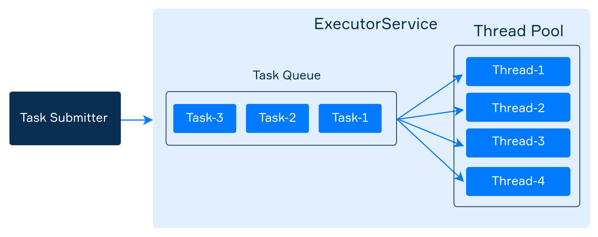

# Java Multi-Threading

## OS perspective
### Process
In operating systems, **a process is an instance of a running application**. A  process has it own private address space, code,  data, opened files, PID, etc... **Processes do not share memory (separate address spaces), thus they have to communicate through IPC mechanisms offered by the OS (i.e., pipes, signals, etc...).**

In Java, it is not possible to explicitly call the syscall _fork()_ as in C. System calls _fork()_ and _exec()_ can be jointly called via the _java.lang.Process_ class. Methods of the _java.lang.Process_ class also allow developers to acquire standard input, output, error, and exit value of the launched process.

```
Process process = new ProcessBuilder("/bin/ls", "-al", "/").start();
try (BufferedReader in = new BufferedReader(new InputStreamReader(process.getInputStream()))) {
    String line;
    while ((line = in.readLine()) != null) {
        System.out.println(line);
    }
}
System.out.println(process.exitValue());
```

### Thread
Threads are frequently called lightweight processes. Like processes, **each thread has its own stack, program counter, and local variables**. However, **threads within the same process share the same address space and, consequently, can share variables and objects**.

Sharing variables is a simple and fast way threads use for communicating but **frequently causes bugs unseen in single-thread programs**

### JVM and OS
A multitasking  operating   system  assigns CPU time (time slices) to processes/threads via a kernel component called _scheduler_. Small time-slices (5-20ms) provide the illusion of parallelism of different processes/threads (on multicore machines it is a partial illusion).

The JVM is a process and gets the CPU as assigned by the OS’s scheduler. However, **Java is a specification** with [many implementations](https://en.wikipedia.org/wiki/List_of_Java_virtual_machines). Most JVMs use the OS scheduler (a Java thread is actually mapped to a system thread) while some operate like a mini-OS and schedule their own threads.

## Why Threads?
There are many reasons to use threads in your Java programs. If you use Android, Swing, JavaFX, Servlets, RMI you may already be using threads without realizing it. The main reasons for using threads:

* **keep UIs responsive while performing background operations**
* **take advantage of multiprocessor systems**

### Case study
Imagine a stockbroker application with three key functionalities:
* Download stock prices from a remote REST service and store them in a local database
* Use the data contained in the database to make short-term price predictions
* Provide a JavaFX GUI for the user

**In a single-threaded process actions execute one after another on a single thread**. An action happens only when the previous one is completed.
* If the download takes 10 minutes, should the user enjoy an unresponsive UI for 10 minutes?
* If price analysis takes additional 10 minutes the result may come too late. Prices could already have changed significantly!

**In a multithreaded process actions execute on different threads**:
* the download can execute in background (i.e. in another thread)
* the analysis, too, can execute in background (i.e. possibly in multiple threads) 
* the user can enjoy a responsive UI while waiting for notifications (buy/sell signals)

### Summarizing
**The good of multi-threading**

* Enable parallelism
* Lighter than processes for both
  * Creation(i.e., fork())
  * Communication (i.e., r/w pipes …)

**The bad of multi-threading**

* Hard for most programmers
* Even for experts, development is often painful
* Threads break abstraction: can't design modules independently.

**The Amdahl's law**

In computer architecture, [Amdahl's law](https://en.wikipedia.org/wiki/Amdahl%27s_law) is a formula which gives the theoretical speedup of the execution of a task that can be expected from a system whose resources are improved. It states that *the overall performance improvement gained by optimizing a single part of a system is limited by the fraction of time that the improved part is actually used*.


## Threads in Java
Every Java program has at least one thread, which is called the _main thread_, created automatically by the JVM process to execute statements inside the _main method_. All Java programs have some other default threads as well (for example, a separate thread for the garbage collector).

Throughout the stages of development of the Java language, the approach to multithreading has changed towards the use of high-level abstractions (i.e., Executors, Tasks, etc...). However, understanding the fundamentals remains very important for a good developer.

Any thread has a name, an identifier, a priority, and some other characteristics that can be obtained through its methods. The example below demonstrates how to obtain the characteristics of the _main thread_:

```java
public class MainThreadDemo {
    public static void main(String[] args) {
        Thread t = Thread.currentThread(); // main thread

        System.out.println("Name: " + t.getName());
        System.out.println("ID: " + t.getId());
        System.out.println("Alive: " + t.isAlive());
        System.out.println("Priority: " + t.getPriority());
        System.out.println("Daemon: " + t.isDaemon());

        t.setName("my-thread");
        System.out.println("New name: " + t.getName());
    }
}
```

```text
Name: main
ID: 1
Alive: true
Priority: 5
Daemon: false
New name: my-thread
```

All statements in this program are executed by the _main thread_.
* Every thread has a **priority**, and the _getPriority()_ method returns the priority of a given thread. Threads with a higher priority are executed in preference to threads with lower priorities.
* The invocation _t.isDaemon()_ checks whether the thread is a **daemon**. A daemon thread (which comes from UNIX terminology) is a low-priority thread that runs in the background to perform tasks such as garbage collection and so on. JVM does not wait for daemon threads before exiting whereas it waits for non-daemon threads.


### Creating threads
Java has two primary ways to create a new thread:
* by extending the _Thread_ class and overriding its _run_ method; 
* by implementing the _Runnable_ interface and passing the implementation to the constructor of the _Thread_ class.

```java
class HelloThread extends Thread {

    @Override
    public void run() {
        String helloMsg = String.format("Hello, i'm %s", getName());
        System.out.println(helloMsg);
    }
}
```

```java
class HelloRunnable implements Runnable {

    @Override
    public void run() {
        String helloMsg = String.format("Hello, i'm %s", Thread.currentThread().getName());
        System.out.println(helloMsg);
    }
}
```

```java
Thread t1 = new HelloThread(); // a subclass of Thread

Thread t2 = new Thread(new HelloRunnable()); // passing runnable
```

In both cases, you should override the _run_ method, which is a regular Java method and contains code to perform a task. Which approach to choose depends on the task and on your preferences. The second approach fits well with lambda expressions:

```java
Thread t3 = new Thread(() -> {
    System.out.println(String.format("Hello, i'm %s", Thread.currentThread().getName()));
});
```

### Starting threads
The class _Thread_ has a method called _start()_ that is used to start a thread. At some point after you invoke this method, the method _run_ will be invoked automatically, but it'll not happen immediately.

Let's suppose that inside the _main method_ you create a _HelloThread_ object named _t_ and start it.

```
Thread t = new HelloThread(); // an object representing a thread
t.start();
```

Eventually, it prints something like:

```text
Hello, i'm Thread-0
```

Here's a picture that explains how a thread actually starts and why it is not happening immediately. As you may see, there is some delay between starting a thread and the moment when it really starts working (running).


If you try to start a thread more than once, the _start_ method throws _IllegalThreadStateException_.

### Execution order
Despite the fact that within a single thread all statements are executed sequentially, **it is impossible to determine the relative order of statements between multiple threads without additional measures (discussed later)**.

Consider the following code:

```java
public class StartingMultipleThreads {

    public static void main(String[] args) {
        Thread t1 = new HelloThread();
        Thread t2 = new HelloThread();

        t1.start();
        t2.start();

        System.out.println("Finished");
    }
}
```

The order of displaying messages may be different. Here is one of them:

```text
Hello, i'm Thread-1
Finished
Hello, i'm Thread-0
```

It is even possible that all threads print their text after the _main thread_ prints _"Finished"_:

```text
Finished
Hello, i'm Thread-0
Hello, i'm Thread-1
```

**Summarizing**:
* It is not guaranteed that threads will start running in the same order in which their start() methods have been called.
* It is not guaranteed that a thread keeps executing until it's done (it is not guaranteed that its loop completes before another thread begins)
* **Nothing is guaranteed except: each thread will start and will run to completion after acquiring the CPU a finite number of times**

### Thread priority
By default, a thread gets the priority of the thread creating it. Priority values are defined between 1 and 10.

* Thread.MIN_PRIORITY  (== 1)
* Thread.NORM_PRIORITY  (== 5)
* Thread.MAX_PRIORITY  (== 10)

Priority can be set using the _setPriority_ method.

```
Thread t = new Thread(() -> { . . . });
t.setPriority(Thread.MAX_PRIORITY);
t.start();
```

### Terminating threads
If the parent thread terminates, all of its child threads terminate as well. 
* Child threads share resources with the parent thread, including variables. When the parent thread terminates, the child threads will not be able to access to those resources that the parent thread owns. 
* Thus, **if the parent thread terminates earlier than its own child threads, synchronization mechanisms are required**.

```java
public class StartStopThread extends Thread {
    public StartStopThread(String name) {
        super(name);
    }

    @Override
    public void run() {
        System.out.println(getName() + " started");
        while (!interrupted()) {
            System.out.println(getName());
        }
        System.out.println(getName() + " terminated");
    }

    public static void main(String[] args) throws InterruptedException {
        StartStopThread a = new StartStopThread("Homer");
        StartStopThread b = new StartStopThread("Marge");

        /* start children threads */
        a.start();
        b.start();

        /* wait 10 millis */
        Thread.sleep(10L);

        /* gracefully terminate children threads */
        a.interrupt();
        b.interrupt();

        /* wait for children before exit */
        a.join();
        b.join();
    }
}
```

## Thread states


* **Running:** The thread has been selected (from the runnable pool) to be the currently executing thread.
* **Runnable:** A thread which is eligible to run, but the scheduler has not selected it to be the running thread . A thread first enters the runnable state when the _start()_ method is invoked.
* **Waiting:** A thread that can acquire a resource but there is no work to do.
* **Blocking:** A thread waiting for a resource such waiting for the completion of I/O operations.
* **Sleeping:** A thread which is sleeping after an explicit call to the _sleep()_ method.

### Leaving the running state
There are 4 ways for leaving the running state under the control of the programmer:

* **sleep()**:  the currently running thread stops executing for at least the specified sleep duration (go to sleeping state)
* **yield()**: the currently running thread moves back to the runnable state and gives room to other threads (go to runnable state)
* **join()**:  the currently running thread stop executing until the thread it joins completes (go to waiting state)
* **wait()**: the currently running thread acquired resources, but it is unable to do anything (go to waiting state)

There are additional ways for leaving the running state which are not under the control of the programmer:

* **end of run() method** (go to dead state)
* **being suspended by the OS scheduler** (go to runnable state)
* **blocking I/O operations** (go to blocking state)

### Thread.sleep()
The static method _Thread.sleep()_ causes the currently executing thread to suspend execution for the specified number of milliseconds. This is an efficient means of making processor time available for the other threads or processes running on the same node.

```
System.out.println("Started");

Thread.sleep(2000L); // suspend current thread for 2000 millis

System.out.println("Finished");
```

Another way to make the current thread sleep is to use the special class _TimeUnit_ from the package _java.util.concurrent:_

-   _TimeUnit.MILLISECONDS.sleep(2000)_ // performs _Thread.sleep_ for 2000 milliseconds;
-   _TimeUnit.SECONDS.sleep(2)_ // performs _Thread.sleep_ for 2 seconds;

### Thread.yield()
The _Thread.yield()_ method moves the running thread back to Runnable state. It allows other threads to get their turn (with no guarantees). It is used when computation is not possible (no work to do) is a given time slice. One of the benefits of this approach is making out code less dependent from the scheduler type, because threads release CPU when needed.


### Thread.join()
The _Thread.join()_ method forces the current thread to wait for the completion of the thread for which the method _join_ was called. In the following example, the string **"Do something else"** will not be printed until the thread terminates.

```
Thread thread = ...
thread.start(); // start thread

System.out.println("Do something useful");

thread.join();  // waiting for thread to die

System.out.println("Do something else");
```

There is an overloaded version of this method which takes a waiting time in milliseconds and is used to avoid waiting for too long.

```
// waits at most two seconds
thread.join(2000L);
```

Let's consider the example below:

```java
class Worker extends Thread {

    @Override
    public void run() {
        try {
            System.out.println("Starting a task");
            Thread.sleep(2000L); // it solves a difficult task
            System.out.println("The task is finished");
        } catch (Exception ignored) {
        }
    }
}
```

```java
public class JoiningExample {
    public static void main(String[] args) throws InterruptedException {
        Thread worker = new Worker();
        worker.start(); // start the worker

        System.out.println("main thread does something useful");

        worker.join(3000L);  // waiting for the worker
        System.out.println("The program stopped");
    }
}
```

The main thread waits for _worker_ and cannot print the message _The program stopped_ until the worker terminates or the timeout is exceeded. We know exactly only that _Starting a task_ precedes _The task is finished_ and _Do something useful_ precedes _The program stopped_. 


## Thread Interference
Threads that belong to the same process share the common memory (called _Heap_). **They communicate by using shared data in memory**. To be able to access the same data from multiple threads, each thread must have a reference to this data. The picture below demonstrates the idea.

****

When you write your code in different threads that work with the same data concurrently, many things might go wrong.
Imagine two people (represented by two threads) each one having an ATM card linked to the same account:

```java
class Account {
    private int balance;
    
    public int getBalance() {
        return balance;
    }

    public void withdraw(int amount) {
        balance -= amount;
    }
}
```

Each person (i.e., thread) does these steps:
1. Check if the balance is greater than 0 
2. Choose an amount to withdraw comprised between 0 and balance 
3. Withdraw the chosen amount

```java
public void run() {
    RandomGenerator rnd = RandomGenerator.getDefault();
    while (!interrupted()) {
        if (account.getBalance() <= 0) {
            break;
        }

        int amount = rnd.nextInt(account.getBalance() + 1);

        account.withdraw(amount);

        Thread.yield();
    }
}
```

**What happens if the scheduler suspends one thread between step 2 and step 3 and the other one gets executed?**

1. **Homer enters the status RUNNING**
2. Homer checks that the account is not empty and contains 125$!
3. Homer chooses to withdraw 100$
4. **Homer leaves the status RUNNING**
5. **Marge enters the status RUNNING**
6. Marge checks that the account is not empty and contains 125$!
7. Marge chooses to withdraw 120$
8. Marge withdraws 120$
9. **Marge leaves the status RUNNING**
10. **Homer enters the status RUNNING**
11. Homer withdraws 100$ (he has already checked!) but the ATM gives him only 5$


### Critical sections and race conditions
**A race condition is problem arising whenever two or more threads share the same resource and one thread **races in** too quickly before another thread has completed its operations (supposed to be atomic).**

**A portion of code which needs to be executed as if it was atomic (the scheduler cannot interrupt a thread during an atomic operation) is called critical section**.

We must guarantee that the steps comprising the withdrawal process are never split apart. **The withdrawal process must be an atomic operation**. In other words, any withdrawal (accomplished by one thread) must be completed before any other thread is allowed to act on the _shared_ account.

### What are natively atomic operations?
Natively atomic operations are operations that are guaranteed to be executed as a single, indivisible operation. In Java, the following operations are natively atomic:
+ Reading or writing to a reference (except for _long_ and _double_ references on 32bit JVMs)
  + example: _int i = 5;_
+ Reading or writing to a _volatile_ variable
  + example: _volatile double x = 2.0;_

The following operations are not natively atomic:
+ Reading or writing to a _long_ or _double_ reference on a 32bit JVM
+ Reading or writing to a non-_volatile_ variable
+ Reading or writing to a _volatile_ variable if the read or write is not the only operation performed on the variable
  + example: _i++_ is not atomic because it is equivalent to _i = i + 1_ which is two operations
  
```java
// This operation is not natively atomic (we read amount, write balance, and do an addition)
public void withdraw(int amount) {
    balance -= amount;
}

// This operation is natively atomic (we only write balance)
public void becomeBroke() {
    balance = 0;
}
```
## The _synchronized_ keyword
Developers can't guarantee that a single thread will stay running during a whole operation (supposed to be atomic) because **they cannot control the scheduler's actions** explicitly (excluding the case of calling the _yield()_ method).

The keyword _synchronized_ is used to protect resources that are accessed concurrently. Only one thread at a time can access a _synchronized_ resource. The modifier _synchronized_ can be applied either to a method or an object.

More specifically, every object in Java has ONE built-in lock. **Entering a synchronized non-static method means getting the lock of the object**. If one thread gets the lock, all other threads have to wait to enter ALL the synchronized methods until the lock is released (the first thread exits the synchronized method).

```java
public synchronized void doStuff() { 
    System.out.println("synchronized");
}

/* is equivalent to… */

public void doStuff() { 
    synchronized(this) {
        System.out.println("synchronized");
    }  
}
```

### Locking granularity
Another example: the first time the method _A()_ is called, it sleeps and makes both _A()_ and _B()_ inaccessible for 100ms. **All synchronized methods of an object share the same lock!**

```java
class Actor extends Thread {
    Runnable runnable;

    public Actor(Runnable runnable) {
        super();
        this.runnable = runnable;
    }

    @Override
    public void run() {
        while (!isInterrupted()) {
            runnable.run();
        }
    }
}
```

```java
class SharedResource {
    public synchronized void A() {
        System.out.println(Thread.currentThread().getName() + " A()");
        try {
            Thread.sleep(100L);
        } catch (InterruptedException e) {
            Thread.currentThread().interrupt();
        }
    }

    public synchronized void B() {
        System.out.println(Thread.currentThread().getName() + " B()");
    }

    public void C() {
        System.out.println(Thread.currentThread().getName() + " C()");
    }
}
```

```java
public class LockingGranularity {
    public static void main(String[] args) {
        SharedResource resource = new SharedResource();
        Actor a = new Actor(resource::A);
        Actor b = new Actor(resource::B);
        Actor c = new Actor(resource::C);

        a.start();
        b.start();
        c.start();

        Thread.sleep(10);

        a.interrupt();
        b.interrupt();
        c.interrupt();

        a.join();
        b.join();
        c.join();
    }
}
```

**Whenever an object lock has been acquired by one thread, other threads can still access the class's non-synchronized methods**. Methods that don't access critical data don’t need to be synchronized.

**Details**:
* Threads going to sleep don't release locks!
* A thread can acquire more than one lock. For example, a thread can enter a synchronized method, then immediately invoke a synchronized method on another object (deadlock prone!)


### Synchronization using thread-safe objects

There are two main ways to grant atomic access to a shared object:
* Use the _synchronized_ modifier within the _run()_ method of each thread to lock the shared object.
* Use the _synchronized_ modifier within the methods of the shared object itself.

**A thread-safe class is class that is safe (works properly) when accessed by multiple threads**. Critical sections (i.e., sections supposed to be atomic) are encapsulated in _synchronized_ blocks.

* Interface List: [Vector](https://www.baeldung.com/java-arraylist-vs-vector) (safe)
* Interface Queue: [LinkedBlockingQueue](https://www.baeldung.com/java-queue-linkedblocking-concurrentlinked), ArrayBlockingQueue, ConcurrentLinkedQueue (safe)
* Interface Map: [ConcurrentMap](https://www.baeldung.com/java-concurrent-map) (safe) 


```java
static class ProducerUnsafe extends Thread {
    final Deque<Integer> integerDeque;

    public ProducerUnsafe(Deque<Integer> integerDeque) {
        super();
        this.integerDeque = integerDeque;
    }

    @Override
    public void run() {
        int i = 0;
        while (!isInterrupted()) {
            integerDeque.addFirst(i++);
        }
    }
}
```

```java
static class ProducerSafe extends Thread {
    final Deque<Integer> integerDeque;

    public ProducerSafe(Deque<Integer> integerDeque) {
        super();
        this.integerDeque = integerDeque;
    }

    @Override
    public void run() {
        int i = 0;
        while (!isInterrupted()) {
            synchronized (integerDeque) {
                integerDeque.addFirst(i++);
            }
        }
    }
}
```

```java
static class ConsumerUnsafe extends Thread {
    final Deque<Integer> integerDeque;

    public ConsumerUnsafe(Deque<Integer> integerDeque) {
        super();
        this.integerDeque = integerDeque;
    }

    @Override
    public void run() {
        while (!isInterrupted()) {
            try {
                integerDeque.removeLast();
            } catch (NoSuchElementException e) {
                Thread.yield();
            }
        }
    }
}
```

```java
static class ConsumerSafe extends Thread {
    final Deque<Integer> integerDeque;

    public ConsumerSafe(Deque<Integer> integerDeque) {
        super();
        this.integerDeque = integerDeque;
    }

    @Override
    public void run() {
        while (!isInterrupted()) {
            try {
                synchronized (integerDeque) {
                    integerDeque.removeLast();
                }
            } catch (NoSuchElementException e) {
                Thread.yield();
            }
        }
    }
}
```

```java
public static void runExperiment(Thread producer, Thread consumer) throws InterruptedException {
    producer.start();
    consumer.start();

    Thread.sleep(100L);

    producer.interrupt();
    consumer.interrupt();

    producer.join();
    consumer.join();
}

public static void main(String[] args) throws InterruptedException {
    /* A safe shared object do not require safe threads */
    Deque<Integer> dq = new ConcurrentLinkedDeque<>();
    Thread p = new ProducerUnsafe(dq);
    Thread c = new ConsumerUnsafe(dq);

    runExperiment(p, c);
}
```

### Synchronization using Object methods
Threads might be able to acquire exclusive access a shared resource but still be unable to progress. For example, a producer with a full queue, or a consumer with an empty queue. 

To avoid waste of computational resources we can use the _wait()_ and _notify()_ methods (which are inherited from Object).

_wait()_ can only be called from a synchronized block. It releases the lock on the object so that another thread can jump in and acquire a lock. **wait() lets a thread say: “There's nothing for me to do now, so put me in the waiting pool and notify me when something happens that I care about.”**

_notify()_ send a signal to one of the threads that are waiting in the object's waiting pool. The _notify()_ method CANNOT specify which waiting thread to notify. The method _notifyAll()_ is similar but sends a signal to all the threads waiting on the object. **notify() lets a thread say: “Something has changed here. Feel free to continue what you were trying to do”.**

```java
static class ProducerSafeWaitNotify extends Thread {
    final Deque<Integer> integerDeque;
    final int maxDequeSize = 10;

    public ProducerSafeWaitNotify(Deque<Integer> integerDeque) {
        super();
        this.integerDeque = integerDeque;
    }

    @Override
    public void run() {
        int i = 0;
        while (!isInterrupted()) {
            synchronized (integerDeque) {
                if (integerDeque.size() < maxDequeSize) {
                    integerDeque.addFirst(i++);
                    integerDeque.notifyAll();
                } else {
                    try {
                        integerDeque.wait();
                    } catch (InterruptedException e) {

                    }
                }
            }
        }
    }
}
```

```java
static class ConsumerSafeWaitNotify extends Thread {
    final Deque<Integer> integerDeque;

    public ConsumerSafeWaitNotify(Deque<Integer> integerDeque) {
        super();
        this.integerDeque = integerDeque;
    }

    @Override
    public void run() {
        while (!isInterrupted()) {
            synchronized (integerDeque) {
                if (integerDeque.size() > 0) {
                    System.out.println(integerDeque.removeLast());
                    integerDeque.notifyAll();
                } else {
                    try {
                        integerDeque.wait();
                    } catch (InterruptedException e) {

                    }
                }
            }
        }
    }
}
```

## Multi-thread design patterns
Despite threads can be used in a number of real-world scenarios, most of them can be conceptually assimilated to two main cases:

**The producer/consumer pattern**, where the producer thread pushes elements into a shared object and the consumer thread fetches (consumes) them. See [this producer/consumer example](https://github.com/nbicocchi/learn-java-javafx/tree/main/code/threads-producer-consumer) for further details.


**The manager/workers pattern**, where a manager decomposes a complex task into subtasks, and assigns them to worker threads. See [this manager/workers example](https://github.com/nbicocchi/learn-java-javafx/tree/main/code/threads-manager-workers) for further details.


## ExecutorService
To simplify the development of multithreaded applications, Java provides an abstraction called _ExecutorService_ (or simply **executor**). It encapsulates one or more threads into a single pool and puts submitted tasks in an internal queue to execute them by using the threads.



This approach clearly isolates tasks from threads and allows you to focus on tasks. You do not need to worry about creating and managing threads because the executor does it for you.

### Creating executors

All types of executors are located in the _java.util.concurrent_ package. This package also contains a convenient utility class _Executors_ for creating different types of _ExecutorService_.


We have considered the most used executor with the fixed size of the pool. Here are a few more types:

**An executor with a single thread** - The simplest executor has only a single thread in the pool. It may be enough for async execution of rarely submitted and small tasks.

```java
ExecutorService executor = Executors.newSingleThreadExecutor();
```

**An executor with a fixed pool** - It can execute multiple tasks concurrently and speed up your program by performing somewhat parallel computations. If one of the threads dies, the executor creates a new one. We will later consider how to determine the required number of threads.

```java
ExecutorService executor = Executors.newFixedThreadPool(4);
```

**An executor with a growing pool** - There is also an executor that automatically increases the number of threads as it needed and reuse previously constructed threads.

```java
ExecutorService executor = Executors.newCachedThreadPool();
```

It can typically improve the performance of programs that perform many short-lived asynchronous tasks. But it can also lead to problems when the number of threads increases too much. It is preferable to choose the fixed thread-pool executor whenever possible.

**An executor that schedules a task** - If you need to perform the same task periodically or only once after the given delay, use the following executor:

```java
ScheduledExecutorService executor = Executors.newSingleThreadScheduledExecutor();
```

The method _scheduleAtFixedRate_ submits a periodic _Runnable_ task that becomes enabled first after the given _initDelay_, and subsequently with the given _period_.

```
ScheduledExecutorService executor = Executors.newSingleThreadScheduledExecutor();
executor.scheduleAtFixedRate(() ->
        System.out.println(LocalTime.now() + ": Hello!"), 1000, 1000, TimeUnit.MILLISECONDS);
```

This kind of executor also has a method named _schedule_ that starts a task only once after the given delay and another method _scheduleWithFixedDelay_ that starts the task with a fixed wait after the previous one is completed.


### Submitting tasks
An executor has the _submit_ method that accepts a _Runnable_ task to be executed. Since _Runnable_ is a functional interface, it is possible to use a lambda expression as a task.

As an example, here we submit a task that prints _"Hello!"_ to the standard output.

```
executor.submit(() -> System.out.println("Hello!"));
```

After invoking _submit_, the current thread does not wait for the task to complete. It just adds the task to the executor's internal queue to be executed asynchronously by one of the threads.


### Stopping executors
An executor continues to work after the completion of a task since threads in the pool are waiting for new coming tasks. Your program will never stop while at least one executor still works.

There are two methods for stopping executors:

1. _void shutdown()_ waits until all running tasks are completed and prohibits submitting of new tasks. **Note:** _shutdown()_ does not block the current thread unlike _join()_ of _Thread_. If you need to wait until the execution is complete, you can invoke _awaitTermination(...)_ with the specified waiting time.

```java
public static void main(String[] args) {
    ExecutorService executor = Executors.newFixedThreadPool(4);
    
    // submitting tasks
    
    executor.shutdown();
    
    boolean terminated = executor.awaitTermination(60, TimeUnit.MILLISECONDS);
    
    if (terminated) {
        System.out.println("The executor was successfully stopped");
    } else {
        System.out.println("Timeout elapsed before termination");
    }
}

```

2. _List<Runnable> shutdownNow()_ immediately stops all running tasks and returns a list of the tasks that were awaiting execution.

### An example: names of threads and tasks
In the following example, we create one executor with a pool consisting of four threads. We submit ten tasks to it and then analyze the results. Each task prints the name of the actual thread executing it, as well as the name of the task.

```java
import java.util.concurrent.ExecutorService;
import java.util.concurrent.Executors;

public class ExecutorDemo {
    private final static int POOL_SIZE = 4;
    private final static int NUMBER_OF_TASKS = 10;

    public static void main(String[] args) {
        ExecutorService executor = Executors.newFixedThreadPool(POOL_SIZE);

        for (int i = 0; i < NUMBER_OF_TASKS; i++) {
            int taskNumber = i;
            executor.submit(() -> {
                String taskName = "task-" + taskNumber;
                String threadName = Thread.currentThread().getName();
                System.out.printf("%s executes %s\n", threadName, taskName);
            });
        }

        executor.shutdown();
    }
}
```

If you launch this program many times, you will get a different output. Below is one of the possible outputs:

```text
pool-1-thread-1 executes task-0
pool-1-thread-2 executes task-1
pool-1-thread-4 executes task-3
pool-1-thread-3 executes task-2
pool-1-thread-3 executes task-7
pool-1-thread-3 executes task-8
pool-1-thread-3 executes task-9
pool-1-thread-1 executes task-6
pool-1-thread-4 executes task-5
pool-1-thread-2 executes task-4
```

It clearly demonstrates the executor uses all four threads to solve the tasks. The number of solved tasks by each thread can vary. There are no guarantees what we'll get.

If you do not know how many threads are needed in your pool, you can take the number of available processors as the pool size.

```java
int poolSize = Runtime.getRuntime().availableProcessors();
ExecutorService executor = Executors.newFixedThreadPool(poolSize);
```


### Exception handling
In our examples, we often ignore error handling to simplify code. Here we demonstrate one feature related to the handling of exceptions in executors (namely, unchecked).

What do you think the following code will print?

```
ExecutorService executor = Executors.newSingleThreadExecutor();
executor.submit(() -> System.out.println(2 / 0));
```

It does not print anything at all, including the exception! This is why it is common practice to wrap a task in the _try-catch_ block not to lose the exception.

```
ExecutorService executor = Executors.newSingleThreadExecutor();
executor.submit(() -> {
    try {
        System.out.println(2 / 0);
    } catch (Exception e) {
        e.printStackTrace();
    }
});
```

## Callable and Future
Sometimes you need not only to execute a task in an executor but also to return a result of this task to the calling code. It is possible but inconvenient with _Runnable_'s. To simplify it, an executor supports another class of tasks named _Callable_ that returns the result and may throw an exception. This interface belongs to the _java.util.concurrent_ package. Let's take a look at this.

```java
@FunctionalInterface
public interface Callable<V> {
    V call() throws Exception;
}
```

_Callable_ is a generic interface where the type parameter _V_ determines the type of the result. Since it is a **functional interface**, we can use it together with lambda expressions and method references. Here is a _Callable_ that emulates a long-running task and returns a number that was "calculated".

```java
Callable<Integer> generator = () -> {
    TimeUnit.SECONDS.sleep(5);
    return 700000;
};
```

### Submitting a Callable and obtaining a Future
When we submit a _Callable_ to an executor service, it cannot return a result directly since the _submit_ method does not wait until the task completes. Instead, an executor returns a special object called _Future_ that wraps the actual result that may not even exist yet. This object represents the result of an asynchronous computation (task).

```java
ExecutorService executor = Executors.newSingleThreadExecutor();

Future<Integer> future = executor.submit(() -> {
    TimeUnit.SECONDS.sleep(5);
    return 700000;
});
```

Until the task completes, the actual result is not present in the _future_ object. To check it, there is a method _isDone()_. Most likely, it will return _false_ if you will call it immediately after obtaining a new _future_.

```
System.out.println(future.isDone()); // most likely it is false
```

### Getting the actual result of a task
The result can only be retrieved from a *future* by using the _get_ method.

```java
int result = future.get();
```

It returns the result when the computation has completed, or blocks the current thread and waits for the result. This method may throw two checked exceptions: _ExecutionException_ and _InterruptedException_ which we omit here for brevity.

If a submitted task executes an infinite loop or waits for an external resource for too long, a thread that invokes _get_ will be blocked all this time. To prevent this, there is also an overloaded version of _get_ with a waiting timeout. In this case, the calling thread waits for 10 seconds most for the computation to complete. If the timeout ends, the method throws a _TimeoutException_.

```java
int result = future.get(10, TimeUnit.SECONDS); // it blocks the current thread
```

### Cancelling a task
The _Future_ class provides an instance method named _cancel_ that attempts to cancel the execution of a task. An attempt will fail if:
* the task has already completed
* the task has already been canceled
* the task could not be canceled for some other reason

If the cancel attempt is successful, the task will never run.

The method takes a _boolean_ parameter that determines whether the thread executing this task should be interrupted in an attempt to stop the task (in other words, whether to stop already running task or not).

```
future1.cancel(true);  // try to cancel even if the task is executing now
future2.cancel(false); // try to cancel only if the task is not executing
```

Since passing _true_ involves interruptions, the actual stop of an executing task is guaranteed only if it handles _InterruptedException_ correctly and checks the flag _Thread.currentThread().isInterrupted()_.

If someone invokes _future.get()_ at a successfully canceled task, the method throws an unchecked _CancellationException_. If you do not want to deal with it, you may check whether a task was canceled by invoking _isCancelled()_.

### Methods invokeAll and invokeAny
In addition to all features described above, there are two useful methods for submitting batches of _Callable_ to an executor.

-   _invokeAll_ accepts a prepared collection of callables and returns a collection of *futures*;

-   _invokeAny_ also accepts a collection of callables and returns the result (not a *future*!) of one that has completed successfully.

Both methods also have overloaded versions that accept a timeout of execution that is often needed in real life.

Suppose that we need to calculate several numbers in separated tasks and then sum up the numbers in the _main_ thread. It is easy to do using _invokeAll_ method.

```java
public static void main(String[] args) {
  ExecutorService executor = Executors.newFixedThreadPool(4);
  List<Callable<Integer>> callables =
          List.of(() -> 1000, () -> 2000, () -> 1500); // three "difficult" tasks

  List<Future<Integer>> futures = executor.invokeAll(callables);
  int sum = 0;
  for (Future<Integer> future : futures) {
    sum += future.get(); // blocks on each future to get a result
  }
  System.out.println(sum);
}
```

## Resources
* https://www.baeldung.com/java-arraylist-vs-vector
* https://www.baeldung.com/java-queue-linkedblocking-concurrentlinked
* https://www.baeldung.com/java-concurrent-map
* https://www.baeldung.com/java-executor-service-tutorial
* https://www.baeldung.com/java-runnable-callable
* https://www.baeldung.com/java-completablefuture
