# Object Oriented Programming - DIEF/UNIMORE

## Java Exercises (OOP Design)

Before starting this module, generate the JavaDoc documentation of the whole oop package.

Click on the oop package then select Tools -> Generate JavaDoc...

---

**[basic.ClickCounter]** Write a class named ClickCounter representing a simple device to keep track of how many times a button (in this case a method) is clicked.
Internally, the class represents the number of clicks with an int value.
The class provides the following methods:
* public int getValue() returning the current number of clicks.
* public void click() increasing the number of clicks of 1 unit.
* public void undo() decreasing the number of clicks of 1 unit (but preventing negative click values).
* public void reset() setting the number of clicks to 0.

Refer to the JavaDoc documentation for further details.

---

**[basic.RationalNumber]** Write a class named RationalNumber representing a rational number.
Internally, the class represents numerator and denominator as int values.
The class provides the following methods:
* public RationalNumber(int numerator, int denominator) creating the rational number.
* getters and setters.
* public RationalNumber add(RationalNumber o) for adding another number to the current number.
* public RationalNumber multiply(RationalNumber o) for multiplying another number with the current number.

Refer to the JavaDoc documentation for further details.

---

**[basic.Circle]** Write a class named Circle representing a Circle on a 2D plane.
Internally, the class uses a Point object and a double value for representing the center and the radius of the Circle, respectively. 
The class provides the following methods:
* public Circle(Point center, int radius) creating the circle.
* getters and setters.
* public double getPerimeter() returning the perimeter of the circle.
* public double getArea() returning the area of the circle.
* public boolean contains(Point point) returning true if point is contained within the circle.
* public void translate(int dx, int dy) moving the circle on the 2D plane. dx and dy are the x and y components of the translation vector.
* public String toString().

Refer to the JavaDoc documentation for further details.

---

**[basic.Polygon]** Write a class named Polygon representing an irregular polygon.
Internally, the class uses an array of Point objects for representing the vertices of the polygon.
The class provides the following methods:
* public Polygon(Point[] vertices) creating the polygon.
* public int getVerticesCount() returning the number of vertices.
* public double getPerimeter() returning the perimeter of the polygon.
* public double getArea() returning the area of the polygon.
* public String toString().

Refer to the JavaDoc documentation for further details.

---

**[basic.BankAccount]** Write a class named BankAccount representing a bank account.
Internally, the class uses a double value for representing the balance of the account.
The class provides the following methods:
* public BankAccount() creating an empty account.
* public BankAccount(double balance) creating an account with the specified balance.
* public double getBalance() getting the current balance.
* public void deposit(double amount) depositing the specific amount into the account.
* public void withdraw(double amount) withdrawing the specified amount from the account.

Refer to the JavaDoc documentation for further details.

--- 

**[basic.EnhancedArray]** Write a class named EnhancedArray representing an enhanced array.
Internally, the class keeps an int array but provides its key functionalities via a set of methods:

* public EnhancedArray(int capacity) creating a new array of the specified capacity. 
* public int size() returning the capacity of the array.
* public int get(int index) returning the element at the specified index.
* public void set(int index, int value) setting the element at the specified index with value
* public boolean contains(int value) returning true if the specified value is contained within the array.
* public void resetZero() setting all the elements to 0.
* public void resetRandom() setting all the elements to random values between [0, size()]
* public int[] toArray() returning a copy of the internal array.

Refer to the JavaDoc documentation for further details.

---

**[basic.Letter]** Write a class for authoring a simple letter.
In the constructor, supply the names of the sender and the recipient:

```
public Letter(String from, String to)
```

Supply a method to add a line of text to the body of the letter.

```
public void addLine(String line)
```

Supply a method that returns the entire text of the letter.

```
public String getText()
```

The text has the form:

```
Dear recipient name: 
blank line
first line of the body 
second line of the body 
. . .
last line of the body 
blank line 
Sincerely,
blank line
sender name
```

Refer to the JavaDoc documentation for further details.

---

**[reverse package]** Given the following Reverser interface, provide two implementations namely ReverserFast and ReverserSlow using two different strategies for reversing a String. Provide also a simple main() in which the Reverser interface is implemented anonymously. 

```
public interface Reverser {
    /**
     * Reverses a string
     * @param s the string to be reversed
     * @return the reversed string
     */
    String reverse(String s);
}
```

The following diagram might provide some inspiration. 



---

**[phonebook package]** Define two classes, namely PhoneBookArray and PhoneBookList implementing the PhoneBook interface (reported below).
* PhoneBookArray internally models the phone book as a ```Person[]```.
* PhoneBookList internally models the phone book as a ```ArrayList<Person>```.

Both implementations limit the number of persons to 256.

The following diagram might provide some inspiration. Refer to the JavaDoc documentation for further details.



---

**[bankaccount package]** Define two classes, namely BankAccountEasy and BankAccountPro implementing the BankAccount interface (reported below).
* BankAccountPro represents a fully fledged bank account, allowing international transfers, negative balances, and a 2pc interest rate. However, all this comes with the cost of 1 Euro for each operation (deposit, withdrawal). Note well: the first two characters of IBANs represent a country code.
* BankAccountEasy represents a basic bank account, which does not support negative balances, international transfers, and does not pay any interest. Nevertheless, deposits and withdrawals are free.

Both accounts must refuse to set invalid IBANs or positive fees (money being added for each operation).

The following diagram might provide some inspiration. Refer to the JavaDoc documentation for further details.



---

**[shape package]** Define two classes, namely Circle and Rectangle representing a circle and rectangle on a 2D plane.
* Circle internally uses a Point object and a double value for representing its center and radius.
* Rectangle internally uses two Point objects for representing its upper-left and bottom-right vertices.

Both shapes must also support:
* an id (String) for identifying the shape
* a color (String) for coloring the shape
* the capability of moving on the 2D plane (move() method)
* the capability of resizing (resize() method)
* the capability of computing area and perimeter (getArea(), getPerimeter() methods)

The following diagram might provide some inspiration. Refer to the JavaDoc documentation for further details.



---

**[polynomials package]**



---

**[library package]**



---

